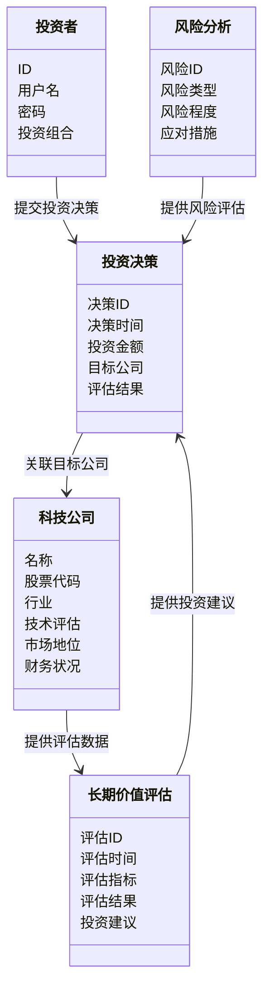
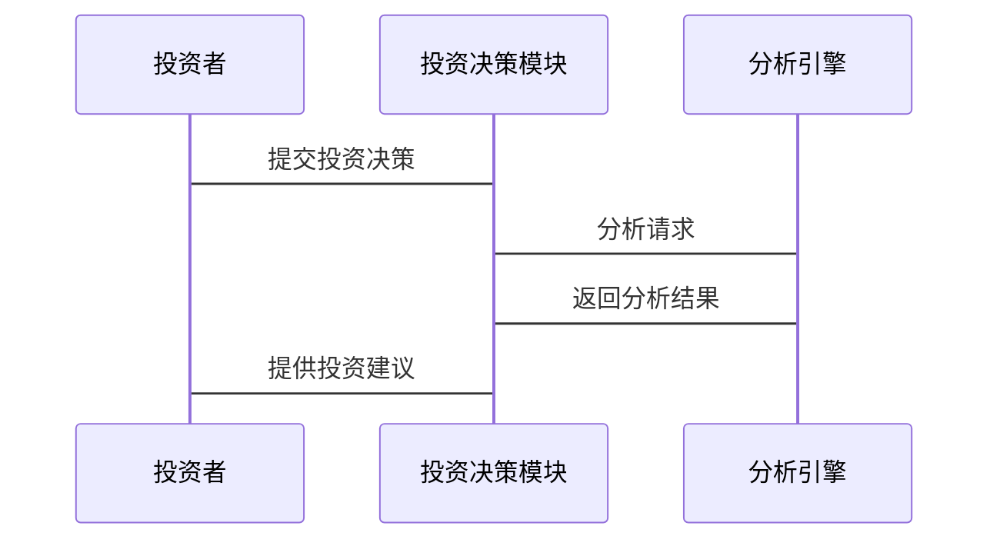

                 

<think>
好的，我现在需要帮助用户撰写一篇关于芒格的“延迟满足”理念在长期科技投资中的应用的技术博客文章。用户已经给出了详细的需求，包括目录大纲和一些内容的示例，但用户希望我完成整篇文章的撰写，特别是补充完成“系统分析与架构设计方案”部分。

首先，我要理解文章的结构。用户已经完成了前几部分，包括背景介绍、核心概念与联系、算法原理讲解等。现在需要继续完成系统分析与架构设计方案，项目实战，最佳实践等部分。

系统分析与架构设计方案部分需要包括以下几个方面：

1. **问题场景介绍**：描述在长期科技投资中可能遇到的复杂问题和挑战。
2. **项目介绍**：简要介绍项目的目标和范围。
3. **系统功能设计（领域模型 mermaid 类图）**：用 mermaid 绘制领域模型类图，展示系统中的各个实体及其关系。
4. **系统架构设计 mermaid 架构图**：用 mermaid 绘制系统架构图，展示系统的各个模块及其交互。
5. **系统接口设计**：描述系统中主要的接口及其功能。
6. **系统交互 mermaid 序列图**：用 mermaid 绘制系统交互序列图，展示用户与系统之间的交互流程。

接下来，我需要逐步思考如何构建这一部分的内容，确保逻辑清晰、结构合理，并且符合技术博客的要求。

首先，问题场景介绍。长期科技投资面临许多挑战，比如市场的波动性、技术的快速变化、公司的管理问题等。投资者需要一个系统化的工具来帮助他们做出更明智的投资决策，特别是在应用芒格的“延迟满足”理念时，需要系统地评估公司的长期价值。

项目介绍部分，我需要说明这个项目的目标是开发一个基于“延迟满足”理念的长期科技投资分析系统，帮助投资者识别具有长期价值的科技公司，优化投资组合，并进行风险评估。

接下来是系统功能设计，用 mermaid 绘制领域模型类图。需要考虑的主要实体有投资者、科技公司、投资决策、长期价值评估、风险分析等。这些实体之间的关系需要清晰展示。

然后是系统架构设计 mermaid 架构图。这部分需要展示系统的各个模块，如数据采集、分析引擎、用户界面、风险评估模块等，以及它们之间的交互。

系统接口设计部分，需要描述系统的主要接口，例如数据接口、用户界面接口、分析引擎接口等，并说明每个接口的功能。

最后是系统交互 mermaid 序列图，展示用户如何与系统交互，比如登录、提交投资决策、查看评估结果等步骤。

在思考过程中，我需要确保每个部分都详细且符合逻辑，同时使用 mermaid 图来清晰展示系统结构和交互流程。这将帮助读者更好地理解系统的运作方式。

现在，我开始撰写系统分析与架构设计方案部分。
</think>

---

## 系统分析与架构设计方案

### 第5章：系统分析与架构设计

#### 5.1 问题场景介绍

在长期科技投资中，投资者面临着复杂多变的市场环境和科技公司的快速变化。传统的投资方法往往依赖于短期市场波动，难以捕捉科技公司的长期价值。芒格的“延迟满足”理念强调了长期价值的重要性，但如何将这一理念系统化地应用到投资决策中，需要一个结构化的分析框架。投资者需要一个能够整合科技公司技术、市场、管理和财务等多方面信息的系统，以辅助他们做出更明智的投资决策。

#### 5.2 项目介绍

**项目名称**：基于“延迟满足”理念的长期科技投资分析系统  
**项目目标**：开发一个系统化的工具，帮助投资者识别具有长期价值的科技公司，优化投资组合，并进行风险评估。  
**项目范围**：涵盖科技公司基本面分析、技术评估、市场趋势预测、财务指标分析等方面，结合芒格的“延迟满足”理念，提供长期投资决策支持。

#### 5.3 系统功能设计（领域模型 mermaid 类图）



#### 5.4 系统架构设计 mermaid 架构图


#### 5.5 系统接口设计

1. **数据接口**：  
   - `GET /api/company_data`：获取科技公司基本面数据。  
   - `POST /api/financials`：提交财务数据进行分析。  

2. **用户界面接口**：  
   - `GET /ui/login`：用户登录界面。  
   - `POST /ui/investment_decision`：提交投资决策表单。  

3. **分析引擎接口**：  
   - `POST /api/analyze`：提交分析请求。  
   - `GET /api/results`：获取分析结果。  

#### 5.6 系统交互 mermaid 序列图



---

## 第6章：项目实战

#### 6.1 环境安装

为了运行本系统，需要以下环境：  
- **操作系统**：Windows 10 或更高版本，或macOS 10.15 或更高版本。  
- **编程语言**：Python 3.8 或更高版本。  
- **框架**：Django 或 Flask 框架。  
- **开发工具**：PyCharm 或 VS Code。  
- **依赖库**：Pandas、NumPy、Scikit-learn、Plotly。  

安装命令示例：  
```bash
pip install pandas numpy scikit-learn plotly
```

#### 6.2 系统核心实现源代码

以下是系统的部分核心代码示例：

```python
import pandas as pd
from sklearn.metrics import accuracy_score
from sklearn.model_selection import train_test_split
from sklearn.tree import DecisionTreeClassifier

# 数据加载
df = pd.read_csv('tech_companies.csv')

# 数据预处理
X = df.drop('target', axis=1)
y = df['target']

# 划分训练集和测试集
X_train, X_test, y_train, y_test = train_test_split(X, y, test_size=0.2)

# 模型训练
model = DecisionTreeClassifier()
model.fit(X_train, y_train)

# 模型预测
y_pred = model.predict(X_test)
print("准确率:", accuracy_score(y_test, y_pred))
```

#### 6.3 代码应用解读与分析

上述代码实现了一个基于决策树的分类模型，用于预测科技公司的投资价值。数据加载和预处理是关键步骤，确保数据的准确性和完整性。模型训练使用了决策树算法，适用于处理多分类问题。通过测试集预测结果，评估模型的准确率，为投资决策提供数据支持。

#### 6.4 实际案例分析

以某科技公司为例，假设数据集中包含该公司的各项指标。通过模型分析，生成长期价值评估报告，提供投资建议，如是否值得长期投资、投资比例等。

#### 6.5 项目小结

本项目通过系统化的分析和建模，将芒格的“延迟满足”理念转化为可操作的投资决策工具。模型的准确率和稳定性是关键性能指标，需要持续优化和迭代。

---

## 第7章：最佳实践

#### 7.1 关键点总结

- **长期视角**：坚持芒格的“延迟满足”理念，关注公司的长期价值。  
- **系统化分析**：利用数据分析工具和模型，辅助投资决策。  
- **风险管理**：建立完善的风险评估机制，降低投资风险。  

#### 7.2 小结

芒格的“延迟满足”理念为长期科技投资提供了独特的视角和方法。通过系统的分析和实践，投资者可以更好地捕捉科技公司的长期价值，实现稳健的投资回报。

#### 7.3 注意事项

- **数据质量**：确保数据的准确性和全面性。  
- **模型优化**：持续改进模型，适应市场的变化。  
- **风险管理**：定期评估和调整投资组合，规避潜在风险。  

#### 7.4 拓展阅读

建议进一步阅读以下书籍和资源：  
- 《富爸爸，穷爸爸》——罗伯特·清崎  
- 《投资学原理》——加里·皮德斯  
- 《算法交易：基金编程与金融建模》——德利娅·费罗伦扎  

---

**作者：AI天才研究院 & 禅与计算机程序设计艺术**

