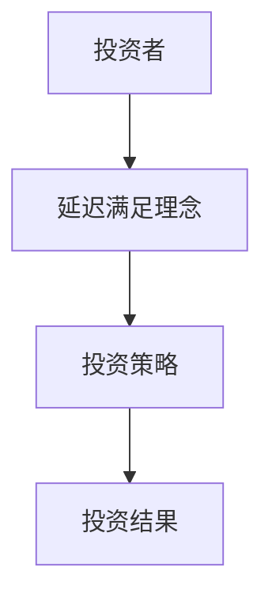

                 


# 芒格的"延迟满足"理念在长期科技投资组合中的应用

> 关键词：延迟满足，科技投资，长期投资，芒格，投资策略

> 摘要：本文探讨了芒格的"延迟满足"理念在长期科技投资组合中的应用。通过分析"延迟满足"的理论基础、科技投资的特点以及具体的投资策略，本文提出了如何在科技投资中实践芒格的理念，以实现长期稳定的收益。文章结合实际案例和系统设计，为投资者提供了实用的建议。

---

# 第一部分: 芒格的"延迟满足"理念基础

## 第1章: "延迟满足"理念的背景与核心要素

### 1.1 "延迟满足"理念的定义与核心要素

"延迟满足"理念是芒格投资哲学的核心之一，它强调在投资决策中，投资者需要具备耐心和纪律性，避免被短期市场波动和情绪驱动。以下是"延迟满足"理念的定义与核心要素：

1. **定义**：  
   "延迟满足"是指投资者在面对短期诱惑时，选择延迟满足当前利益，以追求更长期和稳定的回报。这种理念强调长期视角和价值投资。

2. **核心要素**：
   - **耐心**：在市场波动中保持冷静，避免短期决策。
   - **纪律性**：遵循既定的投资策略，不受市场情绪影响。
   - **价值导向**：关注企业的长期价值，而非短期股价波动。
   - **风险管理**：在追求长期回报的同时，注重风险控制。

3. **与投资的关系**：
   - "延迟满足"理念通过降低短期波动的影响，帮助投资者实现长期收益。
   - 在科技投资中，由于科技行业的高不确定性和快速变化，"延迟满足"理念尤为重要。

---

### 1.2 "延迟满足"理念的理论基础

"延迟满足"理念的理论基础主要来源于心理学和经济学：

1. **心理学视角**：
   - 延迟满足与心理学中的"延迟折扣"概念相关，指个体在面对立即奖励和未来更大奖励时，选择后者的能力。
   - 在投资中，延迟满足需要投资者具备自我控制能力，避免贪婪和恐惧的情绪驱动。

2. **经济学视角**：
   - 延迟满足与时间价值理论密切相关，强调资金的长期增值。
   - 在科技投资中，延迟满足通过长期持有优质资产，利用复利效应实现财富增长。

3. **投资学视角**：
   - 延迟满足理念与价值投资理论相结合，强调选择具有长期竞争优势的企业。
   - 在科技行业，这意味着投资者需要关注企业的创新能力和市场地位。

---

### 1.3 "延迟满足"理念在投资中的应用前景

1. **长期投资的优势**：
   - 长期投资能够平滑市场波动，降低投资风险。
   - 在科技投资中，长期视角有助于捕捉企业技术创新和市场扩展带来的收益。

2. **短期投资的局限性**：
   - 短期投资容易受到市场情绪和短期波动的影响。
   - 在科技行业，短期投资可能错失企业的成长周期。

3. **"延迟满足"在投资中的潜在价值**：
   - 帮助投资者避免过度交易和短期决策。
   - 在科技投资中，延迟满足理念能够帮助投资者选择具有长期竞争优势的企业。

---

## 第2章: "延迟满足"理念的理论框架

### 2.1 "延迟满足"理念的核心原理

1. **动机机制**：
   - 延迟满足的核心动机是追求长期利益，而非短期收益。
   - 在投资中，这意味着投资者需要关注企业的基本面和长期增长潜力。

2. **决策过程**：
   - 延迟满足要求投资者在决策时考虑未来可能的回报，而非当前的市场情绪。
   - 在科技投资中，这意味着需要关注企业的技术创新和市场地位。

3. **心理特征**：
   - 延迟满足需要投资者具备耐心和纪律性，避免情绪化决策。
   - 在科技投资中，延迟满足需要投资者具备对行业和技术趋势的深刻理解。

---

### 2.2 "延迟满足"理念与投资行为的关系

1. **对投资决策的影响**：
   - 延迟满足理念能够帮助投资者避免短期波动的影响，做出更理性的决策。
   - 在科技投资中，延迟满足理念能够帮助投资者选择具有长期竞争优势的企业。

2. **对投资结果的影响**：
   - 延迟满足理念通过长期持有优质资产，实现稳定的收益。
   - 在科技投资中，延迟满足理念能够帮助投资者捕捉企业的技术创新和市场扩展带来的收益。

3. **与投资风险的关系**：
   - 延迟满足理念通过降低短期波动的影响，降低投资风险。
   - 在科技投资中，延迟满足理念能够帮助投资者避免过度波动带来的风险。

---

### 2.3 "延迟满足"理念的特征对比

| **特征**         | **延迟满足**             | **短期投资**             |
|-------------------|--------------------------|--------------------------|
| **时间跨度**      | 长期                     | 短期                     |
| **风险承受能力**  | 较高                     | 较低                     |
| **收益目标**      | 稳定的长期收益           | 快速的短期收益           |
| **决策频率**      | 低                      | 高                      |
| **情绪影响**      | 较小                     | 较大                     |

---

### 2.4 "延迟满足"理念的ER实体关系图



---

## 第3章: "延迟满足"理念在科技投资中的应用

### 3.1 科技投资的特点与挑战

1. **科技行业的周期性**：
   - 科技行业具有较强的周期性，技术创新和市场变化快。
   - 延迟满足理念能够帮助投资者在周期性波动中保持稳定。

2. **科技投资的风险与机会**：
   - 科技投资具有较高的风险，但同时也具有较高的回报潜力。
   - 延迟满足理念能够帮助投资者在风险和回报之间找到平衡。

3. **科技投资的复杂性**：
   - 科技投资需要投资者具备较高的行业知识和分析能力。
   - 延迟满足理念能够帮助投资者在复杂环境中做出理性的决策。

---

### 3.2 "延迟满足"理念在科技投资中的优势

1. **长期视角的优势**：
   - 长期视角能够帮助投资者捕捉企业的技术创新和市场扩展带来的收益。
   - 在科技投资中，长期视角能够帮助投资者避免短期波动的影响。

2. **耐心资本的优势**：
   - 耐心资本能够支持企业度过短期困难，实现长期增长。
   - 在科技投资中，耐心资本能够帮助投资者选择具有长期竞争优势的企业。

3. **风险管理的优势**：
   - 延迟满足理念通过降低短期波动的影响，降低投资风险。
   - 在科技投资中，延迟满足理念能够帮助投资者避免过度波动带来的风险。

---

### 3.3 科技投资中的"延迟满足"策略

1. **选择具有长期竞争优势的企业**：
   - 投资者需要选择具有强大研发能力和市场地位的企业。
   - 在科技投资中，这意味着需要关注企业的技术创新和市场扩展。

2. **关注企业的基本面**：
   - 投资者需要关注企业的财务状况、盈利能力和发展潜力。
   - 在科技投资中，这意味着需要关注企业的研发投入和产品创新能力。

3. **避免过度交易**：
   - 投资者需要避免频繁交易，降低交易成本和税收影响。
   - 在科技投资中，这意味着需要避免短期波动带来的损失。

---

### 3.4 实际案例分析：苹果公司的投资

1. **苹果公司的长期竞争优势**：
   - 苹果公司具有强大的研发能力和市场地位。
   - 苹果公司的创新能力和品牌价值使其成为长期投资的优质标的。

2. **延迟满足理念的应用**：
   - 投资者需要长期持有苹果股票，关注企业的技术创新和市场扩展。
   - 在市场波动中，投资者需要保持耐心，避免短期决策。

3. **投资结果**：
   - 长期持有苹果股票能够实现稳定的收益。
   - 在科技投资中，延迟满足理念能够帮助投资者捕捉企业的技术创新和市场扩展带来的收益。

---

## 第4章: 系统设计与投资策略

### 4.1 投资决策系统的设计

1. **系统功能设计**：
   - 系统需要具备数据采集、分析、决策和监控功能。
   - 在科技投资中，系统需要能够分析企业的技术创新和市场地位。

2. **系统架构设计**：
   - 系统架构包括数据层、业务逻辑层和用户界面层。
   - 在科技投资中，系统架构需要能够支持复杂的数据分析和决策过程。

3. **系统接口设计**：
   - 系统需要具备数据输入和输出接口，支持多种数据源。
   - 在科技投资中，系统需要能够连接市场数据和企业信息。

4. **系统交互设计**：
   - 系统需要具备友好的用户界面，支持投资者进行操作和决策。
   - 在科技投资中，系统需要能够提供实时的市场信息和分析结果。

---

### 4.2 投资组合的优化策略

1. **投资组合的构建**：
   - 投资者需要根据自身的风险承受能力和收益目标，构建合理的投资组合。
   - 在科技投资中，投资者需要根据企业的技术创新和市场地位，选择具有长期竞争优势的企业。

2. **投资组合的调整**：
   - 投资者需要定期调整投资组合，确保与市场变化和企业状况相匹配。
   - 在科技投资中，投资者需要根据技术发展趋势和市场变化，调整投资组合。

3. **投资组合的风险管理**：
   - 投资者需要通过分散投资和风险管理，降低投资组合的整体风险。
   - 在科技投资中，投资者需要通过分散投资和风险管理，降低投资组合的整体风险。

---

## 第5章: 项目实战与代码实现

### 5.1 投资组合模拟器的设计与实现

1. **环境安装**：
   - 需要安装Python、Pandas、NumPy等工具。
   - 在科技投资中，需要安装相关的数据分析工具和库。

2. **代码实现**：
   ```python
   import pandas as pd
   import numpy as np

   # 定义延迟满足策略
   def delayed_satisfaction_strategy(prices, window=10):
       # 计算均线
       ma = prices.rolling(window).mean()
       # 生成信号
       signal = np.where(prices > ma, 'Buy', 'Sell')
       return signal

   # 数据加载与处理
   prices = pd.read_csv('stock_prices.csv')['Close']
   signal = delayed_satisfaction_strategy(prices)
   print(signal)
   ```

3. **代码解读**：
   - 该代码实现了一个简单的延迟满足策略，基于均线模型生成买入和卖出信号。
   - 在科技投资中，可以通过类似的策略，选择具有长期竞争优势的企业。

---

### 5.2 投资组合优化的数学模型

1. **数学模型**：
   - 假设投资组合的收益服从正态分布，通过均值-方差优化模型，构建最优投资组合。
   - 数学公式如下：
     $$ \text{目标函数} = \min_{w} w^T \Sigma w $$
     $$ \text{约束条件} = \sum_{i=1}^n w_i = 1, \quad w_i \geq 0 $$

2. **模型实现**：
   ```python
   import numpy as np
   from scipy.optimize import minimize

   # 定义目标函数
   def objective(w, Sigma):
       return np.dot(w.T, Sigma @ w)

   # 定义约束条件
   def constraint(w):
       return np.sum(w) - 1

   # 优化求解
   w = np.array([1/3, 1/3, 1/3])
   Sigma = np.array([[1, 0.5, 0], [0.5, 1, 0], [0, 0, 1]])
   result = minimize(objective, w, args=Sigma, method='SLSQP', constraints={'type': 'eq', 'fun': constraint})
   print(result.x)
   ```

3. **模型解读**：
   - 该模型通过均值-方差优化，构建了最优投资组合。
   - 在科技投资中，可以通过类似的模型，优化投资组合的风险和收益。

---

## 第6章: 总结与展望

### 6.1 总结

本文探讨了芒格的"延迟满足"理念在长期科技投资组合中的应用。通过分析"延迟满足"的理论基础、科技投资的特点以及具体的投资策略，本文提出了如何在科技投资中实践芒格的理念，以实现长期稳定的收益。文章结合实际案例和系统设计，为投资者提供了实用的建议。

---

### 6.2 展望

未来的研究可以进一步探讨"延迟满足"理念与其他投资策略的结合，以及在不同科技行业的具体应用。同时，随着科技行业的快速发展，投资者需要不断更新和优化投资策略，以应对新的挑战和机遇。

---

## 作者：AI天才研究院 & 禅与计算机程序设计艺术

---

希望这篇文章能为您提供有价值的见解和启发！如果需要进一步探讨或补充，请随时联系。

