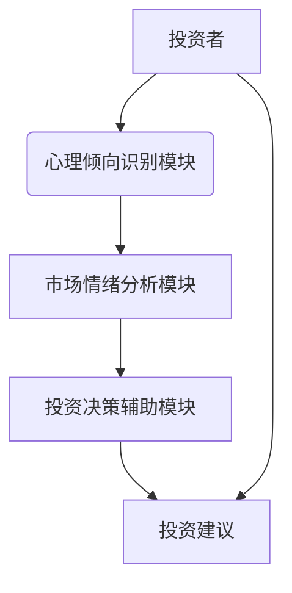

                 


# 芒格的"心理倾向"理论在社交媒体投资中的应用

---

## 关键词

-芒格心理倾向理论、社交媒体投资、认知偏差、投资决策、系统设计

---

## 摘要

本文探讨了芒格的“心理倾向”理论在社交媒体投资中的应用，分析了投资者在社交媒体上的心理倾向如何影响其投资决策。文章首先介绍芒格心理倾向理论的核心概念，然后结合社交媒体投资的特点，深入分析了认知偏差、情绪波动等心理倾向对投资决策的影响。接着，文章从系统设计的角度，提出了基于心理倾向的社交媒体投资系统架构，并通过实际案例展示了该系统的应用。最后，本文总结了社交媒体投资中的最佳实践，为投资者提供了实用的建议。

---

## 第一部分：芒格的“心理倾向”理论概述

### 第1章：芒格的“心理倾向”理论核心概念

#### 1.1 芒格投资理念的背景与起源

芒格的“心理倾向”理论源于其长期的投资实践和对人类行为的研究。他提出，投资者在决策过程中，往往会受到各种心理倾向的影响，这些倾向包括但不限于：

- **从众心理**：倾向于跟随大众的决策。
- **过度自信**：认为自己的判断是正确的，忽视了市场的不确定性。
- **贪婪与恐惧**：在市场上涨时贪婪，在市场下跌时恐惧。

这些心理倾向不仅影响个人投资者，也影响机构投资者的决策。

#### 1.2 心理倾向的核心要素与分类

芒格将心理倾向分为几类，每类都有其独特的特征和表现。以下是主要的心理倾向及其在投资中的表现：

| 心理倾向类型 | 特征 | 投资中的表现 |
|--------------|------|-------------|
| 从众心理     | 倾向于跟随大多数人 | 盲目跟随市场趋势，忽视基本面分析 |
| 过度自信     | 过高估计自己的能力 | 重仓押注单一资产，忽视风险 |
| 贪婪与恐惧   | 市场上涨时贪婪，下跌时恐惧 | 追涨杀跌，频繁交易 |

---

## 第二部分：心理倾向理论在社交媒体投资中的应用

### 第2章：社交媒体投资的基本特性与用户行为分析

#### 2.1 社交媒体投资的特点

社交媒体投资具有以下特点：

- **信息传播速度快**：社交媒体上的信息可以在短时间内传播到大量用户。
- **互动性强**：投资者可以实时互动，分享观点和交易策略。
- **情绪化决策**：社交媒体上的信息往往带有情绪色彩，容易影响投资者的判断。

#### 2.2 投资者在社交媒体上的心理倾向分析

在社交媒体上，投资者的心理倾向表现得尤为明显：

- **从众心理**：投资者容易受到社交媒体上多数人的观点影响，导致盲目跟风。
- **过度自信**：投资者在社交媒体上分享自己的交易策略时，容易产生过度自信，忽视风险。
- **贪婪与恐惧**：社交媒体上的市场情绪容易放大投资者的贪婪和恐惧，导致非理性决策。

---

### 第3章：心理倾向对社交媒体投资决策的影响

#### 3.1 认知偏差与投资决策

认知偏差是指人们在处理信息时，由于主观因素的影响，导致判断偏离客观事实。在社交媒体投资中，认知偏差主要表现在以下几个方面：

- **确认偏差**：投资者倾向于寻找与自己观点一致的信息，忽视相反的证据。
- **锚定效应**：投资者在做决策时，容易受到第一个信息的影响，导致判断偏差。
- **代表性偏差**：投资者根据某类资产的代表性案例，过度概括其风险和收益。

#### 3.2 情绪与社交媒体投资行为

社交媒体上的情绪化决策对投资行为的影响不可忽视：

- **情绪波动对投资决策的影响**：投资者在情绪波动时，容易做出非理性决策，如追涨杀跌。
- **群体情绪传染**：社交媒体上的群体情绪容易传染，导致市场出现非理性波动。

---

## 第三部分：社交媒体投资中的系统分析与架构设计

### 第4章：基于心理倾向的社交媒体投资系统设计

#### 4.1 系统功能设计

为了帮助投资者克服心理倾向的影响，我们设计了一个基于心理倾向的社交媒体投资系统，主要功能包括：

- **投资者心理倾向识别模块**：通过分析投资者的行为和语言，识别其潜在的心理倾向。
- **社交媒体数据采集与分析模块**：采集社交媒体上的投资信息，分析市场情绪。
- **投资决策辅助模块**：根据心理倾向和市场情绪，提供投资建议。

#### 4.2 系统架构设计

以下是系统的整体架构设计：



---

## 第四部分：项目实战与案例分析

### 第5章：社交媒体投资系统实战

#### 5.1 环境配置与数据采集

- **开发环境**：建议使用Python、Jupyter Notebook进行开发。
- **数据采集**：使用Twitter API采集社交媒体上的投资信息。

#### 5.2 核心算法实现

以下是心理倾向识别算法的伪代码：

```python
def identify_psychological_tendencies(text):
    # 从众心理识别
    if '跟随' in text or '趋势' in text:
        return '从众心理'
    # 过度自信识别
    if '肯定' in text or '绝对' in text:
        return '过度自信'
    # 贪婪与恐惧识别
    if '涨' in text or '跌' in text:
        return '贪婪与恐惧'
    return '其他'
```

---

### 第6章：案例分析与经验总结

#### 6.1 典型案例分析

- **案例一**：某投资者在社交媒体上看到大量关于某科技股的正面评论，盲目跟风买入，导致亏损。

---

## 第五部分：最佳实践与总结

### 6.2 最佳实践 tips

- **保持理性**：在社交媒体上投资时，保持冷静，避免被情绪左右。
- **多样化投资**：不要将所有资金投入单一资产，分散投资风险。
- **定期反思**：定期回顾自己的投资决策，识别并纠正心理倾向的影响。

---

## 小结

芒格的“心理倾向”理论为我们理解社交媒体投资中的决策偏差提供了重要的视角。通过识别和分析投资者的心理倾向，我们可以更好地做出理性的投资决策，避免因情绪和认知偏差导致的损失。

---

## 注意事项

- 投资者应保持理性，避免盲目跟风。
- 在使用社交媒体投资系统时，建议结合多方面的信息进行综合判断。

---

## 拓展阅读

- 《巴菲特的股票投资策略》
- 《行为金融学》
- 《社交媒体与投资行为》

---

## 作者

作者：AI天才研究院/AI Genius Institute & 禅与计算机程序设计艺术 /Zen And The Art of Computer Programming

---

本文通过结合芒格的“心理倾向”理论和社交媒体投资的特点，深入分析了心理倾向对投资决策的影响，并提出了基于心理倾向的社交媒体投资系统设计。希望本文能够为投资者提供有价值的参考和启示。

