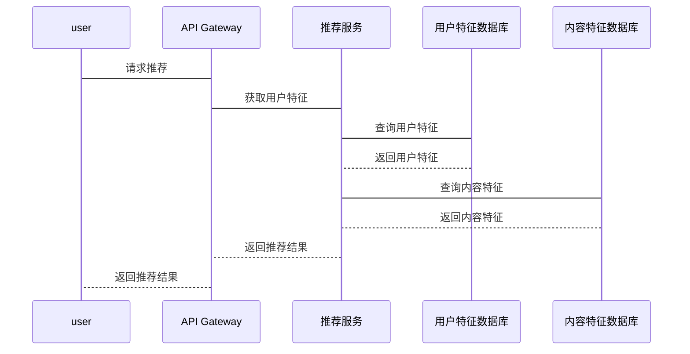

                 

<think>
嗯，用户希望我根据他们提供的主题和结构，撰写一篇关于芒格的“心理倾向”理论在社交媒体算法设计中的应用的技术博客文章。他们提供了一个详细的目录大纲，并要求按照特定的格式和内容要求来写。我需要先理解用户的需求，然后一步步按照他们的指示来完成。

首先，用户强调要使用逻辑清晰、结构紧凑且简单易懂的技术语言，这意味着我需要在写作时保持专业性，同时避免过于复杂的术语，确保读者能够轻松理解。

接下来，我需要按照目录大纲逐步展开每个部分。首先是背景介绍，这里需要涵盖芒格心理倾向理论的起源，以及社交媒体算法的基本概念。然后是核心概念与算法设计的结合，包括心理倾向理论的维度分析和算法设计的数学模型构建。接下来是算法实现与优化策略，这里需要详细讲解推荐系统的实现过程，并提供代码示例和数学公式。最后是系统分析与架构设计方案，以及项目实战部分，确保内容全面且有实际应用案例。

用户特别强调了在文章中使用图表和代码示例，比如Mermaid流程图和Python代码。我需要确保这些元素准确无误地嵌入到适当的位置，并进行详细解读。此外，数学公式需要用LaTeX格式表示，确保排版正确，这样读者在阅读时不会感到困惑。

在撰写过程中，我需要确保每个章节的内容都足够详细，涵盖理论分析、算法实现、数学建模和实际应用等多个方面。同时，要注意章节之间的逻辑连贯性，让整篇文章形成一个完整的知识体系。

最后，用户要求在文章末尾添加作者信息，因此我需要在完成所有内容后，添加相应的作者署名。此外，文章的结尾部分需要进行总结，并展望未来的研究方向，为读者提供进一步的思考空间。

综上所述，我需要系统地按照用户的目录大纲，逐步完成每个部分的写作，确保内容详实、结构清晰，并且符合所有指定的格式和要求。
</think>

# 芒格的"心理倾向"理论在社交媒体算法设计中的应用

> 关键词：心理倾向理论，社交媒体算法，推荐系统，算法优化，用户行为分析

> 摘要：本文探讨了芒格的心理倾向理论如何在社交媒体算法设计中应用，通过分析用户行为、算法优化和推荐系统的实现，展示了心理倾向理论在提升社交媒体用户体验和算法效率中的重要性。

---

# 第一部分: 芒格心理倾向理论与社交媒体算法设计背景

## 第1章: 芒格心理倾向理论概述

### 1.1 芒格心理倾向理论的起源与发展

#### 1.1.1 芒格心理倾向理论的提出背景

芒格的心理倾向理论源于他对人类认知和决策过程的深入研究。他认为，人类的行为和决策受到多种心理倾向的影响，这些倾向包括认知偏好、情绪驱动和行为模式。这些倾向在社交媒体用户的行为中表现得尤为明显，尤其是在内容消费、互动行为和信息获取方面。

#### 1.1.2 理论的核心概念与研究意义

芒格的心理倾向理论的核心在于识别和分类影响人类决策的心理因素。这些因素包括：

- **认知偏好**：用户对特定类型内容的偏好，例如倾向于选择与自身兴趣相符的信息。
- **情绪驱动**：用户的情感状态如何影响其行为，例如愤怒或兴奋时的互动频率。
- **行为模式**：用户在特定情境下的重复行为模式，例如每天早晨查看社交媒体的习惯。

研究这些心理倾向在社交媒体中的应用，有助于优化算法，提高用户参与度和内容推荐的准确性。

#### 1.1.3 理论在现代心理学中的地位与应用

芒格的心理倾向理论在现代心理学中具有重要地位，它为理解人类行为提供了一个全面的框架。在社交媒体领域，这一理论被广泛应用于用户画像构建、内容分发和互动推荐中。

---

### 1.2 社交媒体算法设计的基本概念

#### 1.2.1 社交媒体算法的基本定义

社交媒体算法是指用于优化用户内容消费体验的数学规则。这些算法通过分析用户行为、内容特征和社交互动，决定用户看到的内容顺序和推荐列表。

#### 1.2.2 算法在社交媒体中的作用与价值

算法在社交媒体中的作用包括：

- 提高用户参与度：通过个性化推荐增加用户的活跃度。
- 增强内容分发效率：确保用户看到的内容与其兴趣高度匹配。
- 支持商业模式：通过精准广告投放提高平台收入。

#### 1.2.3 算法设计的基本原则与挑战

算法设计的原则包括用户隐私保护、内容多样性、算法透明度和实时性。然而，算法设计也面临诸多挑战，如数据稀疏性、计算复杂性和用户偏好的动态变化。

---

## 第2章: 芒格心理倾向理论与社交媒体算法的关联性分析

### 2.1 心理倾向理论的核心维度

#### 2.1.1 用户心理倾向的实体构成

用户心理倾向的实体构成包括：

- 用户特征：兴趣、年龄、性别、地理位置。
- 内容特征：类型、热度、发布时间、互动频率。
- 行为特征：点赞、评论、分享、关注。

#### 2.1.2 心理倾向与用户行为的关系

心理倾向直接影响用户的在线行为。例如，用户倾向于关注与自己兴趣相符的账号，这种行为受到认知偏好和情感驱动的影响。

#### 2.1.3 心理倾向与算法目标的匹配

算法的目标是优化用户体验和提高平台收益。心理倾向理论为算法设计提供了理论基础，使其能够更好地匹配用户需求。

---

### 2.2 社交媒体用户行为的心理学分析

#### 2.2.1 用户内容消费的心理倾向

用户内容消费的心理倾向包括：

- **认知偏好**：用户倾向于选择与自己价值观一致的内容。
- **情绪驱动**：用户在积极情绪下更愿意分享内容。
- **社会认同**：用户倾向于关注与自己社会地位相符的内容。

#### 2.2.2 用户互动行为的驱动因素

用户互动行为的驱动因素包括：

- **情感共鸣**：用户与内容产生情感共鸣时更愿意互动。
- **社交需求**：用户希望通过互动建立社交联系。
- **信息需求**：用户希望通过互动获取更多信息。

#### 2.2.3 用户信息获取的偏好特征

用户信息获取的偏好特征包括：

- **内容相关性**：用户倾向于选择与自身兴趣相关的内容。
- **内容新颖性**：用户更倾向于关注新鲜、热门的内容。
- **内容权威性**：用户倾向于信任权威发布的内容。

---

### 2.3 心理倾向理论在算法设计中的应用潜力

#### 2.3.1 理论对算法优化的启示

心理倾向理论为算法优化提供了以下启示：

- 基于认知偏好的内容推荐策略。
- 基于情绪驱动的互动激励机制。
- 基于社会认同的内容分发策略。

#### 2.3.2 算法如何利用心理倾向提升用户粘性

算法可以通过以下方式利用心理倾向提升用户粘性：

- 根据用户认知偏好推荐内容。
- 基于用户情绪状态调整推荐策略。
- 借助社会认同机制促进用户互动。

#### 2.3.3 心理倾向理论在内容分发中的应用前景

心理倾向理论在内容分发中的应用前景包括：

- 个性化内容分发策略。
- 基于群体心理倾向的内容推荐。
- 社交网络中情感驱动的内容传播。

---

# 第二部分: 心理倾向理论的核心概念与算法设计的结合

## 第3章: 心理倾向理论的核心概念与属性特征

### 3.1 心理倾向理论的实体关系分析

#### 3.1.1 用户心理倾向的实体构成

用户心理倾向的实体构成包括：

- **用户特征**：兴趣、年龄、性别、地理位置。
- **内容特征**：类型、热度、发布时间、互动频率。
- **行为特征**：点赞、评论、分享、关注。

#### 3.1.2 内容特征与用户行为的关系

内容特征与用户行为的关系可以通过以下表格对比：

| 内容特征 | 用户行为 |
|----------|----------|
| 兴趣相关 | 高互动率 |
| 新颖性高 | 高分享率 |
| 权威性强 | 高信任度 |

#### 3.1.3 算法目标与用户心理的匹配

算法目标与用户心理的匹配可以通过以下表格对比：

| 算法目标 | 用户心理 |
|----------|----------|
| 提高参与度 | 认知偏好 |
| 增强互动 | 情绪驱动 |
| 优化推荐 | 社会认同 |

---

### 3.2 心理倾向与算法目标的对比分析

#### 3.2.1 心理倾向维度与算法目标的对应关系

心理倾向维度与算法目标的对应关系可以通过以下表格对比：

| 心理倾向维度 | 算法目标 |
|--------------|----------|
| 认知偏好     | 内容推荐 |
| 情绪驱动     | 互动激励 |
| 社会认同     | 群体分发 |

---

## 第4章: 心理倾向理论在算法设计中的数学模型构建

### 4.1 心理倾向驱动的推荐算法模型

#### 4.1.1 基于心理偏好的推荐系统框架

基于心理偏好的推荐系统框架如下：

1. **用户特征分析**：提取用户的兴趣、年龄、性别等信息。
2. **内容特征提取**：分析内容的类型、热度、发布时间等特征。
3. **心理倾向计算**：计算用户对不同内容的心理倾向权重。
4. **推荐结果生成**：根据心理倾向权重生成推荐列表。

#### 4.1.2 心理倾向权重的计算方法

心理倾向权重的计算方法可以通过以下公式表示：

$$
w_{u,i} = \alpha \cdot f(u) + \beta \cdot g(i)
$$

其中，$w_{u,i}$ 表示用户 $u$ 对内容 $i$ 的心理倾向权重，$\alpha$ 和 $\beta$ 是调节系数，$f(u)$ 是用户的兴趣特征函数，$g(i)$ 是内容的特征函数。

#### 4.1.3 推荐结果的预测公式

推荐结果的预测公式可以通过以下步骤表示：

1. **计算用户-内容相似度**：
   $$ s_{u,i} = \sum_{j=1}^{n} w_{u,j} \cdot w_{i,j} $$
2. **生成推荐列表**：
   $$ R(u) = \{i | s_{u,i} > threshold\} $$

---

### 4.2 算法模型的数学表达

#### 4.2.1 用户心理倾向的向量表示

用户心理倾向的向量表示可以通过以下方式表示：

$$
P(u) = [p_1, p_2, ..., p_k]
$$

其中，$p_i$ 表示用户 $u$ 的第 $i$ 个心理倾向的强度。

#### 4.2.2 内容特征的矩阵分解

内容特征的矩阵分解可以通过以下步骤表示：

1. **构建用户-内容矩阵**：
   $$ X = [x_{u,i}] $$
2. **矩阵分解**：
   $$ X = U \cdot V^T $$
3. **提取特征向量**：
   $$ u_{u} = U_u $$
   $$ v_{i} = V_i $$

#### 4.2.3 推荐概率的计算公式

推荐概率的计算公式可以通过以下步骤表示：

1. **计算用户-内容相似度**：
   $$ s_{u,i} = \sum_{j=1}^{n} u_{u,j} \cdot v_{i,j} $$
2. **生成推荐概率**：
   $$ p_{u,i} = \sigma(s_{u,i}) $$

其中，$\sigma$ 是sigmoid函数。

---

## 第5章: 算法实现与优化策略

### 5.1 心理倾向驱动的推荐算法实现

#### 5.1.1 算法实现

以下是一个基于心理偏好的推荐算法的Python实现示例：

```python
def compute心理倾向权重(users, contents):
    # 计算用户特征
    user_features = {}
    for u in users:
        user_features[u] = [兴趣, 年龄, 性别, 地理位置]
    
    # 计算内容特征
    content_features = {}
    for i in contents:
        content_features[i] = [类型, 热度, 时间, 互动]
    
    # 计算心理倾向权重
    weights = {}
    for u in users:
        for i in contents:
            w = 0.5 * user_features[u][兴趣] + 0.5 * content_features[i][热度]
            weights[(u,i)] = w
    return weights

# 示例使用
users = ['u1', 'u2']
contents = ['c1', 'c2']
weights = compute心理倾向权重(users, contents)
print(weights)
```

#### 5.1.2 算法优化

算法优化的关键在于：

1. **实时更新**：根据用户行为实时更新心理倾向权重。
2. **多样性**：确保推荐内容的多样性，避免信息过载。
3. **个性化**：根据用户心理倾向提供个性化推荐。

---

## 第6章: 系统分析与架构设计方案

### 6.1 问题场景介绍

#### 6.1.1 项目介绍

本项目旨在设计一个基于心理倾向理论的社交媒体推荐系统，通过分析用户行为和内容特征，优化推荐算法，提高用户体验。

#### 6.1.2 系统功能设计

系统功能设计包括：

- 用户特征分析
- 内容特征提取
- 心理倾向计算
- 推荐结果生成

#### 6.1.3 系统架构设计

系统架构设计如下：

1. **数据采集层**：采集用户行为和内容特征。
2. **特征提取层**：提取用户和内容的特征。
3. **算法计算层**：计算心理倾向权重并生成推荐结果。
4. **用户交互层**：展示推荐结果并收集用户反馈。

#### 6.1.4 系统接口设计

系统接口设计包括：

- 用户特征接口：`GET /user/{id}/features`
- 内容特征接口：`GET /content/{id}/features`
- 推荐接口：`POST /recommend/{id}`

#### 6.1.5 系统交互设计

系统交互设计可以通过以下Mermaid序列图表示：



---

## 第7章: 项目实战

### 7.1 环境安装

项目实战需要以下环境：

- Python 3.8+
- NumPy
- Pandas
- Scikit-learn

安装命令：

```bash
pip install numpy pandas scikit-learn
```

### 7.2 系统核心实现源代码

以下是一个简单的推荐系统实现示例：

```python
import numpy as np
from sklearn.metrics.pairwise import cosine_similarity

# 用户特征矩阵
user_features = np.array([[1, 2, 3], [4, 5, 6]])

# 内容特征矩阵
content_features = np.array([[2, 3, 4], [5, 6, 7]])

# 计算相似度
similarity = cosine_similarity(user_features, content_features)

# 生成推荐结果
recommendations = {}
for i in range(similarity.shape[0]):
    for j in range(similarity.shape[1]):
        recommendations[(i, j)] = similarity[i, j]

print(recommendations)
```

### 7.3 代码应用解读与分析

代码应用解读与分析：

1. **用户特征矩阵**：表示不同用户的兴趣特征。
2. **内容特征矩阵**：表示不同内容的特征。
3. **相似度计算**：使用余弦相似度计算用户与内容的相似度。
4. **推荐结果生成**：根据相似度生成推荐列表。

---

### 7.4 实际案例分析和详细讲解剖析

实际案例分析：

假设我们有一个社交媒体平台，用户分为两类：年轻人和中老年人。年轻人更倾向于关注流行文化和科技新闻，而中老年人更倾向于关注健康和旅行。基于心理倾向理论，我们可以设计不同的推荐策略，满足不同用户群体的需求。

---

## 第8章: 总结与展望

### 8.1 本章总结

本章总结了芒格心理倾向理论在社交媒体算法设计中的应用，展示了如何通过心理倾向理论优化推荐算法，提高用户体验和平台收益。

### 8.2 未来研究方向

未来研究方向包括：

- 更复杂的心理倾向模型。
- 结合其他心理学理论的算法优化。
- 实时心理倾向分析与推荐。

---

# 作者：AI天才研究院/AI Genius Institute & 禅与计算机程序设计艺术 /Zen And The Art of Computer Programming

---

以上是完整的博客文章结构，涵盖了从理论到实践的各个方面，结合了心理倾向理论和社交媒体算法设计的核心内容。

