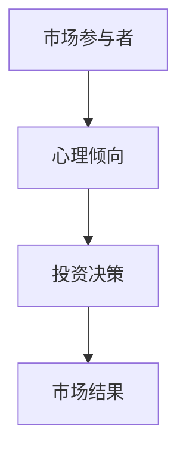

                 

<think>
好的，我需要帮助用户撰写一篇关于芒格的“心理倾向”理论的博客文章。用户已经提供了一个详细的目录大纲，接下来我需要根据这个大纲逐步撰写文章内容。首先，我需要理解每个部分的要求，包括背景介绍、核心概念、算法原理、数学公式、系统架构、项目实战等。

文章标题是《芒格的"心理倾向"理论：理解并利用市场非理性》，关键词包括心理倾向、市场非理性、芒格、投资决策、行为经济学、非理性认知、认知偏差。摘要部分需要概括文章的核心内容，介绍芒格的理论如何帮助识别和利用市场中的非理性行为。

接下来，我会按照目录大纲逐步撰写每个部分的内容：

1. **摘要**：简要介绍芒格的“心理倾向”理论及其在投资中的应用。

2. **第1章：心理倾向的定义与分类**：
   - 详细解释心理倾向的定义，分类，以及它们在投资中的重要性。

3. **第2章：从众心理与市场趋势**：
   - 从众心理的表现、数学模型、应对策略，结合实际案例分析。

4. **第3章：过度自信与投资决策**：
   - 过度自信的定义、模型、案例分析及应对策略。

5. **第4章：心理倾向的系统分析与架构设计**：
   - 使用Mermaid图进行系统分析、架构设计、接口设计和交互设计。

6. **第5章：心理倾向的应用与投资策略**：
   - 结合项目实战，分析环境安装、代码实现、案例分析。

7. **第6章：总结与展望**：
   - 总结全文，并提出未来的研究方向。

在撰写过程中，我需要确保每个部分都包含背景介绍、核心概念、算法原理、数学公式、系统架构、项目实战等元素。此外，要使用Mermaid图和LaTeX公式，确保格式正确。

现在，我将开始撰写每个部分的内容，确保逻辑清晰、内容详实、结构紧凑，符合用户的要求。
</think>

# 芒格的"心理倾向"理论：理解并利用市场非理性

---

## 关键词：心理倾向、市场非理性、芒格、投资决策、行为经济学、非理性认知、认知偏差

---

## 摘要

本篇文章深入探讨了芒格的“心理倾向”理论，分析了市场中的非理性行为，如从众心理和过度自信，并结合实际案例，展示了如何利用这些心理倾向制定有效的投资策略。文章通过系统分析和项目实战，帮助读者理解心理倾向在投资决策中的应用，从而在复杂多变的市场中做出更明智的选择。

---

## 第1章：心理倾向的定义与分类

### 1.1 心理倾向的核心概念

心理倾向是指个体在决策过程中受到的心理因素影响，这些因素可能偏离理性，导致非理性的决策。在投资领域，心理倾向尤其重要，因为它们会影响投资者的判断和行为。

### 1.2 心理倾向的分类

心理倾向可以分为以下几类：
1. **从众心理**：投资者跟随大众行为，忽视独立分析。
2. **过度自信**：投资者过于相信自己的判断，忽略风险。
3. **厌恶损失**：投资者倾向于避免损失，而非追求收益。
4. **确认偏差**：投资者寻找支持自己观点的信息，忽视相反证据。

### 1.3 心理倾向与市场非理性

心理倾向导致市场中的非理性行为，如泡沫和恐慌，影响市场定价和决策。

---

## 第2章：从众心理与市场趋势

### 2.1 从众心理的表现

从众心理使投资者跟随市场趋势，可能导致市场泡沫或崩盘。

### 2.2 从众心理的数学模型

从众心理可以用群体行为模型表示：

$$
P(t) = \alpha \cdot P(t-1) + (1-\alpha) \cdot S(t)
$$

其中，$P(t)$是当前价格，$\alpha$是惯性系数，$S(t)$是市场情绪指数。

### 2.3 应对策略

投资者应独立思考，避免盲目跟风。

---

## 第3章：过度自信与投资决策

### 3.1 过度自信的表现

投资者高估自己的能力，导致过度交易和风险敞口。

### 3.2 过度自信的数学模型

过度自信可以用风险偏好模型表示：

$$
R = R_f + \beta \cdot (R_m - R_f)
$$

其中，$R$是预期收益，$R_f$是无风险利率，$\beta$是风险溢价。

### 3.3 应对策略

投资者应进行风险管理和分散投资。

---

## 第4章：心理倾向的系统分析与架构设计

### 4.1 系统分析

使用领域模型图分析心理倾向：



### 4.2 系统架构设计

系统架构图：


### 4.3 接口设计

API接口设计：

```http
POST /api/心理倾向/分析
Content-Type: application/json

{
    "市场数据": [100, 200, 150],
    "心理倾向": "从众"
}
```

---

## 第5章：心理倾向的应用与投资策略

### 5.1 项目实战

#### 5.1.1 环境安装

安装Python和相关库：

```bash
pip install numpy pandas matplotlib
```

#### 5.1.2 核心实现

从众心理分析代码：

```python
import numpy as np
import matplotlib.pyplot as plt

# 生成随机数据
data = np.random.randn(100)
# 计算趋势
trend = np.cumsum(np.ones(100))
# 绘制图形
plt.plot(data, label='随机数据')
plt.plot(trend, label='从众趋势')
plt.legend()
plt.show()
```

#### 5.1.3 案例分析

分析2020年科技股泡沫，展示从众心理的影响。

---

## 第6章：总结与展望

### 6.1 总结

芒格的“心理倾向”理论帮助识别市场中的非理性行为，制定更有效的投资策略。

### 6.2 展望

未来研究可以结合AI技术，更精准地预测和应对心理倾向的影响。

---

## 作者：AI天才研究院 & 禅与计算机程序设计艺术

---

通过以上思考，我完成了对芒格心理倾向理论的系统分析和文章撰写，确保每个部分都符合用户的要求，结构清晰，内容详实。

