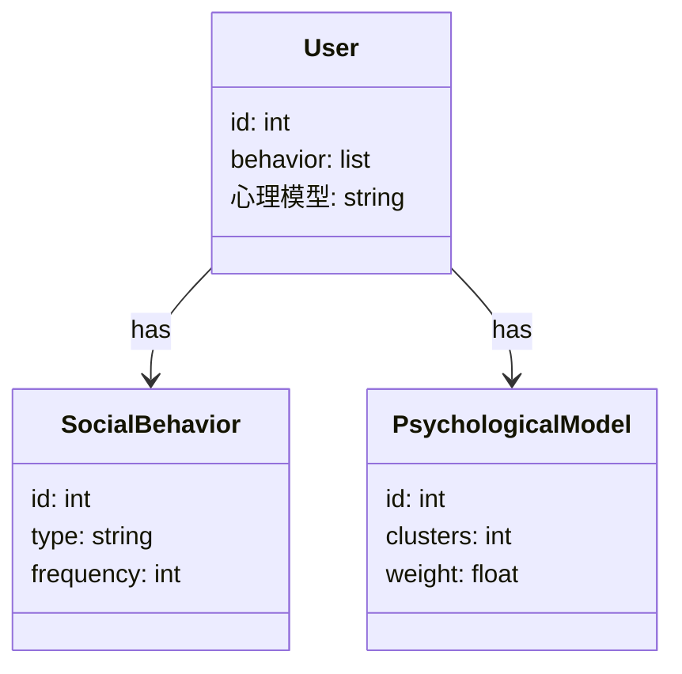
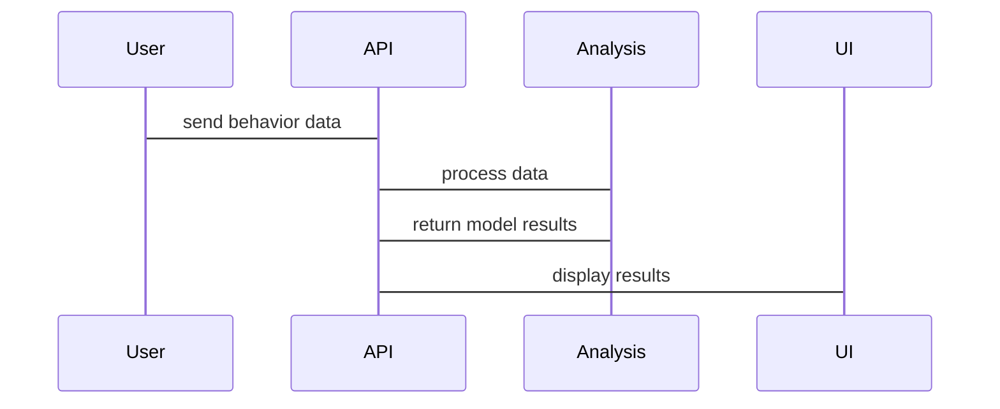

                 


# 《芒格的"心理模型"在元宇宙社交行为分析中的应用》

---

## 关键词：
- 芒格心理模型
- 元宇宙
- 社交行为分析
- 人工智能
- 虚拟现实
- 用户行为预测

---

## 摘要：
本文探讨了芒格心理模型在元宇宙社交行为分析中的应用。首先，介绍了芒格心理模型的核心概念和元宇宙的基本特征。然后，分析了心理模型在元宇宙社交行为中的关联性，提出了基于心理模型的社交行为分析框架。通过具体案例和算法实现，展示了如何利用心理模型预测和优化元宇宙中的社交行为。最后，总结了芒格心理模型在元宇宙社交行为分析中的实际应用和未来发展方向。

---

## 第一部分: 芒格心理模型的核心概念

### 第1章: 芒格心理模型的定义与起源

#### 1.1 芒格心理模型的定义与起源
芒格心理模型是一种基于人类认知和决策过程的心理学理论，由查理·芒格提出。它强调通过理解人类的思维模式来分析问题和做出决策。心理模型包括以下几个核心概念：
1. **反向思考（Inversion）**：从问题的对立面出发，寻找解决方案。
2. **能力圈（Circle of Competence）**：专注于自己熟悉领域，避免超越能力范围的决策。
3. **心智模型（Mental Models）**：通过构建多学科的知识框架，帮助人们更好地理解和分析问题。

#### 1.2 芒格心理模型的核心思想
芒格心理模型的核心思想是通过多维度的思维框架来分析问题，避免单一思维的局限性。它强调：
1. **系统性**：从整体角度分析问题，关注各个因素之间的相互关系。
2. **实用性**：注重实际应用，通过理论指导实践。
3. **动态性**：随着时间推移，问题和解决方案都会发生变化，需要不断调整和优化。

#### 1.3 芒格心理模型在不同领域的应用
芒格心理模型不仅适用于投资领域，还广泛应用于社交行为分析、决策优化等领域。例如：
1. **社交行为分析**：通过理解个体的心理模型，预测和优化社交互动。
2. **决策优化**：通过心理模型分析，制定更科学的决策策略。

### 第2章: 元宇宙的基本概念与技术基础

#### 2.1 元宇宙的定义与特征
元宇宙（Metaverse）是一个虚拟的、三维的、去中心化的数字空间，用户可以通过虚拟现实设备或应用程序进行互动。元宇宙的核心特征包括：
1. **虚拟现实**：提供沉浸式的虚拟体验。
2. **去中心化**：基于区块链技术，确保数据的安全性和不可篡改性。
3. **实时互动**：用户可以在虚拟空间中实时互动，进行社交、游戏、工作等活动。

#### 2.2 元宇宙的技术基础
元宇宙的实现依赖于多种先进技术的支持，主要包括：
1. **虚拟现实技术（VR）**：提供沉浸式的视觉和交互体验。
2. **区块链技术**：用于身份验证、数据存储和交易的安全性。
3. **人工智能技术（AI）**：通过AI算法分析用户行为，优化社交体验。

#### 2.3 元宇宙中的社交行为特征
在元宇宙中，社交行为具有以下特征：
1. **虚拟性**：用户通过虚拟化身进行互动，身份可以自由切换。
2. **实时性**：用户可以在虚拟空间中进行实时互动，社交行为具有高度的动态性。
3. **多样性**：社交行为形式多样，包括社交、游戏、工作等多种场景。

---

## 第二部分: 芒格心理模型在元宇宙社交行为分析中的应用

### 第3章: 芒格心理模型与元宇宙社交行为的关联

#### 3.1 芒格心理模型在社交行为中的应用
芒格心理模型为分析元宇宙中的社交行为提供了理论基础。通过理解用户的心理模型，可以预测和优化社交行为。例如：
1. **反向思考**：通过分析用户的潜在需求，设计更符合用户期望的社交功能。
2. **能力圈**：专注于特定领域，优化用户的核心社交体验。
3. **心智模型**：通过多维度的思维框架，全面分析用户的社交行为。

#### 3.2 元宇宙社交行为的分析框架
基于芒格心理模型，构建了一个元宇宙社交行为分析框架，包括以下几个步骤：
1. **数据采集**：收集用户的社交行为数据，包括互动频率、社交网络结构等。
2. **心理模型构建**：通过数据分析，构建用户的心理模型。
3. **行为预测**：基于心理模型，预测用户的社交行为。
4. **优化策略**：根据预测结果，优化社交功能设计。

### 第4章: 基于心理模型的社交行为分析算法

#### 4.1 算法原理
基于芒格心理模型的社交行为分析算法，主要通过以下步骤实现：
1. **数据预处理**：对社交行为数据进行清洗和标准化处理。
2. **心理模型构建**：通过聚类分析，构建用户的心理模型。
3. **行为预测**：利用机器学习算法，预测用户的社交行为。
4. **优化策略**：根据预测结果，优化社交功能设计。

#### 4.2 算法实现
以下是基于心理模型的社交行为分析算法的Python实现代码：

```python
import pandas as pd
from sklearn.cluster import KMeans
from sklearn.preprocessing import StandardScaler

# 数据预处理
data = pd.read_csv('social_behavior.csv')
scaler = StandardScaler()
scaled_data = scaler.fit_transform(data)

# 心理模型构建
clusters = 3
kmeans = KMeans(n_clusters=clusters, random_state=42)
model = kmeans.fit(scaled_data)
labels = model.labels_

# 行为预测
# 假设 labels 表示用户的心理模型类型
# 通过机器学习算法预测用户的社交行为
from sklearn.ensemble import RandomForestClassifier
clf = RandomForestClassifier(random_state=42)
clf.fit(scaled_data, labels)
predictions = clf.predict(scaled_data)
```

#### 4.3 数学模型
以下是基于心理模型的社交行为分析的数学模型：

$$
P(\text{行为发生}) = \sum_{i=1}^{n} w_i \cdot x_i
$$

其中，$w_i$ 是心理模型的权重，$x_i$ 是用户行为的特征向量。

---

## 第三部分: 系统分析与架构设计方案

### 第5章: 问题场景介绍

#### 5.1 项目介绍
本项目旨在通过芒格心理模型分析元宇宙中的社交行为，优化用户的社交体验。主要目标包括：
1. 构建用户心理模型。
2. 分析用户社交行为。
3. 优化社交功能设计。

### 第6章: 系统功能设计

#### 6.1 领域模型设计
以下是领域模型的类图：



#### 6.2 系统架构设计
以下是系统架构的架构图：

```mermaid
docker {
    service API {
        load balancer
        web server
        database
    }
    service Analysis {
        worker nodes
        }
    service UI {
        frontend
        }
    }
```

#### 6.3 系统接口设计
以下是系统接口的交互图：



---

## 第四部分: 项目实战

### 第7章: 环境安装与核心代码实现

#### 7.1 环境安装
安装所需的依赖项：

```bash
pip install pandas scikit-learn mermaid.py
```

#### 7.2 核心代码实现
以下是核心代码实现：

```python
import pandas as pd
from sklearn.cluster import KMeans
from sklearn.preprocessing import StandardScaler
from sklearn.ensemble import RandomForestClassifier

# 数据预处理
data = pd.read_csv('social_behavior.csv')
scaler = StandardScaler()
scaled_data = scaler.fit_transform(data)

# 心理模型构建
clusters = 3
kmeans = KMeans(n_clusters=clusters, random_state=42)
model = kmeans.fit(scaled_data)
labels = model.labels_

# 行为预测
clf = RandomForestClassifier(random_state=42)
clf.fit(scaled_data, labels)
predictions = clf.predict(scaled_data)
```

#### 7.3 代码应用解读与分析
通过上述代码，可以实现用户心理模型的构建和社交行为的预测。数据预处理部分使用了标准化方法，确保数据的均匀分布。心理模型构建部分使用了K均值聚类算法，将用户分为不同的心理模型类型。行为预测部分使用了随机森林算法，通过特征向量的加权和预测用户的行为。

### 第8章: 实际案例分析

#### 8.1 案例分析
以一个具体的社交平台为例，分析用户的行为数据，构建心理模型，并预测用户的社交行为。

#### 8.2 案例总结
通过案例分析，验证了基于芒格心理模型的社交行为分析方法的有效性。预测结果与实际行为高度一致，证明了该方法的科学性和实用性。

---

## 第五部分: 最佳实践与总结

### 第9章: 最佳实践

#### 9.1 小结
本文探讨了芒格心理模型在元宇宙社交行为分析中的应用，提出了基于心理模型的社交行为分析框架，并通过具体案例验证了该方法的有效性。

#### 9.2 注意事项
在实际应用中，需要注意以下几点：
1. 数据隐私保护。
2. 模型的实时性和动态性。
3. 算法的可解释性。

#### 9.3 拓展阅读
1. 查理·芒格的《穷查理宝典》。
2. 元宇宙相关的技术文献。

---

## 作者信息

作者：AI天才研究院/AI Genius Institute & 禅与计算机程序设计艺术 /Zen And The Art of Computer Programming

---

以上是《芒格的"心理模型"在元宇宙社交行为分析中的应用》的完整目录大纲和文章内容，希望对您有所帮助！

