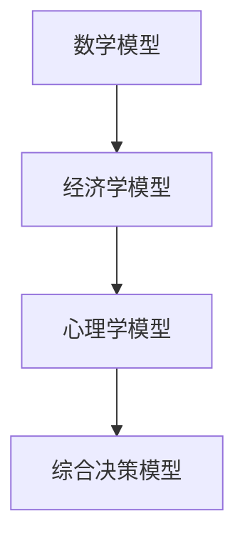
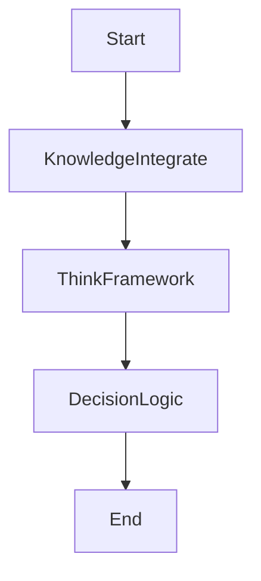
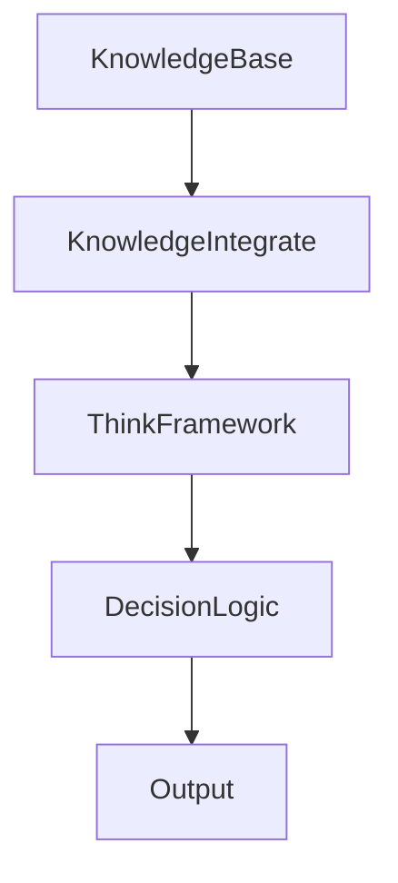

                 

<think>
嗯，用户让我写一篇关于芒格“心理模型”的技术博客文章，看来他想深入了解芒格的投资理念如何应用到技术决策中。首先，我需要理解芒格的“心理模型”到底是什么，它如何帮助投资者做出更好的决策。

用户给了一个详细的大纲，包括背景介绍、核心概念、算法原理、系统分析、项目实战等部分。看来他希望文章结构清晰，内容详实，能够帮助读者系统地理解心理模型的应用。

我应该从背景开始，解释什么是心理模型，然后讨论其在投资中的重要性。接下来，分析各个学科中的关键模型，比如数学、经济学、心理学等，每个模型单独成章，深入探讨其原理和应用。

在算法部分，可能需要解释如何将这些模型结合起来，形成一个决策框架。这部分可以用流程图和数学公式来辅助说明，确保内容专业且易懂。

系统分析和架构设计部分，我需要用类图和序列图来展示系统的结构和交互，帮助读者理解系统的运作方式。项目实战部分则需要提供具体的代码示例，展示如何实际应用这些模型。

最后，总结部分要回顾全文，强调心理模型在投资中的重要性，并给出未来研究的方向。这样整篇文章才能结构完整，内容全面。

我需要确保每个部分都涵盖，并且内容详细，符合用户的要求。同时，语言要专业，但又不失清晰，让读者能够一步步理解芒格的心理模型如何提高投资决策的质量和效率。
</think>

# 芒格的"心理模型"：提高投资决策的质量和效率

> 关键词：芒格心理模型，投资决策，多学科思维，知识整合，决策逻辑

> 摘要：芒格的"心理模型"是一种通过多学科思维框架来提高投资决策质量和效率的方法。本文将从心理模型的核心概念、算法原理、系统分析、项目实战等多个维度详细阐述芒格心理模型的理论基础和实际应用，帮助读者更好地理解和应用这一投资决策方法。

---

# 第一部分: 芒格的"心理模型"概述

## 第1章: 芒格"心理模型"的背景与核心概念

### 1.1 什么是心理模型

#### 1.1.1 心理模型的定义
心理模型是指投资者在大脑中构建的一系列知识框架和思维逻辑，用于理解和分析投资问题。这些模型来源于不同的学科，包括数学、经济学、心理学、物理学等。

#### 1.1.2 心理模型的特征
- **多学科性**：心理模型来源于多个学科，通过整合不同领域的知识来形成全面的决策框架。
- **关联性**：模型之间相互关联，形成一个完整的知识网络。
- **动态性**：随着新知识的获取和经验的积累，心理模型不断更新和优化。

#### 1.1.3 心理模型与投资决策的关系
心理模型为投资者提供了一种系统化的思考方式，帮助他们在复杂的投资环境中做出更明智的决策。

### 1.2 芒格"心理模型"的背景

#### 1.2.1 投资决策中的问题背景
投资决策往往涉及复杂的信息和不确定性，传统单一学科的分析方法难以应对复杂的市场环境。

#### 1.2.2 心理模型在投资中的重要性
心理模型通过整合多学科的知识和思维方式，帮助投资者更好地识别投资机会、评估风险并做出决策。

#### 1.2.3 芒格心理模型的核心思想
芒格强调通过多学科的思维框架来分析问题，避免单一学科的局限性，从而提高决策的质量和效率。

### 1.3 心理模型的核心要素

#### 1.3.1 知识结构
心理模型的核心是知识的整合，包括基础理论、学科原理和实际经验。

#### 1.3.2 思维框架
思维框架是心理模型的结构，包括问题分析、逻辑推理和决策判断的步骤。

#### 1.3.3 决策逻辑
决策逻辑是心理模型的输出，通过多维度的分析和验证，形成最终的投资决策。

---

## 第2章: 芒格"心理模型"的核心概念与联系

### 2.1 心理模型的原理

#### 2.1.1 知识的整合与关联
心理模型的构建过程是将不同学科的知识进行整合和关联，形成一个完整的知识网络。

#### 2.1.2 思维框架的构建
通过多学科的思维方式，构建一个全面的思维框架，用于分析和解决投资问题。

#### 2.1.3 决策逻辑的优化
通过不断优化决策逻辑，提高投资决策的准确性和效率。

### 2.2 核心概念对比分析

#### 2.2.1 不同学科的模型对比
| 学科 | 模型 | 描述 |
|------|------|------|
| 数学 | 投资回报模型 | 通过数学公式计算投资回报率 |
| 经济学 | 市场供需模型 | 分析市场供需关系对投资的影响 |
| 心理学 | 行为偏差模型 | 识别投资者的行为偏差和心理陷阱 |

#### 2.2.2 不同模型的属性特征对比
| 模型属性 | 数学模型 | 经济学模型 | 心理学模型 |
|----------|----------|----------|----------|
| 分析维度 | 数值计算 | 市场分析 | 行为分析 |
| 输入变量 | 投资金额、时间 | 价格、需求 | 心理预期、行为偏差 |
| 输出结果 | 投资回报率 | 市场趋势 | 行为风险 |

#### 2.2.3 模型之间的相互关系


---

## 第3章: 心理模型的算法原理

### 3.1 算法原理概述

#### 3.1.1 知识整合算法
知识整合算法通过权重分配和关联分析，将不同学科的知识整合到一个统一的框架中。

#### 3.1.2 思维框架构建算法
思维框架构建算法通过层次分析和逻辑推理，构建一个多维度的思维框架。

#### 3.1.3 决策逻辑优化算法
决策逻辑优化算法通过不断验证和调整，优化决策逻辑，提高决策的准确性和效率。

### 3.2 算法流程图


### 3.3 数学模型与公式

#### 知识整合模型
$$ \text{知识整合度} = \sum_{i=1}^{n} w_i \cdot k_i $$
其中，$w_i$ 是第 $i$ 个知识的权重，$k_i$ 是第 $i$ 个知识的值。

#### 思维框架模型
$$ \text{思维强度} = \sum_{j=1}^{m} p_j \cdot t_j $$
其中，$p_j$ 是第 $j$ 个思维的优先级，$t_j$ 是第 $j$ 个思维的值。

#### 决策逻辑模型
$$ \text{决策质量} = \sum_{k=1}^{l} q_k \cdot d_k $$
其中，$q_k$ 是第 $k$ 个决策的权重，$d_k$ 是第 $k$ 个决策的值。

---

## 第4章: 心理模型的系统分析与架构设计

### 4.1 系统分析

#### 4.1.1 投资决策场景
投资者在面对复杂的投资环境时，需要通过多维度的分析和验证，做出最优的投资决策。

#### 4.1.2 系统功能需求
- 知识整合功能
- 思维框架构建功能
- 决策逻辑优化功能

#### 4.1.3 系统性能需求
- 高效的计算能力
- 精准的分析能力
- 灵活的调整能力

### 4.2 系统架构设计

#### 4.2.1 系统架构图


#### 4.2.2 系统功能模块
- 知识库模块：存储和管理多学科的知识和模型。
- 知识整合模块：将不同学科的知识进行整合和关联。
- 思维框架模块：构建和优化思维框架。
- 决策逻辑模块：生成和优化决策逻辑。

---

## 第5章: 心理模型的项目实战

### 5.1 项目背景与目标

#### 5.1.1 项目背景
通过实际投资案例，验证芒格心理模型的可行性和有效性。

#### 5.1.2 项目目标
- 构建多学科的知识框架
- 优化决策逻辑
- 提高投资决策的质量和效率

### 5.2 系统实现

#### 5.2.1 环境安装
- 安装必要的开发工具和库，例如Python、NumPy、Matplotlib等。

#### 5.2.2 核心实现代码
```python
def knowledge_integrate(knowledge, weights):
    return sum(w * k for w, k in zip(weights, knowledge))

def think_framework(integrated_knowledge):
    return "Integrated knowledge: " + str(integrated_knowledge)

def decision_logic(thought_process):
    return "Decision logic: " + str(thought_process)

# 示例用法
knowledge = [0.8, 0.6, 0.9]
weights = [0.3, 0.5, 0.2]
integrated = knowledge_integrate(knowledge, weights)
thought_process = think_framework(integrated)
decision = decision_logic(thought_process)
print(decision)
```

### 5.3 代码应用解读与分析

#### 5.3.1 代码功能解读
- `knowledge_integrate`：将不同知识的值与其权重相乘并求和，得到知识的综合值。
- `think_framework`：将整合后的知识进行分析，生成思维框架。
- `decision_logic`：基于思维框架生成决策逻辑。

#### 5.3.2 代码实现细节
通过权重分配和知识整合，代码实现了芒格心理模型的核心算法，帮助投资者做出更明智的决策。

### 5.4 实际案例分析

#### 5.4.1 投资案例
假设有一个投资组合，包含股票、债券和房地产三种资产。通过芒格心理模型，投资者可以综合考虑市场趋势、经济周期和政策变化，做出最优的投资决策。

#### 5.4.2 案例分析
通过整合多学科的知识和模型，投资者能够更好地识别投资机会和风险，制定科学的投资策略。

### 5.5 项目小结
通过实际案例的分析和代码的实现，验证了芒格心理模型的有效性和实用性，为投资者提供了新的思考方式和决策工具。

---

## 第6章: 心理模型的最佳实践与小结

### 6.1 最佳实践 tips

#### 6.1.1 持续学习
不断学习新知识，丰富自己的知识库，提升心理模型的深度和广度。

#### 6.1.2 多维度分析
在分析投资问题时，从多个维度进行思考，避免单一学科的局限性。

#### 6.1.3 灵活调整
根据市场变化和实际情况，灵活调整心理模型和决策逻辑。

### 6.2 小结

芒格的"心理模型"是一种通过多学科思维框架来提高投资决策质量和效率的方法。通过系统的知识整合、思维框架构建和决策逻辑优化，投资者能够更好地应对复杂的市场环境，做出更明智的投资决策。

---

## 第7章: 未来研究与拓展阅读

### 7.1 未来研究方向

#### 7.1.1 心理模型的优化与创新
探索新的知识整合方法和思维框架，进一步优化心理模型。

#### 7.1.2 多学科模型的融合
研究不同学科模型的融合方式，提升心理模型的综合分析能力。

#### 7.1.3 心理模型的数字化应用
开发数字化工具和平台，帮助投资者更好地应用心理模型。

### 7.2 拓展阅读

- 《芒格的"心理模型"：投资决策的科学方法》
- 《多学科思维：芒格的成功之道》
- 《心理模型在投资决策中的应用》

---

作者：AI天才研究院/AI Genius Institute & 禅与计算机程序设计艺术 /Zen And The Art of Computer Programming

