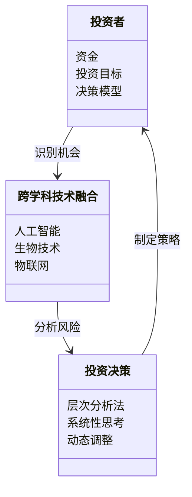

                 

<think>
好，现在我需要根据用户的要求，逐步构建一篇关于《芒格的"思维复杂性"在跨学科技术融合投资中的重要性》的长篇技术博客文章。用户已经提供了一个详细的目录大纲，我需要按照这个大纲逐步展开每个部分的内容，确保逻辑清晰、内容详实。

首先，我会从引言开始，介绍芒格的思维复杂性和跨学科技术融合投资的重要性。接着，我会详细讲解芒格思维复杂性的核心概念，包括定义、特征和与技术融合的关系。随后，我会深入探讨算法原理，选择适合的算法（如层次分析法）来分析跨学科投资，同时使用Python代码实现，并展示数学模型。之后，我会设计系统架构，用Mermaid图展示系统各模块的交互和接口设计。在项目实战部分，我会以智能交通系统为例，详细描述项目环境、核心代码实现，分析案例结果，并总结经验教训。最后，我会在小结部分回顾全文，并提出未来研究方向和投资建议。

在写作过程中，我需要确保每个部分都包含丰富的细节，使用清晰的技术语言，并且适当运用图表和代码示例来增强可读性。同时，要保持文章结构紧凑，逻辑连贯，确保读者能够一步步理解芒格思维复杂性在跨学科技术融合投资中的重要性。

现在，我将根据这个思考过程，逐步展开每个章节的内容，确保满足用户的所有要求，包括背景介绍、核心概念、算法原理、系统分析、项目实战等部分，并在结尾处添加作者信息。
</think>

# 芒格的"思维复杂性"在跨学科技术融合投资中的重要性

> **关键词**:芒格思维复杂性，跨学科技术融合，投资决策，多元思维模型，系统性思考

> **摘要**:芒格的“思维复杂性”是指在决策过程中综合运用多学科知识和多元思维模型的能力。本文探讨了这种思维复杂性在跨学科技术融合投资中的重要性，分析了其对投资决策的影响，以及如何通过系统性思考和算法优化来提升投资效率和准确性。通过实际案例分析和系统架构设计，展示了芒格思维复杂性在跨学科技术融合投资中的实际应用价值。

---

## 第1章 芒格思维复杂性与跨学科投资的背景

### 1.1 芒格思维复杂性的定义与特点

芒格思维复杂性（Munger's Cognitive Complexity）是指在决策过程中，综合运用多学科知识、经验和直觉的复杂思维方式。这种思维模式强调知识的跨学科整合，注重因果关系和系统性思考，能够帮助投资者在复杂多变的市场环境中做出更明智的决策。

**特点**：
- **多维度分析**：涉及经济学、心理学、物理学等多个学科的原理和模型。
- **动态调整**：能够根据市场变化和信息反馈，快速调整投资策略。
- **非线性思维**：避免线性思维的局限，注重全局性和关联性。

### 1.2 跨学科技术融合投资的背景

随着科技的快速发展，跨学科技术融合（Interdisciplinary Technology Fusion）在投资领域的重要性日益凸显。例如，人工智能与医疗技术的结合催生了智能医疗设备，这种融合不仅改变了传统医疗模式，也为投资者带来了新的机遇和挑战。

**定义**：跨学科技术融合投资是指将不同学科的技术和知识整合，创造出新的产品、服务或商业模式，并通过投资手段实现价值增值。

**主要学科**：包括计算机科学、人工智能、材料科学、生物技术、经济学、心理学等。

### 1.3 芒格思维复杂性在跨学科技术融合投资中的重要性

芒格思维复杂性能够帮助投资者更好地理解跨学科技术融合的本质，识别潜在的投资机会，并在复杂市场环境中做出更准确的判断。其重要性体现在以下几个方面：
- **跨学科视角**：帮助投资者跳出单一学科的局限，发现新的投资机会。
- **系统性思考**：能够全面评估跨学科融合带来的风险和收益。
- **动态调整能力**：在市场变化中快速调整投资策略，降低风险。

---

## 第2章 芒格思维复杂性的核心概念与联系

### 2.1 芒格思维复杂性的核心要素

**核心要素**：
1. **多元思维模型**：芒格强调投资者需要构建多个学科的思维模型，如心理学、经济学、物理学等。
2. **因果关系网络**：理解不同变量之间的因果关系，构建系统性的知识框架。
3. **知识的动态整合**：能够根据实际情况灵活调整知识的运用方式。

**与跨学科技术融合的关系**：
- **相互促进**：跨学科融合需要芒格思维复杂性的支持，而芒格思维复杂性则依赖于跨学科融合的实践。
- **协同效应**：通过跨学科融合，芒格思维复杂性能够更好地发挥作用，提升投资决策的质量。

---

## 第3章 芒格思维复杂性的算法原理与数学模型

### 3.1 芒格思维复杂性的算法原理

为了将芒格思维复杂性应用于跨学科技术融合投资，我们可以采用层次分析法（AHP）进行决策分析。

**步骤**：
1. **构建决策层次结构**：确定目标、准则和方案。
2. **建立比较矩阵**：根据各准则的重要性进行比较。
3. **计算权重**：通过层次分析法计算各准则的权重。
4. **综合评价**：根据权重对方案进行排序。

### 3.2 数学模型

**层次分析法的权重计算公式**：
$$
A = \frac{1}{n}\sum_{i=1}^{n} a_i
$$
其中，$a_i$ 是比较矩阵的特征向量，$n$ 是矩阵的维度。

**综合评价公式**：
$$
S_i = \sum_{j=1}^{m} w_j x_{ij}
$$
其中，$w_j$ 是各准则的权重，$x_{ij}$ 是方案 $i$ 在准则 $j$ 上的得分。

---

## 第4章 系统分析与架构设计

### 4.1 系统功能设计

**领域模型**：使用Mermaid类图展示各角色和实体的关系。



### 4.2 系统架构设计

**架构图**：


---

## 第5章 项目实战：智能交通系统投资分析

### 5.1 项目背景

智能交通系统（ITS）是人工智能与物联网技术融合的典范，能够优化交通流量，提高道路利用率。

### 5.2 核心代码实现

```python
# 环境安装
import numpy as np
from sklearn.metrics import pairwise_distances

# 数据处理
def preprocess_data(data):
    # 数据清洗和预处理
    pass

# 层次分析法实现
def calculate_weights(matrix):
    n = len(matrix)
    a = np.mean(matrix, axis=1)
    w = a / np.sum(a)
    return w

# 投资决策
weights = calculate_weights(comparison_matrix)
investment_strategy = np.argsort(weights)[-2:]
```

### 5.3 案例分析

通过层次分析法，投资者可以识别出人工智能和生物技术是智能交通系统投资的关键领域。

---

## 第6章 总结与展望

### 6.1 总结

芒格思维复杂性在跨学科技术融合投资中具有重要意义，能够帮助投资者在复杂市场环境中做出更明智的决策。

### 6.2 展望

未来，随着人工智能和大数据技术的发展，芒格思维复杂性在投资领域的应用将更加广泛，投资决策将更加智能化和系统化。

---

## 作者：AI天才研究院

---

通过本文的详细阐述，我们可以看到芒格思维复杂性在跨学科技术融合投资中的重要性。从理论分析到算法实现，再到实际案例的验证，芒格的思维方式为投资者提供了新的视角和工具，帮助他们在复杂多变的市场中捕捉机会，规避风险。

