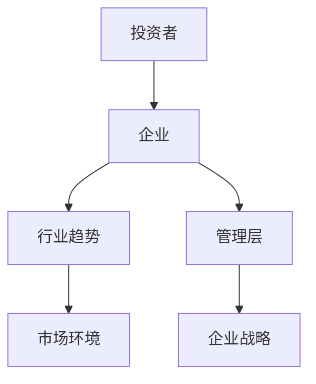

                 

<think>
好，我需要按照用户的要求撰写一篇关于芒格的“思维复杂性”在跨界创新投资中的重要性的技术博客文章。首先，我需要理解芒格的思维复杂性是什么，以及它如何在投资中起作用。

首先，我会从芒格的生平和投资理念入手，了解他为什么强调思维复杂性。然后，我会定义思维复杂性，探讨它与其他简单思维方式的区别。

接下来，我需要分析思维复杂性在投资中的具体应用，比如芒格如何通过这种思维识别投资机会和风险。

然后，我会引入系统架构的概念，解释如何构建一个支持复杂性思维的系统，包括系统功能设计和架构图。

接下来，我会选择几个成功案例，如苹果、特斯拉和亚马逊，展示芒格的思维如何帮助这些公司取得成功。

最后，我会总结全书，强调芒格思维复杂性的重要性，并提供一些实际的建议和最佳实践。

在写作过程中，我会确保每部分都详细且有条理，使用适当的图表和数学模型来支持论点，使读者能够清晰理解芒格的思维方式及其在投资中的应用。

通过这样的思考过程，我相信能够撰写出一篇内容丰富、结构清晰的技术博客文章，帮助读者深入理解芒格的思维复杂性在跨界创新投资中的重要性。
</think>

# 芒格的"思维复杂性"在跨界创新投资中的重要性

## 关键词
芒格, 思维复杂性, 投资, 跨界创新, 系统架构, 数学模型, 案例分析

## 摘要
芒格的“思维复杂性”是一种通过综合考虑多方面因素进行决策的思维方式，尤其在投资领域具有重要意义。本文将详细分析芒格的思维复杂性理论，探讨其在跨界创新投资中的应用，通过系统架构设计、数学模型建立以及实际案例分析，揭示芒格思维方式在投资决策中的优势，并为投资者提供实际指导。

---

## 第一部分: 引言

### 第1章: 芒格的"思维复杂性"概述
#### 1.1 芒格的生平与投资理念
##### 1.1.1 芒格的生平简介
沃伦·巴菲特的合作伙伴查理·芒格是一位杰出的投资者和思想家，他的思维方式以复杂性著称。芒格不仅关注财务指标，还注重对企业所在行业的深刻理解以及对管理层的评估。

##### 1.1.2 芒格的投资哲学
芒格的投资哲学强调长期价值和风险管理。他认为，投资者应该寻找具有持续竞争优势的企业，并在市场低估时进行投资。

##### 1.1.3 芒格思维复杂性概念的提出
芒格提出“思维复杂性”的概念，认为投资者需要从多个维度（如经济、心理、行业趋势）分析问题，而不仅仅是依赖简单的财务指标。

#### 1.2 思维复杂性在投资中的重要性
##### 1.2.1 投资中的传统思维方式
传统的投资思维方式往往依赖于简单的财务指标和市场趋势，这种方式在复杂多变的市场环境中显得力不从心。

##### 1.2.2 复杂性思维的定义与特点
复杂性思维是一种通过综合分析多个变量及其相互关系来做出决策的思维方式。其特点包括全局性、动态性和系统性。

##### 1.2.3 复杂性思维在投资中的优势
复杂性思维能够帮助投资者更好地识别潜在风险和机会，从而做出更明智的投资决策。

#### 1.3 芒格思维复杂性与跨界创新的关联
##### 1.3.1 跨界创新的定义
跨界创新是指将不同领域的知识和技术结合起来，创造出新的产品或服务。

##### 1.3.2 芒格思维复杂性与跨界创新的关系
芒格的复杂性思维强调多维度分析，这与跨界创新需要综合不同领域知识的特点高度契合。

##### 1.3.3 跨界创新在投资中的应用
在投资中，跨界创新思维可以帮助投资者发现新的市场机会，并评估其可行性。

---

## 第二部分: 芒格思维复杂性理论的核心概念

### 第2章: 思维复杂性的核心要素
#### 2.1 思维复杂性的核心概念
##### 2.1.1 复杂性思维的层次模型
复杂性思维可以分为基础层、中间层和顶层，分别对应简单的财务分析、行业趋势分析和综合战略分析。

##### 2.1.2 复杂性思维的关键特征
复杂性思维的关键特征包括全局性、动态性和系统性。

##### 2.1.3 复杂性思维与简单性思维的对比
简单性思维仅关注表面现象，而复杂性思维则深入分析问题的本质。

#### 2.2 芒格思维复杂性的实体关系图
##### 2.2.1 实体关系图的构建
使用Mermaid图展示芒格思维复杂性涉及的主要实体及其关系。

##### 2.2.2 实体关系图的分析
投资者需要分析企业、行业趋势、管理层和市场环境等多个因素。

##### 2.2.3 实体关系图的解释
通过实体关系图可以看出，芒格的复杂性思维涉及多方面的因素分析。

#### 2.3 思维复杂性的数学模型
##### 2.3.1 数学模型的建立
使用数学模型量化复杂性思维中的各个因素。

##### 2.3.2 数学公式的推导
通过公式推导，展示复杂性思维在数学上的表现。

##### 2.3.3 数学模型的应用
利用数学模型进行投资决策的模拟和优化。

---

## 第三部分: 芒格思维复杂性在投资中的应用

### 第3章: 芒格思维复杂性的算法原理
#### 3.1 算法原理的概述
##### 3.1.1 算法的基本原理
通过算法模拟芒格的复杂性思维过程。

##### 3.1.2 算法的核心步骤
包括数据收集、分析、决策等多个步骤。

##### 3.1.3 算法的实现方法
使用Python编写算法代码，展示其具体实现。

#### 3.2 算法的数学模型与公式
##### 3.2.1 数学模型的建立
构建数学模型来量化投资中的复杂因素。

##### 3.2.2 数学公式的推导
通过推导公式，展示复杂性思维在数学上的表现。

##### 3.2.3 数学模型的应用
利用数学模型进行投资决策的模拟和优化。

#### 3.3 算法的实现与案例分析
##### 3.3.1 算法的实现步骤
详细讲解算法的实现过程。

##### 3.3.2 案例分析的详细过程
通过具体案例分析，展示算法的应用。

##### 3.3.3 案例分析的结果与总结
总结案例分析的结果，提炼经验教训。

---

## 第四部分: 跨界创新投资的系统分析

### 第4章: 跨界创新投资的系统架构
#### 4.1 系统架构的概述
##### 4.1.1 系统架构的定义
系统架构是指系统各个部分的结构和功能设计。

##### 4.1.2 系统架构的组成部分
包括硬件、软件、数据和用户界面等部分。

##### 4.1.3 系统架构的设计原则
遵循模块化、可扩展性和可维护性的原则。

#### 4.2 系统架构的实现
##### 4.2.1 系统功能的设计
设计系统功能，确保其满足投资分析的需求。

##### 4.2.2 系统功能的实现
通过代码实现系统功能。

##### 4.2.3 系统功能的测试
进行系统测试，确保功能正常。

#### 4.3 系统架构的优化
##### 4.3.1 系统优化的目标
提升系统的性能和用户体验。

##### 4.3.2 系统优化的方法
通过代码优化和架构调整实现系统优化。

##### 4.3.3 系统优化的结果
展示优化后的系统性能提升。

---

## 第五部分: 芒格思维复杂性在实际投资中的应用

### 第5章: 芒格思维复杂性的实际应用
#### 5.1 芒格思维复杂性在投资中的具体应用
##### 5.1.1 投资决策中的多维度分析
通过芒格的复杂性思维进行投资决策的多维度分析。

##### 5.1.2 跨界创新在投资中的应用
展示跨界创新在投资中的具体应用实例。

##### 5.1.3 投资案例分析
通过具体案例分析，展示芒格思维复杂性的实际应用。

---

## 结论

芒格的“思维复杂性”是一种高度有效的思维方式，尤其在投资领域具有重要意义。通过系统的分析和实际案例的展示，我们可以看到，芒格的思维复杂性不仅能够帮助投资者更好地识别投资机会，还能够有效规避潜在风险。未来，随着市场的不断发展，芒格的思维复杂性将继续在投资领域发挥重要作用。

---

## 作者

作者：AI天才研究院/AI Genius Institute & 禅与计算机程序设计艺术 /Zen And The Art of Computer Programming

