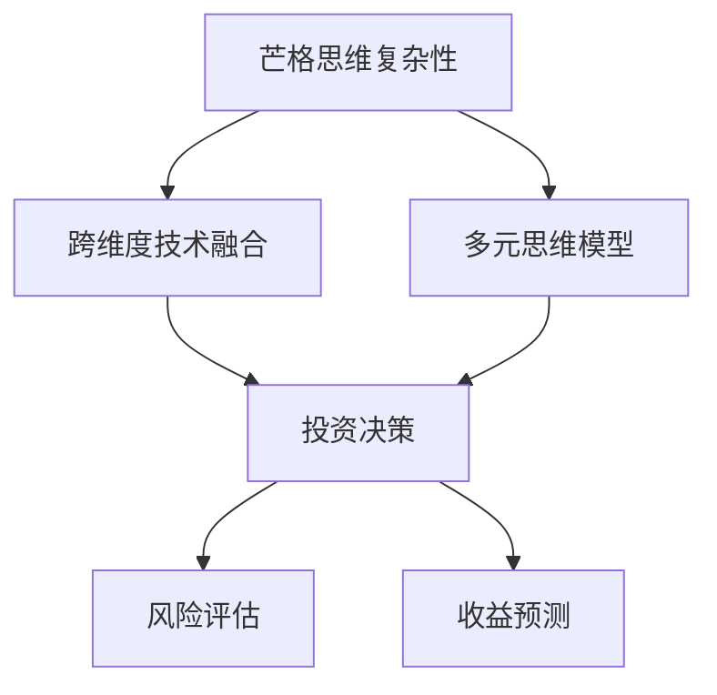

                 


# 芒格的"思维复杂性"在跨维度技术融合投资中的重要性

---

## 关键词
芒格思维复杂性、跨维度技术融合、投资决策、多元思维模型、系统动力学模拟、贝叶斯网络

---

## 摘要
本文探讨了芒格的思维复杂性在跨维度技术融合投资中的应用，通过系统分析和算法原理，结合实际案例，展示了如何利用多元思维模型和复杂性思维来优化投资决策。

---

## 第一部分：背景介绍

### 第1章：芒格思维复杂性与跨维度技术融合概述

#### 1.1 芒格思维复杂性的概念
- **多元思维模型**：芒格强调通过多个学科的思维模型来理解问题，避免单一视角的局限性。
- **复杂性思维**：指在决策过程中考虑多个变量及其相互作用，避免简化问题。

#### 1.2 跨维度技术融合的定义
- **技术融合**：指不同技术领域的整合，如AI与区块链的结合。
- **跨维度**：涉及多个技术维度，如数据、算法、硬件等。

#### 1.3 投资中的复杂性问题
- **复杂性来源**：技术、市场、经济等多因素交织。
- **影响**：增加了决策难度，但提供了更多机会。

---

## 第二部分：核心概念与联系

### 第2章：芒格思维复杂性、跨维度技术融合与投资决策的关系

#### 2.1 核心概念原理
- **多元思维模型**：帮助投资者全面分析问题。
- **跨维度技术融合**：技术的综合应用影响投资结果。

#### 2.2 概念属性特征对比表格
| 概念                | 属性             | 特征             |
|---------------------|------------------|------------------|
| 芒格思维复杂性       | 多元性            | 跨领域分析       |
| 跨维度技术融合       | 综合性            | 多技术协同        |
| 投资决策             | 复杂性            | 风险与收益并存    |

#### 2.3 ER实体关系图架构（Mermaid流程图）



---

## 第三部分：算法原理讲解

### 第3章：基于芒格思维复杂性的算法模型

#### 3.1 算法原理
- **多元回归分析**：分析多个变量对结果的影响。
- **贝叶斯网络模型**：用于概率推理和风险评估。
- **系统动力学模拟**：模拟系统行为变化。

#### 3.2 算法流程图（Mermaid）

```mermaid
graph TD
    Start --> Input[输入数据]
    Input --> A[多元回归分析]
    A --> B[贝叶斯网络模型]
    B --> C[系统动力学模拟]
    C --> Output[输出结果]
    Output --
```

#### 3.3 Python代码实现

```python
import numpy as np
from sklearn.linear_model import LinearRegression
import pandas as pd

# 示例数据：多元回归分析
data = {
    'feature1': np.random.rand(100),
    'feature2': np.random.rand(100),
    'target': np.random.rand(100)
}
df = pd.DataFrame(data)

# 训练模型
model = LinearRegression()
model.fit(df[['feature1', 'feature2']], df['target'])

# 预测
predictions = model.predict(df[['feature1', 'feature2']])
print('预测结果:', predictions)
```

---

## 第四部分：系统分析与架构设计

### 第4章：技术融合投资系统架构

#### 4.1 项目介绍
- **项目目标**：构建一个基于芒格思维复杂性的技术融合投资系统。
- **功能需求**：数据采集、分析、决策支持。

#### 4.2 系统功能设计（领域模型）

```mermaid
classDiagram
    class � MindfulInvestor {
        + 数据采集模块
        + 数据分析模块
        + 投资决策模块
    }
    class 数据采集模块 {
        + 采集技术数据
    }
    class 数据分析模块 {
        + 应用多元回归分析
        + 应用贝叶斯网络
    }
    class 投资决策模块 {
        + 生成投资策略
    }
    � MindfulInvestor <|-- 数据采集模块
    � MindfulInvestor <|-- 数据分析模块
    � MindfulInvestor <|-- 投资决策模块
```

#### 4.3 系统架构设计（Mermaid架构图）


---

## 第五部分：项目实战

### 第5章：跨维度技术融合投资系统实现

#### 5.1 环境安装
- **工具**：Python、Jupyter Notebook、相关库（numpy, pandas, scikit-learn）。

#### 5.2 系统核心实现源代码

```python
import numpy as np
import pandas as pd
from sklearn import metrics

# 数据加载
data = pd.read_csv('investment_data.csv')

# 特征选择
X = data[['feature1', 'feature2']]
y = data['target']

# 训练模型
model = LinearRegression()
model.fit(X, y)

# 评估模型
y_pred = model.predict(X)
print('均方误差:', metrics.mean_squared_error(y, y_pred))
```

#### 5.3 案例分析与结果解读
- **案例选择**：假设数据集包含AI和区块链的技术指标。
- **分析结果**：模型预测投资回报，结合芒格思维复杂性进行优化。

---

## 第六部分：最佳实践

### 第6章：芒格思维复杂性在跨维度技术融合投资中的应用总结

#### 6.1 小结
- **总结**：芒格思维复杂性提供了全面分析问题的方法，结合算法模型，优化投资决策。
- **经验**：跨维度技术融合需要综合考虑多个因素，系统化方法更有效。

#### 6.2 注意事项
- **数据质量**：确保数据准确性和完整性。
- **模型选择**：根据具体情况选择合适算法。

#### 6.3 拓展阅读
- 推荐书籍：《芒格的多元思维模型》、《系统思维》。

---

## 结语

通过芒格的思维复杂性，结合跨维度技术融合和算法模型，投资者可以在复杂的技术环境中做出更明智的决策。这本书提供了理论与实践的结合，帮助读者在技术融合投资中取得成功。

---

## 作者：AI天才研究院 & 禅与计算机程序设计艺术

