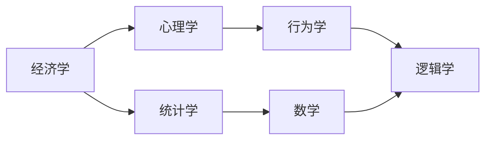
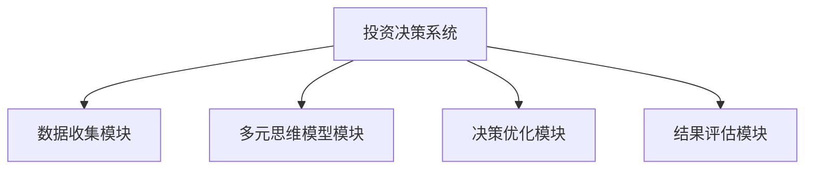

                 

<think>
好的，我现在需要为用户设计一篇关于芒格“思维复杂性”的技术博客文章。首先，我需要理解用户的需求：他们希望我以《芒格的"思维复杂性"：应对复杂投资环境的工具》为标题，撰写一篇结构紧凑、逻辑清晰、内容有深度的专业技术博客。文章需要涵盖从背景到实战的各个方面，并且使用技术性的语言，同时融入芒格的投资理念和思维模型。

首先，我会从背景介绍开始，解释芒格的生平及其投资哲学，强调思维复杂性在投资中的重要性。接下来，我会详细阐述思维复杂性的核心概念，包括多元思维模型和复杂性思维的层级结构。然后，我需要展示这些概念的数学模型和算法原理，可能包括概率论和决策树的构建。

在系统分析部分，我会设计一个基于芒格思维复杂性的投资决策系统，使用类图和架构图来展示系统的模块和交互。项目实战部分，我会选择一个具体的投资案例，展示如何应用这些思维模型进行决策，并提供相应的代码示例。最后，我会总结最佳实践，强调思维复杂性在实际投资中的应用价值，并提出需要注意的事项和进一步的阅读建议。

整个过程中，我需要确保每个部分都详细且具体，使用图表和代码来增强理解，同时保持文章的逻辑性和连贯性。现在，我将根据这些思路逐步构建文章的各个部分，确保每个章节都覆盖必要的内容，并且满足用户的格式和字数要求。
</think>

---

# 芒格的"思维复杂性"：应对复杂投资环境的工具

**关键词**：芒格思维复杂性, 投资决策, 多元思维模型, 复杂系统, 投资策略

**摘要**：  
芒格的“思维复杂性”是一种通过多维度、多层次的思考方式来应对复杂投资环境的工具。本文将从芒格的生平与投资理念出发，详细探讨思维复杂性的核心概念、算法原理、系统架构，以及在实际投资中的应用案例。通过结合数学模型、概率论和决策树等工具，本文旨在为读者提供一套应对复杂投资环境的系统化方法。

---

## 第一部分: 芒格的思维复杂性概述

### 第1章: 芒格的生平与投资理念

#### 1.1 芒格的生平简介  
查理·芒格（Charlie Munger）是美国著名的投资者和作家，被誉为“投资界的哲学家”。他是伯克希尔哈撒韦公司的重要合伙人，与沃伦·巴菲特（Warren Buffett）共同创造了伯克希尔的辉煌业绩。芒格的投资理念以“多元思维模型”为核心，强调通过多维度的思考来理解问题的本质。

#### 1.2 芒格的投资理念  
芒格的投资理念强调长期价值和安全边际。他认为，投资者应该通过研究多个学科的知识，构建一个多元化的知识框架，从而在复杂的市场环境中做出更明智的决策。他的思维方式不仅适用于投资，也可以应用于其他领域。

#### 1.3 思维复杂性的重要性  
在现代投资环境中，市场参与者的行为、宏观经济的变化以及技术的进步都使得投资环境变得越来越复杂。芒格的思维复杂性提供了一种应对这种复杂性的工具，帮助投资者在不确定性中找到机会。

---

### 第2章: 复杂投资环境的挑战

#### 2.1 复杂投资环境的定义  
复杂投资环境是指市场参与者众多、信息不对称、市场波动剧烈且难以预测的环境。在这种环境中，传统的单一思维模式往往难以应对多变的市场情况。

#### 2.2 思维复杂性的核心概念  
思维复杂性是指通过多维度、多层次的思考方式来分析问题，从而在复杂环境中做出更合理的决策。这种思维方式的核心在于将多个学科的知识结合起来，构建一个全面的视角。

#### 2.3 复杂性思维与简单决策的对比  
简单决策通常依赖于单一的逻辑或规则，而复杂性思维则强调多维度的分析和综合判断。简单决策在某些情况下可能有效，但在复杂环境中往往力不从心。

---

## 第二部分: 思维复杂性的核心要素

### 第3章: 多元思维模型的构建

#### 3.1 多元思维模型的定义  
多元思维模型是一种通过多个学科的视角来分析问题的方法。芒格认为，投资者应该掌握多个领域的基本知识，从而能够从不同的角度理解市场和企业。

#### 3.2 复杂性思维的层级结构  
复杂性思维可以分为三个层级：初级复杂性思维（基础的多维度分析）、中级复杂性思维（综合多个模型的相互作用）和高级复杂性思维（动态调整和优化）。

#### 3.3 复杂性思维的数学模型  
复杂性思维的数学模型可以用图论中的网络结构来表示，其中每个节点代表一个思维模型，边代表模型之间的相互作用。

$$
\text{复杂性思维网络} = \{ (n_i, n_j) | n_i, n_j \in N, i \neq j \}
$$

其中，$N$ 是思维模型的集合，$n_i$ 和 $n_j$ 是其中的两个节点。

---

### 第4章: 复杂性思维的属性特征对比

#### 4.1 复杂性思维与简单决策的对比  
| 特性                | 简单决策                  | 复杂性思维                |
|---------------------|---------------------------|---------------------------|
| 分析维度            | 单一或少数                | 多维度                   |
| 决策效率            | 高                       | 中等                     |
| 适应性              | 低                       | 高                      |

#### 4.2 复杂性思维的网络结构  
使用 Mermaid 绘制复杂性思维的网络结构图：



---

## 第三部分: 复杂性思维的算法与系统架构

### 第5章: 算法原理与数学模型

#### 5.1 复杂性思维的算法原理  
复杂性思维的算法可以看作是一个多层决策树，每个节点代表一个决策点，分支代表不同的选择。

使用 Mermaid 绘制决策树：

```mermaid
decision
    if 市场环境复杂吗？
        yes --> 多元思维分析
        no --> 单一模型分析
```

#### 5.2 复杂性思维的数学模型  
复杂性思维的数学模型可以用贝叶斯网络来表示，其中每个节点代表一个变量，边代表变量之间的依赖关系。

$$
P(A|B) = \frac{P(B|A)P(A)}{P(B)}
$$

其中，$P(A|B)$ 是在已知 $B$ 的条件下，$A$ 发生的概率。

---

### 第6章: 系统分析与架构设计

#### 6.1 系统功能设计  
基于复杂性思维的投资决策系统需要包括以下几个模块：
1. 数据收集与处理模块
2. 多元思维模型构建模块
3. 决策优化模块
4. 结果评估模块

#### 6.2 系统架构设计  
使用 Mermaid 绘制系统架构图：



#### 6.3 系统接口设计  
系统接口设计包括数据输入接口、模型调用接口和结果输出接口。

---

## 第四部分: 项目实战与案例分析

### 第7章: 项目实战

#### 7.1 环境搭建  
投资者需要收集相关的市场数据，包括宏观经济指标、行业趋势和企业财务数据。

#### 7.2 核心代码实现  
以下是基于多元思维模型的投资决策代码示例：

```python
def multi_dimensional_analysis(markets, economy, industry):
    # 经济指标分析
    economy_analysis = economy_analysis(economy)
    # 行业趋势分析
    industry_analysis = industry_analysis(industry)
    # 综合分析
    return combine(economy_analysis, industry_analysis, markets)
```

#### 7.3 案例分析  
以某个具体的投资案例为例，展示如何通过多元思维模型进行分析和决策。

---

## 第五部分: 最佳实践与小结

### 第8章: 最佳实践

#### 8.1 小结  
芒格的思维复杂性提供了一种应对复杂投资环境的有效工具。通过构建多元思维模型，投资者可以在复杂环境中做出更明智的决策。

#### 8.2 注意事项  
投资者在应用复杂性思维时，需要注意模型的复杂性和计算成本之间的平衡，避免过度复杂化。

#### 8.3 拓展阅读  
推荐阅读芒格的著作《穷查理宝典》，深入理解其投资哲学和思维方式。

---

**作者：AI天才研究院/AI Genius Institute & 禅与计算机程序设计艺术 /Zen And The Art of Computer Programming**

