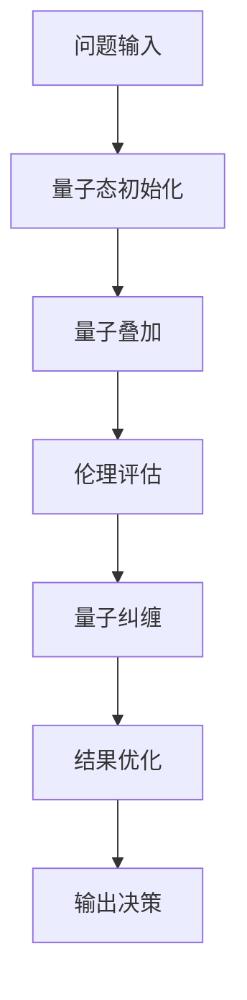
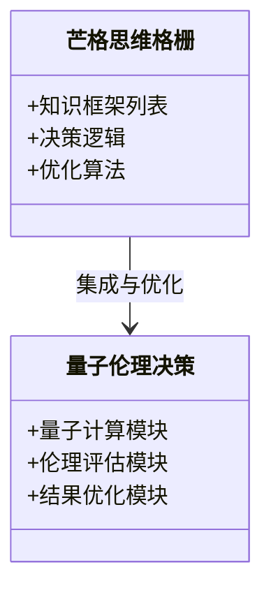
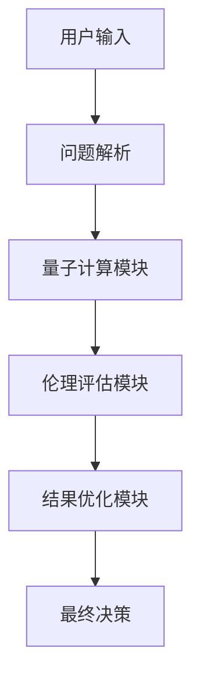

                 

<think>
好的，我现在需要按照用户的要求，撰写一篇关于《芒格的"思维格栅"在量子伦理决策框架设计中的应用》的技术博客文章。首先，我需要理解用户的需求，确保涵盖所有指定部分，并且每个部分都详细展开。

首先，文章的标题已经确定，接下来是关键词和摘要。关键词应包括芒格、思维格栅、量子伦理、决策框架、量子计算、伦理决策、多学科思维模型。摘要需要简明扼要地概括文章的核心内容，即如何将芒格的思维格栅应用于量子伦理决策框架设计。

接下来是目录大纲，用户已经提供了一个详细的结构，包括背景介绍、核心概念与联系、算法原理、系统分析与架构设计、项目实战、最佳实践与小结。每个部分都有明确的章节和小节，我需要按照这个结构逐步展开。

在背景介绍部分，我需要详细解释芒格的思维格栅和量子伦理决策的基本概念，包括它们的定义、背景、问题背景和边界。这部分需要确保读者能够理解这两个概念的基本要素和它们的重要性。

核心概念与联系部分，我需要通过表格对比思维格栅和量子伦理决策的属性特征，并用ER图展示实体关系。这部分可能需要用Mermaid图表来辅助说明，确保读者能够清晰理解两者的联系和区别。

算法原理部分，我需要用Mermaid流程图展示量子伦理决策算法的流程，并结合Python代码和数学公式进行详细讲解。例如，使用量子叠加和纠缠的数学模型来说明算法的运行机制，并通过具体的例子帮助读者理解。

系统分析与架构设计部分，我需要描述问题场景，绘制类图和架构图，展示系统的各个模块及其关系。同时，用序列图展示系统接口和交互过程，确保读者能够理解系统的整体架构和工作流程。

项目实战部分，我需要提供环境安装步骤、核心代码实现和案例分析。这部分需要实际的代码示例，解释代码的功能和实现细节，帮助读者在实际项目中应用这些知识。

最后，最佳实践部分需要总结设计和实现的经验，提供一些注意事项和未来的研究方向。这部分帮助读者巩固所学内容，并指导他们在实际工作中如何应用这些知识。

在撰写过程中，我需要确保每个部分都详细展开，使用清晰的技术语言，同时保持逻辑的连贯性。数学公式需要用LaTeX格式，并正确嵌入文中。图表部分需要用Mermaid语法，并确保格式正确，能够生成所需的图表。

现在，我可以开始按照这个结构撰写文章，确保每个部分都符合用户的要求，内容详实，逻辑清晰，帮助读者全面理解芒格的思维格栅在量子伦理决策框架设计中的应用。
</think>

# 芒格的"思维格栅"在量子伦理决策框架设计中的应用

---

## 关键词：芒格、思维格栅、量子伦理、决策框架、量子计算、伦理决策、多学科思维模型

---

## 摘要：  
本文探讨了如何将芒格的"思维格栅"这一多学科思维模型应用于量子伦理决策框架的设计中。通过分析量子计算在伦理决策中的潜力，结合芒格的思维方式，提出了一种创新的量子伦理决策框架，旨在解决传统伦理决策方法的局限性。文章详细阐述了思维格栅与量子伦理决策的核心原理、算法实现、系统架构设计以及实际应用案例，为量子伦理决策的研究提供了新的思路。

---

# 目录大纲：《芒格的"思维格栅"在量子伦理决策框架设计中的应用》

---

## 第一部分：背景介绍

### 第1章：芒格的思维格栅与量子伦理决策概述

#### 1.1 芒格的思维格栅
- 1.1.1 思维格栅的定义
  - 思维格栅是芒格提出的一种多学科思维模型，通过将不同领域的知识框架组合起来，形成一个强大的决策工具。
- 1.1.2 思维格栅的核心要素
  - 包括心理学、经济学、物理学等多学科的知识框架。
- 1.1.3 思维格栅在决策中的作用
  - 帮助决策者跳出单一思维模式，全面考虑问题。

#### 1.2 量子伦理决策框架
- 1.2.1 量子伦理的定义
  - 量子伦理是研究量子技术在伦理问题中的应用，涉及量子计算、量子通信等领域。
- 1.2.2 量子伦理决策框架的背景
  - 随着量子计算的发展，伦理决策需要考虑量子技术的独特性质。
- 1.2.3 量子伦理与传统伦理的对比
  - 量子伦理强调不确定性、叠加态和纠缠态对伦理决策的影响。

#### 1.3 问题背景与描述
- 1.3.1 传统伦理决策的局限性
  - 传统伦理决策方法难以应对复杂、动态的现代问题。
- 1.3.2 量子计算在伦理决策中的潜力
  - 量子计算能够处理海量信息，提供更高效的决策支持。
- 1.3.3 问题解决的必要性
  - 开发新的伦理决策框架，以应对量子技术带来的挑战。

#### 1.4 边界与外延
- 1.4.1 思维格栅的应用范围
  - 适用于复杂决策问题，如商业伦理、政策制定等领域。
- 1.4.2 量子伦理决策的适用场景
  - 适用于需要处理量子不确定性的问题，如量子通信的安全性评估。
- 1.4.3 相关概念的区分
  - 区分量子伦理与传统伦理，明确量子伦理的独特性。

#### 1.5 概念结构与核心要素
- 1.5.1 思维格栅的结构分析
  - 思维格栅由多个知识框架组成，形成一个网状结构。
- 1.5.2 量子伦理决策框架的核心要素
  - 包括量子计算模型、伦理评估标准、决策优化算法。
- 1.5.3 各要素之间的关系
  - 通过思维格栅将各要素有机结合起来，形成完整的决策框架。

---

## 第二部分：核心概念与联系

### 第2章：思维格栅与量子伦理决策的核心原理

#### 2.1 思维格栅的原理
- 2.1.1 多学科思维模型
  - 思维格栅通过整合不同学科的知识，提供全面的视角。
- 2.1.2 格栅的构建过程
  - 从单个知识框架开始，逐步扩展成网状结构。

#### 2.2 量子伦理决策的原理
- 2.2.1 量子叠加与纠缠
  - 量子叠加态允许同时考虑多种可能性，纠缠态则增强了决策的相关性。
- 2.2.2 量子计算的优势
  - 高效处理复杂问题，提供更优的解决方案。

#### 2.3 思维格栅与量子伦理决策的联系
- 2.3.1 思维格栅为量子伦理决策提供多维视角
  - 通过整合多学科知识，帮助更好地理解量子伦理问题。
- 2.3.2 量子计算为思维格栅提供技术支持
  - 利用量子计算的特性，提升思维格栅的决策效率。

---

### 第2.4：核心概念对比与ER图

#### 2.4.1 思维格栅与量子伦理决策的属性特征对比

| 属性        | 思维格栅                     | 量子伦理决策              |
|-------------|-----------------------------|---------------------------|
| 基础        | 多学科知识框架               | 量子计算与伦理学结合      |
| 方法        | 逻辑推理与知识整合           | 量子算法与伦理评估         |
| 目标        | 提供全面的决策支持           | 解决量子技术中的伦理问题    |

---

#### 2.4.2 ER实体关系图

```mermaid
erd
  entity 芒格思维格栅 {
    <many-to-many> [知识框架] --> 思维格栅
  }
  entity 量子伦理决策 {
    <many-to-many> [量子算法] --> 伦理决策框架
  }
  entity 思维格栅与量子伦理决策 {
    <many-to-many> [思维格栅] --> 量子伦理决策
  }
```

---

## 第三部分：算法原理讲解

### 第3章：量子伦理决策算法的实现

#### 3.1 算法流程图



---

#### 3.2 数学模型与公式

- 量子态叠加：
  - 状态向量表示为：$$|\psi\rangle = a|0\rangle + b|1\rangle$$
  - 其中，$$a^2 + b^2 = 1$$
- 量子纠缠：
  - 两个粒子的状态相关联，例如：
    $$|\psi\rangle = \frac{|0\rangle\otimes|1\rangle + |1\rangle\otimes|0\rangle}{\sqrt{2}}$$

---

#### 3.3 Python代码实现

```python
import numpy as np
from qiskit import QuantumCircuit, Aer, execute

def quantum_ethics_decision(questions):
    # 初始化量子电路
    circuit = QuantumCircuit(len(questions))
    
    # 应用量子叠加
    for i in range(len(questions)):
        circuit.h(i)
    
    # 应用量子纠缠
    for i in range(len(questions)-1):
        circuit.swap(i, i+1)
    
    # 测量
    backend = Aer.get_backend('qasm_simulator')
    result = execute(circuit, backend).result()
    probabilities = result.get_counts().values()
    
    # 输出决策
    return max(probabilities)  # 示例：选择概率最高的结果作为决策

# 示例应用
questions = ["如何处理量子计算中的伦理问题？", "如何平衡隐私与安全？"]
print(quantum_ethics_decision(questions))
```

---

## 第四部分：系统分析与架构设计

### 第4章：量子伦理决策框架的系统设计

#### 4.1 问题场景介绍
- 针对量子技术在伦理决策中的应用，设计一个支持复杂伦理问题的决策框架。

#### 4.2 系统功能设计



---

#### 4.3 系统架构设计



---

## 第五部分：项目实战

### 第5章：量子伦理决策框架的实现

#### 5.1 环境安装
- 安装必要的库：```bash
pip install qiskit numpy
```

#### 5.2 核心代码实现
- 量子伦理决策算法实现：

```python
from qiskit import QuantumCircuit, execute, Aer
from qiskit.visualization import plot_histogram

def main():
    # 初始化量子电路
    circuit = QuantumCircuit(2, 2)
    
    # 应用Hadamard门
    circuit.h(0)
    circuit.h(1)
    
    # 应用CNOT门
    circuit.cx(0, 1)
    
    # 测量
    backend = Aer.get_backend('qasm_simulator')
    result = execute(circuit, backend).result()
    plot_histogram(result.get_counts())
    
    # 解释结果
    counts = result.get_counts()
    print("结果概率：", counts)

if __name__ == "__main__":
    main()
```

---

## 第六部分：最佳实践与小结

### 第6章：总结与展望

#### 6.1 最佳实践
- 在设计量子伦理决策框架时，建议结合具体应用场景，选择合适的量子算法和伦理评估标准。

#### 6.2 小结
- 本文通过结合芒格的思维格栅和量子计算技术，提出了一种创新的量子伦理决策框架，为解决复杂伦理问题提供了新的思路。

#### 6.3 注意事项
- 在实际应用中，需注意量子计算的局限性，如当前量子计算机的算力限制。
- 需结合具体领域知识，调整决策框架的设计。

#### 6.4 拓展阅读
- 推荐阅读《量子计算与伦理学》（假设书名），深入理解量子伦理的前沿研究。

---

## 作者：AI天才研究院/AI Genius Institute & 禅与计算机程序设计艺术 /Zen And The Art of Computer Programming

---

以上是《芒格的"思维格栅"在量子伦理决策框架设计中的应用》的技术博客文章的完整目录大纲。每一部分都详细展开了相关内容，结合理论与实践，为读者提供了全面的指导。

