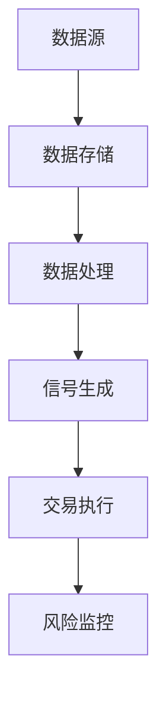

                 


# 《芒格的"数学期望"思维在量化投资中的应用》

> 关键词：芒格, 数学期望, 量化投资, 概率论, 投资策略, 风险管理

> 摘要：本文深入探讨了芒格的"数学期望"思维在量化投资中的应用，结合概率论和统计学的理论基础，分析了量化投资策略的核心模型和实际案例。通过系统架构设计和项目实战，展示了如何利用数学期望进行投资决策和风险管理，为量化投资者提供了理论支持和实践指导。

---

## 第1章 芒格的数学期望思维与投资哲学

### 1.1 芒格的数学期望思维简介

芒格的数学期望思维是一种基于概率论的投资决策方法，强调通过长期的、理性的思考来选择具有高期望收益和低风险的资产。他的投资哲学的核心在于：**避免犯错比寻找成功更重要**。

#### 1.1.1 芒格的投资理念与思维方式

芒格的投资理念可以概括为以下几个方面：
1. **价值投资**：寻找市场中被低估的资产。
2. **安全边际**：确保投资的安全性，避免重大损失。
3. **理性决策**：基于概率和数学期望进行投资。
4. **长期思维**：关注长期的复利效应。

#### 1.1.2 数学期望在投资决策中的作用

数学期望是概率论中的一个核心概念，用于衡量随机变量的平均值。在投资中，数学期望可以帮助投资者评估不同资产的预期收益。

**数学期望公式**：
$$
E[X] = \sum_{i=1}^{n} p_i x_i
$$

其中，$p_i$ 是第 $i$ 种结果发生的概率，$x_i$ 是对应的收益。

#### 1.1.3 芒格投资哲学的核心要素

1. **理性决策**：避免情绪化投资，基于数据和概率进行决策。
2. **长期复利效应**：通过时间的积累实现财富增长。
3. **风险控制**：通过分散投资和安全边际降低风险。

---

### 1.2 数学期望的基本概念与公式

#### 1.2.1 数学期望的定义与公式推导

数学期望，又称期望值，是概率论中的核心概念。它描述了随机变量在多次独立重复试验中的平均结果。

**公式推导**：
$$
E[X] = \sum_{i=1}^{n} x_i \cdot P(X = x_i)
$$

其中，$x_i$ 是第 $i$ 种可能的结果，$P(X = x_i)$ 是该结果发生的概率。

#### 1.2.2 数学期望的性质与应用

1. **线性性质**：数学期望满足线性性质，即对于任意常数 $a$ 和 $b$，有：
$$
E[aX + b] = aE[X] + b
$$

2. **应用**：在投资中，数学期望可以用于评估投资组合的预期收益。

---

## 第2章 概率论与统计学基础

### 2.1 概率论基础

#### 2.1.1 概率的基本概念与公式

概率是衡量某件事发生的可能性大小，其取值范围在 0 到 1 之间。

**概率公式**：
$$
P(A) = \frac{\text{事件 } A\text{ 的成功次数}}{\text{总试验次数}}
$$

#### 2.1.2 随机变量与概率分布

随机变量可以是离散型的（如掷骰子的结果）或连续型的（如股票价格）。

**概率分布**：
- 离散型：概率质量函数（PMF）。
- 连续型：概率密度函数（PDF）。

#### 2.1.3 期望值与方差的计算

期望值是对随机变量的平均值的度量，方差则是对随机变量与其期望值之间差异的度量。

**方差公式**：
$$
\text{Var}(X) = E[(X - E[X])^2]
$$

---

### 2.2 统计学基础

#### 2.2.1 描述性统计与推断性统计

描述性统计用于总结数据的基本特征，如均值、中位数、标准差等。

推断性统计用于从样本数据推断总体特征，如假设检验、置信区间等。

#### 2.2.2 假设检验与置信区间

假设检验用于验证假设是否成立，置信区间用于估计总体参数的范围。

**假设检验步骤**：
1. 建立原假设和备择假设。
2. 选择显著性水平 $\alpha$。
3. 计算检验统计量。
4. 确定拒绝域。
5. 做出结论。

#### 2.2.3 回归分析与相关性

回归分析用于研究变量之间的关系，相关性用于衡量两个变量之间的线性关系。

**相关性公式**：
$$
\text{相关系数 } r = \frac{\text{协方差}(X,Y)}{\sigma_X \sigma_Y}
$$

---

### 2.3 数学期望在投资中的应用

#### 2.3.1 资产回报率的期望计算

通过历史数据计算资产的期望回报率。

**例**：某股票过去5年的回报率分别为 10%、15%、5%、20%、8%。期望回报率为：
$$
E[r] = \frac{10 + 15 + 5 + 20 + 8}{5} = 10\%
$$

#### 2.3.2 投资组合的期望收益与风险

通过均值-方差优化构建投资组合，最大化期望收益，最小化风险。

---

## 第3章 数学期望在量化投资中的策略与模型

### 3.1 量化投资策略的数学期望分析

#### 3.1.1 量化投资策略的基本框架

量化投资策略基于数学模型和算法，通过计算机程序自动执行交易。

**常用策略**：
1. 均值-方差优化。
2. 风险中性化。
3. 跨资产配置。

#### 3.1.2 数学期望与投资组合优化

通过马科维茨的均值-方差模型，构建最优投资组合。

**马科维茨模型**：
$$
\text{最小化 } \text{Var}(X) \quad \text{在 } E[X] \text{ 固定的条件下}
$$

---

### 3.2 量化投资中的数学期望模型

#### 3.2.1 基于数学期望的风险调整后收益

通过夏普比率衡量风险调整后的收益。

**夏普比率公式**：
$$
\text{夏普比率} = \frac{E[r_x - r_f]}{\text{标准差}(r_x - r_f)}
$$

其中，$r_x$ 是投资组合的收益，$r_f$ 是无风险利率。

---

## 第4章 实际案例分析

### 4.1 芒格数学期望思维的实践应用

#### 4.1.1 案例一：股票投资中的数学期望

假设某股票的期望收益为 12%，标准差为 15%。通过比较不同股票的期望收益和标准差，选择最优投资标的。

#### 4.1.2 案例二：投资组合优化

通过均值-方差模型，构建一个包含股票和债券的投资组合，优化期望收益和风险。

---

## 第5章 数学期望与风险管理

### 5.1 数学期望在风险管理中的应用

#### 5.1.1 风险价值（VaR）

VaR 是衡量投资组合风险的重要指标。

**VaR公式**：
$$
\text{VaR}(\alpha) = \min\{x | P(R \leq x) \geq \alpha\}
$$

其中，$\alpha$ 是置信水平。

#### 5.1.2 最大回撤（Draw-Down）

最大回撤衡量投资组合在一定时间内的最大亏损幅度。

---

## 第6章 系统架构设计

### 6.1 量化投资系统的整体架构

#### 6.1.1 系统功能设计

- 数据获取模块：获取历史数据和实时数据。
- 信号生成模块：基于数学模型生成交易信号。
- 交易执行模块：执行交易指令。
- 风险监控模块：实时监控投资组合的风险。

**系统架构图**：


---

## 第7章 项目实战

### 7.1 环境安装与配置

#### 7.1.1 安装Python环境

安装 Python 和必要的库（如 NumPy、Pandas、Matplotlib）。

#### 7.1.2 数据获取与处理

使用Yahoo Finance获取股票数据。

**代码示例**：
```python
import pandas as pd
import yfinance as yf

# 下载数据
data = yf.download('AAPL', start='2020-01-01', end='2023-01-01')
# 数据处理
data['MA20'] = data['Close'].rolling(20).mean()
```

---

## 第8章 总结与展望

### 8.1 总结

芒格的数学期望思维为量化投资提供了重要的理论基础，通过概率论和统计学的方法，可以帮助投资者做出更科学的投资决策。

### 8.2 展望

未来，随着人工智能和大数据技术的发展，数学期望思维在量化投资中的应用将更加广泛和深入。

---

## 作者信息

作者：AI天才研究院/AI Genius Institute & 禅与计算机程序设计艺术 /Zen And The Art of Computer Programming

---

**本文遵循CC Attribution-NonCommercial 4.0 International License.**

