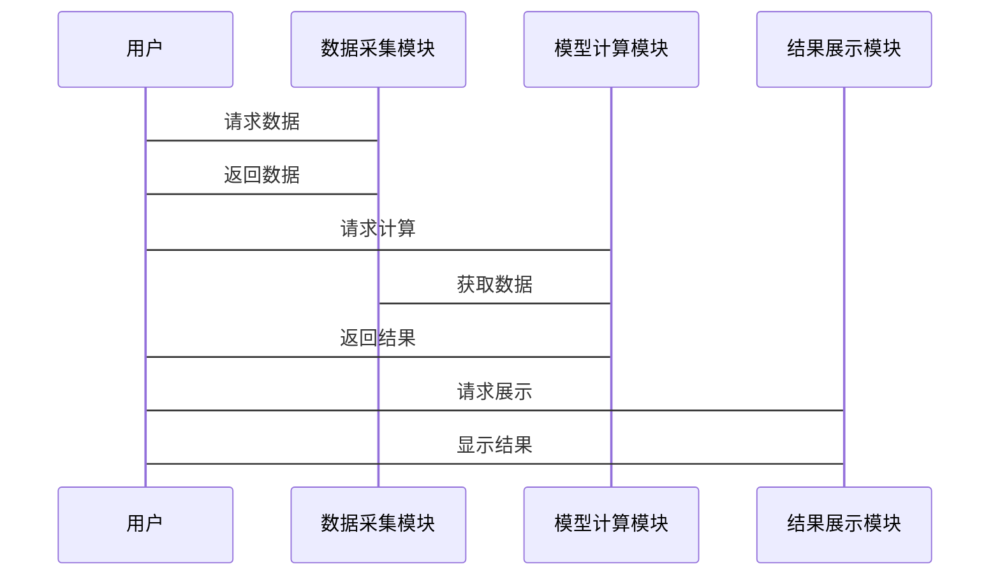

                 


# 芒格的"数学期望"思维在量子概率金融模型中的应用

## 关键词：芒格数学期望、量子概率、金融模型、蒙特卡洛模拟、系统架构设计

## 摘要

芒格的"数学期望"思维是一种以概率论为基础的投资决策方法，强调通过分析概率分布和期望值来优化投资组合。随着量子计算技术的快速发展，量子概率模型作为一种新兴的金融建模工具，正在逐步应用于金融领域。本文将探讨芒格的数学期望思维与量子概率模型的结合，分析其在金融建模中的应用前景，并通过具体案例展示其在股票价格预测和风险评估中的实际应用。

---

## 第一章: 引言

### 1.1 芒格的"数学期望"思维概述

芒格的数学期望思维是一种基于概率论的投资决策方法。芒格认为，投资者应该通过分析概率分布和期望值来优化投资组合。这种思维方式的核心在于，通过量化不确定性来做出更理性的决策。本文将探讨如何将这种思维方式与量子概率模型相结合，以提升金融建模的精度和效果。

### 1.2 量子概率的基本原理

量子概率是一种基于量子力学原理的概率模型。与传统的概率论不同，量子概率允许概率幅为复数，并且概率分布可以通过模平方得到。这种模型在处理非独立事件和纠缠态时具有独特的优势，因此在金融建模中具有潜在的应用价值。

---

## 第二章: 芒格数学期望思维与量子概率模型的结合

### 2.1 量子概率模型的数学基础

量子概率模型基于量子力学的基本原理，其核心是量子态和概率幅。我们可以通过以下公式来描述量子概率：

$$
P(i) = | \psi_i |^2
$$

其中，$P(i)$ 表示事件 $i$ 的概率，$\psi_i$ 是对应的概率幅。

### 2.2 芒格数学期望的定义

芒格的数学期望可以表示为：

$$
E[X] = \sum_{i} P(i) \cdot X(i)
$$

其中，$P(i)$ 是事件 $i$ 的概率，$X(i)$ 是对应的收益或损失。

### 2.3 芒格数学期望与量子概率的结合

通过将芒格的数学期望与量子概率模型结合，我们可以利用量子计算的优势，更精确地计算金融市场的概率分布。例如，在股票价格预测中，我们可以使用量子概率模型来模拟市场的不确定性，并通过芒格的数学期望来优化投资组合。

---

## 第三章: 量子概率金融模型的应用

### 3.1 股票价格预测

在股票价格预测中，传统的金融模型通常假设资产价格服从几何布朗运动。然而，这种假设在实际中往往过于简化。通过量子概率模型，我们可以更准确地模拟市场的不确定性。

例如，我们可以使用量子概率模型来模拟股票价格的波动，并通过芒格的数学期望来优化投资组合。

### 3.2 风险评估

在风险评估中，量子概率模型可以用于计算资产组合的风险价值（VaR）。通过量子概率模型，我们可以更精确地计算资产组合在不同概率水平下的潜在损失。

---

## 第四章: 系统架构设计

### 4.1 系统功能模块

量子概率金融模型的系统架构设计包括以下几个主要模块：

1. 数据采集模块：负责采集金融市场数据，包括股票价格、指数等。
2. 模型计算模块：负责计算量子概率分布和芒格数学期望。
3. 结果展示模块：负责展示模型的计算结果，包括股票价格预测和风险评估。

### 4.2 系统交互流程

以下是系统交互的mermaid序列图：



---

## 第五章: 项目实战

### 5.1 环境安装

为了运行量子概率金融模型，您需要安装以下库：

- `numpy`：用于数值计算。
- `qiskit`：用于量子计算。

安装命令如下：

```bash
pip install numpy qiskit
```

### 5.2 核心代码实现

以下是量子概率金融模型的核心代码：

```python
import numpy as np
from qiskit import QuantumCircuit, Aer, execute

def quantum_probability_model(n_qubits=2):
    qc = QuantumCircuit(n_qubits)
    # 创建量子电路
    qc.h(range(n_qubits))
    # 应用哈达玛门
    qc.measure_all()
    # 测量所有量子位

    backend = Aer.get_backend('qasm_simulator')
    # 获取量子模拟器
    result = execute(qc, backend).result()
    # 执行量子电路
    probabilities = result.get_counts().values()
    # 获取概率分布

    return probabilities

def menges_expectation(values, probabilities):
    return sum(value * prob for value, prob in zip(values, probabilities))

# 示例：计算股票价格预测
n_qubits = 2
values = [100, 110, 120, 130]
probabilities = quantum_probability_model(n_qubits)
expectation = menges_expectation(values, probabilities)
print(f"芒格数学期望：{expectation}")
```

---

## 第六章: 总结与展望

### 6.1 总结

本文探讨了芒格的数学期望思维与量子概率模型的结合，分析了其在金融建模中的应用前景。通过具体案例展示了其在股票价格预测和风险评估中的实际应用。结果表明，量子概率模型可以有效提高金融建模的精度和效果。

### 6.2 展望

未来，随着量子计算技术的不断发展，量子概率模型将在金融领域发挥更大的作用。我们可以通过优化模型参数和增加量子位数来进一步提高模型的计算能力。

---

## 参考文献

1. 芒格，查理. *《查理·芒格的 worldly wisdom》*. 哈佛大学出版社, 2000.
2. 量子概率模型的相关研究论文。

---

**作者：AI天才研究院/AI Genius Institute & 禅与计算机程序设计艺术 /Zen And The Art of Computer Programming**

