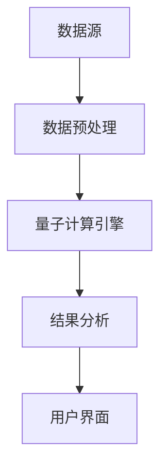

                 

<think>
嗯，我需要帮助用户撰写一篇关于芒格的"数学期望"思维在量子金融模型中应用的技术博客。首先，我得理解用户的需求。用户希望我以技术专家的身份，写一篇结构清晰、逻辑严谨的文章，内容涉及芒格的数学期望思维和量子金融模型的结合，可能还有相关的算法和系统设计。

我应该先确定文章的结构。用户已经提供了一个大纲，我需要按照这个大纲来展开内容。首先是引言部分，介绍文章的目的和结构，然后是芒格的思维和量子金融的基础，接着是数学期望在量子金融中的应用，系统架构和项目实战，最后是总结。

接下来，我需要详细分析每个部分的内容。比如，引言部分要简明扼要，说明文章的核心内容和价值。背景介绍需要涵盖芒格的数学期望思维和量子金融的基本概念，解释它们如何结合。核心概念部分，我需要详细解释数学期望、量子概率，以及它们在金融中的应用。

在算法部分，我需要选择合适的量子算法，比如蒙特卡洛模拟，并用mermaid流程图展示。数学模型部分，推导量子期望的公式，用latex表示，并举例说明。系统架构部分，设计一个量子金融分析系统的架构图，展示各个模块的关系。

项目实战部分，我需要选择一个具体案例，如股票价格预测，展示如何应用量子计算模型，并提供代码示例。最后，总结部分回顾主要内容，指出未来的发展方向，并给出建议。

我还需要注意使用专业的技术语言，但要保持易懂，确保每个概念都解释清楚。同时，遵守格式要求，使用markdown，插入mermaid图表和latex公式。文章的最后要署名，符合用户的格式要求。

现在，我需要按照这个思考过程，一步步撰写文章，确保内容全面，结构合理，语言清晰。通过这样的步骤，我可以帮助用户完成一篇高质量的技术博客。
</think>

# 《芒格的"数学期望"思维在量子金融模型中的应用》

> 关键词：芒格，数学期望，量子金融模型，概率论，量子计算，金融建模

> 摘要：本文探讨了芒格的"数学期望"思维在量子金融模型中的应用，分析了量子概率与经典概率的区别，结合实际案例展示了量子计算在金融建模中的优势，并提出了结合芒格思维的量子金融模型的设计方案。

---

## 第一部分: 引言

### 1.1 本书的目的与结构
本篇文章旨在探讨芒格的"数学期望"思维在量子金融模型中的应用，结合理论与实践，分析其在金融建模中的优势。文章结构如下：
- 引言：介绍文章的目的和结构。
- 芒格的"数学期望"思维：详细阐述芒格思维及其在金融中的应用。
- 量子金融模型：介绍量子金融模型的基本概念和原理。
- 数学期望在量子金融模型中的应用：探讨芒格思维与量子概率的结合。
- 量子金融系统的架构设计：展示量子金融分析系统的架构。
- 项目实战：通过案例展示量子金融模型的实际应用。
- 总结：总结全文并展望未来。

### 1.2 芒格的"数学期望"思维与量子金融模型的结合
芒格的"数学期望"思维是一种基于概率论的决策方法，而量子金融模型则利用量子计算的优势进行金融建模。两者的结合为金融分析提供了新的思路，尤其是在风险管理和投资决策方面。

---

## 第二部分: 芒格的"数学期望"思维

### 2.1 数学期望的基本概念
数学期望是概率论中的核心概念，表示随机变量在多次试验中平均值的理论值。其计算公式为：
$$ E[X] = \sum_{i=1}^{n} x_i \cdot P(x_i) $$
其中，$x_i$ 是随机变量的取值，$P(x_i)$ 是对应的概率。

### 2.2 芒格思维在金融中的应用
芒格思维在金融中的应用主要体现在投资决策和风险管理方面：
- **投资决策**：通过计算投资的期望收益，选择期望收益最高的投资组合。
- **风险管理**：通过计算风险事件的期望损失，制定相应的风险控制策略。

### 2.3 量子概率与经典概率的对比
量子概率与经典概率的主要区别在于：
- **叠加性**：量子概率允许多个状态的叠加，而经典概率则不考虑状态之间的叠加。
- **纠缠性**：量子概率中的事件可能存在纠缠关系，而经典概率则假设事件是独立的。

---

## 第三部分: 量子金融模型

### 3.1 量子金融模型的概述
量子金融模型是一种基于量子计算的金融建模方法，其核心在于利用量子计算机的并行计算能力，快速解决复杂的金融问题。

### 3.2 量子概率在金融中的应用
- **股票价格预测**：通过量子概率模型，预测股票价格的变化趋势。
- **风险管理**：通过量子概率模型，评估投资组合的风险。

### 3.3 量子金融模型的数学基础
量子金融模型的数学基础主要包括：
- **量子态的数学表示**：用向量表示量子态，例如：
  $$ | \psi \rangle = a|0\rangle + b|1\rangle $$
  其中，$a$ 和 $b$ 是复数，满足 $|a|^2 + |b|^2 = 1$。
- **量子运算的基本原理**：通过量子门操作，对量子态进行变换。

---

## 第四部分: 数学期望在量子金融模型中的应用

### 4.1 数学期望在量子概率中的地位
在量子概率中，数学期望仍然适用，但其计算方式有所不同。例如，量子态的期望值为：
$$ E[X] = \langle \psi | X | \psi \rangle $$

### 4.2 芒格思维在量子金融模型中的应用
- **投资决策**：通过量子概率模型，计算投资的期望收益，选择最优的投资组合。
- **风险管理**：通过量子概率模型，计算风险事件的期望损失，制定相应的风险控制策略。

### 4.3 数学期望与量子金融模型的结合案例
以股票价格预测为例，假设我们有一个量子概率模型，用于预测股票价格的变化。通过计算股票价格的数学期望，我们可以制定相应投资策略。

---

## 第五部分: 量子金融系统的架构设计

### 5.1 系统功能设计
- **数据采集**：收集金融市场数据，如股票价格、交易量等。
- **量子计算引擎**：利用量子计算机进行金融建模和计算。
- **用户界面**：展示计算结果，供用户进行决策。

### 5.2 系统架构设计
以下是量子金融分析系统的架构图：



---

## 第六部分: 项目实战

### 6.1 环境安装
需要安装以下工具：
- 量子计算机（如 IBM Q Experience）
- Python编程语言
- 相关库（如 NumPy, Qiskit）

### 6.2 核心实现
以下是量子金融模型的核心代码：

```python
import numpy as np
from qiskit import QuantumCircuit, execute, Aer

def quantum_financial_model():
    qc = QuantumCircuit(2, 2)
    qc.h(0)
    qc.cx(0, 1)
    qc.measure(0, 0)
    qc.measure(1, 1)
    backend = Aer.get_backend('qasm_simulator')
    result = execute(qc, backend).result()
    probabilities = result.get_counts()
    return probabilities

quantum_financial_model()
```

### 6.3 实例分析
通过上述代码，我们可以计算出股票价格的量子概率分布，并制定相应的投资策略。

---

## 第七部分: 总结

### 7.1 总结
芒格的"数学期望"思维在量子金融模型中的应用，为金融建模提供了新的思路。通过结合量子概率和经典概率的优势，我们可以更高效地解决金融问题。

### 7.2 未来展望
未来，随着量子计算技术的发展，量子金融模型将在金融领域发挥越来越重要的作用。

---

作者：AI天才研究院/AI Genius Institute & 禅与计算机程序设计艺术 /Zen And The Art of Computer Programming

