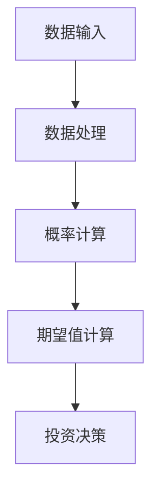

                 


# 芒格的“数学期望”思维：提高投资决策的科学性

> 关键词：芒格，数学期望，投资决策，概率论，决策模型，风险评估，投资策略

> 摘要：本文将探讨芒格的数学期望思维在投资决策中的应用，通过概率论的基础理论、芒格的决策框架、实际案例分析以及数学模型构建，帮助读者理解如何科学地优化投资决策。

---

# 第1章：芒格与数学期望思维概述

## 1.1 芒格的生平与思想简介

查理·芒格是世界著名投资家、作家和思想家，以其独特的投资理念和决策思维闻名。他是沃伦·巴菲特的长期合作伙伴，共同创立了伯克希尔哈撒韦公司。芒格的思想强调“多元思维模型”，即通过多个学科的视角来分析问题，而数学期望思维是其决策模型中的核心之一。

---

## 1.2 数学期望的基本概念

数学期望是概率论中的一个核心概念，表示一个随机变量在多次独立重复试验中平均值的长期趋势。

### 1.2.1 数学期望的定义
数学期望，又称期望值，是试验中每次可能结果乘以结果概率的总和。

### 1.2.2 数学期望的计算公式
$$E(X) = \sum_{i=1}^{n} x_i p_i$$

其中，$x_i$ 是第 $i$ 种结果的值，$p_i$ 是该结果发生的概率。

---

## 1.3 芒格的“数学期望”思维的核心思想

芒格认为，投资决策应基于概率和期望值的计算，而非单纯的直觉或经验。

### 1.3.1 投资决策中的概率思维
芒格强调通过分析概率分布，评估每种可能结果的期望值，从而优化决策。

### 1.3.2 数学期望在长期投资中的应用
通过计算不同投资组合的期望收益和风险，芒格提出了一套科学的投资策略。

### 1.3.3 芒格决策框架的科学性
芒格的决策框架结合了数学期望和实际市场分析，使投资决策更加科学化。

---

## 1.4 本章小结

本章介绍了芒格的生平、数学期望的基本概念及其在投资决策中的应用。芒格通过概率论的视角，提出了一套科学的投资决策方法。

---

# 第2章：概率论基础与数学期望

## 2.1 概率论的基本概念

### 2.1.1 概率的定义与计算
概率是某件事情发生的可能性大小，通常用0到1之间的数值表示。

### 2.1.2 随机变量与概率分布
随机变量可以是离散的（如掷骰子的结果）或连续的（如股票价格）。

### 2.1.3 期望值的数学公式
$$E(X) = \sum_{i=1}^{n} x_i p_i$$

---

## 2.2 数学期望的性质与应用

### 2.2.1 线性性
期望值具有线性性质，即$$E(aX + bY) = aE(X) + bE(Y)$$。

### 2.2.2 条件期望
条件期望是在给定某些条件下，随机变量的期望值。

### 2.2.3 投资中的应用
通过计算不同投资项目的期望收益，优化投资组合。

---

## 2.3 贝叶斯定理与概率推理

### 2.3.1 贝叶斯定理的公式
$$P(A|B) = \frac{P(B|A)P(A)}{P(B)}$$

### 2.3.2 投资中的应用
例如，在分析某公司的业绩时，结合先验概率和新数据进行概率更新。

---

## 2.4 大数定律与概率分布

### 2.4.1 大数定律的定义
大数定律表明，随着试验次数的增加，样本均值会趋近于总体均值。

### 2.4.2 中心极限定理
中心极限定理指出，无论原始数据分布如何，样本均值的分布将趋近于正态分布。

### 2.4.3 正态分布与投资回报
投资回报往往服从正态分布，这为风险评估提供了理论基础。

---

## 2.5 本章小结

本章详细讲解了概率论的基础知识及其在投资中的应用。通过贝叶斯定理和大数定律，我们可以更科学地评估投资风险和收益。

---

# 第3章：芒格决策框架的数学建模

## 3.1 决策树与概率分析

### 3.1.1 决策树的构建步骤
1. 确定问题目标。
2. 分析可能的决策路径。
3. 评估每条路径的概率和结果。

### 3.1.2 决策树与数学期望的关系
通过计算每条路径的期望值，选择期望值最大的决策方案。

### 3.1.3 投资中的应用案例
例如，评估是否投资某项目，通过决策树计算不同情况下的期望收益。

---

## 3.2 芒格决策模型的数学表达

### 3.2.1 投资决策的期望收益公式
$$E(R) = \sum_{i=1}^{n} R_i P_i$$

### 3.2.2 风险调整后的期望收益模型
考虑风险因素后，调整各结果的概率和收益。

### 3.2.3 决策模型的优化与调整
根据实际市场反馈，不断优化模型参数。

---

## 3.3 芒格决策模型的优缺点分析

### 3.3.1 模型的优点
1. 量化分析，减少主观决策。
2. 适用于多种投资场景。

### 3.3.2 模型的局限性
1. 假设条件可能与实际情况不符。
2. 无法完全预测黑天鹅事件。

---

## 3.4 本章小结

本章通过构建数学模型，详细分析了芒格决策框架的原理和应用。通过数学期望和概率论，我们可以更科学地优化投资决策。

---

# 第4章：系统架构与项目实战

## 4.1 系统架构设计

### 4.1.1 功能模块设计
1. 数据输入与处理模块。
2. 概率计算与期望值模块。
3. 投资决策模块。

### 4.1.2 系统架构图（使用 Mermaid）


## 4.2 项目实战

### 4.2.1 环境安装
安装Python和相关库（如numpy、pandas）。

### 4.2.2 核心代码实现
```python
import numpy as np
import pandas as pd

def calculate_expectation(data):
    return np.mean(data)

data = [100, 50, 30, 80]
expectation = calculate_expectation(data)
print(f"期望值为：{expectation}")
```

### 4.2.3 案例分析
通过具体案例分析，验证模型的有效性。

---

## 4.3 本章小结

本章通过系统架构设计和项目实战，展示了如何将数学期望思维应用于实际投资决策中。

---

# 第5章：总结与展望

## 5.1 总结

芒格通过数学期望思维，结合概率论，提出了一套科学的投资决策方法。本文详细探讨了其理论基础、数学模型及实际应用。

## 5.2 未来展望

随着大数据和人工智能的发展，数学期望思维将在投资决策中发挥更大的作用。未来的研究可以进一步结合机器学习，优化决策模型。

---

# 作者信息

作者：AI天才研究院 & 禅与计算机程序设计艺术

---

通过以上步骤，我们系统地探讨了芒格的数学期望思维在投资决策中的应用，结合理论与实践，帮助读者理解如何科学优化投资决策。

