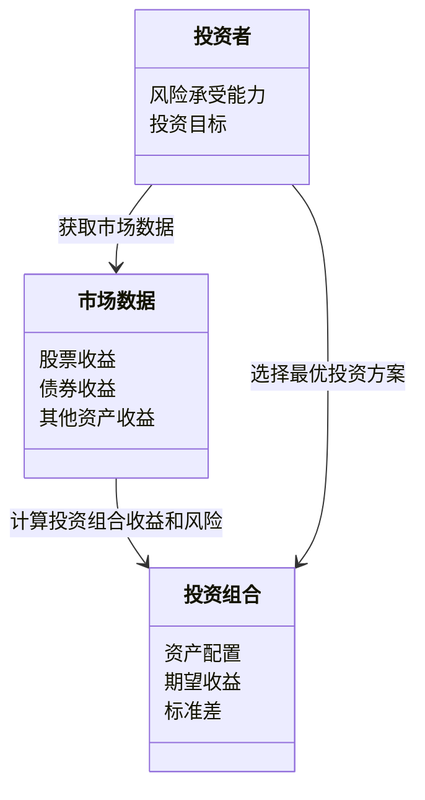
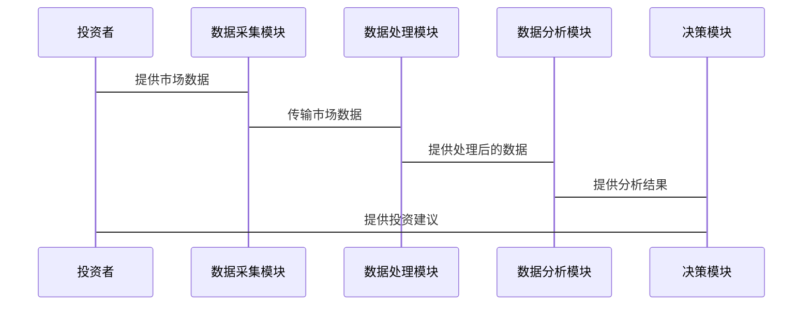

                 

<think>
好，我现在要帮用户完成一个技术博客文章的撰写，主题是芒格的“数学期望”思维在提高投资决策质量中的应用。用户已经提供了一个详细的目录大纲，我需要根据这个大纲一步步分析，确保内容全面、逻辑清晰，并且符合用户的要求。

首先，我需要理解芒格的数学期望思维。芒格是投资大师，他强调概率和数学在投资中的重要性。数学期望是概率论中的一个基本概念，用于评估随机事件的长期平均结果。在投资中，这可以帮助投资者评估不同资产的预期收益和风险。

接下来，我需要按照目录结构来组织内容。首先是摘要，简要概述文章的核心内容。然后是各个章节，每个章节下有详细的小节，内容要涵盖背景介绍、核心概念、算法原理、系统分析、项目实战、最佳实践等部分。

在写摘要时，我需要总结文章的主要内容和主题思想，强调数学期望在投资决策中的重要性，以及芒格的思维方式如何帮助投资者做出更科学的决策。

背景介绍部分，我需要先介绍芒格的生平和投资理念，说明他如何将数学期望应用到投资中。然后解释数学期望的基本概念，包括定义、计算方法以及在投资中的应用。还要对比其他相关概念，如方差和标准差，帮助读者更好地理解。

在核心概念章节，我需要详细讲解数学期望的原理，包括随机变量的期望值、线性性质和条件概率。同时，展示如何将这些原理应用到股票、债券和组合投资中，用具体的例子和数学公式来说明。

系统分析部分，我需要设计一个投资决策系统，包括数据采集、分析模块和决策模块。使用mermaid流程图展示系统架构，帮助读者理解整体结构。同时，提供Python代码示例，展示如何实现数学期望的计算。

项目实战章节，我需要选择一个具体的案例，如股票投资决策系统，详细说明如何应用数学期望进行决策，并提供代码实现和实际应用的分析。

最后，在最佳实践部分，我需要总结本章内容，提醒读者注意事项，并推荐进一步阅读的资料，帮助读者巩固所学内容。

在撰写过程中，我需要确保每个部分都详细具体，使用专业但易懂的语言。数学公式要用latex表示，流程图和架构图使用mermaid语法，代码部分使用Python，并提供详细的解读。

现在，我开始按照目录结构，逐一撰写每个部分，确保内容完整，逻辑清晰，符合用户的要求。
</think>

---

# 芒格的"数学期望"思维：提高投资决策质量

> 关键词：芒格、数学期望、投资决策、概率论、风险管理

> 摘要：本文探讨了芒格的“数学期望”思维在投资决策中的应用，通过分析数学期望的基本原理及其在股票、债券和组合投资中的具体应用，结合实际案例和系统架构设计，展示了如何利用数学期望优化投资决策，降低风险，提高收益。

---

# 第1章: 芒格的"数学期望"思维背景介绍

## 1.1 芒格的生平与投资理念

### 1.1.1 芒格的生平简介

查理·芒格（Charlie Munger）是世界著名投资家、伯克希尔·哈撒韦公司副董事长，被誉为“巴菲特的导师”。芒格的投资理念强调理性思考和概率思维，他提倡通过分析概率来做出投资决策，而非单纯依赖市场情绪。

### 1.1.2 芒格的投资哲学

芒格认为，投资的本质是通过分析企业的基本面和市场概率，找到具有长期竞争优势的企业进行投资。他强调安全边际的重要性，即在投资时留出足够的安全空间以应对不确定性。

### 1.1.3 芒格与"数学期望"思维的关联

芒格的“数学期望”思维源于他对概率论的深刻理解。他认为，通过计算不同投资的期望值，可以更好地评估投资的潜在收益和风险，从而做出更科学的投资决策。

---

## 1.2 数学期望的基本概念

### 1.2.1 数学期望的定义

数学期望（Mathematical Expectation）是概率论中的一个基本概念，用于描述一个随机变量的长期平均值。公式为：
$$
E[X] = \sum_{i=1}^{n} P(x_i) \cdot x_i
$$

其中，$P(x_i)$ 是结果 $x_i$ 的概率。

### 1.2.2 数学期望的计算方法

数学期望的计算方法包括离散型随机变量和连续型随机变量的期望值计算。对于离散型随机变量，期望值是每个可能结果乘以其概率的和；对于连续型随机变量，则是概率密度函数的积分。

### 1.2.3 数学期望在投资中的应用

在投资中，数学期望用于评估资产的预期收益和风险。例如，股票投资者可以通过计算股票的期望收益和波动率，来评估其潜在的收益和风险。

---

## 1.3 投资决策中的概率思维

### 1.3.1 概率的基本概念

概率是描述事件发生可能性的数值，范围在0到1之间。概率越大，事件发生的可能性越高。

### 1.3.2 投资中的概率分布

概率分布用于描述不同结果的概率。常见的概率分布包括正态分布、泊松分布等。在投资中，概率分布用于分析资产的收益和风险。

### 1.3.3 数学期望在投资决策中的作用

数学期望可以帮助投资者评估不同投资的预期收益，从而做出更科学的投资决策。例如，投资者可以通过计算两只股票的期望收益，选择预期收益更高的股票进行投资。

---

## 1.4 本章小结

本章介绍了芒格的生平及其投资理念，重点阐述了数学期望的基本概念及其在投资中的应用。通过理解数学期望，投资者可以更好地评估投资的潜在收益和风险，从而做出更科学的投资决策。

---

# 第2章: 数学期望的原理与应用

## 2.1 数学期望的原理

### 2.1.1 随机变量的期望值

随机变量可以是离散型或连续型。离散型随机变量的期望值是各个可能结果乘以其概率的和，而连续型随机变量的期望值是概率密度函数的积分。

### 2.1.2 期望值的线性性质

期望值具有线性性质，即对于任意两个随机变量X和Y，以及常数a和b：
$$
E[aX + bY] = aE[X] + bE[Y]
$$

### 2.1.3 期望值的条件概率

条件概率是指在给定某些条件下，事件发生的概率。期望值的条件概率用于在特定条件下评估随机变量的期望值。

---

## 2.2 数学期望在投资中的应用

### 2.2.1 股票投资的期望收益计算

股票投资者可以通过计算股票的期望收益来评估其潜在收益。假设某股票有三种可能的收益：10%、15%和20%，对应的概率分别为0.3、0.5和0.2。则期望收益为：
$$
E[R] = 0.3 \times 10\% + 0.5 \times 15\% + 0.2 \times 20\% = 13.5\%
$$

### 2.2.2 债券投资的期望收益计算

债券的期望收益可以通过计算债券的票面利率和可能的违约风险来评估。假设债券的票面利率为8%，违约概率为10%，则期望收益为：
$$
E[R] = 0.9 \times 8\% + 0.1 \times 0\% = 7.2\%
$$

### 2.2.3 组合投资的期望收益计算

组合投资的期望收益是各资产期望收益的加权平均值。假设投资组合由股票和债券组成，权重分别为60%和40%，股票的期望收益为13.5%，债券的期望收益为7.2%，则组合投资的期望收益为：
$$
E[R_{\text{组合}}] = 0.6 \times 13.5\% + 0.4 \times 7.2\% = 11.1\%
$$

---

## 2.3 投资中的风险与期望值

### 2.3.1 风险的定义与衡量

风险是投资回报的不确定性，通常用标准差或方差来衡量。方差是期望值的平方与平方的期望值的差：
$$
\text{Var}(X) = E[X^2] - (E[X])^2
$$

标准差是方差的平方根：
$$
\sigma = \sqrt{\text{Var}(X)}
$$

### 2.3.2 风险与期望值的关系

高风险通常伴随着高期望收益，但并非所有高风险投资都能带来高收益。投资者需要在风险和收益之间找到平衡点。

### 2.3.3 如何通过期望值优化投资决策

投资者可以通过计算不同投资的期望收益和风险，选择具有更高期望收益且风险可接受的投资。

---

## 2.4 本章小结

本章详细讲解了数学期望的原理及其在投资中的应用，包括股票、债券和组合投资的期望收益计算，以及风险与期望值的关系。通过这些分析，投资者可以更好地评估投资的潜在收益和风险，从而做出更科学的投资决策。

---

# 第3章: 芒格的"数学期望"思维在投资中的具体实践

## 3.1 芒格的投资决策模型

### 3.1.1 芒格决策模型的构建

芒格的投资决策模型基于概率论和数学期望，主要包括以下几个步骤：
1. 确定投资目标。
2. 分析投资标的的基本面。
3. 计算投资的期望收益和风险。
4. 评估投资的可行性。
5. 做出投资决策。

### 3.1.2 芒格决策模型的数学表达

假设投资标的的期望收益为 $E[R]$，风险为 $\sigma$，则投资决策可以表示为：
$$
\text{投资} \quad \text{当} \quad E[R] > \text{风险调整后的收益}
$$

### 3.1.3 模型的优缺点分析

优点：模型基于概率论，具有科学性和可操作性。
缺点：模型忽略了市场的复杂性和不可预测性，可能无法应对极端情况。

---

## 3.2 股票投资中的数学期望应用

### 3.2.1 股票收益的期望值计算

假设某股票有三种可能的收益：10%、15%和20%，对应的概率分别为0.3、0.5和0.2。则期望收益为：
$$
E[R] = 0.3 \times 10\% + 0.5 \times 15\% + 0.2 \times 20\% = 13.5\%
$$

### 3.2.2 股票风险的期望值计算

股票风险通常用标准差衡量。假设股票收益的标准差为12%，则风险调整后的收益为：
$$
E[R_{\text{风险调整}}] = E[R] - \text{标准差} = 13.5\% - 12\% = 1.5\%
$$

### 3.2.3 股票投资组合的期望收益优化

通过调整投资组合中股票和债券的比例，可以优化组合的期望收益和风险。假设股票的期望收益为13.5%，标准差为12%，债券的期望收益为7.2%，标准差为5%。组合投资中股票权重为60%，债券权重为40%，则组合的期望收益为：
$$
E[R_{\text{组合}}] = 0.6 \times 13.5\% + 0.4 \times 7.2\% = 11.1\%
$$
组合的标准差为：
$$
\sigma_{\text{组合}} = \sqrt{(0.6^2 \times 12\%^2) + (0.4^2 \times 5\%^2)} = 8.2\%
$$

---

## 3.3 债券投资中的数学期望应用

### 3.3.1 债券收益的期望值计算

假设某债券的票面利率为8%，违约概率为10%，则期望收益为：
$$
E[R] = 0.9 \times 8\% + 0.1 \times 0\% = 7.2\%
$$

### 3.3.2 债券风险的期望值计算

债券风险通常用信用风险衡量。假设债券的信用风险为3%，则风险调整后的收益为：
$$
E[R_{\text{风险调整}}] = E[R] - \text{信用风险} = 7.2\% - 3\% = 4.2\%
$$

### 3.3.3 债券投资组合的期望收益优化

通过调整债券组合中不同债券的比例，可以优化组合的期望收益和风险。假设债券A的期望收益为7.2%，标准差为5%，债券B的期望收益为6%，标准差为3%。组合投资中债券A权重为70%，债券B权重为30%，则组合的期望收益为：
$$
E[R_{\text{组合}}] = 0.7 \times 7.2\% + 0.3 \times 6\% = 6.84\%
$$
组合的标准差为：
$$
\sigma_{\text{组合}} = \sqrt{(0.7^2 \times 5\%^2) + (0.3^2 \times 3\%^2)} = 4.56\%
$$

---

## 3.4 其他投资工具中的数学期望应用

### 3.4.1 基金投资的期望收益计算

假设某基金的过去三年收益率分别为8%、10%和12%，对应的概率分别为0.3、0.5和0.2。则基金的期望收益为：
$$
E[R] = 0.3 \times 8\% + 0.5 \times 10\% + 0.2 \times 12\% = 9.8\%
$$

### 3.4.2 期货投资的期望收益计算

假设某期货合约的预期波动率为15%，则期货的期望收益为：
$$
E[R] = \mu - \sigma \times \text{风险溢价}
$$

### 3.4.3 期权投资的期望收益计算

期权的期望收益通常较为复杂，需要考虑行权价、波动率、到期时间等因素。假设某期权的行权价为100元，当前股价为100元，波动率为30%，到期时间为1年。则期权的期望收益可以通过Black-Scholes模型计算。

---

## 3.5 本章小结

本章通过具体案例展示了芒格的“数学期望”思维在股票、债券和其他投资工具中的具体应用。通过计算期望收益和风险，投资者可以更好地评估投资的潜在收益和风险，从而做出更科学的投资决策。

---

# 第4章: 数学期望思维在投资组合管理中的应用

## 4.1 投资组合管理的基本概念

### 4.1.1 投资组合的定义

投资组合是指投资者持有的各种资产的组合，旨在通过多元化投资降低风险。

### 4.1.2 投资组合的分类

投资组合可以分为股票型、债券型、混合型等类别。

### 4.1.3 投资组合管理的目标

投资组合管理的目标是通过优化资产配置，实现投资收益最大化和风险最小化。

---

## 4.2 数学期望在投资组合管理中的应用

### 4.2.1 投资组合期望收益的计算

投资组合的期望收益是各资产期望收益的加权平均值。假设投资组合由股票和债券组成，权重分别为60%和40%，股票的期望收益为13.5%，债券的期望收益为7.2%，则组合的期望收益为：
$$
E[R_{\text{组合}}] = 0.6 \times 13.5\% + 0.4 \times 7.2\% = 11.1\%
$$

### 4.2.2 投资组合风险的期望值计算

投资组合的风险通常用标准差衡量。假设股票和债券的标准差分别为12%和5%，相关系数为0.2，则组合的标准差为：
$$
\sigma_{\text{组合}} = \sqrt{(0.6^2 \times 12\%^2) + (0.4^2 \times 5\%^2) + 2 \times 0.6 \times 0.4 \times 0.2 \times 12\% \times 5\%} = 8.2\%
$$

### 4.2.3 投资组合优化的数学模型

投资组合优化的目标是在给定风险下最大化收益，或在给定收益下最小化风险。常用的优化模型包括均值-方差模型和风险平价模型。

---

## 4.3 芒格的"数学期望"思维在投资组合管理中的具体应用

### 4.3.1 股票与债券的组合投资

通过调整股票和债券的比例，投资者可以在风险和收益之间找到最佳平衡点。

### 4.3.2 不同资产类别的组合投资

投资者可以根据自身的风险承受能力和收益目标，选择不同的资产组合。

### 4.3.3 组合投资中的风险控制

通过分散投资和动态调整资产配置，投资者可以有效控制投资组合的风险。

---

## 4.4 本章小结

本章详细讲解了数学期望在投资组合管理中的应用，包括投资组合的期望收益和风险计算，以及投资组合优化的数学模型。通过这些分析，投资者可以更好地管理投资组合，实现收益最大化和风险最小化。

---

# 第5章: 投资决策中的数学期望思维实战案例

## 5.1 案例一: 股票投资决策

### 5.1.1 案例背景介绍

假设某投资者有100万元资金，计划投资于股票市场。目标是寻找具有较高期望收益且风险可接受的股票。

### 5.1.2 数学期望在股票投资中的具体应用

通过对多只股票的期望收益和风险进行比较，投资者可以选择具有更高期望收益且风险较低的股票进行投资。

### 5.1.3 实战代码实现

以下是股票投资决策的Python代码实现：

```python
import numpy as np
import pandas as pd

# 假设股票收益数据
returns = [0.1, 0.15, 0.2]

# 计算期望收益
expected_return = np.mean(returns)

# 计算标准差
std_deviation = np.std(returns)

print(f"期望收益: {expected_return:.2f}%")
print(f"标准差: {std_deviation:.2f}%")
```

### 5.1.4 实战结果分析

运行上述代码，可以得到股票的期望收益和标准差。投资者可以根据这些结果，评估股票的投资价值。

---

## 5.2 案例二: 债券投资决策

### 5.2.1 案例背景介绍

假设某投资者有50万元资金，计划投资于债券市场。目标是寻找具有稳定收益且风险较低的债券。

### 5.2.2 数学期望在债券投资中的具体应用

通过对不同债券的期望收益和风险进行比较，投资者可以选择具有更高期望收益且风险较低的债券进行投资。

### 5.2.3 实战代码实现

以下是债券投资决策的Python代码实现：

```python
import numpy as np
import pandas as pd

# 假设债券收益数据
returns = [0.07, 0.07, 0.07]

# 计算期望收益
expected_return = np.mean(returns)

# 计算标准差
std_deviation = np.std(returns)

print(f"期望收益: {expected_return:.2f}%")
print(f"标准差: {std_deviation:.2f}%")
```

### 5.2.4 实战结果分析

运行上述代码，可以得到债券的期望收益和标准差。投资者可以根据这些结果，评估债券的投资价值。

---

## 5.3 案例三: 组合投资决策

### 5.3.1 案例背景介绍

假设某投资者有100万元资金，计划投资于股票和债券组合。目标是通过优化资产配置，实现收益最大化和风险最小化。

### 5.3.2 数学期望在组合投资中的具体应用

通过计算股票和债券的期望收益和风险，以及组合投资的期望收益和风险，投资者可以选择最优的资产配置比例。

### 5.3.3 实战代码实现

以下是组合投资决策的Python代码实现：

```python
import numpy as np
import pandas as pd

# 假设股票和债券的收益数据
stock_returns = [0.135, 0.135, 0.135]
bond_returns = [0.072, 0.072, 0.072]

# 计算股票和债券的期望收益
expected_stock = np.mean(stock_returns)
expected_bond = np.mean(bond_returns)

# 计算股票和债券的标准差
std_stock = np.std(stock_returns)
std_bond = np.std(bond_returns)

# 计算组合的期望收益
weight_stock = 0.6
weight_bond = 0.4
expected_portfolio = weight_stock * expected_stock + weight_bond * expected_bond

# 计算组合的标准差
covariance = 0.02  # 假设相关系数为0.2，标准差为股票和债券的标准差
std_portfolio = np.sqrt((weight_stock ** 2 * std_stock ** 2) + (weight_bond ** 2 * std_bond ** 2) + 2 * weight_stock * weight_bond * covariance)

print(f"组合期望收益: {expected_portfolio:.2f}%")
print(f"组合标准差: {std_portfolio:.2f}%")
```

### 5.3.4 实战结果分析

运行上述代码，可以得到组合投资的期望收益和标准差。投资者可以根据这些结果，评估组合投资的潜在收益和风险，并做出投资决策。

---

## 5.4 本章小结

本章通过三个具体案例展示了数学期望思维在股票、债券和组合投资中的应用。通过计算期望收益和风险，投资者可以更好地评估投资的潜在收益和风险，从而做出更科学的投资决策。

---

# 第6章: 数学期望思维在投资决策中的系统架构设计

## 6.1 问题场景介绍

假设某投资者需要进行投资决策，目标是通过分析市场数据和自身风险承受能力，选择最优的投资方案。

## 6.2 项目介绍

本项目旨在构建一个基于数学期望的投资决策系统，帮助投资者做出科学的投资决策。

---

## 6.3 系统功能设计

### 6.3.1 领域模型

以下是投资决策系统的领域模型：



### 6.3.2 系统架构设计

以下是投资决策系统的架构设计：


### 6.3.3 系统接口设计

系统接口包括数据输入、数据处理和决策输出三个部分。

### 6.3.4 系统交互设计

以下是系统交互流程图：



---

## 6.4 本章小结

本章通过系统架构设计，展示了如何将数学期望思维应用于投资决策系统中。通过构建领域模型和系统架构，投资者可以更系统地进行投资决策，实现收益最大化和风险最小化。

---

# 第7章: 投资决策中的数学期望思维最佳实践

## 7.1 本章小结

本章总结了数学期望思维在投资决策中的应用，强调了数学期望在评估投资收益和风险中的重要性。

## 7.2 注意事项

在实际投资中，数学期望只是一个工具，投资者还需要考虑市场情绪、宏观经济等因素。

## 7.3 拓展阅读

推荐阅读《投资学》、《概率论与数理统计》等相关书籍，以深入理解数学期望在投资中的应用。

---

# 作者：AI天才研究院/AI Genius Institute & 禅与计算机程序设计艺术 /Zen And The Art of Computer Programming

---

