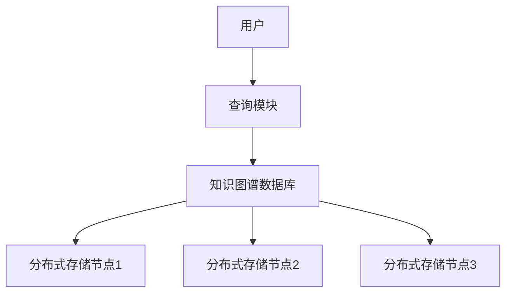
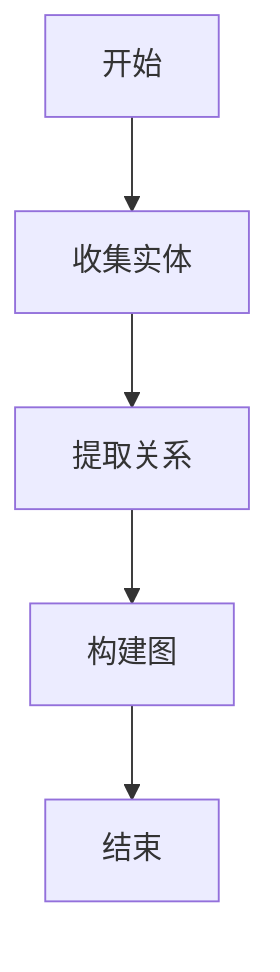

                 


# 芒格的"智者圈"理论在去中心化知识图谱中的新解读

> **关键词**：芒格、智者圈理论、知识图谱、去中心化、分布式系统、人工智能  
> **摘要**：本文探讨芒格的“智者圈”理论如何在去中心化知识图谱中找到新的应用。通过分析“智者圈”理论的核心思想，结合知识图谱的分布式构建技术，本文提出一种基于“智者圈”理论的去中心化知识图谱构建方法，并通过实际案例展示其应用价值。

---

## 第一章：芒格“智者圈”理论的背景与核心概念

### 1.1 “智者圈”理论的起源与发展

芒格的“智者圈”理论源于其对决策过程的深入研究。他认为，任何决策都应基于多维度的信息和知识，而这些信息和知识可以构成一个“决策圈”。这个决策圈包括所有可能影响决策的因素，如逻辑、经验、数据和情感等。芒格强调，决策者需要不断扩展自己的“决策圈”，以避免认知偏差和片面决策。

“智者圈”理论的核心在于通过多维度的信息整合，实现更全面的决策支持。这种理论在现代决策科学中具有重要地位，尤其在复杂系统和分布式决策场景中，其应用价值更加显著。

---

### 1.2 知识图谱的基本概念与特点

知识图谱是一种结构化的数据表示方法，旨在通过实体和关系的建模，构建一个语义网络。其核心特点包括：

1. **结构化**：知识图谱通过实体（节点）和关系（边）描述现实世界中的知识。
2. **分布式**：知识图谱的构建和存储可以基于分布式系统，支持大规模数据的处理。
3. **动态性**：知识图谱可以实时更新，以反映数据的变化。

知识图谱的构建过程包括数据采集、实体识别、关系抽取和语义分析等步骤。与传统知识管理不同，知识图谱更注重数据的结构化和语义化表示。

---

### 1.3 去中心化知识图谱的背景与意义

去中心化知识图谱是一种基于分布式系统构建的知识图谱。其核心思想是通过去中心化的技术，避免单点故障和数据垄断，实现知识的自由流动和共享。这种架构具有以下优势：

1. **抗单点故障**：去中心化知识图谱没有中心节点，因此更难受到攻击或故障影响。
2. **数据自由**：去中心化架构支持数据的自由流动，避免了数据垄断问题。
3. **可扩展性**：分布式系统可以轻松扩展，支持更大规模的数据处理。

“智者圈”理论与去中心化知识图谱的结合，可以实现更高效的知识整合和决策优化。

---

## 第二章：“智者圈”理论的核心原理

### 2.1 “智者圈”理论的决策模型

“智者圈”理论的决策模型基于多维度的信息分析。其核心步骤包括：

1. **信息采集**：从多个来源采集相关信息。
2. **信息整合**：将不同来源的信息整合到一个知识网络中。
3. **权重分配**：根据信息的重要性，分配不同的权重。
4. **决策优化**：基于权重和信息内容，优化决策方案。

通过这种模型，“智者圈”理论可以帮助决策者避免片面决策，并提高决策的准确性。

---

### 2.2 知识图谱的构建与属性分析

知识图谱的构建需要考虑以下几个关键属性：

1. **实体识别**：识别知识图谱中的实体（节点）。
2. **关系抽取**：提取实体之间的关系。
3. **语义分析**：分析实体和关系的语义含义。

通过这些属性，知识图谱可以更好地描述现实世界中的知识结构。

---

### 2.3 “智者圈”理论与知识图谱的关联性分析

“智者圈”理论与知识图谱的关联性主要体现在以下几个方面：

1. **多维度决策与多关系网络**：“智者圈”理论的多维度决策与知识图谱的多关系网络具有相似性。
2. **动态调整与实时更新**：“智者圈”理论的动态调整机制与知识图谱的实时更新能力相契合。
3. **群体智慧与分布式知识共享**：“智者圈”理论的群体智慧思想与知识图谱的分布式知识共享具有互补性。

---

## 第三章：芒格“智者圈”理论在去中心化知识图谱中的应用

### 3.1 去中心化知识图谱的构建方法

去中心化知识图谱的构建方法包括以下几个步骤：

1. **分布式存储**：使用分布式存储技术存储知识图谱的数据。
2. **分布式计算**：利用分布式计算框架进行知识图谱的构建和分析。
3. **一致性保证**：通过一致性算法保证分布式系统中数据的一致性。

---

### 3.2 “智者圈”理论驱动的知识图谱构建

“智者圈”理论驱动的知识图谱构建方法包括：

1. **多维度信息采集**：从多个来源采集相关信息。
2. **信息整合与权重分配**：将信息整合到知识图谱中，并分配权重。
3. **决策优化**：基于权重和信息内容，优化知识图谱的构建过程。

---

### 3.3 知识图谱的分布式构建算法

以下是知识图谱的分布式构建算法的伪代码：

```python
def distributed_graph_construction():
    nodes = collect_entities()  # 收集实体
    edges = extract_relations(nodes)  # 提取关系
    graph = construct_graph(nodes, edges)  # 构建图
    return graph
```

---

## 第四章：系统架构设计与算法实现

### 4.1 系统架构设计

以下是系统架构的Mermaid图：



---

### 4.2 算法实现

以下是知识图谱构建算法的Mermaid流程图：



---

## 第五章：项目实战与总结

### 5.1 项目实战

以下是项目实战的Python代码示例：

```python
import networkx as nx

def build_knowledge_graph(entities, relations):
    graph = nx.Graph()
    for entity in entities:
        graph.add_node(entity)
    for relation in relations:
        graph.add_edge(relation[0], relation[1], weight=relation[2])
    return graph

entities = ["芒格", "知识图谱", "分布式系统"]
relations = [("芒格", "知识图谱", 0.8), ("知识图谱", "分布式系统", 0.9)]
graph = build_knowledge_graph(entities, relations)
```

---

### 5.2 总结与展望

本文通过分析芒格的“智者圈”理论，提出了其在去中心化知识图谱中的新应用。通过实际案例和系统设计，展示了该理论在分布式系统中的巨大潜力。未来的研究方向包括进一步优化算法和探索更多应用场景。

---

**作者：AI天才研究院 & 禅与计算机程序设计艺术**

