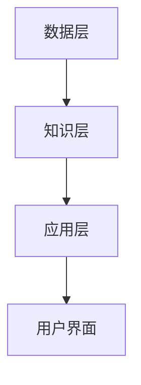

                 


# 芒格的"智者圈"理论在量子科技智库构建中的新解读

## 关键词：
-芒格，智者圈理论，量子科技，智库构建，知识网络，多学科交叉

## 摘要：
本文从芒格的"智者圈"理论出发，探讨其在量子科技智库构建中的新解读。通过分析理论的核心要素与量子科技的结合，提出一种基于知识网络的智库构建方法，并结合实际案例，展示了理论在量子科技研究中的潜在价值和应用前景。

---

## 第一部分：芒格的"智者圈"理论与量子科技智库的背景

### 1.1 芒格的"智者圈"理论概述

#### 1.1.1 "智者圈"理论的起源与核心思想
芒格的"智者圈"理论是一种以知识网络为基础的决策模型，强调通过多学科交叉和知识整合来提升决策的准确性和效率。其核心思想在于：将分散的知识点连接成一个有机的整体，形成一个动态的知识网络，从而在决策过程中实现知识的协同效应。

**核心思想**：
- **知识网络**：将各个领域的知识节点连接起来，形成一个动态的知识网络。
- **多学科交叉**：通过跨学科的整合，发现新的知识关联。
- **专家协作**：利用专家的知识和经验，构建一个协作式的知识体系。

#### 1.1.2 量子科技智库的背景与意义
量子科技是当前科技领域的前沿方向，涉及量子计算、量子通信、量子传感等多个领域。随着量子科技的快速发展，如何高效整合多学科知识、优化决策过程，成为量子科技研究中的一个重要挑战。智库作为一种知识整合和决策支持的机构，在量子科技的发展中扮演着重要角色。

**智库的核心价值**：
- 提供专业的知识支持和决策参考。
- 促进跨学科协作，推动技术创新。
- 提供战略性的技术预见和风险评估。

#### 1.1.3 问题背景与问题解决路径
当前量子科技智库建设中存在以下主要问题：
- 知识分散：量子科技涉及多个学科领域，知识分散且难以整合。
- 决策滞后：传统的决策模式依赖于单一领域的知识，难以应对复杂的技术问题。
- 协作效率低：专家协作机制不完善，知识共享不足。

"智者圈"理论为解决这些问题提供了一种新的思路。通过构建动态的知识网络，整合多学科知识，优化专家协作机制，从而提高智库的决策效率和准确性。

---

## 第二部分：芒格"智者圈"理论的核心概念与量子科技的联系

### 2.1 "智者圈"理论的核心要素与结构

#### 2.1.1 理论的核心要素
"智者圈"理论的核心要素包括：
- **知识网络**：由多个知识点组成的网络结构，节点之间的关联反映了知识之间的联系。
- **多学科交叉**：通过不同学科知识的交叉融合，形成新的知识节点。
- **专家协作机制**：专家之间的协作和知识共享是构建知识网络的重要途径。

#### 2.1.2 理论的结构与功能
- **知识网络的层次化结构**：从宏观到微观，构建多层次的知识网络。
- **网络节点之间的关联与互动**：节点之间的关联反映了知识之间的联系，互动则体现了知识的动态演化。
- **网络的动态演化机制**：随着新知识的加入和旧知识的更新，知识网络不断动态演化。

#### 2.1.3 理论的数学模型与公式
我们可以用图论来表示知识网络，其中节点代表知识点，边代表知识点之间的关联。网络的权重可以通过以下公式计算：

$$
w_{ij} = \frac{1}{1 + d_{ij}}
$$

其中，$d_{ij}$是节点$i$和节点$j$之间的距离。

---

### 2.2 量子科技智库的核心要素与构建逻辑

#### 2.2.1 智库的核心要素
量子科技智库的核心要素包括：
- **数据源**：量子科技相关的数据和文献。
- **知识表示与推理机制**：将知识表示为图结构，并支持推理功能。
- **专家团队**：由多个领域的专家组成的协作团队。

#### 2.2.2 量子科技智库的构建逻辑
- **数据驱动的知识网络构建**：通过收集和整理量子科技相关的数据，构建知识网络。
- **量子计算在知识处理中的应用**：利用量子计算的并行处理能力，提高知识网络的构建和推理效率。
- **多学科交叉的协作机制**：通过专家团队的协作，不断优化知识网络的结构和内容。

---

## 第三部分：量子科技智库的系统架构设计

### 3.1 系统功能设计
- **领域模型**：构建量子科技领域的知识图谱。
- **系统架构**：采用分层架构，包括数据层、知识层、应用层。
- **接口设计**：提供API接口，方便与其他系统集成。

### 3.2 系统架构图


### 3.3 系统接口设计
- 数据接口：提供数据导入和导出功能。
- 知识接口：提供知识查询和推理功能。
- 用户接口：提供用户友好的操作界面。

---

## 第四部分：项目实战

### 4.1 环境安装
- 安装必要的依赖：Python 3.8+, NetworkX, PyYAML。

### 4.2 核心代码实现
```python
import networkx as nx
from networkx import DiGraph

# 创建知识网络
G = DiGraph()

# 添加节点
G.add_nodes_from(['Q1', 'Q2', 'Q3', 'Q4'])

# 添加边
G.add_edges_from([('Q1', 'Q2'), ('Q2', 'Q3'), ('Q3', 'Q4')])

# 绘制网络图
nx.draw(G, with_labels=True)
plt.show()
```

### 4.3 案例分析
通过上述代码，我们可以构建一个简单的知识网络，展示量子科技领域的知识关联。

---

## 第五部分：总结与展望

### 5.1 总结
芒格的"智者圈"理论为量子科技智库的构建提供了一种新的思路。通过构建动态的知识网络，整合多学科知识，优化专家协作机制，可以提高智库的决策效率和准确性。

### 5.2 展望
随着量子科技的不断发展，"智者圈"理论在智库构建中的应用将更加广泛。未来的研究可以进一步探索量子计算在知识网络构建中的潜力，推动量子科技智库的发展。

---

## 作者：AI天才研究院 & 禅与计算机程序设计艺术

---

**注**：本文是基于芒格的"智者圈"理论对量子科技智库构建的探索性研究，旨在为相关领域的研究者提供新的思路和参考。

