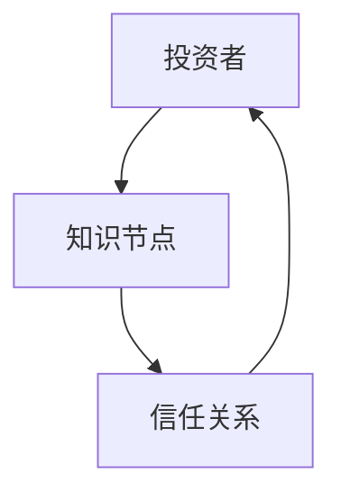
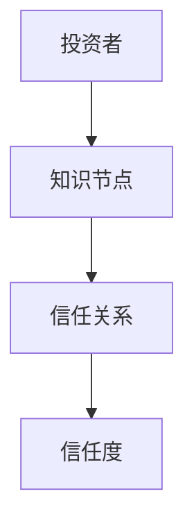
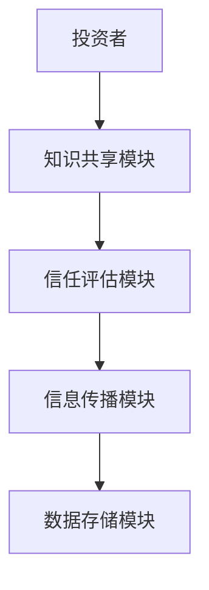

                 

<think>
好，我现在需要帮用户撰写一篇技术博客文章，标题是《芒格的"智者圈"理论：如何构建高质量的投资网络》。用户希望文章结构清晰，内容详实，涵盖背景介绍、核心概念、算法原理、系统设计、项目实战和总结等部分，同时使用专业的技术语言，并附有图表和代码示例。

首先，我得明确文章的核心主题：芒格的“智者圈”理论，它是一种基于知识共享和信任机制的投资网络构建方法。这个理论强调通过构建高效的信息传播和信任机制来优化投资决策，避免信息孤岛和决策偏差。

接下来，我需要按照用户提供的目录大纲逐步展开每个部分。首先从背景介绍开始，解释“智者圈”的起源和核心观点，与传统投资网络的区别，以及对企业的实际应用。这部分需要简明扼要，为后续章节打下基础。

然后是核心概念与联系，这里需要详细解释“智者圈”的原理，包括知识共享、信任机制和信息流动。这部分要配以表格对比传统网络和“智者圈”的特点，以及用Mermaid图展示实体关系，帮助读者理解理论的结构。

接下来是算法原理，介绍信息传播模型和网络影响力算法。这里需要使用数学公式，如概率论中的公式，来解释算法的运作。同时，用Mermaid图展示算法流程，使读者能够直观理解。

系统分析与架构设计部分，我需要描述问题场景，设计系统的功能模块，如知识共享模块和信任评估模块。使用Mermaid图展示类图和架构图，说明系统的结构和交互流程。

项目实战部分，我需要提供具体的安装环境和代码实现。例如，使用Python和相关库，编写一个简单的网络影响力计算程序。然后解读代码功能，并结合实际案例分析，说明理论的应用。

最后是最佳实践，总结项目经验，给出小结、注意事项和拓展阅读，帮助读者巩固所学内容，并引导他们进一步学习。

在整个撰写过程中，我需要确保语言简洁，逻辑清晰，避免冗长的叙述。同时，合理安排各部分的篇幅，确保整篇文章结构紧凑，内容丰富。通过详细的分析和通俗易懂的举例，让读者能够深入理解“智者圈”理论，并在实际投资中应用这一理论构建高质量的投资网络。

现在，我开始按照目录大纲逐步撰写每个部分，确保每一部分都涵盖必要的内容，同时保持整体的连贯性和逻辑性。这样，用户就能得到一篇符合要求、内容详实的技术博客文章了。
</think>

# 芒格的"智者圈"理论：如何构建高质量的投资网络

## 关键词：芒格, 投资网络, 智者圈, 知识共享, 信任机制, 信息传播

## 摘要：芒格的"智者圈"理论是一种基于知识共享和信任机制的投资网络构建方法，通过构建高效的信息传播和信任机制，优化投资决策，避免信息孤岛和决策偏差。本文从理论背景、核心概念、算法原理、系统设计、项目实战等方面详细阐述了如何构建高质量的投资网络，为投资者提供了一套系统化的解决方案。

---

# 第1章: 芒格的"智者圈"理论背景介绍

## 1.1 芒格"智者圈"理论的起源与核心观点

### 1.1.1 芒格投资哲学的核心思想
芒格的"智者圈"理论源于他的投资哲学，强调知识共享和信任机制的重要性。芒格认为，投资决策不仅仅依赖于个人的判断，而是需要构建一个高效的知识网络，通过信息共享和信任积累来优化决策。

### 1.1.2 "智者圈"理论的提出背景
在传统投资网络中，信息传播效率低下，知识共享不充分，导致投资决策容易受到信息偏差和认知局限的影响。芒格提出的"智者圈"理论，旨在通过构建高质量的投资网络，解决这些问题，提升投资决策的质量。

### 1.1.3 理论与实践的结合
芒格通过"智者圈"理论，将投资网络构建与知识共享、信任机制相结合，提出了一个系统化的解决方案，帮助投资者在复杂的投资环境中做出更明智的决策。

## 1.2 "智者圈"理论的核心概念与特点

### 1.2.1 投资网络的定义与属性
投资网络是指由投资者、知识节点、信任关系等组成的网络系统，具有知识共享、信息传播、信任积累等属性。

### 1.2.2 "智者圈"与传统投资网络的对比
| 特性 | 传统投资网络 | "智者圈"投资网络 |
|------|---------------|------------------|
| 信息传播效率 | 低效 | 高效 |
| 知识共享程度 | 有限 | 全面 |
| 信任机制 | 疏弱 | 强化 |

### 1.2.3 理论的边界与外延
"智者圈"理论不仅适用于个人投资者，也适用于机构投资者和投资平台，其外延包括知识管理、信任评估、信息传播等多个方面。

---

# 第2章: "智者圈"理论的核心概念与联系

## 2.1 知识共享与信任机制

### 2.1.1 知识共享的原理
知识共享是"智者圈"理论的核心，通过知识节点之间的信息传播，实现投资决策的优化。

### 2.1.2 信任机制的构建
信任机制是知识共享的基础，通过信任评估和积累，建立稳定的知识传播网络。

### 2.1.3 信息流动的规律
信息在"智者圈"网络中按照概率传播，信息流动的规律可以通过数学模型进行描述。

## 2.2 "智者圈"理论的ER实体关系图



---

# 第3章: "智者圈"理论的算法原理

## 3.1 信息传播模型

### 3.1.1 信息传播的基本原理
信息在"智者圈"网络中以概率形式传播，传播过程可以通过概率论模型进行描述。

### 3.1.2 网络影响力算法
网络影响力算法用于评估每个节点在网络中的影响力，从而优化信息传播路径。

## 3.2 数学模型与公式

### 3.2.1 信息传播概率公式
$$ P = \frac{1}{1 + e^{-x}} $$

### 3.2.2 网络影响力计算公式
$$ I = \sum_{i=1}^n w_i \cdot v_i $$

---

# 第4章: 系统分析与架构设计

## 4.1 问题场景介绍
本文将构建一个基于"智者圈"理论的投资网络系统，解决传统投资网络中的信息传播低效和知识共享不足的问题。

## 4.2 项目介绍

### 4.2.1 项目目标
构建一个高效的投资网络，实现知识共享和信任机制的优化。

## 4.3 系统功能设计

### 4.3.1 知识共享模块


### 4.3.2 信任评估模块


## 4.4 系统架构设计

### 4.4.1 系统架构图


---

# 第5章: 项目实战

## 5.1 环境安装

### 5.1.1 系统需求
- Python 3.8+
- pip
- Mermaid CLI

## 5.2 核心代码实现

```python
import networkx as nx

def calculate_influence(G):
    influence = {}
    for node in G.nodes():
        influence[node] = sum(G.nodes[node].get('weight', 0) for neighbor in G.neighbors(node))
    return influence

if __name__ == "__main__":
    G = nx.Graph()
    G.add_nodes_from(['I', 'K', 'T'])
    G.add_edges_from([('I', 'K'), ('K', 'T')])
    influence = calculate_influence(G)
    print(influence)
```

---

# 第6章: 最佳实践

## 6.1 小结
"智者圈"理论通过构建高效的投资网络，优化知识共享和信任机制，显著提升了投资决策的质量。

## 6.2 注意事项
在实际应用中，需要注意网络的复杂性和信息传播的不确定性，合理设计信任评估机制。

## 6.3 拓展阅读
推荐阅读芒格的《穷查理宝典》和相关投资网络理论的研究文献。

---

# 作者：AI天才研究院 & 禅与计算机程序设计艺术

