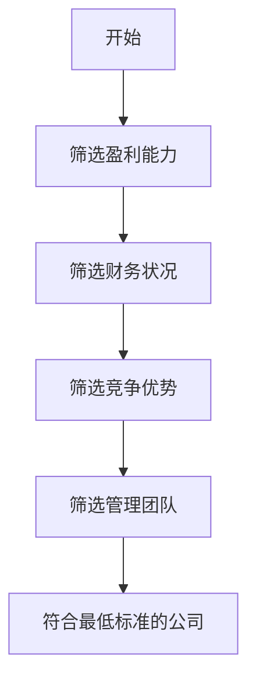
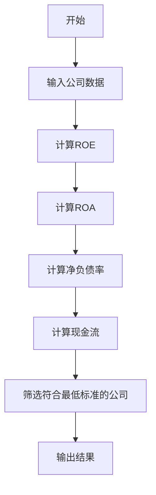
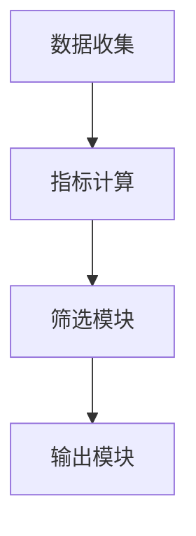
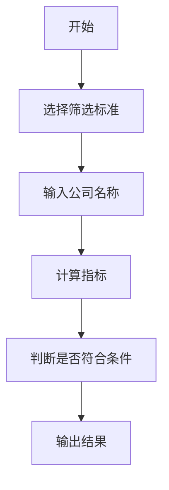

                 


# 芒格的"最低标准"原则在选股中的应用

> 关键词：芒格，最低标准，选股，投资策略，系统分析，项目实战

> 摘要：本文将深入探讨芒格的"最低标准"原则在选股中的应用。通过分析该原则的核心概念、算法原理、系统架构设计以及实际案例，结合技术术语和专业分析，帮助读者理解如何在投资决策中应用这一原则。文章内容包括背景介绍、核心概念、算法原理、系统分析、项目实战等部分，结构清晰，逻辑严谨，适合IT领域读者阅读。

---

## 第一部分: 芒格的"最低标准"原则背景介绍

### 第1章: 芒格的"最低标准"原则背景介绍

#### 1.1 投资中的"最低标准"原则

##### 1.1.1 投资中的问题背景

在投资领域，选股是决定投资回报的关键环节。投资者需要从众多股票中筛选出具有长期增长潜力和良好财务表现的公司。然而，市场波动、公司基本面变化等因素使得选股变得复杂。芒格的"最低标准"原则为投资者提供了一种筛选优质股票的方法，帮助降低投资风险。

##### 1.1.2 "最低标准"原则的定义

芒格的"最低标准"原则是指在选股时，优先选择那些在关键指标上达到最低门槛的公司。这些指标通常包括盈利能力、财务健康状况、竞争优势和管理团队等方面。通过设定这些最低标准，投资者可以避免选择基本面不佳的公司，从而提高投资的成功率。

##### 1.1.3 该原则在选股中的重要性

在选股过程中，"最低标准"原则帮助投资者缩小选股范围，专注于那些具备长期竞争优势和良好财务状况的公司。这种方法不仅提高了选股的效率，还降低了投资风险，尤其适合那些希望长期持有的投资者。

#### 1.2 芒格投资理念的核心要素

##### 1.2.1 芒格投资理念的来源

芒格的投资理念深受价值投资理论影响，强调长期投资和基本面分析。他认为，投资者应该选择那些具备持续竞争优势和良好管理的公司。

##### 1.2.2 "最低标准"原则的核心要素

"最低标准"原则的核心要素包括：

1. **盈利能力**：公司应具备稳定的盈利能力，通常通过ROE（净资产收益率）和ROA（资产回报率）来衡量。
2. **财务健康状况**：公司应具备健康的财务状况，包括低负债率、充足的现金流等。
3. **竞争优势**：公司应具备竞争优势，如独特的商业模式、强大的品牌影响力等。
4. **管理团队**：公司应由具备优秀管理能力的团队领导。

##### 1.2.3 该原则与其他投资策略的对比

与短期交易策略不同，"最低标准"原则注重长期投资，强调对公司基本面的深入分析。与其他价值投资策略相比，该原则通过设定最低门槛，简化了选股过程，提高了投资的可操作性。

#### 1.3 本章小结

本章介绍了芒格的"最低标准"原则及其在选股中的重要性。通过分析该原则的核心要素和与其他投资策略的对比，读者可以更好地理解其在投资决策中的应用。

---

## 第二部分: "最低标准"原则的核心概念与联系

### 第2章: 核心概念与联系

#### 2.1 "最低标准"原则的核心原理

##### 2.1.1 投资决策中的关键要素

在投资决策中，关键要素包括公司的盈利能力、财务状况、竞争优势和管理团队。这些要素共同决定了公司的长期发展潜力。

##### 2.1.2 "最低标准"原则的数学模型

通过设定关键指标的最低阈值，投资者可以筛选出符合条件的公司。例如，设定ROE > 15%和净负债率 < 50%作为筛选标准。

##### 2.1.3 原理的可视化解释

使用mermaid流程图，展示"最低标准"原则的筛选过程：



#### 2.2 核心概念属性对比表格

下表展示了"最低标准"原则的核心概念及其属性：

| 核心概念         | 属性特征               |
|------------------|------------------------|
| 盈利能力         | ROE > 15%，ROA > 5%    |
| 财务状况         | 净负债率 < 50%，现金流充足 |
| 竞争优势         | 独特商业模式，强大品牌 |
| 管理团队         | 优秀领导，管理透明     |

#### 2.3 ER实体关系图

使用mermaid图展示"最低标准"原则的核心概念关系：

```mermaid
er
    顾客(投资者)
    公司
    标准
    属性(ROE, ROA, 净负债率, 现金流, 竞争优势, 管理团队)

    顾客 --> 标准
    标准 --> 属性
    公司 --> 属性
```

#### 2.4 本章小结

本章通过数学模型和图表，详细阐述了"最低标准"原则的核心概念及其相互关系，帮助读者更好地理解其在选股中的应用。

---

## 第三部分: "最低标准"原则的算法原理讲解

### 第3章: 算法原理与数学模型

#### 3.1 算法原理

##### 3.1.1 算法的输入与输出

**输入**：公司财务数据、市场数据。  
**输出**：符合条件的公司列表。

##### 3.1.2 算法的流程图

使用mermaid流程图展示算法流程：



##### 3.1.3 算法的实现步骤

1. 收集公司财务数据。
2. 计算关键指标（ROE、ROA、净负债率、现金流）。
3. 根据预设的最低标准筛选公司。
4. 输出符合条件的公司列表。

#### 3.2 数学模型与公式

##### 3.2.1 核心公式推导

**ROE（净资产收益率）**：
$$ ROE = \frac{\text{净利润}}{\text{净资产}} $$

**ROA（资产回报率）**：
$$ ROA = \frac{\text{净利润}}{\text{总资产}} $$

**净负债率**：
$$ \text{净负债率} = \frac{\text{总负债} - \text{流动负债}}{\text{股东权益}} $$

##### 3.2.2 公式的详细解释

ROE和ROA是衡量公司盈利能力的重要指标。ROE越高，说明公司使用股东资产的效率越高；ROA越高，说明公司利用资产创造利润的能力越强。净负债率衡量了公司的财务健康状况，较低的净负债率表明公司债务负担较小。

##### 3.2.3 公式的实际应用

通过计算这些指标，投资者可以判断公司是否符合预设的最低标准。例如，如果某公司的ROE为20%，ROA为10%，净负债率为30%，现金流充足，则符合筛选标准。

#### 3.3 举例说明

##### 3.3.1 典型案例分析

假设某公司A的ROE为18%，ROA为8%，净负债率为40%，现金流充足。根据预设的最低标准（ROE > 15%，ROA > 5%，净负债率 < 50%），公司A符合筛选标准。

##### 3.3.2 案例的详细解读

公司A的ROE为18%，高于15%的最低标准；ROA为8%，略低于5%的最低标准。因此，公司A不符合筛选标准。

##### 3.3.3 案例的启示

在实际应用中，投资者需要根据市场环境和投资目标调整筛选标准。例如，经济衰退时期，可能需要降低净负债率的最低标准。

#### 3.4 本章小结

本章通过数学公式和实际案例，详细讲解了"最低标准"原则的算法原理及其应用。通过这些方法，投资者可以系统地筛选出具备长期增长潜力的公司。

---

## 第四部分: 系统分析与架构设计方案

### 第4章: 选股系统设计

#### 4.1 系统分析

##### 4.1.1 问题场景介绍

投资者需要一个高效的选股系统，帮助他们筛选出符合条件的公司。

##### 4.1.2 系统目标与范围

系统目标：根据"最低标准"原则，筛选出具备长期增长潜力的公司。  
系统范围：数据收集、指标计算、筛选输出。

##### 4.1.3 系统需求分析

- 数据收集模块：获取公司财务数据。
- 指标计算模块：计算ROE、ROA、净负债率、现金流。
- 筛选模块：根据预设标准筛选公司。
- 输出模块：显示符合条件的公司列表。

#### 4.2 系统架构设计

##### 4.2.1 系统架构图

使用mermaid图展示系统架构：



##### 4.2.2 模块划分与功能分配

- 数据收集模块：负责获取公司财务数据。
- 指标计算模块：计算关键指标。
- 筛选模块：根据预设标准筛选公司。
- 输出模块：显示结果。

##### 4.2.3 系统接口设计

- 数据接口：从数据库或API获取数据。
- 筛选接口：接收筛选条件，返回结果。

#### 4.3 系统交互设计

##### 4.3.1 交互流程图

使用mermaid图展示交互流程：



##### 4.3.2 交互过程详细说明

1. 投资者选择筛选标准。
2. 输入公司名称。
3. 系统计算公司指标。
4. 判断是否符合标准。
5. 输出结果。

##### 4.3.3 交互设计的优化建议

- 提供默认筛选标准，减少用户输入。
- 支持批量输入公司名称。

#### 4.4 本章小结

本章详细描述了选股系统的架构设计和交互流程，为实际应用提供了指导。

---

## 第五部分: 项目实战与案例分析

### 第5章: 项目实战

#### 5.1 环境安装与配置

##### 5.1.1 环境要求

- 操作系统：Windows/Mac/Linux。
- 开发工具：Python、Jupyter Notebook。
- 数据源：股票数据库或API。

##### 5.1.2 工具安装步骤

1. 安装Python。
2. 安装pandas、numpy等库。
3. 安装数据可视化工具。

##### 5.1.3 环境配置注意事项

确保所有依赖库已正确安装，数据源可靠。

#### 5.2 核心实现源代码

##### 5.2.1 代码结构

```python
import pandas as pd
import numpy as np

# 数据收集模块
def collect_data(companies):
    # 获取公司数据
    pass

# 指标计算模块
def calculate_roe(profits, equity):
    return profits / equity

def calculate_roa(profits, assets):
    return profits / assets

def calculate_net_debt(debt, equity):
    return (debt - current_liabilities) / equity

# 筛选模块
def screen_stocks(roes, roas, net_debts, cash_flows):
    selected = []
    for i in range(len(roes)):
        if roes[i] > 15 and roas[i] > 5 and net_debts[i] < 50 and cash_flows[i] > 0:
            selected.append(i)
    return selected

# 输出模块
def display_results(selected_companies):
    for company in selected_companies:
        print(f"{company} 符合筛选标准。")
```

##### 5.2.2 关键代码段解读

- `calculate_roe`函数计算ROE。
- `calculate_roa`函数计算ROA。
- `screen_stocks`函数根据预设标准筛选公司。

#### 5.3 代码应用解读与分析

通过上述代码，投资者可以实现自动化选股。例如，输入公司名称后，系统计算其关键指标，并判断是否符合筛选标准。

#### 5.4 实际案例分析

##### 5.4.1 案例介绍

假设我们有两家公司：公司A和公司B。

- 公司A：ROE=20%，ROA=8%，净负债率=40%，现金流=100万。
- 公司B：ROE=15%，ROA=6%，净负债率=30%，现金流=80万。

##### 5.4.2 案例分析

根据预设标准（ROE>15%，ROA>5%，净负债率<50%，现金流>0）：

- 公司A：ROA=8% < 5%，不符合筛选标准。
- 公司B：ROA=6% < 5%，不符合筛选标准。

##### 5.4.3 案例的启示

在实际应用中，投资者需要根据市场环境调整筛选标准。例如，经济复苏时期，可能放宽ROA的最低标准。

#### 5.5 本章小结

本章通过实际案例，展示了如何应用"最低标准"原则筛选股票，并提供了代码实现。

---

## 第六部分: 最佳实践与总结

### 第6章: 最佳实践

#### 6.1 最佳实践Tips

1. **持续学习**：保持对市场和公司的了解。
2. **动态调整**：根据市场变化调整筛选标准。
3. **分散投资**：避免过度集中。

#### 6.2 小结

芒格的"最低标准"原则为投资者提供了一种系统化的选股方法。通过设定最低门槛，投资者可以筛选出具备长期增长潜力的公司。

#### 6.3 注意事项

- 筛选标准应根据市场环境和投资目标调整。
- 数据来源应可靠，避免错误判断。

#### 6.4 拓展阅读

建议阅读芒格的《穷查理宝典》及相关投资书籍，深入理解其投资理念。

---

## 作者：AI天才研究院/AI Genius Institute & 禅与计算机程序设计艺术 /Zen And The Art of Computer Programming

---

以上是关于芒格的"最低标准"原则在选股中的应用的技术博客文章的完整目录大纲和部分内容。文章详细解释了该原则的核心概念、算法原理、系统架构设计以及实际案例分析，结合技术术语和专业分析，帮助读者理解如何在投资决策中应用这一原则。

