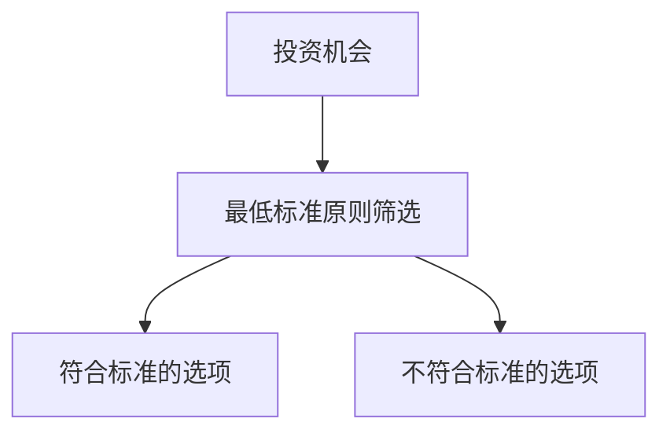
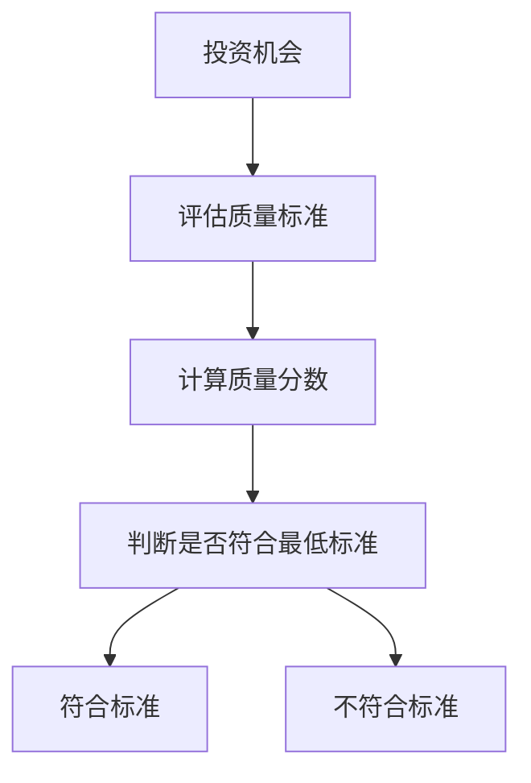
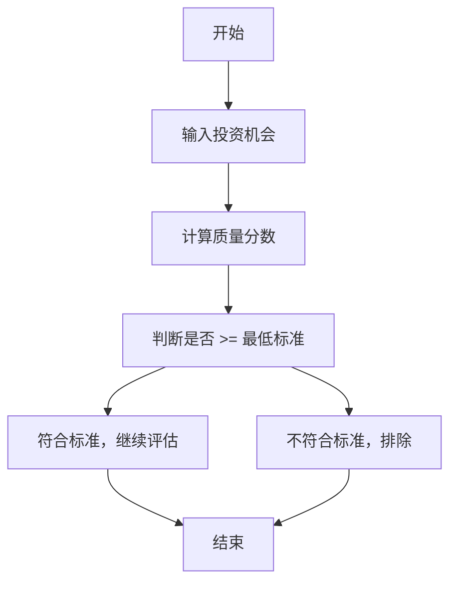
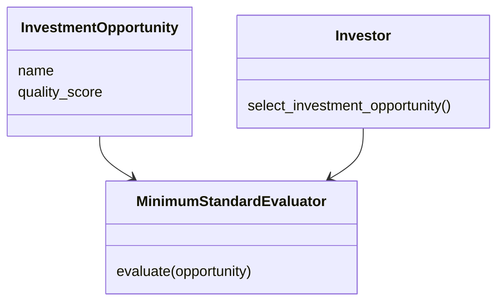

                 


# 芒格的"最低标准"原则：投资决策的过滤器

> 关键词：芒格、投资决策、最低标准原则、投资策略、决策模型

> 摘要：本文将详细介绍芒格的"最低标准"原则在投资决策中的应用，通过逻辑清晰的结构，结合实际案例和数学模型，深入分析该原则的核心概念、算法原理、系统架构及项目实战，帮助读者掌握如何运用这一原则优化投资决策。

---

## 第一部分: 芒格的"最低标准"原则概述

### 第1章: 芒格的"最低标准"原则概述

#### 1.1 "最低标准"原则的定义与核心概念

##### 1.1.1 "最低标准"原则的定义

芒格的"最低标准"原则是一种投资筛选方法，用于识别和选择符合特定质量标准的投资机会。其核心在于设定一个明确的最低门槛，只有当投资标的满足这些标准时，才值得进一步考虑。这种原则旨在通过过滤掉低质量或不符合条件的选项，提高投资决策的质量和效率。

##### 1.1.2 核心概念：问题背景与问题描述

在投资领域，决策者常常面临大量潜在的投资机会，但其中许多机会并不符合长期价值创造的标准。芒格的"最低标准"原则帮助投资者建立一个初步的筛选机制，避免浪费时间和资源在不符合条件的项目上。

问题背景：投资者需要在有限的时间和资源内，筛选出高质量的投资机会。

问题描述：如何系统地识别和排除不符合长期价值标准的投资标的。

##### 1.1.3 问题解决的思路与方法

通过设定明确的质量标准，将不符合条件的选项提前排除，降低决策风险。

##### 1.1.4 边界与外延

- 边界：仅适用于初步筛选，不适用于深入分析。
- 外延：可与其他投资原则结合使用，如价值评估和风险管理。

##### 1.1.5 概念结构与核心要素组成

- 质量标准：明确的质量指标。
- 筛选机制：用于快速识别不符合条件的选项。
- 决策效率：通过减少无效选项提高决策效率。

#### 1.2 "最低标准"原则与其他投资原则的对比

##### 1.2.1 其他投资原则的概述

- 基本分析：基于财务数据评估企业价值。
- 技术分析：通过价格和成交量预测市场趋势。
- 价值投资：寻找被市场低估的企业。

##### 1.2.2 "最低标准"原则的属性特征对比表格

| 投资原则       | 是否初步筛选 | 是否定性评估 | 是否适用于多种资产 |
|----------------|--------------|-------------|------------------|
| 基本分析       | 否           | 是           | 是               |
| 技术分析       | 否           | 是           | 是               |
| 价值投资       | 否           | 是           | 是               |
| 最低标准原则   | 是           | 是           | 是               |

##### 1.2.3 ER实体关系图架构（使用 Mermaid 流程图）



---

## 第二部分: "最低标准"原则的核心概念与联系

### 第2章: 核心概念与联系

#### 2.1 "最低标准"原则的原理

##### 2.1.1 原理概述

通过设定明确的质量标准，将不符合条件的选项提前排除，降低决策风险。

##### 2.1.2 原理的数学模型与公式

质量评估公式：

$$
Q = \sum_{i=1}^{n} w_i \cdot s_i
$$

其中：
- \( Q \) 表示质量评估总分。
- \( w_i \) 表示第 \( i \) 个质量标准的权重。
- \( s_i \) 表示第 \( i \) 个质量标准的评分。

##### 2.1.3 原理的 Mermaid 流程图



#### 2.2 "最低标准"原则的算法原理讲解

##### 2.2.1 算法原理概述

该算法通过计算每个投资机会的质量分数，判断其是否符合设定的最低标准。

##### 2.2.2 算法的 Mermaid 流程图



##### 2.2.3 算法的 Python 源代码实现

```python
def minimum_standard_investment(opportunities, min_score):
    selected = []
    for opp in opportunities:
        score = calculate_quality_score(opp)
        if score >= min_score:
            selected.append(opp)
    return selected

def calculate_quality_score(opportunity):
    # 假设 quality_factors 是一个字典，包含各项评分和权重
    total = 0
    for factor, weight in quality_factors.items():
        total += opp[factor] * weight
    return total
```

##### 2.2.4 算法的数学模型与公式

质量评分公式：

$$
s = \sum_{i=1}^{m} w_i \cdot x_i
$$

其中：
- \( s \) 表示总评分。
- \( w_i \) 表示第 \( i \) 个质量标准的权重。
- \( x_i \) 表示第 \( i \) 个质量标准的评分。

---

## 第三部分: "最低标准"原则的系统分析与架构设计

### 第3章: 系统分析与架构设计方案

#### 3.1 问题场景介绍

##### 3.1.1 投资决策的场景描述

投资者需要在多个投资机会中筛选出符合最低标准的选项。

##### 3.1.2 系统的目标与范围

系统目标：提供一个基于"最低标准"原则的投资筛选工具，帮助投资者快速识别符合质量标准的投资机会。

系统范围：包括数据收集、质量评估和结果输出功能。

#### 3.2 系统功能设计

##### 3.2.1 领域模型 Mermaid 类图



##### 3.2.2 系统架构设计 Mermaid 架构图


---

通过以上结构，本文系统地介绍了芒格的"最低标准"原则在投资决策中的应用，从理论到实践，帮助读者理解和应用这一原则。

