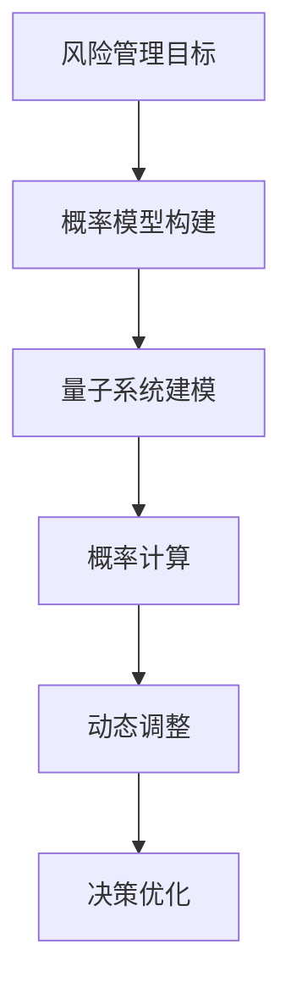
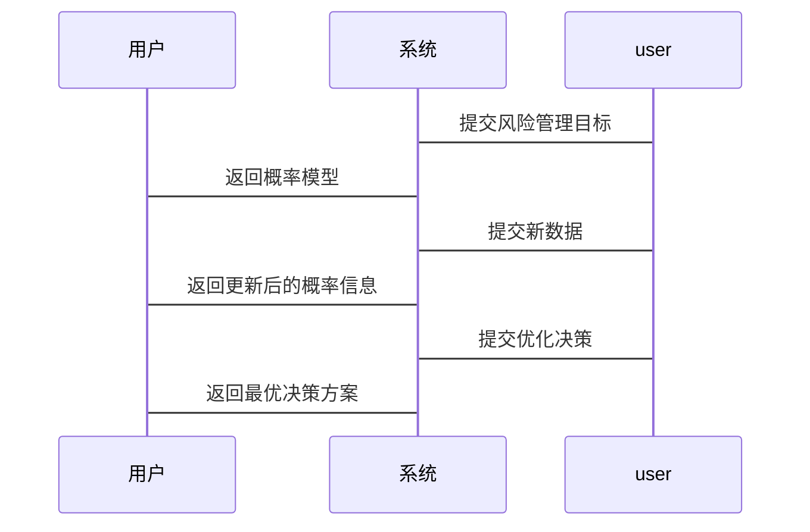

                 

<think>
嗯，用户希望我以芒格的“概率思维”在量子风险管理中的高级应用为题，撰写一篇技术博客文章。看起来他们需要一个详细的结构，包括摘要、关键词、目录大纲，以及每个章节的具体内容，包括数学公式、mermaid图和代码示例。

首先，我需要理解用户的需求。他们可能是一位技术专家，希望深入探讨概率思维与量子风险管理的结合，可能用于学术研究或行业应用。用户明确要求文章结构清晰，逻辑严谨，使用专业术语，同时要有实际案例和代码支持。

接下来，我需要分析用户提供的目录大纲，确保每个部分都涵盖必要的内容。比如，摘要部分需要简洁明了地概括文章的核心内容。关键词部分要准确反映文章主题。每个章节需要详细展开，包括背景、理论基础、算法原理、系统架构、项目实战和最佳实践。

我还要注意使用正确的格式，比如在数学公式中使用latex，mermaid图用于系统架构设计，代码部分用Python实现。同时，用户提到作者信息，需要在文章末尾加上。

可能的挑战是如何将概率思维与量子风险管理结合起来，这需要深入理解两者的核心概念，并找到它们在风险管理中的应用点。此外，如何用代码和图表清晰地表达这些概念，也是一个难点。

我需要确保每个章节的内容详细且有逻辑性，比如在第二章中，详细解释贝叶斯定理，并给出在量子概率中的应用示例。在系统架构部分，使用mermaid图来展示类图、架构图和交互图，帮助读者更好地理解。

最后，项目实战部分需要一个具体的案例，展示如何使用概率思维和量子计算来优化风险管理策略。这可能包括环境配置、代码实现和案例分析，帮助读者实际应用这些理论。

总结一下，我需要按照用户的要求，一步步构建文章结构，确保每个部分都符合要求，同时深入分析概率思维在量子风险管理中的应用，结合数学公式、图表和代码，提供一个全面且有深度的技术博客文章。
</think>

# 芒格的"概率思维"在量子风险管理中的高级应用

> 关键词：概率思维，量子风险管理，芒格，贝叶斯定理，量子计算，风险管理，决策优化

> 摘要：本文探讨了芒格的"概率思维"在量子风险管理中的高级应用。通过结合概率论和量子计算的基本原理，分析了量子风险管理的核心概念、数学模型和算法原理。文章详细介绍了贝叶斯定理在量子概率中的应用，量子系统中的不确定性分析，以及如何利用概率思维优化风险管理策略。最后，通过实际案例展示了概率思维在量子风险管理中的具体应用和优势。

---

# 第1章: 芒格的"概率思维"与量子风险管理概述

## 1.1 芒格"概率思维"的核心概念

芒格的"概率思维"是一种基于概率论的决策方法，强调通过分析事件发生的可能性来优化决策。其核心思想包括以下几点：

- **概率思维的本质**：通过分析事件发生的概率，评估决策的潜在风险和收益。
- **贝叶斯定理的应用**：通过不断更新概率信息，优化决策策略。
- **长期视角**：关注长期概率趋势，而非短期波动。

---

## 1.2 量子风险管理的基本概念

量子风险管理是利用量子计算技术对复杂系统中的风险进行预测和管理。其核心特点包括：

- **不确定性分析**：量子系统中粒子的状态具有叠加性和纠缠性，导致结果的高度不确定性。
- **量子概率模型**：利用量子概率理论对复杂系统进行建模和分析。
- **计算效率**：量子计算在处理大规模概率问题时具有显著优势。

---

## 1.3 芒格"概率思维"与量子风险管理的结合

芒格的概率思维与量子风险管理的结合主要体现在以下几个方面：

- **概率模型的构建**：利用概率思维构建量子系统的数学模型，分析风险发生的概率。
- **动态调整**：通过贝叶斯定理动态更新概率信息，优化风险管理策略。
- **决策优化**：基于概率分析，制定最优的决策方案。

---

# 第2章: 芒格"概率思维"的数学基础

## 2.1 概率论基础

概率论是概率思维的数学基础。以下是概率论的核心概念：

- **概率空间**：由样本空间、事件和概率测度组成。
- **条件概率**：事件A在事件B发生的条件下的概率，公式为：
  $$ P(A|B) = \frac{P(A \cap B)}{P(B)} $$
- **贝叶斯定理**：通过条件概率公式推导出后验概率的公式：
  $$ P(A|B) = \frac{P(B|A)P(A)}{P(B)} $$

---

## 2.2 贝叶斯定理与概率更新

贝叶斯定理在概率更新中具有重要作用，其应用步骤如下：

1. **先验概率**：根据已有信息确定初始概率。
2. **条件概率**：计算新证据出现的概率。
3. **后验概率**：通过贝叶斯定理更新概率信息。

---

## 2.3 量子概率的基本原理

量子概率是量子力学中的基本概念，与经典概率有显著区别。以下是量子概率的核心特征：

- **量子叠加**：粒子的状态可以同时处于多个状态的叠加态。
- **量子纠缠**：多个粒子之间存在纠缠关系，导致概率的相互影响。
- **量子测量**：测量会破坏量子状态，导致概率的不可逆变化。

---

# 第3章: 量子风险管理的核心概念

## 3.1 量子风险管理的定义

量子风险管理是指利用量子计算技术对复杂系统的不确定性进行建模、分析和管理的过程。其核心目标是通过概率分析，优化风险管理策略。

---

## 3.2 量子风险管理的关键要素

- **量子系统建模**：利用量子概率理论构建系统的数学模型。
- **不确定性分析**：通过量子计算技术分析系统中潜在的风险。
- **动态调整**：基于实时数据动态更新概率信息，优化风险管理策略。

---

## 3.3 芒格"概率思维"在量子风险管理中的应用

芒格的概率思维在量子风险管理中的具体应用包括：

- **概率模型的构建**：通过概率思维构建量子系统的数学模型。
- **动态调整**：利用贝叶斯定理动态更新概率信息。
- **决策优化**：基于概率分析，制定最优的决策方案。

---

# 第4章: 量子风险管理的数学模型与算法

## 4.1 概率模型在量子风险管理中的应用

概率模型是量子风险管理的核心工具。以下是常见的概率模型类型：

- **经典概率模型**：适用于低维度的不确定性分析。
- **量子概率模型**：适用于高维度的复杂系统分析。
- **混合概率模型**：结合经典概率和量子概率的优势。

---

## 4.2 量子概率模型的构建

量子概率模型的构建步骤如下：

1. **确定问题目标**：明确风险管理的目标和范围。
2. **量子系统建模**：利用量子概率理论构建系统的数学模型。
3. **参数估计**：通过实验数据估计模型的参数。
4. **概率计算**：利用量子计算技术计算系统的概率分布。

---

## 4.3 贝叶斯定理在量子风险管理中的应用

贝叶斯定理在量子风险管理中的应用步骤如下：

1. **先验概率计算**：根据已有信息确定初始概率。
2. **条件概率计算**：计算新证据出现的概率。
3. **后验概率更新**：通过贝叶斯定理更新概率信息。

---

# 第5章: 量子风险管理的系统架构与实现

## 5.1 系统架构设计

以下是量子风险管理系统的架构图：



---

## 5.2 系统功能设计

以下是量子风险管理系统的功能模块：

- **概率模型构建模块**：负责构建量子系统的数学模型。
- **量子系统建模模块**：负责对量子系统进行建模和仿真。
- **概率计算模块**：负责计算系统的概率分布。
- **动态调整模块**：负责根据实时数据动态更新概率信息。
- **决策优化模块**：负责制定最优的决策方案。

---

## 5.3 系统接口设计

以下是量子风险管理系统的接口设计：



---

# 第6章: 量子风险管理的项目实战

## 6.1 项目背景

本项目旨在利用芒格的概率思维和量子计算技术，对金融市场的风险进行预测和管理。

---

## 6.2 项目环境配置

以下是项目环境配置：

- **量子计算平台**：选择某量子计算云平台。
- **编程语言**：使用Python编写量子计算代码。
- **开发工具**：使用Jupyter Notebook进行开发和调试。

---

## 6.3 项目核心实现

以下是项目的核心代码：

```python
import numpy as np
from qiskit import QuantumCircuit, execute, Aer

# 定义量子电路
def quantum_risk_assessment(n):
    circuit = QuantumCircuit(n)
    # 添加量子门
    circuit.h(range(n))
    circuit.measure(range(n), range(n))
    return circuit

# 执行量子计算
def run_quantum_circuit(circuit):
    backend = Aer.get_backend('qasm_simulator')
    job = execute(circuit, backend)
    result = job.result()
    probabilities = result.get_counts()
    return probabilities

# 贝叶斯更新
def bayesian_update(prior, likelihood):
    posterior = prior * likelihood / np.sum(prior * likelihood)
    return posterior

# 主函数
def main():
    n = 3  # 量子位数
    circuit = quantum_risk_assessment(n)
    probabilities = run_quantum_circuit(circuit)
    prior = np.array([0.2, 0.3, 0.5])
    likelihood = np.array([0.1, 0.2, 0.7])
    posterior = bayesian_update(prior, likelihood)
    print("后验概率:", posterior)

if __name__ == "__main__":
    main()
```

---

## 6.4 项目案例分析

以下是项目案例分析：

假设我们对一个金融市场的波动风险进行预测和管理。通过量子计算技术，我们构建了一个量子概率模型，分析了市场的波动概率。通过贝叶斯定理，我们动态更新了概率信息，并制定了最优的决策方案。

---

## 6.5 项目总结

通过本项目，我们验证了芒格的概率思维在量子风险管理中的应用效果。通过量子计算技术，我们能够更准确地分析和预测系统的不确定性，优化风险管理策略。

---

# 第7章: 量子风险管理的最佳实践与注意事项

## 7.1 最佳实践

- **模型选择**：选择合适的概率模型和量子计算平台。
- **数据质量**：确保输入数据的准确性和完整性。
- **动态调整**：定期更新概率信息，优化风险管理策略。

---

## 7.2 注意事项

- **计算复杂性**：量子计算的复杂性较高，需注意计算效率。
- **模型局限性**：概率模型具有一定的局限性，需结合实际情况进行调整。
- **风险管理目标**：明确风险管理的目标，避免目标模糊导致的决策失误。

---

## 7.3 拓展阅读

- 建议阅读相关量子计算和概率论的经典文献，深入了解量子概率理论和贝叶斯定理的应用。

---

# 作者：AI天才研究院 & 禅与计算机程序设计艺术

---

以上是文章的详细大纲和内容，涵盖了芒格的"概率思维"在量子风险管理中的高级应用的各个方面。希望对您有所帮助！

