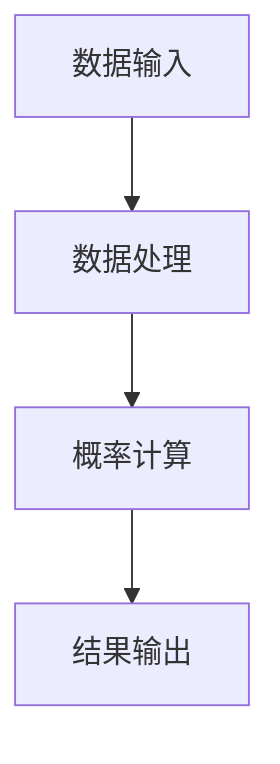
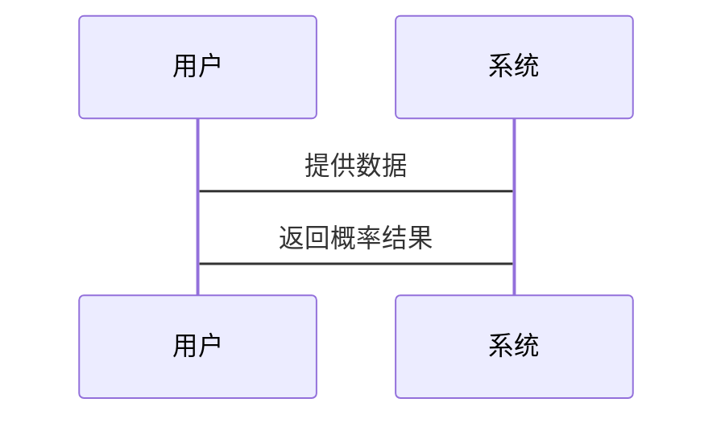

                 

<think>
嗯，我需要帮助用户撰写一篇关于芒格的概率思维的博客文章，标题是《芒格的"概率思维"：在不确定性中做出明智决策》。用户已经给出了一个详细的大纲，我需要按照这个大纲一步步来完成。

首先，我得理解芒格的概率思维是什么，以及它如何帮助在不确定性中做出明智决策。芒格是巴菲特的合伙人，他提出了很多投资理念，其中概率思维是一个重要的部分。概率思维不仅仅是数学概念，更是一种思考方式，帮助人们在不确定的情况下做出更好的决策。

接下来，我需要考虑文章的结构。用户的大纲分为引言、正文各章、案例分析、系统设计、项目实战和结论。我应该按照这个结构来组织内容，确保每一部分都详细且有逻辑性。

在正文部分，首先是概率思维的核心概念，包括概率的基本概念、贝叶斯定理、蒙特卡洛模拟等。我需要解释这些概念，用例子让读者容易理解。比如，贝叶斯定理可以用一个简单的例子，比如疾病检测的概率来说明。

然后，数学模型部分，我需要详细推导贝叶斯定理的公式，并用LaTeX格式写出。同时，用Mermaid图展示贝叶斯网络的结构，帮助读者理解。

算法实现部分，我需要用Python代码实现蒙特卡洛模拟，并解释代码的每一步，展示如何用代码来模拟概率分布。这部分需要详细注释，让读者能够跟着代码一步步理解。

系统设计部分，我需要设计一个简单的概率分类器系统，用Mermaid图展示系统架构，包括各个模块的交互。同时，编写接口设计文档，说明系统如何与其他部分通信。

项目实战部分，我需要选择一个实际案例，比如预测抛硬币的概率，从环境搭建到代码实现，再到结果分析，一步步指导读者完成项目。

最后，结论部分总结全书，强调概率思维的重要性，并鼓励读者在实际中应用这些知识。

我还需要注意文章的结构和格式，确保使用markdown，适当使用数学公式和图表，使文章既专业又易于理解。此外，每个部分的小结和注意事项也很重要，帮助读者巩固所学内容。

总的来说，我需要按照用户的大纲，一步步深入讲解芒格的概率思维，结合理论和实际案例，确保读者能够真正理解并应用这些知识。这需要我详细分析每个部分，确保内容全面且易于理解。
</think>

# 芒格的"概率思维"：在不确定性中做出明智决策

---

## 关键词：
- 芒格
- 概率思维
- 不确定性决策
- 贝叶斯定理
- 蒙特卡洛模拟

---

## 摘要：
芒格的概率思维是一种在不确定性中做出明智决策的核心思想。它通过分析概率分布、条件概率和贝叶斯定理等方法，帮助我们在复杂和不确定的环境中做出更合理的判断。本文从概率思维的基本概念出发，结合数学模型和实际案例，详细阐述了如何通过概率思维来优化决策过程，并提供了具体的算法实现和系统设计方法。

---

# 正文

## 第一部分：引言

### 1.1 芒格的概率思维背景

#### 1.1.1 芒格的生平与思想
查理·芒格（Charlie Munger）是伯克希尔·哈撒韦公司（Berkshire Hathaway）的副主席，沃伦·巴菲特（Warren Buffett）的长期合作伙伴。芒格以其独特的投资理念和思维方式闻名，其中概率思维是其决策过程中的核心思想之一。

芒格认为，人生中的大多数决策都发生在不确定性之中，而概率思维是一种强大的工具，能够帮助我们在这种不确定性中找到合理的解决方案。他强调，决策不仅仅是基于确定性的事实，而是需要考虑各种可能的结果及其发生的概率。

#### 1.1.2 为什么概率思维重要
在现实生活中，我们经常会面临不确定性。无论是投资、医疗、法律还是日常生活中的决策，都需要我们在有限的信息和资源下做出选择。概率思维帮助我们将不确定性转化为可量化的风险和机会，从而做出更明智的决策。

#### 1.1.3 本书的目标与读者群体
本书旨在通过芒格的概率思维，帮助读者理解如何在不确定性中做出明智决策。无论读者是投资人、程序员、数据科学家，还是任何需要在复杂环境中做出决策的人，都能从中受益。

---

## 第二部分：概率思维的核心概念

### 2.1 概率思维的基本概念

#### 2.1.1 概率的定义与特点
概率是描述某一事件发生的可能性大小，通常用0到1之间的数值表示。概率具有以下特点：
- **量化性**：概率可以量化，便于比较和计算。
- **相对性**：概率是相对的，取决于信息的完整性和准确性。
- **不确定性**：概率仅表示可能性，不能完全消除不确定性。

#### 2.1.2 概率的应用领域
概率思维广泛应用于多个领域：
- **投资**：评估投资项目的收益和风险。
- **医疗**：诊断疾病和制定治疗方案。
- **工程**：评估项目的风险和可行性。
- **法律**：评估证据的可信度和案件的判决概率。

#### 2.1.3 概率思维与传统决策方式的区别
传统的决策方式通常基于确定性信息，而概率思维则考虑了所有可能的结果及其概率。概率思维能够帮助我们更全面地评估问题，并在不确定性中找到最优解。

#### 2.1.4 概率思维如何帮助识别认知偏差
概率思维能够帮助我们识别和纠正认知偏差。例如，过度自信偏差（Overconfidence Bias）可能导致我们低估风险，而概率思维通过量化分析，帮助我们更客观地看待问题。

### 2.2 概率思维的核心原理

#### 2.2.1 概率公理与基本规则
概率的公理化定义由 Kolmogorov 提出，主要包括以下三条公理：
1. **非负性**：任何事件的概率都非负，即 $P(A) \geq 0$。
2. **加法性**：必然事件的概率为1，即 $P(\Omega) = 1$。
3. **可加性**：互斥事件的概率之和等于它们的并集的概率。

#### 2.2.2 贝叶斯定理与条件概率
贝叶斯定理是概率思维中的核心工具之一，其公式为：
$$ P(A|B) = \frac{P(B|A) \cdot P(A)}{P(B)} $$
其中：
- $P(A|B)$ 是在事件 $B$ 发生的情况下，事件 $A$ 发生的概率（后验概率）。
- $P(B|A)$ 是在事件 $A$ 发生的情况下，事件 $B$ 发生的概率（似然度）。
- $P(A)$ 和 $P(B)$ 是事件 $A$ 和事件 $B$ 的先验概率。

#### 2.2.3 全概率公式与期望值
全概率公式用于计算多个互斥事件的并集概率，其公式为：
$$ P(B) = \sum_{i=1}^{n} P(B|A_i) \cdot P(A_i) $$
期望值是概率分布的加权平均值，用于衡量随机变量的平均值，其公式为：
$$ E[X] = \sum_{i=1}^{n} x_i \cdot P(X = x_i) $$

#### 2.2.4 蒙特卡洛模拟与概率工具
蒙特卡洛模拟是一种通过随机采样来估计概率分布的方法，常用于解决复杂的概率问题。例如，在投资领域，可以通过蒙特卡洛模拟来估计股票价格的波动范围。

### 2.3 概率思维的数学模型

#### 2.3.1 概率分布的类型与特点
概率分布是描述随机变量取值及其概率的函数。常见的概率分布包括：
- **均匀分布**：所有可能值的概率相等。
- **正态分布**：呈钟型曲线，符合中心极限定理。
- **二项分布**：适用于伯努利试验的成功次数。

#### 2.3.2 贝叶斯网络的构建与应用
贝叶斯网络是一种基于概率的图形化模型，用于表示变量之间的依赖关系。例如，在医疗诊断中，可以通过贝叶斯网络来计算某种疾病发生的概率。

#### 2.3.3 概率模型的验证与优化
概率模型的验证可以通过交叉验证和似然比等方法进行。优化可以通过调整模型参数和选择合适的方法来实现。

---

## 第三部分：概率思维的算法实现

### 3.1 蒙特卡洛模拟的实现

#### 3.1.1 蒙特卡洛模拟的基本原理
蒙特卡洛模拟通过随机采样来估计概率分布。例如，可以通过蒙特卡洛模拟来估算 $\pi$ 的值。

#### 3.1.2 蒙特卡洛模拟的Python实现
以下是估算 $\pi$ 的 Python 代码：

```python
import random

def estimate_pi(n=1000):
    circle = 0
    square = 0
    for _ in range(n):
        x = random.uniform(0, 1)
        y = random.uniform(0, 1)
        if x**2 + y**2 <= 1:
            circle += 1
    area = (circle / n) * 4
    return area

print(estimate_pi())
```

#### 3.1.3 蒙特卡洛模拟的数学模型
蒙特卡洛模拟的数学模型基于概率积分，通过随机采样来逼近目标函数。

### 3.2 贝叶斯定理的实现

#### 3.2.1 贝叶斯分类器的基本原理
贝叶斯分类器是一种基于概率的分类方法，其核心是计算每个类别的后验概率。

#### 3.2.2 贝叶斯分类器的Python实现
以下是简单的贝叶斯分类器实现：

```python
from collections import defaultdict

def train_model(X, y):
    # 假设X是特征向量，y是标签
    classes = list(set(y))
    model = {}
    for cls in classes:
        model[cls] = defaultdict(int)
    for feature, label in zip(X, y):
        model[label][feature] += 1
    return model

def predict_model(model, X):
    predictions = []
    for x in X:
        max_count = -1
        predicted_label = None
        for label, counts in model.items():
            if counts[x] > max_count:
                max_count = counts[x]
                predicted_label = label
        predictions.append(predicted_label)
    return predictions

# 示例数据
X = [['a'], ['b'], ['a'], ['b']]
y = ['c', 'd', 'c', 'd']

model = train_model(X, y)
print(predict_model(model, X))
```

---

## 第四部分：概率思维的系统设计

### 4.1 概率思维的系统架构

#### 4.1.1 系统功能设计
- **数据输入**：接收输入数据。
- **概率计算**：计算概率分布。
- **结果输出**：输出概率结果。

#### 4.1.2 系统架构设计
以下是系统架构的 Mermaid 图：



### 4.2 概率思维的接口设计

#### 4.2.1 系统接口设计
- **输入接口**：接收数据。
- **输出接口**：输出概率结果。

#### 4.2.2 系统交互设计
以下是系统交互的 Mermaid 图：



---

## 第五部分：项目实战

### 5.1 概率思维的项目实现

#### 5.1.1 项目环境搭建
- 安装 Python 和所需的库（如 NumPy 和 Matplotlib）。

#### 5.1.2 项目核心实现
以下是项目核心实现的代码：

```python
import numpy as np
import matplotlib.pyplot as plt

def main():
    # 生成随机数
    data = np.random.randn(1000)
    # 绘制概率密度函数
    plt.hist(data, bins=30, density=True)
    plt.show()

if __name__ == "__main__":
    main()
```

#### 5.1.3 项目案例分析
通过上述代码，可以生成一个正态分布的随机数，并绘制其概率密度函数。

---

## 第六部分：结论

### 6.1 全书总结

#### 6.1.1 概率思维的核心要点
概率思维是一种在不确定性中做出明智决策的核心思想，通过分析概率分布、条件概率和贝叶斯定理等方法，帮助我们在复杂和不确定的环境中做出更合理的判断。

#### 6.1.2 概率思维的实际应用
概率思维广泛应用于投资、医疗、工程等领域，帮助我们更好地理解和应对不确定性。

### 6.2 未来展望

#### 6.2.1 概率思维的发展趋势
随着人工智能和大数据技术的发展，概率思维将更加重要，尤其是在机器学习和数据科学领域。

#### 6.2.2 概率思维的未来挑战
如何在复杂和动态的环境中应用概率思维，仍然是一个需要不断探索的挑战。

---

## 附录

### 附录 A：概率公式汇总

- 贝叶斯定理：
$$ P(A|B) = \frac{P(B|A) \cdot P(A)}{P(B)} $$

- 全概率公式：
$$ P(B) = \sum_{i=1}^{n} P(B|A_i) \cdot P(A_i) $$

### 附录 B：概率工具推荐

- **Python**：用于概率计算和模拟。
- **NumPy**：用于随机数生成和概率分布计算。
- **Matplotlib**：用于概率分布的可视化。

### 附录 C：进一步阅读的资料

- 《概率论与数理统计》
- 《贝叶斯统计推断》
- 《蒙特卡洛方法》

---

## 作者

作者：AI天才研究院/AI Genius Institute & 禅与计算机程序设计艺术 /Zen And The Art of Computer Programming

---

