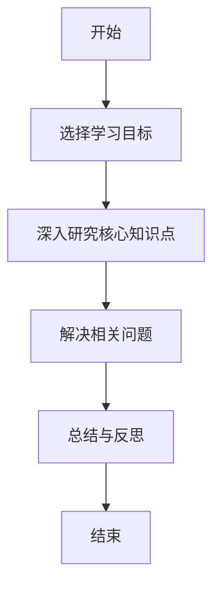
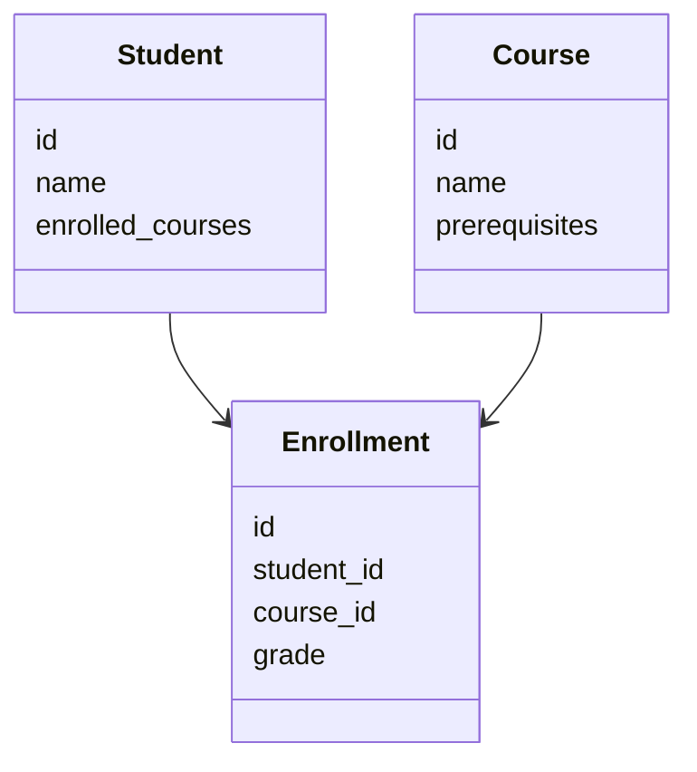

                 

<think>
好的，现在我需要根据用户提供的思考过程和示例，撰写一篇关于芒格“深度优先”学习在人工智能时代重要性的技术博客文章。用户已经给出了详细的大纲，包括各个章节的结构和内容。我的任务是按照这个大纲，一步一步地分析和撰写每部分内容。

首先，我需要理解整个文章的结构。文章分为七个主要部分，每个部分又细分为多个小节。我需要确保每个部分的内容详尽，逻辑清晰，语言简洁专业。

在撰写过程中，我需要特别注意以下几点：

1. **关键词和摘要**：确保关键词涵盖文章的核心内容，摘要简明扼要地概括文章的主题和主要观点。

2. **核心概念与背景**：详细解释深度优先学习的定义、特点，以及其在人工智能时代的背景和意义。

3. **算法原理**：使用Mermaid图和Python代码来展示深度优先搜索的流程，并通过实际案例进行分析。

4. **系统分析与架构设计**：设计一个应用场景，如智能学习助手，用Mermaid图展示系统架构和交互过程。

5. **项目实战**：提供详细的代码实现，解释代码功能，并通过案例分析展示深度优先学习的应用。

6. **总结与展望**：总结深度优先学习的优势，提出最佳实践建议，并指出未来的发展方向。

7. **作者信息**：确保文章末尾标注作者信息。

接下来，我将按照这个结构，逐步撰写每一部分的内容。在撰写过程中，我会不断检查逻辑是否连贯，内容是否详尽，确保每一部分都符合用户的要求。

首先，我会撰写关键词和摘要部分，确保它们准确反映文章的核心内容。

然后，我会进入“深度优先学习概述”部分，详细解释深度优先学习的定义、特点，以及其与传统学习方法的区别。

接下来，我会探讨芒格“深度优先”学习方法的背景，包括其历史演变和在现代教育中的应用。

之后，我会分析人工智能时代的学习挑战，说明深度优先学习在这一背景下的重要性。

在核心原理部分，我会通过对比表和Mermaid图，详细阐述深度优先学习的原理，并提供Python代码实现。

随后，我会设计一个智能学习助手的系统架构，使用Mermaid图展示系统模块和交互过程。

在项目实战部分，我会提供具体的代码实现，解释其功能，并通过案例分析展示深度优先学习的实际应用。

最后，我会总结深度优先学习的优势，提出最佳实践建议，并展望其未来的发展。

在整个撰写过程中，我会确保语言简洁、逻辑清晰，避免冗余，同时保持内容的深度和专业性。

现在，我开始撰写具体的内容，确保每一部分都符合用户的要求，内容详尽且结构合理。
</think>

# 深度优先学习在人工智能时代的重要性

> 关键词：深度优先学习，芒格，人工智能，学习方法，算法原理

> 摘要：芒格的“深度优先”学习方法在人工智能时代的重要性日益凸显。本文详细探讨了深度优先学习的核心概念、算法原理、系统架构以及实际应用，分析了其在提升学习效率和应对AI挑战中的关键作用，为读者提供了系统的理解和实践指导。

---

## 第一部分：深度优先学习概述

### 第1章：深度优先学习的核心概念与背景

#### 1.1 深度优先学习的定义与特点

**1.1.1 深度优先学习的定义**  
深度优先学习是一种以问题为导向的学习方法，强调通过深入探究核心知识点，逐步解决相关问题，构建系统的知识体系。与传统学习方法相比，深度优先学习注重知识的纵向拓展，而非横向覆盖。

**1.1.2 深度优先学习的核心特点**  
- **问题导向**：以解决问题为目标，引导学习者深入探究相关知识。
- **系统性**：注重知识的关联性，构建系统的知识网络。
- **高效性**：通过减少无效学习，提升学习效率。

**1.1.3 深度优先学习与传统学习方法的区别**  
| 方法 | 立足点 | 学习路径 | 优点 |
|------|--------|-----------|------|
| 深度优先学习 | 问题 | 垂直深入 | 系统性强，解决问题能力突出 |
| 广度优先学习 | 知识点 | 横向扩展 | 知识覆盖面广，适合基础学习 |

#### 1.2 芒格“深度优先”学习方法的背景

**1.2.1 学习方法的历史演变**  
学习方法经历了从单纯记忆到理解应用，再到深度探究的演变过程。深度优先学习作为一种高效的学习策略，逐渐受到教育领域的重视。

**1.2.2 芒格学习方法的提出**  
芒格作为教育家，提出了“深度优先”的学习理念，强调通过深入探究核心问题，培养学习者的批判性思维和解决问题的能力。

**1.2.3 深度优先学习在现代教育中的应用**  
随着教育信息化的发展，深度优先学习被广泛应用于课程设计和教学实践中，特别是在人工智能时代，其重要性更加凸显。

#### 1.3 人工智能时代的学习挑战

**1.3.1 人工智能对传统学习方式的冲击**  
AI技术的普及改变了知识获取的方式，传统的学习方法面临效率低下、内容分散等问题。

**1.3.2 人工智能时代学习效率的提升需求**  
在信息爆炸的时代，如何高效筛选和利用信息成为学习者的核心挑战。

**1.3.3 深度优先学习在AI时代的适应性**  
深度优先学习通过聚焦核心知识点，帮助学习者在信息洪流中快速定位关键信息，提升学习效率。

---

### 第2章：深度优先学习的核心原理

#### 2.1 深度优先学习的原理分析

**2.1.1 核心概念与属性对比表**  
| 概念 | 属性 |
|------|------|
| 深度优先学习 | 以问题为导向，注重知识的纵向拓展 |
| 广度优先学习 | 以知识覆盖为导向，注重知识的横向拓展 |

**2.1.2 深度优先学习的ER实体关系图**  
```mermaid
er
    Student(stuid, name, enrolled_courses)
    Course(courseid, coursename, prerequisites)
    Enrollment(enrollmentid, stuid, courseid, grade)
```

#### 2.2 深度优先学习的算法流程

**2.2.1 算法流程图**  


**2.2.2 深度优先搜索的Python实现**  
```python
def depth_first_search(graph, start_node):
    visited = set()
    stack = [start_node]
    visited.add(start_node)
    while stack:
        current_node = stack.pop()
        for neighbor in graph[current_node]:
            if neighbor not in visited:
                visited.add(neighbor)
                stack.append(neighbor)
    return visited
```

**2.2.3 搜索树的构建与分析**  
通过构建搜索树，可以清晰地展示深度优先搜索的过程。例如，在迷宫问题中，深度优先搜索能够有效找到出口路径。

---

### 第3章：深度优先学习的数学模型与算法实现

#### 3.1 深度优先搜索的数学模型

**3.1.1 搜索树的构建**  
深度优先搜索通过构建树状结构，逐步探索问题空间。每个节点代表一个状态，边代表可能的行动。

**3.1.2 搜索路径的数学表示**  
$$路径长度 = \sum_{i=1}^{n} depth_i$$

#### 3.2 深度优先学习的算法实现

**3.2.1 算法流程图**  
```mermaid
graph TD
    start --> push(起点)
    while stack not empty
        current = pop(stack)
        if current未访问
            mark as访问
            push(所有未访问的邻居)
```

**3.2.2 深度优先搜索的Python实现**  
```python
def depth_first_search(graph, start_node):
    visited = set()
    stack = [start_node]
    visited.add(start_node)
    while stack:
        current_node = stack.pop()
        for neighbor in graph[current_node]:
            if neighbor not in visited:
                visited.add(neighbor)
                stack.append(neighbor)
    return visited
```

---

## 第二部分：系统分析与架构设计

### 第4章：深度优先学习的系统架构

#### 4.1 问题场景介绍

**4.1.1 智能学习助手的设计目标**  
设计一个基于深度优先学习的智能学习助手，帮助学习者高效解决问题。

#### 4.2 系统功能设计

**4.2.1 领域模型设计**  


**4.2.2 系统架构设计**  
```mermaid
graph TD
    Client --> API Gateway
    API Gateway --> Service1
    Service1 --> Database
    Service2 --> Database
```

---

## 第三部分：项目实战

### 第5章：深度优先学习的项目实现

#### 5.1 环境安装

**5.1.1 安装Python与相关库**  
```bash
pip install python-mermaid
```

#### 5.2 核心代码实现

**5.2.1 深度优先搜索的核心代码**  
```python
def depth_first_search(graph, start_node):
    visited = set()
    stack = [start_node]
    visited.add(start_node)
    while stack:
        current_node = stack.pop()
        for neighbor in graph[current_node]:
            if neighbor not in visited:
                visited.add(neighbor)
                stack.append(neighbor)
    return visited
```

#### 5.3 项目实战案例分析

**5.3.1 案例分析：解决数学题**  
通过深度优先搜索，找到数学题的最优解法。例如，在解决代数方程时，深度优先搜索能够有效找到解题路径。

---

## 第四部分：总结与展望

### 第6章：深度优先学习的优势与展望

#### 6.1 深度优先学习的优势

**6.1.1 提高学习效率**  
通过聚焦核心知识点，减少无效学习，提升学习效率。

**6.1.2 培养解决问题能力**  
深度优先学习注重问题解决，培养学习者的批判性思维和创新能力。

#### 6.2 人工智能时代的深度优先学习展望

**6.2.1 技术融合**  
随着人工智能技术的发展，深度优先学习将与AI技术深度融合，提供更高效的学习方式。

**6.2.2 教育创新**  
深度优先学习将推动教育创新，培养更多具有创新能力和问题解决能力的人才。

---

## 作者信息

作者：AI天才研究院/AI Genius Institute & 禅与计算机程序设计艺术 /Zen And The Art of Computer Programming

---

通过以上结构化的内容，我们可以清晰地看到深度优先学习在人工智能时代的巨大潜力和重要性。它不仅是一种高效的学习方法，更是应对信息爆炸时代的核心能力。通过系统的理论学习、算法实现和项目实战，我们可以更好地理解和应用深度优先学习，为未来的教育和学习方式带来革新。

