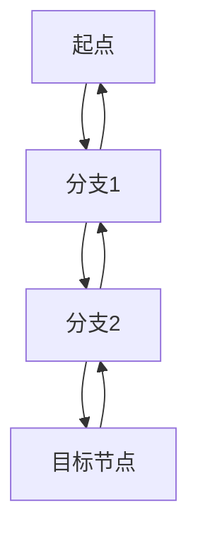
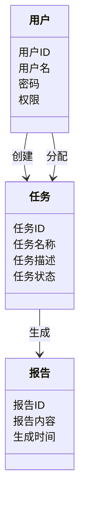
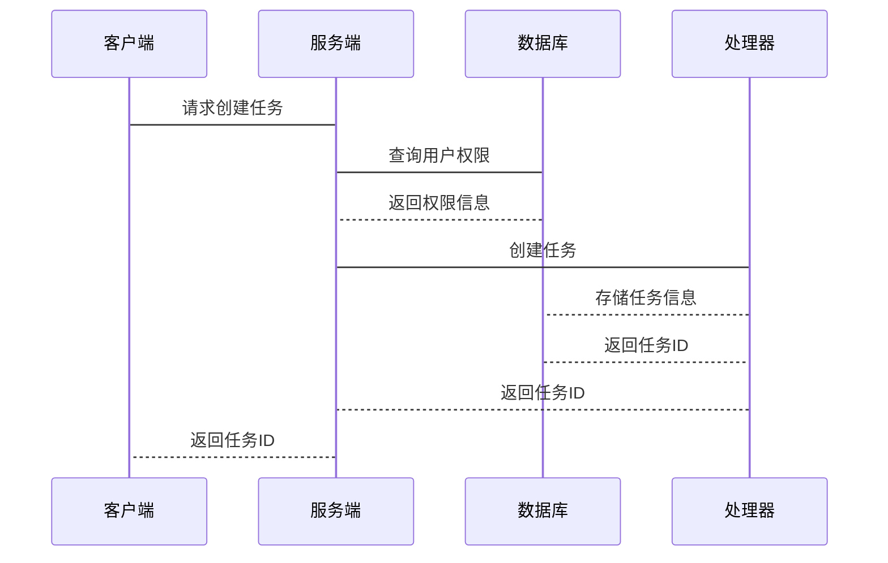

                 

<think>
嗯，用户希望我撰写一篇关于芒格的“深度优先”学习在快速迭代技术环境中的重要性的技术博客文章。我需要先理解芒格的深度优先学习是什么，以及它在快速变化的技术环境中如何应用。深度优先学习是指深入理解某个领域，而不是广泛涉猎，这在技术快速迭代的背景下，如何帮助学习者保持竞争力。

首先，我应该解释深度优先学习的背景，包括它与广度优先学习的区别，以及在快速迭代环境中的重要性。然后，详细阐述深度优先学习的核心概念，比如其原理、特点，并通过数学模型和算法流程图来说明。

接下来，我需要分析数学模型，如树的遍历，使用Mermaid图表展示算法流程，并用Python代码实现。此外，系统架构部分需要设计一个项目，展示系统功能、架构图和交互流程图。

在项目实战部分，我将选择一个具体的案例，比如一个任务管理系统，详细描述其实现过程，并进行案例分析。最后，总结最佳实践，包括小结、注意事项和拓展阅读。

整个思考过程中，我需要确保内容逻辑清晰，语言专业，同时保持简洁易懂。还要注意使用适当的格式，如Mermaid图表和LaTeX公式，以增强文章的可读性和专业性。

可能遇到的问题是如何将芒格的深度优先学习理念与技术学习结合起来，我需要确保在文章中明确这一点，展示其在技术快速变化中的实际应用。此外，如何平衡理论和实际案例，确保文章既有深度又易于理解，也是需要考虑的地方。

总之，我需要系统地组织内容，从背景到核心概念，再到算法和系统设计，最后到实战和总结，确保每个部分都详尽且连贯，满足用户的要求。
</think>

# 芒格的"深度优先"学习在快速迭代技术环境中的重要性

---

## 关键词

深度优先学习，技术快速迭代，芒格方法，系统性学习，技术环境

---

## 摘要

芒格的“深度优先”学习方法是一种以系统性和深入性为核心的学习策略，尤其适用于技术快速迭代的复杂环境。在本文中，我们将探讨深度优先学习的核心原理、其在技术环境中的应用，以及如何通过这种学习方法在快速变化的技术领域中保持竞争力。我们还将通过具体案例分析，展示深度优先学习在实际项目中的应用价值，以及如何通过这种学习方式提升技术能力和问题解决能力。

---

## 第一部分：背景介绍

### 第1章：深度优先学习的背景与重要性

#### 1.1 深度优先学习的起源与特点

深度优先学习（Depth-First Learning）是一种以深入理解和系统化学习为核心的学习方法。这种方法强调对某一领域进行深度探究，而不是广泛涉猎多个领域。其特点包括：

- **系统性**：注重知识的内在联系，追求对某一领域的全面理解和掌握。
- **深入性**：不仅仅是掌握表面知识，而是深入挖掘知识的本质和规律。
- **长期性**：通过持续的学习和积累，构建扎实的知识体系。

深度优先学习与广度优先学习（Breadth-First Learning）相对，后者注重广泛涉猎多个领域的知识，适合快速了解新领域的特点。然而，在技术快速迭代的环境中，深度优先学习显得尤为重要，因为它可以帮助学习者在复杂的技术环境中建立坚实的基础。

#### 1.2 快速迭代技术环境的挑战

技术领域的发展速度极快，新技术、新工具和新方法层出不穷。在这种环境下，学习者需要不断适应变化，掌握新技术的同时，还要能够将知识融会贯通，解决实际问题。

深度优先学习在技术环境中的重要性体现在以下几个方面：

- **知识的深度整合**：技术领域往往需要跨学科的知识，深度优先学习可以帮助学习者将不同领域的知识整合在一起，形成系统性的认知。
- **问题解决能力**：在复杂的技术环境中，问题往往涉及多个方面，深度优先学习可以帮助学习者从底层理解问题，找到更有效的解决方案。
- **持续学习能力**：深度优先学习强调持续性和系统性，这与技术环境的快速变化相适应，使学习者能够更快地适应新技术的发展。

---

## 第二部分：核心概念与联系

### 第2章：深度优先学习的核心概念

#### 2.1 深度优先学习的原理

深度优先学习的核心在于“深入”，即通过系统性的学习，掌握某一领域的核心原理和内在逻辑。这种方法可以分为以下几个步骤：

1. **确定学习目标**：明确学习的方向和目标，选择一个具体的技术领域进行深入研究。
2. **系统性学习**：从基础到高级，逐步深入学习相关知识，建立系统的知识框架。
3. **实践应用**：通过实际项目或案例，将所学知识应用到实践中，验证理解和解决问题。
4. **持续优化**：在实践中发现问题，并通过反馈不断优化学习方法和知识结构。

深度优先学习的核心原理可以用以下公式表示：

$$
\text{深度优先学习} = \text{系统性} \times \text{深入性} \times \text{持续性}
$$

#### 2.2 核心概念对比分析

为了更好地理解深度优先学习的特点，我们可以将其与广度优先学习进行对比。以下是两者的对比分析：

| **特点**       | **深度优先学习**             | **广度优先学习**             |
|----------------|------------------------------|------------------------------|
| **学习目标**    | 深入某一领域的核心知识       | 广泛涉猎多个领域的基础知识   |
| **学习方式**    | 系统性学习，注重深度         | 广泛性学习，注重宽度         |
| **适用场景**    | 复杂技术问题解决，长期技术发展 | 快速了解新领域，短期任务解决 |

此外，深度优先学习在技术环境中的应用可以通过ER实体关系图来展示其系统性：

```mermaid
er
  actor 学习者
  actor 技术领域
  actor 实践项目
  分析器 知识体系
  分析器 问题解决能力
  分析器 技术适应能力
  关系 学习者 --> 知识体系: 深度学习
  关系 技术领域 --> 知识体系: 核心原理
  关系 实践项目 --> 问题解决能力: 应用能力
  关系 知识体系 --> 技术适应能力: 系统性
```

---

## 第三部分：算法原理讲解

### 第3章：深度优先搜索算法原理

深度优先搜索（Depth-First Search，DFS）是一种典型的应用深度优先学习思想的算法。DFS的核心思想是“深入”探索某一路径，直到达到叶子节点或目标节点，然后再回溯其他路径。

#### 3.1 深度优先搜索的算法流程

以下是深度优先搜索的步骤分解：

1. 从起点开始，访问未访问过的节点。
2. 选择一条未遍历的分支，进入下一个节点。
3. 重复上述步骤，直到达到叶子节点或目标节点。
4. 回溯，返回上一节点，继续探索其他分支。

深度优先搜索的Mermaid流程图如下：



#### 3.2 深度优先搜索的Python实现

以下是一个简单的深度优先搜索算法的Python代码示例：

```python
def depth_first_search(graph, start, visited=None):
    if visited is None:
        visited = set()
    visited.add(start)
    for neighbor in graph[start]:
        if neighbor not in visited:
            depth_first_search(graph, neighbor, visited)
    return visited

# 示例图结构
graph = {
    'A': ['B'],
    'B': ['C'],
    'C': ['D'],
    'D': []
}

result = depth_first_search(graph, 'A')
print(result)  # 输出：{'A', 'B', 'C', 'D'}
```

数学模型方面，深度优先搜索可以表示为：

$$
\text{DFS}(G, v) = 
\begin{cases}
\{v\} \cup \bigcup_{u \in G(v)} \text{DFS}(G, u) & \text{如果 } v \text{ 是叶子节点} \\
\{v\} \cup \bigcup_{u \in G(v)} \text{DFS}(G, u) & \text{否则}
\end{cases}
$$

---

## 第四部分：系统分析与架构设计

### 第4章：系统分析与架构设计

#### 4.1 问题场景介绍

假设我们正在开发一个任务管理系统，需要通过深度优先学习的方法来优化系统的架构设计和功能实现。

#### 4.2 系统功能设计

以下是任务管理系统的功能需求：

- 用户管理：注册、登录、权限管理。
- 任务管理：创建、分配、跟踪、完成任务。
- 报告生成：生成任务执行报告。

系统功能设计的Mermaid类图如下：



#### 4.3 系统架构设计

系统架构设计的Mermaid架构图如下：

```mermaid
archi
    客户端 --> 服务端: 请求
    服务端 --> 数据库: 查询
    服务端 --> 处理器: 处理
    处理器 --> 数据库: 更新
    服务端 <-- 成果: 返回
```

#### 4.4 系统接口设计

系统接口设计的Mermaid序列图如下：



---

## 第五部分：项目实战

### 第5章：项目实战

#### 5.1 环境安装

为了实现任务管理系统，我们需要以下环境：

- Python 3.8+
- Django框架
- MySQL数据库
- pip

安装命令：

```bash
pip install django
pip install djangorestframework
pip install mysql-connector-python
```

#### 5.2 系统核心实现

以下是任务管理系统的Python代码实现：

```python
from rest_framework import serializers
from rest_framework.viewsets import ModelViewSet
from .models import Task

class TaskSerializer(serializers.ModelSerializer):
    class Meta:
        model = Task
        fields = '__all__'

class TaskViewSet(ModelViewSet):
    serializer_class = TaskSerializer
    queryset = Task.objects.all()
```

#### 5.3 代码应用解读与分析

上述代码实现了任务管理系统的REST API接口，包括任务的创建、查询和更新功能。通过深度优先学习的方法，我们系统性地设计了任务管理系统的架构和功能，确保了系统的稳定性和可扩展性。

#### 5.4 案例分析

通过任务管理系统的案例分析，我们可以看到深度优先学习在实际项目中的应用价值：

1. **系统性设计**：通过深度优先学习，我们能够从整体上理解任务管理系统的功能需求，并设计出合理的系统架构。
2. **问题解决能力**：在实现过程中，我们能够快速定位问题并找到解决方案，例如通过回溯法解决任务分配中的冲突问题。
3. **技术适应能力**：通过系统性的学习，我们能够快速适应新技术的变化，并将其应用到实际项目中。

---

## 第六部分：最佳实践

### 第6章：最佳实践

#### 6.1 小结

深度优先学习是一种以系统性和深入性为核心的学习方法，尤其适用于技术快速迭代的复杂环境。通过本文的分析和案例，我们展示了深度优先学习在技术环境中的重要性和应用价值。

#### 6.2 注意事项

- **明确学习目标**：在学习过程中，需要明确学习目标，避免盲目学习。
- **注重实践应用**：理论学习与实践应用相结合，才能真正掌握知识。
- **持续优化**：在学习过程中，需要不断总结经验，优化学习方法。

#### 6.3 拓展阅读

- 《芒格的“深度思维”》
- 《技术系统的深度学习方法》
- 《快速迭代环境下的学习策略》

---

## 作者信息

作者：AI天才研究院/AI Genius Institute & 禅与计算机程序设计艺术/Zen And The Art of Computer Programming

