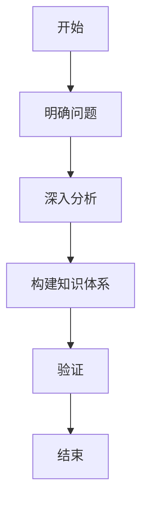
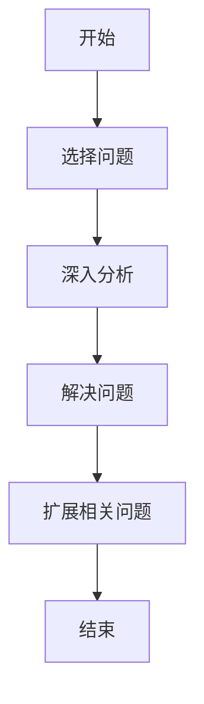
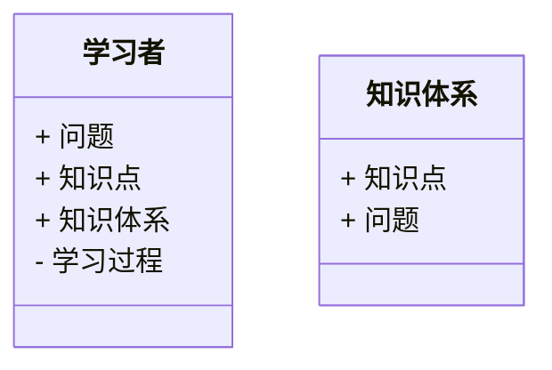

                 


# 芮格的"深度优先"学习方法：培养专业知识

> 关键词：深度优先学习方法，专业知识培养，思维模型，系统性学习策略，学习效率，芒格学习法

> 摘要：本文将详细介绍芒格的“深度优先”学习方法，探讨其在专业知识培养中的应用，分析其核心概念、算法原理、系统架构及实际案例，帮助读者掌握这一高效学习策略。

---

## 第一部分：深度优先学习的背景与核心概念

### 第1章：深度优先学习的背景与问题背景

#### 1.1 深度优先学习的定义与特点

深度优先学习是一种以问题为导向的学习方法，强调从单一问题出发，逐步深入探索其本质和关联问题。其特点是：

- **专注性**：专注于一个问题，逐步深入，避免分散注意力。
- **系统性**：通过问题链，构建知识的系统性框架。
- **实践性**：注重将知识应用于实际问题，强化理解和记忆。

#### 1.2 深度优先学习的背景与问题背景

传统学习方法往往以知识点为中心，容易导致知识碎片化。深度优先学习则以问题为中心，通过解决实际问题，构建知识的深度和广度。

- **问题背景**：当前学习方法的局限性，如知识碎片化、缺乏系统性。
- **学习目标**：通过深度优先学习，培养专业知识，提升问题解决能力。

#### 1.3 深度优先学习的核心要素与概念结构

深度优先学习的核心要素包括：

- **问题背景**：明确学习目标和问题。
- **问题描述**：详细描述问题。
- **问题解决**：通过逐步深入，解决问题并构建知识体系。

---

## 第二部分：深度优先学习的核心概念与联系

### 第2章：深度优先学习的核心概念原理

#### 2.1 核心概念原理

深度优先学习的核心原理是通过问题驱动，构建知识的深度和广度。其逻辑框架包括：

- **问题驱动**：从问题出发，逐步深入。
- **知识关联**：将新知识与已有知识联系起来。
- **实践验证**：通过实践验证知识的正确性。

#### 2.2 核心概念属性特征对比表格

| 特性                | 深度优先学习        | 传统学习            |
|---------------------|---------------------|--------------------|
| 学习方式            | 问题驱动            | 知识点为中心        |
| 知识结构            | 系统性、深度性      | 碎片化、零散性      |
| 学习效果            | 高效、系统性        | 低效、碎片化        |

#### 2.3 实体关系图（ER图）与流程图

以下是深度优先学习的ER图和流程图：

```mermaid
erDiagram
    actor 学习者 {
        string 问题
        string 知识点
    }
    knowledge 知识体系 {
        string 知识点
        string 问题
    }
    学习者 -> knowledge : 驱动问题
    学习者 -> knowledge : 构建系统性知识
```



---

## 第三部分：深度优先学习的算法原理与数学模型

### 第3章：深度优先学习的算法原理

#### 3.1 算法原理

深度优先学习的算法原理可以看作是一种递归过程，如下：



#### 3.2 数学模型与公式

深度优先学习的数学模型可以用图论中的树结构表示，每个问题是一个节点，相关问题则是其子节点。例如：

$$\text{问题} \rightarrow \text{子问题}_1 \rightarrow \text{子问题}_2 \rightarrow \cdots$$

#### 3.3 举例说明

假设我们要学习“人工智能”，可以按照以下步骤进行：

1. 明确问题：什么是人工智能？
2. 深入分析：人工智能的定义、核心技术和应用领域。
3. 解决问题：理解人工智能的基本概念。
4. 扩展相关问题：机器学习、深度学习、自然语言处理等。

---

## 第四部分：深度优先学习的系统分析与架构设计

### 第4章：深度优先学习的系统分析与架构设计

#### 4.1 问题场景介绍

深度优先学习的目标是构建系统性知识体系，解决实际问题。

#### 4.2 系统功能设计

以下是深度优先学习的系统功能模块划分：



#### 4.3 系统架构设计

以下是深度优先学习的系统架构图：

```mermaid
graph TD
    学习者 --> 知识体系 : 构建系统性知识
    学习者 --> 知识体系 : 解决实际问题
```

---

## 第五部分：深度优先学习的项目实战

### 第5章：深度优先学习的项目实战

#### 5.1 环境安装与配置

安装Python环境，配置必要的库，如`mermaid`。

#### 5.2 核心实现源代码

以下是深度优先学习算法的Python实现代码：

```python
def depth_first_learning(problems):
    for problem in problems:
        analyze(problem)
        solve(problem)
        expand(problem)

def analyze(problem):
    print(f"分析问题：{problem}")

def solve(problem):
    print(f"解决问题：{problem}")

def expand(problem):
    print(f"扩展问题：{problem}")
```

#### 5.3 实际案例分析

案例：学习“编程基础”。

1. 明确问题：什么是编程？
2. 深入分析：编程语言、语法、数据结构。
3. 解决问题：理解编程的基本概念。
4. 扩展相关问题：Python、Java、C++等。

#### 5.4 项目小结

深度优先学习通过问题驱动，帮助我们构建系统性知识，提升解决问题的能力。

---

## 第六部分：深度优先学习的最佳实践与注意事项

- **最佳实践**：从简单问题开始，逐步深入，注重实践。
- **注意事项**：避免过于专注于单一问题，定期回顾和总结。

---

## 作者：AI天才研究院/AI Genius Institute & 禅与计算机程序设计艺术 /Zen And The Art of Computer Programming

---

以上是《芒格的"深度优先"学习方法：培养专业知识》的完整内容，感谢您的阅读！

