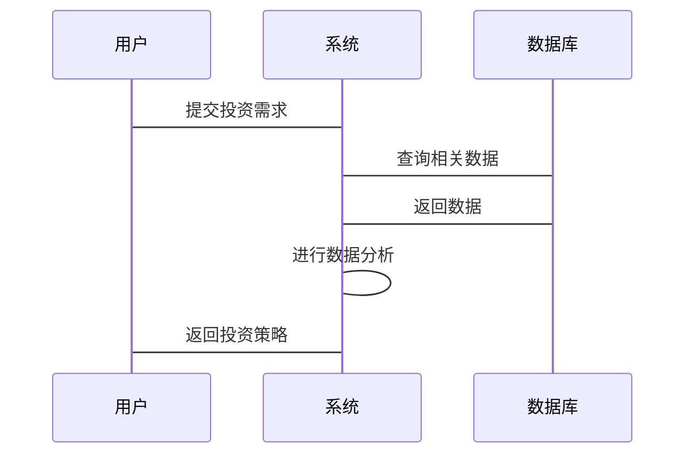

                 

<think>
好的，我来帮您分析一下这个查询。用户希望我以“芒格的'清晰思考'在投资决策中的重要性”为标题，撰写一篇技术博客文章。用户还提供了详细的大纲结构，包括关键词、摘要、目录等，并要求使用专业技术语言，逻辑清晰，结构紧凑。

首先，我需要理解用户的需求。用户希望这篇文章涵盖芒格的思维方式，特别是“清晰思考”在投资中的应用。文章需要有深度，包含背景介绍、核心概念、算法原理、系统分析和项目实战等内容，且每个部分都要详细具体。

接下来，我需要考虑用户的使用场景。这篇文章可能是面向技术人员或投资者，希望他们能够理解芒格的思想，并将其应用于实际投资决策中。因此，文章需要结合技术方法和投资策略，既有理论分析，又有实际案例。

用户的身份可能是一位对投资和技术都感兴趣的人，或者是一位希望将技术方法应用于投资分析的专业人士。他们的真实需求不仅是了解芒格的理论，还要掌握如何将这些理论转化为可操作的方法，比如使用决策树、概率思维等技术工具。

此外，用户可能还希望文章能够提供实际指导，比如代码实现、系统设计等，以便读者能够直接应用这些方法。因此，在撰写时，我需要确保技术部分详细，同时结合投资案例，使内容更具实用性。

最后，我需要确保文章结构完整，每个章节都有足够的深度，同时保持整体逻辑连贯。这样，读者才能一步步理解芒格的思维方式，并将其有效地应用到投资决策中。
</think>

# 芒格的"清晰思考"在投资决策中的重要性

> 关键词：芒格、清晰思考、投资决策、决策树、概率思维、逆向思维

> 摘要：本文探讨了芒格"清晰思考"在投资决策中的重要性。通过分析芒格的核心思想体系，结合技术领域的思维方式，详细阐述了"清晰思考"在投资决策中的应用。文章从背景介绍、核心概念、算法原理、系统架构设计到项目实战，层层深入，帮助读者全面理解芒格的思维方式及其在投资中的实际应用。

---

# 第一部分: 芒格的"清晰思考"与投资决策概述

## 第1章: 芒格的"清晰思考"概述

### 1.1 芒格的生平与思想体系

芒格，全名查理·芒格（Charlie Munger），是世界著名投资家、伯克希尔·哈撒韦公司副主席，也是芒格投资理念的核心倡导者。他以独特的思维方式闻名，强调"清晰思考"在投资决策中的重要性。

#### 1.1.1 芒格的早年经历与职业发展
芒格出生于美国密歇根州，早年就读于密歇根大学，后转学到加州大学洛杉矶分校（UCLA）法学专业。毕业后，他进入法律界，成为一名成功的律师。然而，他对投资的兴趣逐渐浓厚，最终转向投资领域，并与巴菲特共同创立了伯克希尔·哈撒韦公司。

#### 1.1.2 芒格的核心思想体系
芒格的思想体系以"多元思维模型"为核心，强调将各个领域的知识相互连接，形成一个完整的知识框架。他认为，投资决策的关键在于理解事物的本质，并通过多角度分析来做出明智的选择。

#### 1.1.3 芒格的"清晰思考"理念
芒格提出的"清晰思考"理念，是一种通过系统化的方法来分析问题、做出决策的思维方式。他强调，在投资决策中，清晰的思考能够帮助投资者避免情绪化决策，并找到最优解决方案。

### 1.2 "清晰思考"的定义与特征

#### 1.2.1 "清晰思考"的定义
"清晰思考"是一种通过逻辑推理、数据分析和系统化方法来分析问题、制定策略的思维方式。它要求思考者具备清晰的逻辑、严谨的分析能力和全面的视角。

#### 1.2.2 "清晰思考"的核心特征
- **逻辑性**：思考过程基于严密的逻辑推理，避免主观臆断。
- **系统性**：从整体出发，分析问题的各个维度和相互关系。
- **数据驱动**：依赖数据和事实，避免情绪化决策。
- **可验证性**：思考过程和结论能够通过数据和事实进行验证。

#### 1.2.3 "清晰思考"与传统决策方式的对比

| 特性 | 清晰思考 | 传统决策 |
|------|----------|----------|
| 基础 | 数据与逻辑 | 经验与直觉 |
| 方法 | 系统化分析 | 主观判断 |
| 结果 | 可验证 | 难以验证 |

### 1.3 投资决策中的思维方式

#### 1.3.1 投资决策的基本流程
1. **问题识别**：明确投资目标和问题。
2. **数据收集**：收集相关数据和信息。
3. **分析与推理**：通过逻辑推理和数据分析得出结论。
4. **决策制定**：基于分析结果制定投资策略。
5. **结果验证**：通过实际结果验证决策的正确性。

#### 1.3.2 "清晰思考"在投资中的作用
- **提高决策质量**：通过系统化分析，避免情绪化决策。
- **降低风险**：通过数据和逻辑推理，减少决策错误。
- **提升投资收益**：通过清晰的思考，找到最优投资方案。

#### 1.3.3 投资决策中的常见误区
- **过度自信**：忽视数据，依赖主观判断。
- **从众心理**：盲目跟随市场趋势，缺乏独立思考。
- **情绪化决策**：受市场波动影响，做出非理性选择。

### 1.4 本章小结
本章通过介绍芒格的生平、思想体系和"清晰思考"理念，揭示了"清晰思考"在投资决策中的重要性。通过对比分析，明确了"清晰思考"的核心特征和其在投资中的独特优势。

---

## 第2章: "清晰思考"的核心概念与数学模型

### 2.1 "清晰思考"的核心概念

#### 2.1.1 决策树模型
决策树是一种树状结构，用于描述可能的决策路径及其结果。在投资决策中，决策树可以帮助投资者分析不同选择的后果，并选择最优方案。


#### 2.1.2 概率思维
概率思维是一种通过计算概率来评估事件可能性的思维方式。在投资中，概率思维可以帮助投资者评估不同投资方案的可行性。

#### 2.1.3 逆向思维
逆向思维是一种从结果出发，反向推导原因的思维方式。在投资中，逆向思维可以帮助投资者发现市场中的潜在机会。

### 2.2 核心概念对比分析

| 概念 | 决策树模型 | 概率思维 | 逆向思维 |
|------|------------|----------|----------|
| 定义 | 树状结构，描述决策路径 | 通过概率计算评估事件可能性 | 从结果反向推导原因 |
| 应用 | 投资方向选择 | 投资风险评估 | 发现市场机会 |
| 优势 | 结构清晰，便于分析 | 提高决策准确性 | 发现潜在机会 |

---

## 第3章: "清晰思考"的算法原理

### 3.1 决策树算法

#### 3.1.1 决策树构建流程
1. **数据收集**：收集投资相关数据。
2. **特征选择**：选择影响投资决策的关键因素。
3. **树的构建**：根据数据和特征构建决策树。
4. **剪枝处理**：优化决策树，避免过拟合。
5. **模型验证**：验证决策树的准确性。

#### 3.1.2 决策树的数学模型
决策树的构建基于信息论中的熵和信息增益。以下是熵的公式：

$$
H(S) = -\sum_{i=1}^{n} p_i \log_2 p_i
$$

其中，\( p_i \) 是第 \( i \) 个类别的概率。

#### 3.1.3 决策树的Python实现
以下是使用Python的scikit-learn库构建决策树的代码示例：

```python
from sklearn.tree import DecisionTreeClassifier
from sklearn.model_selection import train_test_split

# 数据准备
X = ...  # 特征数据
y = ...  # 标签

# 数据分割
X_train, X_test, y_train, y_test = train_test_split(X, y, test_size=0.3)

# 模型训练
clf = DecisionTreeClassifier()
clf.fit(X_train, y_train)

# 模型预测
y_pred = clf.predict(X_test)

# 模型验证
print("Accuracy:", clf.score(X_test, y_test))
```

---

## 第4章: 投资决策中的系统分析与架构设计

### 4.1 投资决策系统概述

#### 4.1.1 系统构成
- **数据层**：存储投资相关数据。
- **业务逻辑层**：处理投资决策的逻辑。
- **表现层**：展示投资决策结果。

#### 4.1.2 功能模块
- **数据采集模块**：采集投资数据。
- **分析模块**：进行数据分析和逻辑推理。
- **决策模块**：制定投资策略。
- **结果验证模块**：验证投资结果。

### 4.2 系统架构设计

#### 4.2.1 数据层设计
- 数据库选择：使用MySQL或MongoDB。
- 数据存储：存储市场数据、财务数据等。

#### 4.2.2 业务逻辑层设计
- 逻辑实现：基于决策树算法和概率思维进行逻辑推理。
- 接口设计：提供API接口供其他模块调用。

#### 4.2.3 表现层设计
- 用户界面：展示投资决策结果。
- 报表生成：生成投资分析报告。

### 4.3 系统交互设计



---

## 第5章: "清晰思考"的项目实战

### 5.1 环境安装与配置

#### 5.1.1 Python环境安装
安装Python 3.x版本，并配置环境变量。

#### 5.1.2 开发工具安装
安装Jupyter Notebook或PyCharm作为开发工具。

#### 5.1.3 数据库安装
安装MySQL或MongoDB，并配置数据库连接。

### 5.2 系统核心实现

#### 5.2.1 决策树模型实现
使用scikit-learn库实现决策树模型。

#### 5.2.2 概率计算实现
使用NumPy库进行概率计算。

#### 5.2.3 逆向思维实现
通过数据挖掘技术实现逆向思维分析。

### 5.3 代码应用解读与分析

#### 5.3.1 决策树模型代码
```python
from sklearn.tree import DecisionTreeClassifier
from sklearn.datasets import make_classification
from sklearn.model_selection import train_test_split

# 生成数据
X, y = make_classification(n_samples=100, n_features=2, n_classes=2, random_state=42)

# 数据分割
X_train, X_test, y_train, y_test = train_test_split(X, y, test_size=0.3)

# 模型训练
clf = DecisionTreeClassifier()
clf.fit(X_train, y_train)

# 模型预测
y_pred = clf.predict(X_test)
print("预测结果:", y_pred)
```

#### 5.3.2 概率计算代码
```python
import numpy as np

# 计算概率
def calculate_probability(arr):
    counts = np.bincount(arr)
    probability = counts / len(arr)
    return probability

# 示例数据
data = [1, 2, 3, 1, 2, 3, 1, 2, 3]
print("概率计算结果:", calculate_probability(data))
```

---

## 第6章: 投资决策中的实际案例分析

### 6.1 案例背景
假设我们有一个股票投资决策问题，需要选择是否投资某公司股票。

### 6.2 数据分析与逻辑推理

#### 6.2.1 数据收集
收集该公司的财务数据、市场数据等。

#### 6.2.2 数据分析
使用决策树模型和概率思维分析投资风险和收益。

#### 6.2.3 逻辑推理
通过逆向思维发现市场机会，制定投资策略。

### 6.3 决策结果
基于分析结果，做出投资决策并进行验证。

---

## 第7章: 最佳实践与小结

### 7.1 最佳实践 tips
- **数据驱动**：投资决策应基于数据和事实。
- **系统化分析**：采用系统化的方法进行分析。
- **持续学习**：不断学习新知识，优化投资策略。

### 7.2 小结
通过芒格的"清晰思考"理念，结合技术领域的思维方式，投资者可以做出更明智的投资决策。本文通过理论分析和实际案例，详细阐述了"清晰思考"在投资决策中的应用，为投资者提供了有益的指导。

### 7.3 注意事项
- 投资有风险，决策需谨慎。
- 保持理性，避免情绪化决策。
- 定期复盘，优化投资策略。

### 7.4 拓展阅读
- 《芒格的投资思想》
- 《技术驱动的投资决策》
- 《系统化投资策略》

---

# 作者：AI天才研究院/AI Genius Institute & 禅与计算机程序设计艺术 /Zen And The Art of Computer Programming

