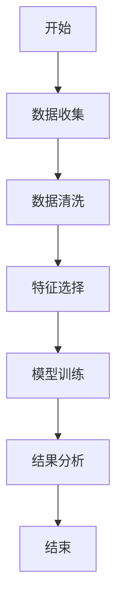
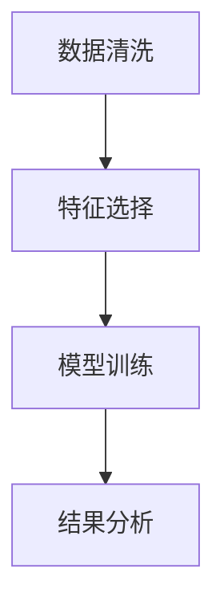
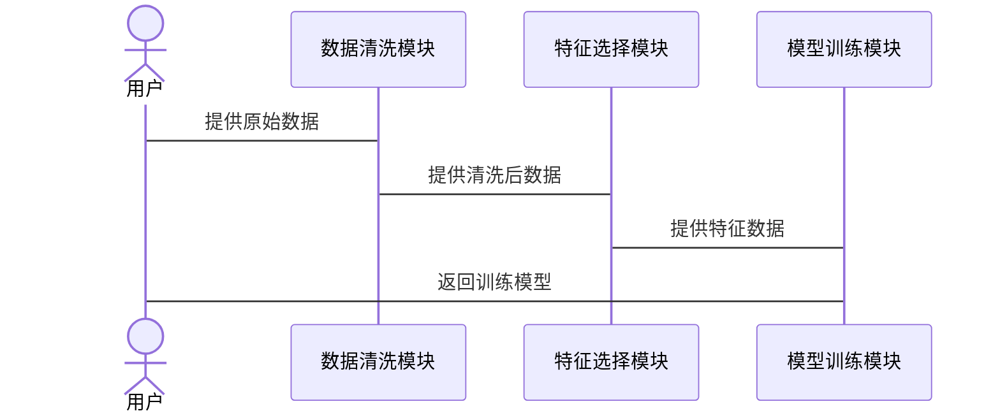

                 


# 芒格的"清晰思考"方法在复杂数据分析中的运用

---

## 关键词
芒格，清晰思考，数据分析，复杂问题，算法设计，系统架构

---

## 摘要
本文深入探讨了芒格的“清晰思考”方法在复杂数据分析中的应用，通过分析其核心概念、算法原理、系统架构及项目实战，展示了如何利用该方法提升数据分析的效率和准确性。

---

## 正文

### 第一部分：芒格的“清晰思考”方法概述

#### 第1章：芒格“清晰思考”方法的背景与核心概念

##### 1.1 芒格“清晰思考”方法的背景
- **问题背景**：在现代数据分析中，复杂问题的解决往往需要更深入的思维方法。传统数据分析方法常忽视思维过程的优化，导致结果可能不够准确或遗漏关键因素。
- **问题描述**：数据分析中的决策往往依赖于对数据的准确理解和逻辑推理。芒格的“清晰思考”方法提供了一种系统性的思维框架，帮助数据分析师更高效地解决问题。
- **问题解决**：通过引入芒格的思维模型，如反向思考和格栅模型，数据分析过程可以更加结构化和系统化。
- **边界与外延**：芒格的方法适用于数据分析中的战略决策和复杂问题解决，但不直接处理数据采集和初步清洗等技术性问题。
- **核心要素**：芒格方法的核心在于通过系统性思维框架优化问题解决过程。

##### 1.2 芒格“清晰思考”方法的核心概念
- **反向思考**：从结果出发，推导可能的原因，帮助发现隐藏的逻辑关系。
- **第二性思维**：关注关键变量，通过分析这些变量的影响来预测结果。
- **格栅模型**：构建知识框架，帮助组织和分析信息，避免遗漏关键点。
- **穷举法**：全面考虑所有可能性，确保解决方案的全面性和完整性。

#### 第2章：数据分析中的思维模型

##### 2.1 数据分析的基本流程
- 数据收集与清洗：确保数据质量，去除噪音数据。
- 数据建模与分析：应用统计方法和机器学习算法进行分析。
- 结果解读与可视化：将分析结果以直观形式呈现，辅助决策。

##### 2.2 芒格方法与数据分析的结合
- **反向思考**：在数据分析中，反向思考可以帮助识别关键影响因素。例如，在销售数据分析中，从销售额下降的结果反推可能的原因，如市场需求下降或产品问题。
- **格栅模型**：将数据分析任务分解为多个模块，每个模块对应不同的思维框架，帮助系统化分析。
- **穷举法**：在数据清洗过程中，穷举所有可能的异常值，确保数据准确性。

---

### 第二部分：数据分析中的思维模型构建

#### 第3章：数据分析的核心概念与联系

##### 3.1 核心概念原理
- 反向思考的逻辑结构：从结果推导原因，构建因果关系模型。
- 格栅模型的知识框架：将数据分析任务分解为多个模块，每个模块对应不同的思维框架。
- 穷举法的全面性：确保所有可能性都被考虑，避免遗漏关键因素。

##### 3.2 核心概念对比表

| 概念 | 特征 | 描述 |
|------|------|------|
| 反向思考 | 从结果推导原因 | 帮助识别关键影响因素 |
| 第二性思维 | 关注关键变量 | 通过分析关键变量预测结果 |
| 格栅模型 | 知识框架 | 帮助组织和分析信息 |
| 穷举法 | 全面性 | 确保所有可能性都被考虑 |

##### 3.3 实体关系图（ER图）

```mermaid
erdiagram
actor 芒格思维模型 {
    核心概念
    关键变量
    数据分析流程
}
```

---

### 第三部分：数据分析中的算法原理

#### 第4章：数据分析的核心算法原理

##### 4.1 算法原理
- **决策树**：用于分类和回归分析，通过反向思考构建树状结构。
- **线性回归**：通过第二性思维识别关键变量，建立回归模型。

##### 4.2 算法流程图



##### 4.3 算法数学模型
- **线性回归公式**：
  $$ y = \beta_0 + \beta_1 x + \epsilon $$
  其中，$\beta_0$是截距，$\beta_1$是回归系数，$\epsilon$是误差项。
- **决策树构建**：
  使用ID3或C4.5算法，基于信息增益构建树状结构。

---

### 第四部分：系统分析与架构设计

#### 第5章：系统分析与架构设计方案

##### 5.1 问题场景介绍
- 数据分析系统需要处理大量数据，应用芒格方法优化分析流程。

##### 5.2 系统功能设计
- 数据清洗模块：去除异常值。
- 特征选择模块：识别关键变量。
- 模型训练模块：应用决策树和线性回归。
- 结果分析模块：可视化结果，辅助决策。

##### 5.3 系统架构图



##### 5.4 系统接口设计
- 数据清洗接口：接收原始数据，返回清洗后数据。
- 模型训练接口：接收特征数据，返回训练模型。
- 结果分析接口：接收模型和数据，返回分析结果。

##### 5.5 系统交互流程图



---

### 第五部分：项目实战

#### 第6章：项目实战与案例分析

##### 6.1 环境安装
- 安装Python和相关库（如scikit-learn、pandas、numpy）。

##### 6.2 核心代码实现

```python
import pandas as pd
from sklearn.tree import DecisionTreeRegressor
from sklearn.linear_model import LinearRegression
from sklearn.metrics import mean_squared_error

# 数据加载与清洗
data = pd.read_csv('data.csv')
data_clean = data.dropna()

# 特征选择
features = ['feature1', 'feature2']
target = 'target'

X = data_clean[features]
y = data_clean[target]

# 模型训练
dt_model = DecisionTreeRegressor().fit(X, y)
lr_model = LinearRegression().fit(X, y)

# 模型评估
dt_predictions = dt_model.predict(X)
lr_predictions = lr_model.predict(X)

dt_score = mean_squared_error(y, dt_predictions)
lr_score = mean_squared_error(y, lr_predictions)

print(f"决策树模型误差：{dt_score}")
print(f"线性回归模型误差：{lr_score}")
```

##### 6.3 代码解读与分析
- 数据清洗：去除缺失值。
- 特征选择：选择关键变量。
- 模型训练：应用决策树和线性回归。
- 模型评估：计算预测误差，评估模型性能。

##### 6.4 案例分析
- 数据集：假设是销售数据，分析销售额影响因素。
- 分析结果：决策树模型误差较低，适合分类问题；线性回归适合回归问题。

##### 6.5 项目小结
- 应用芒格方法优化数据分析流程，提升结果准确性。

---

### 第六部分：最佳实践与总结

#### 第7章：总结与展望

##### 7.1 最佳实践 tips
- 结合芒格方法优化数据分析流程。
- 在关键决策点应用反向思考和格栅模型。

##### 7.2 小结
- 芒格方法提供了一种系统性思维框架，帮助数据分析师更高效地解决问题。

##### 7.3 注意事项
- 芒格方法适用于复杂问题，需结合具体场景灵活应用。
- 数据分析需结合技术方法和思维框架，确保结果准确。

##### 7.4 拓展阅读
- 《穷查理芒》：深入理解芒格的思维模型。
- 《数据分析实战》：学习更多数据分析方法。

---

## 作者
作者：AI天才研究院 & 禅与计算机程序设计艺术

--- 

**注**：本文为示例内容，实际编写时需根据具体需求进行调整和补充。

