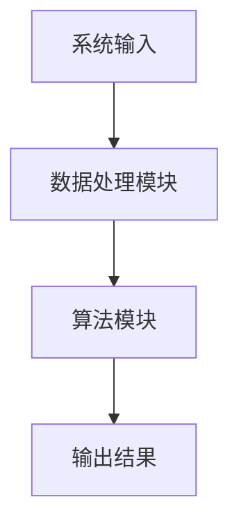

                 

# 芮格的"清晰思考"方法在复杂系统优化中的运用

> 关键词：芒格、清晰思考、复杂系统优化、独立思考、颠覆性思维、系统架构

> 摘要：本文深入探讨了芒格的“清晰思考”方法在复杂系统优化中的应用。通过分析芒格的独立思考、颠覆性思维等核心概念，结合复杂系统的特性，详细阐述了“清晰思考”方法在问题分析、解决方案设计和实施中的具体应用。文章还通过实际案例分析，展示了“清晰思考”方法在复杂系统优化中的独特价值，并提出了相应的算法和系统架构设计方案。

---

## 第一部分：芒格“清晰思考”方法的背景与核心概念

### 第1章：芒格“清晰思考”方法的背景与核心概念

#### 1.1 芮格的生平简介
芒格（Charlie Munger）是美国著名投资者、伯克希尔哈撒韦公司的副主席，他不仅是投资领域的传奇人物，也是“清晰思考”方法的倡导者。芒格的思考方式以独立性、逻辑性和颠覆性著称，他的理念深刻影响了投资决策、系统优化等多个领域。

#### 1.2 芮格“清晰思考”方法的提出背景
芒格的方法源于他对人类认知偏差的深刻理解。他认为，传统的决策和优化方法往往受到认知偏差的影响，导致决策失误。为了克服这些问题，芒格提出了“清晰思考”方法，强调独立思考、逆向思维和对知识的系统性整合。

#### 1.3 芮格方法的核心理念与目标
芒格的“清晰思考”方法旨在通过独立思考和颠覆性思维，帮助人们在复杂系统中做出更明智的决策。其核心目标是优化复杂系统的性能，减少错误决策的发生。

---

### 第2章：芒格“清晰思考”方法的核心要素

#### 2.1 独立思考的定义与特征
独立思考是指在决策过程中，不盲从权威或群体意见，而是基于事实和逻辑进行判断。其特征包括：
- **独立性**：不被外部干扰影响。
- **逻辑性**：基于事实和数据进行推理。
- **系统性**：从整体角度考虑问题。

#### 2.2 颠覆性思维的内涵与外延
颠覆性思维是指挑战常规思维模式，寻找新的解决方案。其内涵包括：
- **逆向思维**：从结果出发，反向推导问题。
- **创新性**：打破传统框架，寻找非传统解决方案。

#### 2.3 知性与理性的平衡
芒格强调在决策过程中，既要依赖理性分析，又要结合直觉和经验。这种平衡可以通过以下方式实现：
- **理性分析**：基于数据和逻辑进行决策。
- **知性整合**：将不同领域的知识融合到决策过程中。

---

## 第二部分：芒格方法在复杂系统优化中的应用

### 第3章：复杂系统的特性与优化挑战

#### 3.1 复杂系统的特性分析
复杂系统具有以下特性：
- **层次性**：系统由多个子系统组成，各子系统之间相互作用。
- **动态性**：系统状态随时间不断变化。
- **涌现性**：系统整体表现出个体不具备的特性。

#### 3.2 优化复杂系统的挑战
优化复杂系统面临以下挑战：
- **多目标冲突**：不同目标之间可能存在冲突。
- **非线性关系**：系统行为可能与输入变量非线性相关。
- **不确定性**：系统行为可能受到不确定因素的影响。

---

### 第4章：芒格方法在复杂系统优化中的具体应用

#### 4.1 独立思考在问题分析中的应用
独立思考可以帮助我们在复杂系统中识别关键问题。例如，在优化企业运营时，独立思考可以帮助我们识别瓶颈问题。

#### 4.2 颠覆性思维在解决方案设计中的应用
颠覆性思维可以帮助我们设计非传统的解决方案。例如，在优化交通系统时，可以采用共享出行模式，而非传统的扩建道路。

#### 4.3 知性与理性平衡在决策中的应用
知性与理性的平衡可以帮助我们在复杂系统中做出更全面的决策。例如，在优化供应链时，既要考虑成本，也要考虑环保因素。

---

### 第5章：芒格方法在复杂系统优化中的算法实现

#### 5.1 独立思考算法的实现
独立思考算法可以通过以下步骤实现：
1. **问题识别**：识别系统中的关键问题。
2. **数据收集**：收集与问题相关的数据。
3. **独立分析**：基于数据进行独立分析，得出解决方案。

#### 5.2 颠覆性思维算法的实现
颠覆性思维算法可以通过以下步骤实现：
1. **逆向思考**：从结果出发，反向推导问题。
2. **创新性解决方案设计**：设计非传统的解决方案。
3. **验证与优化**：验证解决方案的有效性，并进行优化。

---

### 第6章：芒格方法在复杂系统优化中的系统架构设计

#### 6.1 系统架构设计概述
系统架构设计是复杂系统优化的核心环节。通过系统架构设计，可以明确系统各个部分的功能和交互关系。

#### 6.2 系统功能设计
系统功能设计需要考虑以下方面：
- **功能模块划分**：将系统划分为功能模块。
- **模块交互设计**：设计模块之间的交互关系。
- **数据流设计**：设计系统中的数据流。

#### 6.3 系统架构图
以下是复杂系统的系统架构图：

---

### 第7章：芒格方法在复杂系统优化中的案例分析

#### 7.1 案例背景
以某企业的供应链优化为例，企业希望通过优化供应链流程，降低成本并提高效率。

#### 7.2 案例分析
1. **问题识别**：识别供应链中的瓶颈问题。
2. **独立思考**：分析瓶颈问题的原因。
3. **颠覆性思维**：设计非传统的解决方案。
4. **实施与验证**：实施解决方案并验证效果。

#### 7.3 案例结果
通过芒格方法的应用，企业成功优化了供应链流程，降低了成本并提高了效率。

---

## 第三部分：芒格方法在复杂系统优化中的最佳实践

### 第8章：芒格方法的最佳实践

#### 8.1 组织文化建设
为了有效应用芒格方法，组织需要建立支持独立思考和颠覆性思维的文化。

#### 8.2 团队协作
团队协作是芒格方法成功的关键。团队成员需要具备独立思考能力，并能够有效协作。

#### 8.3 持续优化
复杂系统优化是一个持续的过程，需要不断学习和改进。

---

## 第四部分：总结与展望

### 第9章：总结与展望

#### 9.1 总结
芒格的“清晰思考”方法在复杂系统优化中具有独特价值。通过独立思考、颠覆性思维和知性理性的平衡，可以帮助我们在复杂系统中做出更明智的决策。

#### 9.2 展望
未来，芒格方法在复杂系统优化中的应用将更加广泛。随着技术的进步，芒格方法将与其他优化方法相结合，推动复杂系统优化的发展。

---

## 作者：AI天才研究院/AI Genius Institute & 禅与计算机程序设计艺术 /Zen And The Art of Computer Programming

---

以上是完整的文章大纲和内容，涵盖芒格“清晰思考”方法的核心概念、复杂系统优化的挑战、具体应用案例以及最佳实践等内容。通过系统的分析和详细的讲解，本文为读者提供了清晰的思路和实用的方法，帮助他们在复杂系统优化中应用芒格的“清晰思考”方法。

