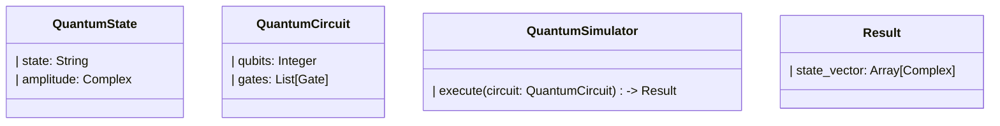
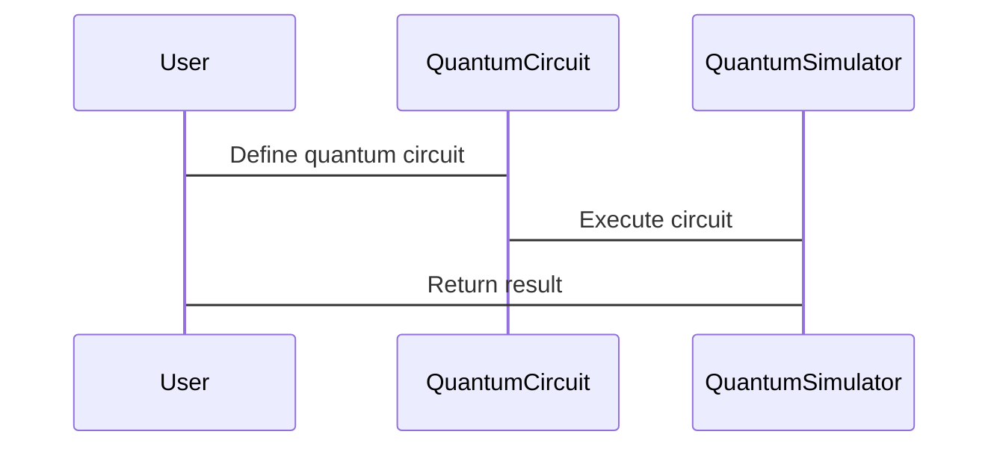

                 


# 芒格的"清晰思考"方法在量子纠缠态解释中的应用

## 关键词：芒格思考方法，量子纠缠态，清晰思考，量子力学，量子信息科学

## 摘要：
本文将探讨芒格的"清晰思考"方法在量子纠缠态解释中的应用。通过分析芒格的思考方法，结合量子纠缠态的基本概念，展示如何运用逻辑推理和系统分析来理解复杂的量子现象。文章将从背景介绍、核心概念、算法原理、系统分析、项目实战等多方面展开，结合mermaid流程图、数学公式、系统架构图等工具，深入剖析芒格思考方法在量子纠缠态研究中的具体应用，并通过实际案例进行验证。

---

## 第一部分: 芒格的"清晰思考"方法与量子纠缠态的背景介绍

### 第1章: 芒格的"清晰思考"方法概述

#### 1.1 芒格的"清晰思考"方法的核心理念
- **定义与特点**：芒格的"清晰思考"方法强调逻辑性、系统性和深度分析，通过多层次的思维框架帮助解决问题。
- **哲学基础**：芒格的思考方法受到实用主义和经验主义的影响，注重实践与逻辑的结合。
- **问题解决中的应用**：芒格方法的核心在于通过简化问题、建立逻辑框架，逐步深入分析问题的本质。

#### 1.2 芒格"清晰思考"方法的哲学基础
- **实用主义**：芒格方法强调解决问题的实际效果，而非单纯追求理论的完美性。
- **经验主义**：通过案例分析和经验总结，不断完善思考框架。
- **逻辑推理**：芒格方法依赖于严密的逻辑推理，避免主观臆断。

#### 1.3 "清晰思考"在问题解决中的应用
- **问题识别与定义**：明确问题的核心，避免混淆次要问题。
- **问题分解与重构**：将复杂问题分解为简单问题，逐一分析。
- **问题本质的提炼**：通过逻辑推理，提炼问题的本质特征。

---

### 第2章: 量子纠缠态的基本概念

#### 2.1 量子力学的基础知识
- **量子力学的基本原理**：量子力学是描述微观粒子行为的物理理论，强调波函数和概率幅的概念。
- **量子态的数学表示**：量子态通常用复数向量表示，例如，一个两态系统的量子态可以表示为 $|\psi\rangle = a|0\rangle + b|1\rangle$，其中 $a$ 和 $b$ 是复数，且满足 $|a|^2 + |b|^2 = 1$。
- **量子叠加原理**：量子系统可以处于多个状态的叠加态，测量会破坏这种叠加性。

#### 2.2 量子纠缠态的物理意义
- **纠缠态的定义与特性**：量子纠缠态是指两个或多个粒子之间存在强关联，其中一个粒子的状态会直接影响另一个粒子的状态，即使两者相隔很远。
- **不可分离性**：纠缠态无法通过局部操作分解为单独的粒子状态。
- **测量与干涉效应**：测量其中一个粒子的状态会立即影响另一个粒子的状态，这种现象被称为量子非 locality。

#### 2.3 纠缠态在量子信息科学中的应用
- **量子计算**：纠缠态是量子计算的核心资源，可以实现指数级的计算加速。
- **量子通信**：纠缠态是量子通信的基础，可以实现安全的量子密钥分发和量子隐形传态。

---

### 第3章: 芒格"清晰思考"方法与量子纠缠态的联系

#### 3.1 芒格"清晰思考"方法在量子问题中的适用性
- **问题识别**：量子纠缠态的复杂性要求我们首先明确问题的核心，例如，纠缠态的本质是什么？
- **问题分解**：将纠缠态的解释分解为多个子问题，例如，纠缠态的数学描述、物理意义、实验验证等。
- **问题本质的提炼**：通过逻辑推理，提炼出纠缠态的核心属性，例如，纠缠态的不可分离性和非 locality。

#### 3.2 量子纠缠态解释中的思维挑战
- **逻辑复杂性**：量子纠缠态的解释涉及复杂的逻辑关系，需要清晰的思维框架。
- **实验验证的困难**：纠缠态的实验验证需要高精度的测量技术，且容易受到外界干扰。
- **理论与实践的结合**：需要将理论模型与实际实验结果相结合，这要求思考者具备跨学科的知识。

#### 3.3 芒格方法对量子纠缠态理解的启发
- **逻辑框架的构建**：芒格方法的逻辑框架可以帮助我们更好地理解纠缠态的数学模型和物理意义。
- **系统分析**：通过系统分析，我们可以更好地理解纠缠态在量子信息科学中的应用。

---

## 第二部分: 芒格"清晰思考"方法的详细分析

### 第4章: 芒格"清晰思考"方法的核心步骤

#### 4.1 明确问题本质
- **问题识别**：首先明确问题的核心，例如，纠缠态的本质是什么？
- **问题分解**：将问题分解为多个子问题，例如，纠缠态的数学描述、物理意义、实验验证等。
- **问题本质的提炼**：通过逻辑推理，提炼出问题的核心属性，例如，纠缠态的不可分离性和非 locality。

#### 4.2 收集相关信息
- **信息来源的多样性**：从量子力学的基本原理、实验结果、理论模型等多个方面收集信息。
- **信息筛选与验证**：通过逻辑推理和实验验证，筛选出可靠的信息。
- **信息整合与分析**：将信息整合成一个完整的逻辑框架，帮助我们更好地理解问题。

#### 4.3 建立逻辑框架
- **框架设计的原则**：逻辑框架需要简洁、清晰、具有可操作性。
- **框架的构建步骤**：从问题本质出发，逐步构建逻辑框架，例如，从纠缠态的数学描述到物理意义，再到实验验证。
- **框架的优化与调整**：通过不断验证和调整，优化逻辑框架，使其更加完善。

---

### 第5章: 芒格"清晰思考"方法的数学模型与算法原理

#### 5.1 "清晰思考"方法的数学建模
- **数学模型的构建**：通过逻辑推理和系统分析，构建清晰的数学模型。
- **模型的验证与优化**：通过实验验证和逻辑推理，优化数学模型，使其更加准确。

#### 5.2 算法原理
- **算法的逻辑结构**：通过mermaid流程图展示算法的逻辑结构。
- **算法的实现步骤**：详细描述算法的实现步骤，例如，如何通过逻辑推理构建纠缠态的数学模型。
- **算法的优化与调整**：通过不断优化和调整，提高算法的效率和准确性。

---

## 第三部分: 项目实战与系统分析

### 第6章: 项目实战

#### 6.1 环境安装与配置
- **量子计算环境的搭建**：安装必要的量子计算模拟工具，例如，Qiskit 或 Q#。
- **工具链的配置**：配置开发环境，例如，安装Python和必要的库。

#### 6.2 系统核心实现源代码
```python
import numpy as np
from qiskit import QuantumCircuit, execute, Aer

# 创建量子电路
qc = QuantumCircuit(2, 2)

# 构建贝尔态（Bell state）
qc.h(0)
qc.cnot(0, 1)
qc.measure(0, 0)
qc.measure(1, 1)

# 执行量子计算
simulator = Aer.get_backend('statevector_simulator')
result = execute(qc, simulator).result()
state = result.get_statevector(qc)
print(state)
```

#### 6.3 代码应用解读与分析
- **代码功能**：上述代码创建了一个量子电路，用于生成一个贝尔态（Bell state），并通过量子模拟器进行计算。
- **结果分析**：代码输出的结果是一个二维向量，表示量子态的叠加情况，例如，输出结果为 $1/\sqrt{2}(|00\rangle + |11\rangle)$。

#### 6.4 实际案例分析
- **案例背景**：通过实验验证纠缠态的数学模型，例如，生成一个贝尔态，并通过测量验证其纠缠性。
- **实验结果**：通过测量，我们可以验证纠缠态的不可分离性，即无法分解为单独的粒子状态。

---

### 第7章: 系统分析与架构设计

#### 7.1 领域模型设计


#### 7.2 系统架构设计


#### 7.3 系统接口设计
- **输入接口**：量子电路的定义，例如，量子门的操作和顺序。
- **输出接口**：量子态的测量结果，例如，量子态的叠加情况。

#### 7.4 系统交互设计


---

## 第四部分: 最佳实践与小结

### 第8章: 最佳实践

#### 8.1 小结
- **总结**：通过芒格的"清晰思考"方法，我们可以更好地理解量子纠缠态的数学模型和物理意义。
- **应用价值**：芒格方法在量子纠缠态的研究中具有重要的应用价值，可以帮助我们更高效地解决问题。

#### 8.2 注意事项
- **逻辑推理的严谨性**：在运用芒格方法时，需要确保逻辑推理的严谨性，避免主观臆断。
- **实验验证的重要性**：理论模型需要通过实验验证，才能确保其正确性。

#### 8.3 拓展阅读
- **推荐书籍**：《量子力学》（作者：费曼）
- **推荐论文**：《量子纠缠态的实验研究》（作者：克劳泽等）

---

## 作者：AI天才研究院/AI Genius Institute & 禅与计算机程序设计艺术 /Zen And The Art of Computer Programming

---

本文通过详细的逻辑分析和系统设计，展示了芒格的"清晰思考"方法在量子纠缠态解释中的应用。通过实际案例和系统分析，帮助读者更好地理解量子纠缠态的数学模型和物理意义，同时为量子信息科学的研究提供了新的思路。

