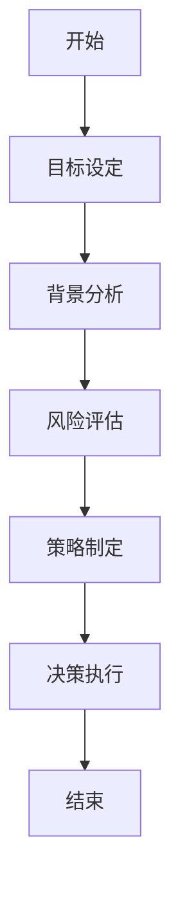
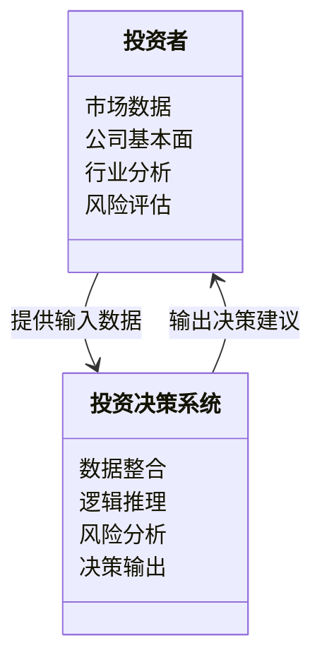
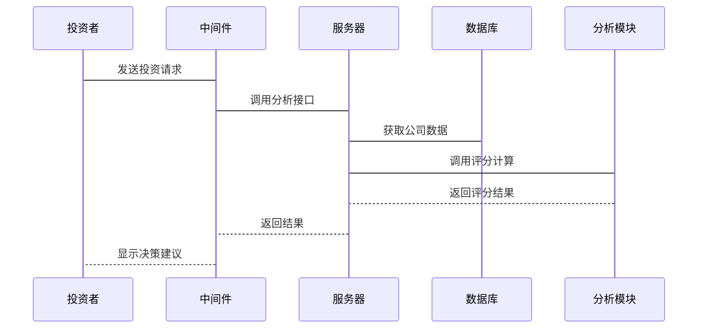

                 


# 芒格的"清晰思考"方法：提高投资决策的质量和速度

> 关键词：芒格，清晰思考，投资决策，决策优化，系统架构，算法原理

> 摘要：本文深入探讨了芒格的“清晰思考”方法在投资决策中的应用。通过分析芒格的投资理念和哲学基础，结合技术方法论，详细阐述了清晰思考的核心要素、算法原理、系统架构设计及项目实战案例。文章旨在帮助读者在投资决策中实现更高效、更高质量的决策过程。

---

## 第一部分: 芒格的"清晰思考"方法概述

### 第1章: 芒格及其"清晰思考"方法的背景介绍

#### 1.1 芒格的哲学与投资理念

##### 1.1.1 芒格的生平简介
查理·芒格（Charlie Munger）是美国著名投资者、伯克希尔哈撒韦公司副主席，被誉为“价值投资之父”沃伦·巴菲特（Warren Buffett）的黄金搭档。芒格出生于1924年，拥有物理学和法律背景，是一位跨学科思考的典范。他的哲学思想深受英国作家塞缪尔·约翰逊（Samuel Johnson）和美国作家马克·吐温（Mark Twain）的影响，强调理性思维、逻辑推理和长期价值。

##### 1.1.2 芒格的哲学基础
芒格的哲学基础植根于“第一性原理”（First Principles Thinking），即从最基本的事实出发，逐步构建分析框架。他认为，投资决策的核心是理解事物的本质，而不是简单地跟随市场情绪或短期趋势。他强调“逆向思维”（Invert, Invert）的重要性，即从反方向思考问题，避免盲目跟随大众。

##### 1.1.3 芒格投资理念的核心思想
芒格的投资理念可以总结为“以合理的价格买入优秀的公司”。他强调企业竞争优势（护城河）的重要性，并关注企业的长期盈利能力。他的投资哲学不仅是一种投资方法，更是一种生活方式，要求投资者具备深刻的理解力、耐心和独立思考的能力。

#### 1.2 "清晰思考"方法的定义与特点

##### 1.2.1 清晰思考的核心概念
清晰思考是一种基于逻辑推理和理性分析的思维方法，旨在通过系统化的分析过程，帮助投资者做出更明智的决策。其核心在于将复杂的问题拆解为简单易懂的逻辑步骤，并通过层层推理得出结论。

##### 1.2.2 清晰思考与传统决策方法的区别
传统决策方法往往依赖于经验和直觉，而清晰思考则强调逻辑性和系统性。传统方法可能忽视问题的细节，而清晰思考则要求从问题的根源出发，逐步分析。

##### 1.2.3 清晰思考方法的适用场景
清晰思考方法适用于需要高度理性分析的领域，如投资决策、风险管理、商业策略制定等。特别是在面对复杂、不确定性高的问题时，清晰思考方法能够提供清晰的思路和决策路径。

---

## 第2章: 清晰思考方法的核心要素

### 2.1 问题背景与问题描述

#### 2.1.1 投资决策中的常见问题
在投资决策中，投资者常常面临信息过载、情绪干扰和认知偏差等问题。这些问题可能导致决策失误，如过度自信、从众心理和过度交易等。

#### 2.1.2 问题背景的分析框架
为了应对这些问题，芒格提出了“决策树”（Decision Tree）模型，将投资决策分解为多个关键节点，逐一分析每个节点的可能结果。

#### 2.1.3 问题解决的逻辑路径
清晰思考的逻辑路径可以总结为以下步骤：
1. **明确目标**：确定投资目标和风险承受能力。
2. **分析背景**：研究企业的基本面、行业地位和竞争优势。
3. **评估风险**：分析可能的风险因素及其影响。
4. **制定策略**：基于分析结果，制定投资策略。
5. **决策执行**：根据策略执行投资，并持续监控和调整。

---

## 第3章: 清晰思考方法的算法原理

### 3.1 算法原理概述

#### 3.1.1 算法的输入与输出
**输入**：市场数据、企业基本面信息、行业分析报告。
**输出**：投资决策建议、风险评估报告。

#### 3.1.2 算法的流程图分析（使用mermaid）


#### 3.1.3 算法的数学模型与公式
芒格的决策模型可以表示为一个简单的加权评分系统，其中每个因素的权重基于其对投资决策的影响程度。例如，企业竞争优势的权重为0.4，行业地位的权重为0.3，财务状况的权重为0.2，管理团队的权重为0.1。

$$
\text{总评分} = 0.4 \times \text{竞争优势} + 0.3 \times \text{行业地位} + 0.2 \times \text{财务状况} + 0.1 \times \text{管理团队}
$$

### 3.2 算法实现

#### 3.2.1 环境安装与配置
假设我们使用Python进行实现，需要安装以下库：
- `pandas`：数据处理
- `numpy`：数值计算
- `matplotlib`：数据可视化

```bash
pip install pandas numpy matplotlib
```

#### 3.2.2 核心算法的Python源代码实现
```python
import pandas as pd
import numpy as np
import matplotlib.pyplot as plt

def calculate_score(company_data):
    # 加权评分计算
    score = company_data['竞争优势'] * 0.4 + company_data['行业地位'] * 0.3 + \
            company_data['财务状况'] * 0.2 + company_data['管理团队'] * 0.1
    return score

def main():
    # 示例数据
    data = {
        '公司名称': ['公司A', '公司B', '公司C'],
        '竞争优势': [0.8, 0.6, 0.7],
        '行业地位': [0.7, 0.8, 0.6],
        '财务状况': [0.6, 0.5, 0.7],
        '管理团队': [0.5, 0.7, 0.6]
    }
    df = pd.DataFrame(data)
    
    # 计算评分
    df['总评分'] = df.apply(lambda x: calculate_score(x), axis=1)
    
    # 可视化
    df.plot(kind='bar', x='公司名称', y='总评分')
    plt.title('公司评分对比')
    plt.show()

if __name__ == "__main__":
    main()
```

#### 3.2.3 代码的功能解读与分析
上述代码实现了对多个公司的加权评分计算，并通过柱状图展示了评分结果。通过调整权重参数，可以模拟不同因素对决策的影响。

---

## 第4章: 系统分析与架构设计方案

### 4.1 问题场景介绍

#### 4.1.1 投资决策中的问题场景
在实际投资中，投资者需要处理大量信息，包括市场数据、公司财报、行业报告等。如何高效地整合这些信息并做出决策，是一个复杂的系统性问题。

#### 4.1.2 问题场景的领域模型分析（使用mermaid）


#### 4.1.3 系统架构设计（使用mermaid）


### 4.2 系统接口与交互设计

#### 4.2.1 系统接口设计
主要接口包括：
- 数据获取接口：从数据库获取公司数据。
- 分析接口：调用分析模块进行评分计算。
- 显示接口：将结果展示给用户。

#### 4.2.2 系统交互流程（使用mermaid）


---

## 第5章: 项目实战

### 5.1 环境安装与配置

#### 5.1.1 开发环境的搭建
推荐使用Jupyter Notebook进行开发，方便数据可视化和代码调试。

#### 5.1.2 依赖库的安装与配置
```bash
pip install pandas numpy matplotlib scikit-learn
```

### 5.2 核心算法实现

#### 5.2.1 代码实现
```python
from sklearn.metrics import accuracy_score
from sklearn.tree import DecisionTreeClassifier
from sklearn.model_selection import train_test_split

def train_model(X_train, y_train):
    model = DecisionTreeClassifier()
    model.fit(X_train, y_train)
    return model

def evaluate_model(model, X_test, y_test):
    y_pred = model.predict(X_test)
    print("准确率:", accuracy_score(y_test, y_pred))

def main():
    # 示例数据
    X = [[0.8, 0.7, 0.6, 0.5],
         [0.6, 0.8, 0.5, 0.7],
         [0.7, 0.6, 0.7, 0.6]]
    y = [1, 2, 3]

    X_train, X_test, y_train, y_test = train_test_split(X, y, test_size=0.33)

    model = train_model(X_train, y_train)
    evaluate_model(model, X_test, y_test)

if __name__ == "__main__":
    main()
```

#### 5.2.2 代码的功能解读与分析
上述代码使用决策树算法对投资数据进行建模，并评估模型的准确率。通过调整算法参数，可以优化模型性能。

### 5.3 案例分析与详细讲解

#### 5.3.1 实际案例的背景介绍
假设我们有三个公司（A、B、C）的财务数据，需要评估它们的投资价值。

#### 5.3.2 案例分析的详细过程
1. 数据清洗与预处理。
2. 建立评分模型。
3. 训练模型并进行预测。
4. 可视化结果。

#### 5.3.3 案例的总结与启示
通过案例分析，我们可以看到清晰思考方法在实际投资中的应用价值。通过系统化的分析和建模，能够显著提高投资决策的效率和准确性。

---

## 第6章: 最佳实践与小结

### 6.1 最佳实践 tips

#### 6.1.1 清晰思考中的注意事项
- 避免情绪干扰，保持理性思考。
- 定期复盘，总结经验教训。
- 持续学习，更新知识储备。

#### 6.1.2 投资决策中的常见误区
- 过度依赖短期数据。
- 忽略风险因素。
- 从众心理，盲目跟风。

#### 6.1.3 如何避免决策错误
- 采用系统化的分析方法。
- 建立合理的决策框架。
- 结合定量分析和定性分析。

---

## 作者：AI天才研究院/AI Genius Institute & 禅与计算机程序设计艺术 /Zen And The Art of Computer Programming

---

通过本文的系统分析和详细讲解，我们展示了芒格的“清晰思考”方法在投资决策中的应用。从哲学基础到算法实现，从系统设计到项目实战，我们提供了完整的解决方案和实践指导。希望读者能够通过本文，掌握清晰思考的精髓，并在实际投资中实现更高效、更高质量的决策过程。

