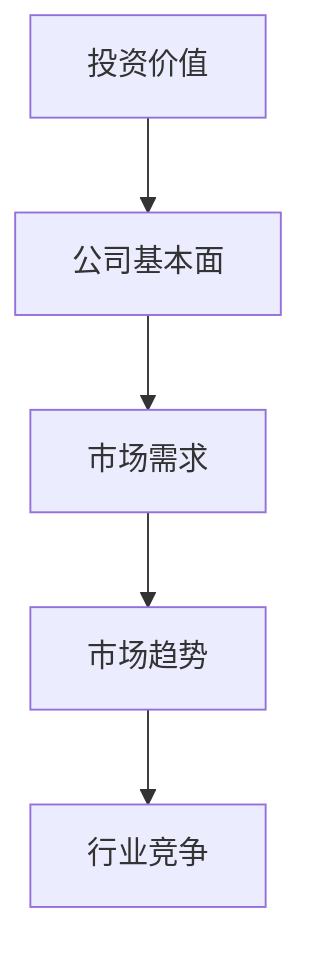
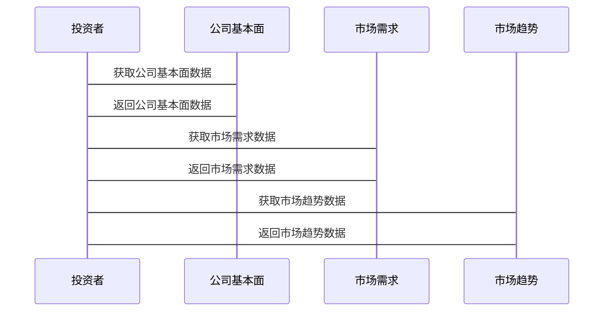

                 


# 芒格的"第一原理"思维在投资分析中的应用

> 关键词：芒格、第一原理思维、投资分析、哲学基础、系统分析

> 摘要：本文深入探讨了芒格的第一原理思维在投资分析中的应用，通过理论分析和实际案例，揭示了这一思维方法在投资决策中的重要性。文章从哲学基础、核心概念、算法原理等多个角度展开，结合系统分析和项目实战，为读者提供了全面的理解和应用指南。

---

## 第一部分: 芒格的第一原理思维概述

### 第1章: 芒格的第一原理思维概述

#### 1.1 芒格与第一原理思维

##### 1.1.1 芒格的生平简介
查理·芒格（Charlie Munger）是著名投资家沃伦·巴菲特（Warren Buffett）的长期合作伙伴，被誉为“价值投资的第二人”。芒格不仅在投资领域取得了巨大成功，还以其独特的思维方式闻名于世。他的思想深刻影响了投资界，尤其是其提出的“第一原理思维”（First Principles Thinking），成为投资分析中的重要工具。

##### 1.1.2 芒格的投资哲学
芒格的投资哲学强调以理性为基础，追求长期价值。他认为，投资的核心在于理解事物的本质，而非追随市场的短期波动。这种哲学与“第一原理思维”密不可分，即从基础原理出发，逐步构建分析框架。

##### 1.1.3 第一原理思维的定义与特点
第一原理思维是一种从基本原理出发，通过逻辑推理和验证，逐步构建解决方案的思维方式。其特点在于：
1. **从基础出发**：不依赖现有假设，而是从最根本的原理出发。
2. **逻辑推理**：通过层层推理，构建严密的逻辑框架。
3. **验证与修正**：每一步都经过验证，确保结论的准确性。

#### 1.2 第一原理思维的核心要素

##### 1.2.1 问题背景与问题描述
在投资分析中，问题背景通常涉及市场趋势、公司基本面、行业动态等。问题描述需要明确分析的目标，例如评估一家公司的投资价值。

##### 1.2.2 问题解决的逻辑框架
芒格的第一原理思维通过以下步骤解决问题：
1. **明确目标**：确定分析的核心问题。
2. **拆解问题**：将问题拆解为基本要素。
3. **构建逻辑框架**：从基础原理出发，逐步构建分析框架。
4. **验证与修正**：通过数据和事实验证假设，并进行必要的修正。

##### 1.2.3 边界与外延的界定
在投资分析中，明确分析的边界和外延至关重要。例如，在分析一家科技公司时，边界可能包括其核心技术和市场，而外延可能涉及政策变化和行业趋势。

##### 1.2.4 核心概念与联系的实体关系图
通过实体关系图（ER图）可以清晰展示核心概念及其联系。例如，在分析一家公司时，核心概念可能包括公司财务状况、行业竞争格局、市场需求等。

#### 1.3 第一原理思维在投资中的重要性

##### 1.3.1 投资分析的核心问题
投资分析的核心问题包括评估公司的长期价值、预测市场趋势、识别投资风险等。第一原理思维能够帮助投资者从基础出发，避免被表面现象迷惑。

##### 1.3.2 第一原理思维对投资决策的影响
通过第一原理思维，投资者能够深入理解企业的基本面，避免短期波动的干扰。例如，在分析一家科技公司时，可以从技术、市场、财务等多个维度出发，逐步构建分析框架。

##### 1.3.3 投资分析中的常见误区
常见的误区包括过度依赖市场情绪、忽视基本面分析、盲目追随趋势等。第一原理思维能够帮助投资者避免这些误区，回归投资的本质。

---

## 第二部分: 第一原理思维的哲学基础

### 第2章: 第一原理思维的哲学基础

#### 2.1 第一原理思维的哲学基础

##### 2.1.1 还原论与整体论的对比
还原论强调将问题拆解为基本要素，而整体论则关注整体的系统性。第一原理思维更接近还原论，通过拆解问题，逐步构建解决方案。

##### 2.1.2 批判性思维与逆向思维的联系
批判性思维要求对现有假设进行质疑，逆向思维则强调从反方向思考问题。两者都是第一原理思维的重要组成部分，帮助投资者避免思维定式。

#### 2.2 第一原理思维的核心原理

##### 2.2.1 核心概念的属性特征对比表格
以下是核心概念的属性特征对比表格：

| 核心概念 | 属性特征 |
|----------|----------|
| 投资价值 | 长期回报、内在价值 |
| 市场趋势 | 增长率、周期性 |
| 公司基本面 | 财务状况、竞争优势 |

##### 2.2.2 实体关系图的Mermaid流程图
以下是实体关系图的Mermaid流程图：



##### 2.2.3 第一原理思维的数学模型
以下是第一原理思维的数学模型示例：

$$\text{投资价值} = f(\text{公司基本面}, \text{市场需求}, \text{市场趋势})$$

##### 2.2.4 通俗易懂的举例说明
以分析一家科技公司为例，从技术、市场、财务等多个维度出发，逐步构建分析框架。例如，首先分析公司的核心技术，然后评估市场需求，最后结合财务数据进行综合判断。

#### 2.3 第一原理思维的数学模型

##### 2.3.1 投资分析中的数学模型
以下是投资分析中的数学模型示例：

$$\text{投资回报率} = \frac{\text{净利润}}{\text{投资额}}$$

##### 2.3.2 案例分析与详细讲解
例如，在分析一家科技公司的投资回报率时，可以结合公司过去几年的财务数据，计算其平均净利润率，从而评估其投资价值。

##### 2.3.3 通俗易懂的举例说明
假设某科技公司过去三年的净利润分别为100万、150万和200万，投资金额为500万。则投资回报率为：

$$\text{投资回报率} = \frac{100 + 150 + 200}{500} = 10\%$$

---

## 第三部分: 第一原理思维在投资分析中的应用

### 第3章: 第一原理思维在投资分析中的应用

#### 3.1 投资分析的核心问题

##### 3.1.1 投资机会的识别与评估
通过第一原理思维，投资者可以从基本原理出发，识别具有长期价值的投资机会。例如，分析一家公司的核心技术、市场需求和行业趋势。

##### 3.1.2 投资决策的逻辑框架
通过构建逻辑框架，投资者可以系统地分析投资机会。例如，首先分析公司的基本面，然后评估市场需求，最后结合市场趋势进行综合判断。

##### 3.1.3 投资风险的评估与管理
通过第一原理思维，投资者可以更好地识别和评估投资风险。例如，分析公司的财务状况、行业竞争格局和政策变化。

#### 3.2 投资分析中的系统架构设计

##### 3.2.1 系统功能设计（领域模型Mermaid类图）
以下是系统功能设计的Mermaid类图：


##### 3.2.2 系统架构设计（Mermaid架构图）
以下是系统架构设计的Mermaid架构图：


##### 3.2.3 系统接口设计
系统接口设计包括投资者与公司基本面、市场需求、市场趋势之间的接口。例如，投资者通过分析公司基本面，评估市场需求，并结合市场趋势进行投资决策。

##### 3.2.4 系统交互（Mermaid序列图）
以下是系统交互的Mermaid序列图：



#### 3.3 项目实战

##### 3.3.1 环境安装
在进行投资分析之前，需要确保环境配置正确，例如安装必要的数据分析工具和投资分析软件。

##### 3.3.2 系统核心实现源代码
以下是系统核心实现的源代码示例：

```python
def analyze_investment():
    company_financials = get_company_financials()
    market_demand = get_market_demand()
    market_trends = get_market_trends()
    investment_value = calculate_investment_value(company_financials, market_demand, market_trends)
    return investment_value

def calculate_investment_value(financials, demand, trends):
    # 具体计算逻辑
    return investment_value
```

##### 3.3.3 代码应用解读与分析
通过代码实现，投资者可以系统地分析投资机会。例如，通过获取公司基本面数据、市场需求数据和市场趋势数据，计算投资价值。

##### 3.3.4 实际案例分析
以某科技公司为例，分析其投资价值时，可以结合公司财务数据、市场需求和市场趋势进行综合判断。

##### 3.3.5 详细讲解剖析
通过详细讲解案例，投资者可以更好地理解如何将第一原理思维应用到实际投资分析中。

##### 3.3.6 项目小结
本项目通过系统化的分析框架，帮助投资者更好地识别和评估投资机会，避免常见误区。

---

## 第四部分: 总结与展望

### 第4章: 总结与展望

#### 4.1 总结
本文深入探讨了芒格的第一原理思维在投资分析中的应用，从哲学基础、核心概念到实际应用，为读者提供了全面的理解和应用指南。通过系统化的分析框架和实际案例，帮助投资者更好地识别和评估投资机会。

#### 4.2 展望
未来，随着市场的不断发展，第一原理思维在投资分析中的应用将更加广泛和深入。投资者需要不断学习和适应，以应对复杂多变的市场环境。

---

## 作者：AI天才研究院/AI Genius Institute & 禅与计算机程序设计艺术 /Zen And The Art of Computer Programming

---

**注：** 本文由AI天才研究院/AI Genius Institute撰写，旨在为读者提供关于芒格的第一原理思维在投资分析中的应用的深度洞察。内容涵盖从基础概念到实际应用的各个方面，帮助读者更好地理解并应用这一思维方式。

