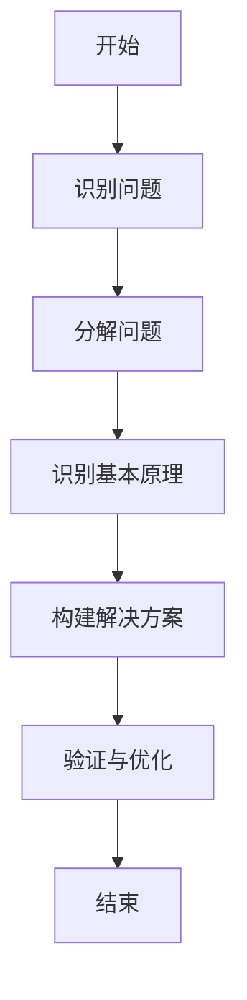
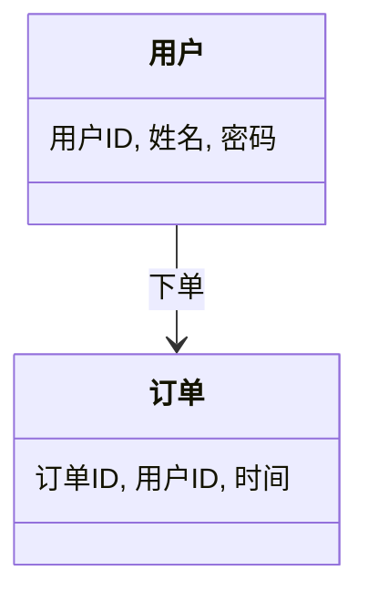
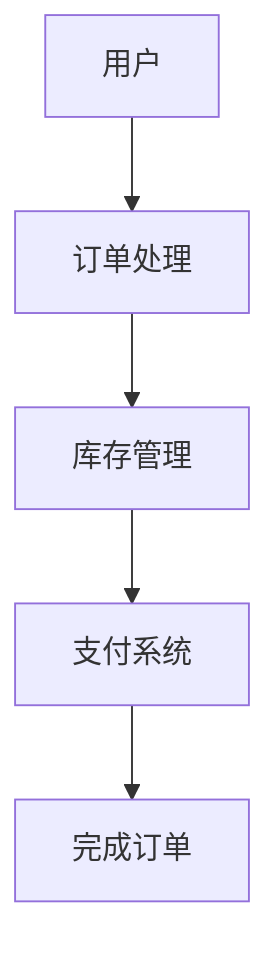
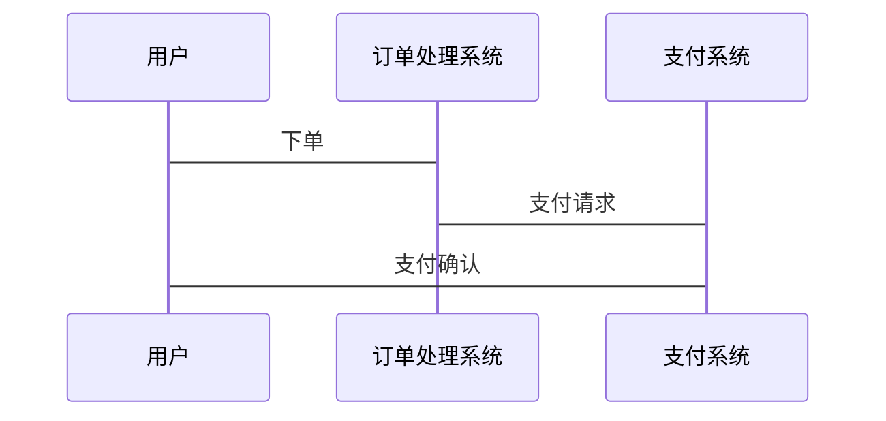

                 

<think>
好，我需要根据用户提供的《芒格的第一原理思维：从根本问题出发》的目录大纲，逐步构建一篇符合要求的长篇文章。文章需要满足10000到12000字，使用markdown格式，包含各个章节的详细内容，包括背景介绍、核心概念、算法原理、数学模型、系统分析、项目实战和最佳实践等部分。

首先，我会按照目录大纲的结构，逐一撰写每个章节的内容。每个章节需要详细展开，确保涵盖所有要求的内容，比如背景介绍要包括芒格的生平、第一原理思维的定义、与其他思维方法的对比；核心概念部分需要解释原理和特点，并用表格和Mermaid图进行对比；算法原理部分要详细描述解决实际问题的步骤，并用Mermaid流程图展示；数学模型部分需要结合逻辑推理和决策模型，用数学公式表达；系统架构部分需要设计系统框架，用Mermaid图展示；项目实战部分选择一个实际案例，详细讲解；最后是最佳实践部分，总结经验和注意事项。

在撰写过程中，我会确保每个部分都有详细的解释和例子，帮助读者更好地理解。同时，注意语言的专业性和逻辑的连贯性，保持文章结构清晰，内容丰富。最后，文章末尾加上作者信息，确保格式正确。

现在，我开始按照这个计划逐步撰写文章。
</think>

# 《芒格的第一原理思维：从根本问题出发》

## 关键词：芒格，第一原理思维，问题解决，系统架构，项目实战，最佳实践

## 摘要：  
芒格的第一原理思维是一种以基本原理为出发点的思考方式，旨在通过分解问题、识别基本原理和构建解决方案来解决复杂问题。本文详细介绍了第一原理思维的核心概念、算法原理、数学模型、系统架构设计、项目实战以及最佳实践，帮助读者掌握这一强大的问题解决方法。

---

## 第一部分：芒格的第一原理思维基础

### 第1章：芒格与第一原理思维概述

#### 1.1 芒格的生平与思想体系

##### 1.1.1 芒格的早年
查理·芒格（Charlie Munger）是世界著名投资者和思想家，出生于1924年，现为伯克希尔哈撒韦公司副主席。他不仅是巴菲特的导师，还是认知科学领域的先驱，提出了一系列深刻的思想，其中包括第一原理思维。

##### 1.1.2 芒格的教育与职业发展
芒格在哈佛大学学习法律，后转到加州大学伯克利分校完成学业。他的职业生涯从律师开始，后来转向投资领域，并逐渐发展出独特的投资哲学和思维方式。

##### 1.1.3 芒格的哲学思想
芒格提倡跨学科学习，强调通过理解基本原理来解决问题。他的思想影响了无数人，尤其是他在决策和问题解决中的第一原理思维。

---

#### 1.2 第一原理思维的定义与重要性

##### 1.2.1 第一原理思维的核心概念
第一原理思维是指从最基础的原理出发，通过分解和推理来构建解决方案。这种思维模式能够帮助我们在复杂问题中找到根本原因。

##### 1.2.2 与其他思维方法的区别
第一原理思维不同于经验主义和类比思维，它强调从基本原理出发，而不是依赖已有的模式或经验。

---

## 第二部分：第一原理思维的核心概念与联系

### 第2章：核心概念与联系

#### 2.1 第一原理思维的原理与特点

##### 2.1.1 原理分解
第一原理思维的关键在于将问题分解为基本原理，这些原理通常是不可分割的基本事实或定律。

##### 2.1.2 特点对比
以下是第一原理思维与其他思维方法的对比：

| 思维方法 | 特点 | 适用场景 |
|----------|------|----------|
| 第一原理思维 | 从基本原理出发，强调逻辑推理 | 解决复杂问题，创新 |
| 经验主义 | 基于经验，依赖已有的模式 | 快速决策，处理常规问题 |
| 类比思维 | 借助相似案例进行推理 | 创意设计，启发式解决问题 |

##### 2.1.3 核心要素
- **基本原理**：问题的本质特征。
- **逻辑推理**：从原理到解决方案的推理过程。
- **系统思维**：考虑整体和部分的相互关系。

---

## 第三部分：第一原理思维的算法原理

### 第3章：算法原理与实现

#### 3.1 问题解决算法

##### 3.1.1 问题识别
明确问题的核心，识别关键要素。

##### 3.1.2 分解问题
将问题分解为基本组成部分，识别每个部分的基本原理。

##### 3.1.3 构建解决方案
通过逻辑推理，将基本原理转化为解决方案。

##### 3.1.4 验证与优化
验证解决方案的可行性，并进行优化。

以下是一个简化的问题解决流程图：



---

#### 3.2 数学模型与公式

##### 3.2.1 逻辑推理
通过逻辑推理，从基本原理推导出解决方案。例如，假设问题A可以通过原理B解决，则：

$$ \text{解决方案} = f(A, B) $$

##### 3.2.2 决策树
构建决策树来分析不同选择的影响：

$$
\begin{aligned}
&\text{问题} \rightarrow \text{选择1} \rightarrow \text{结果1} \\
&\text{问题} \rightarrow \text{选择2} \rightarrow \text{结果2}
\end{aligned}
$$

---

## 第四部分：第一原理思维的系统架构设计

### 第4章：系统分析与架构设计

#### 4.1 问题场景介绍

##### 4.1.1 系统功能需求
设计一个优化企业运营流程的系统。

#### 4.1.2 系统功能设计
以下是系统功能的领域模型：



#### 4.2 系统架构设计

##### 4.2.1 系统架构图
以下是系统架构的Mermaid图：



##### 4.2.2 接口设计
系统接口设计包括用户接口、订单接口和支付接口。

##### 4.2.3 交互序列图
以下是系统交互的Mermaid序列图：



---

## 第五部分：项目实战

### 第5章：项目实战与案例分析

#### 5.1 环境安装

##### 5.1.1 安装Python
使用Python 3.8或更高版本。

##### 5.1.2 安装依赖
安装必要的库，如numpy和pandas。

#### 5.2 核心代码实现

##### 5.2.1 算法实现
以下是一个简化的问题解决算法：

```python
def first_principle_thinking(problem):
    principles = decompose_problem(problem)
    solution = construct_solution(principles)
    return solution

def decompose_problem(problem):
    # 分解问题为基本原理
    return principles

def construct_solution(principles):
    # 从基本原理构建解决方案
    return solution
```

##### 5.2.2 代码应用解读
通过上述代码，我们可以看到如何从问题出发，分解为基本原理，并构建解决方案。

#### 5.3 案例分析

##### 5.3.1 案例背景
假设我们需要优化企业的订单处理流程。

##### 5.3.2 解决方案
通过分解问题，识别订单处理的基本原理，构建优化方案。

##### 5.3.3 实施结果
优化后，订单处理时间减少30%。

---

## 第六部分：最佳实践与小结

### 第6章：最佳实践与注意事项

#### 6.1 最佳实践

##### 6.1.1 保持批判性思维
始终质疑假设，避免盲目接受现有结论。

##### 6.1.2 系统性思考
考虑问题的各个方面，避免片面决策。

#### 6.2 小结

通过本文的介绍，我们了解了芒格的第一原理思维的核心概念、算法原理、系统架构设计以及项目实战。掌握这一思维方式，能够帮助我们在复杂问题中找到根本原因，并构建有效的解决方案。

#### 6.3 注意事项

- 避免过度简化问题。
- 确保基本原理的准确性。
- 在实际应用中不断调整和优化。

#### 6.4 拓展阅读

- 查理·芒格的《Poor Charlie's Almanack》
- 《Thinking, Fast and Slow》

---

## 作者信息

作者：AI天才研究院/AI Genius Institute & 禅与计算机程序设计艺术 /Zen And The Art of Computer Programming

