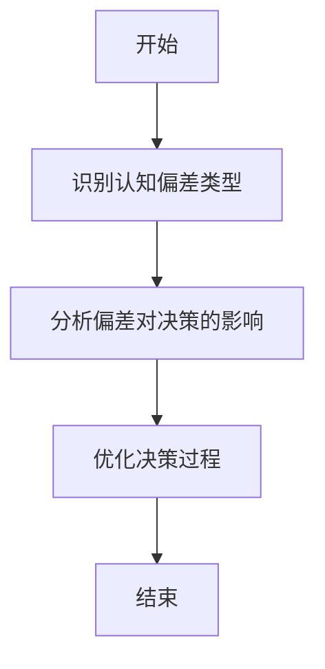
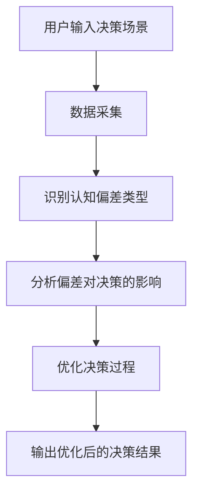

                 


# 芒格的认知偏差理论：在人工智能伦理决策中的应用

**关键词**：芒格认知偏差、人工智能伦理决策、算法设计、系统架构、伦理挑战、技术实现

**摘要**：  
本文深入探讨了芒格的认知偏差理论在人工智能伦理决策中的应用。通过分析认知偏差对人类决策的影响，结合人工智能技术，提出了一种基于芒格认知偏差理论的伦理决策模型。本文从理论背景、认知偏差对人工智能决策的影响、算法实现、系统架构设计、项目实战等多个方面展开，详细阐述了如何利用认知偏差理论优化人工智能伦理决策过程。文章还通过具体案例分析和数学模型，展示了如何将认知偏差理论融入人工智能决策系统中，以提高决策的透明性、公平性和可解释性。

---

# 第一部分: 芒格的认知偏差理论概述

## 第1章: 认知偏差的基本概念

### 1.1 认知偏差的定义与分类

#### 1.1.1 认知偏差的基本概念  
认知偏差是指人在信息处理和决策过程中，由于心理因素的影响，导致偏离逻辑推理或客观事实的偏差。芒格的认知偏差理论强调，人类决策中的偏差并非随机发生，而是由特定的心理机制和外部环境共同作用的结果。  

#### 1.1.2 常见的认知偏差类型  
常见的认知偏差包括：  
1. **确认偏差**：倾向于寻找支持已有结论的信息，忽略矛盾信息。  
2. **从众偏差**：由于社会压力，倾向于跟随多数人的意见。  
3. **锚定效应**：过度依赖第一个信息做决策。  
4. **可得性偏差**：根据易于回忆的信息做出决策。  
5. **过度自信偏差**：高估自己判断的准确性。  

#### 1.1.3 认知偏差对人类决策的影响  
认知偏差会显著影响决策的质量，尤其是在复杂场景中，容易导致错误决策。例如，在医疗领域，医生可能因为确认偏差而忽略患者其他潜在的健康问题。  

---

### 1.2 芒格认知偏差理论的核心观点

#### 1.2.1 芒格认知偏差理论的提出背景  
芒格认知偏差理论的核心思想来源于对人类决策心理的研究。芒格认为，认知偏差是人类决策过程中不可避免的一部分，但可以通过系统化的方法加以识别和纠正。  

#### 1.2.2 芒格认知偏差理论的核心假设  
芒格认知偏差理论假设：  
1. 认知偏差是人类决策过程中的普遍现象。  
2. 通过分析和识别特定的认知偏差类型，可以优化决策过程。  
3. 认知偏差可以通过系统化的方法进行纠正，从而提高决策的准确性。  

#### 1.2.3 芒格认知偏差理论的实践意义  
芒格认知偏差理论为人工智能伦理决策提供了重要的理论基础。通过识别和纠正认知偏差，人工智能系统可以做出更符合伦理的决策。  

---

## 第2章: 人工智能与伦理决策的背景

### 2.1 人工智能决策的基本概念

#### 2.1.1 人工智能决策的定义  
人工智能决策是指利用人工智能技术（如机器学习、自然语言处理等）来模拟和优化人类决策过程。  

#### 2.1.2 人工智能决策的核心技术  
人工智能决策的核心技术包括：  
1. 机器学习：通过训练模型实现预测和分类。  
2. 自然语言处理：理解文本信息并生成决策建议。  
3. 知识图谱：构建领域知识库，支持决策推理。  

#### 2.1.3 人工智能决策的应用领域  
人工智能决策已在医疗、法律、金融、自动驾驶等领域得到广泛应用。  

---

### 2.2 人工智能伦理决策的挑战

#### 2.2.1 人工智能决策的伦理问题  
人工智能决策的伦理问题主要集中在以下方面：  
1. **公平性**：算法可能对某些群体存在偏见。  
2. **透明性**：用户难以理解算法的决策过程。  
3. **可解释性**：复杂的模型难以解释。  

#### 2.2.2 认知偏差对人工智能决策的影响  
认知偏差可能导致人工智能系统在数据采集、模型训练和决策过程中引入偏差。例如，训练数据中的偏见可能被算法放大。  

#### 2.2.3 人工智能决策中的公平性与透明性  
解决人工智能决策中的公平性和透明性问题，需要结合认知偏差理论，设计更加公正和可解释的算法。  

---

# 第二部分: 认知偏差与人工智能决策的结合

## 第3章: 认知偏差对人工智能决策的影响

### 3.1 认知偏差在人工智能决策中的表现

#### 3.1.1 确认偏差与人工智能决策  
确认偏差可能导致人工智能系统过度依赖已有数据，忽略新的信息。例如，在医疗诊断中，系统可能因确认偏差而忽略患者的其他症状。  

#### 3.1.2 从众偏差与人工智能决策  
从众偏差可能导致人工智能系统在决策时过于依赖多数意见，忽略少数群体的需求。例如，在自动驾驶中，系统可能因从众偏差而忽略非主流的驾驶场景。  

#### 3.1.3 锚定效应与人工智能决策  
锚定效应可能导致人工智能系统在决策时过度依赖初始信息，例如在金融投资中，系统可能因锚定效应而坚持错误的初始判断。  

---

### 3.2 人工智能决策中的认知偏差案例分析

#### 3.2.1 医疗领域的认知偏差案例  
在医疗领域，认知偏差可能导致误诊。例如，医生因确认偏差而忽略患者的其他症状，导致诊断错误。  

#### 3.2.2 法律领域的认知偏差案例  
在法律领域，认知偏差可能导致判决不公。例如，法官因可得性偏差而过度依赖最近的案例，忽略其他相关法律条文。  

#### 3.2.3 自动驾驶领域的认知偏差案例  
在自动驾驶领域，认知偏差可能导致算法在复杂场景中做出错误决策。例如，系统因从众偏差而忽略非主流的驾驶行为。  

---

## 第4章: 人工智能决策中的认知偏差识别与纠正

### 4.1 认知偏差识别的基本方法

#### 4.1.1 数据分析法  
通过数据分析，识别数据中的偏差模式。例如，使用统计方法检测数据中的偏见。  

#### 4.1.2 知识图谱构建法  
通过构建知识图谱，识别知识中的偏差。例如，使用图论方法分析知识之间的关系。  

#### 4.1.3 专家系统法  
通过专家系统，结合专家知识识别偏差。例如，利用专家规则库检测算法中的偏差。  

---

### 4.2 认知偏差纠正的策略

#### 4.2.1 数据预处理策略  
通过数据清洗和数据增强，消除数据中的偏差。例如，使用重采样技术平衡数据分布。  

#### 4.2.2 模型优化策略  
通过优化算法，减少模型中的偏差。例如，使用对抗训练方法消除偏见。  

#### 4.2.3 用户反馈机制  
通过用户反馈，动态调整算法，纠正偏差。例如，利用用户反馈优化推荐算法。  

---

# 第三部分: 基于芒格认知偏差理论的人工智能伦理决策模型

## 第5章: 基于认知偏差的人工智能决策算法

### 5.1 算法原理

#### 5.1.1 算法的基本思路  
基于认知偏差理论，设计一种算法，通过识别和纠正认知偏差，优化决策过程。  

#### 5.1.2 算法的输入输出  
- **输入**：决策场景、相关数据、认知偏差类型。  
- **输出**：优化后的决策结果。  

#### 5.1.3 算法的核心步骤  
1. 识别认知偏差类型。  
2. 分析偏差对决策的影响。  
3. 优化决策过程，纠正偏差。  

---

### 5.2 算法实现

#### 5.2.1 算法的数学模型  
$$ P(\text{决策错误}) = \sum_{i=1}^{n} P(\text{偏差类型}_i) \times I(\text{偏差发生}) $$  

其中，$P(\text{偏差类型}_i)$ 表示偏差类型 $i$ 的概率，$I(\text{偏差发生})$ 表示偏差是否发生。  

#### 5.2.2 算法的Python实现  
```python
def cognitive_bias_correction(decision_scenario, data, bias_types):
    # 识别认知偏差类型
    identified_biases = identify_biases(decision_scenario, data, bias_types)
    # 分析偏差对决策的影响
    impact_analysis = analyze_impact(decision_scenario, identified_biases)
    # 优化决策过程，纠正偏差
    optimized_decision = optimize_decision(decision_scenario, impact_analysis)
    return optimized_decision
```

#### 5.2.3 算法的流程图  


---

## 第6章: 人工智能伦理决策系统的架构设计

### 6.1 系统功能设计

#### 6.1.1 系统核心功能  
1. **认知偏差识别**：识别决策过程中的认知偏差。  
2. **偏差分析**：分析偏差对决策的影响。  
3. **决策优化**：优化决策过程，纠正偏差。  

#### 6.1.2 系统功能流程图  


---

### 6.2 系统架构设计

#### 6.2.1 系统架构图  
```mermaid
graph LR
    Client --> API Gateway
    API Gateway --> Cognitive Bias Analyzer
    Cognitive Bias Analyzer --> Decision Optimizer
    Decision Optimizer --> Database
    Database --> Output
```

#### 6.2.2 系统模块划分  
1. **认知偏差分析模块**：识别和分析认知偏差。  
2. **决策优化模块**：优化决策过程。  
3. **数据管理模块**：管理决策数据。  

---

### 6.3 系统接口设计

#### 6.3.1 API接口  
- `/api/v1/bias_identification`：识别认知偏差。  
- `/api/v1/bias_analysis`：分析偏差影响。  
- `/api/v1/decision_optimization`：优化决策过程。  

---

## 第7章: 项目实战

### 7.1 环境安装

#### 7.1.1 系统需求  
- 操作系统：Linux/Windows/MacOS  
- Python版本：3.6+  
- 额外依赖：numpy、scipy、scikit-learn  

#### 7.1.2 环境配置  
安装必要的Python包：  
```bash
pip install numpy scipy scikit-learn
```

---

### 7.2 系统核心实现

#### 7.2.1 认知偏差识别模块  
```python
import numpy as np
from sklearn import datasets

def identify_biases(data):
    # 示例：识别数据中的偏差
    X, y = datasets.load_iris(return_X_y=True)
    # 分析数据分布
    print("Data distribution:", np.unique(y, return_counts=True))
```

#### 7.2.2 决策优化模块  
```python
def optimize_decision(decision_scenario, data):
    # 示例：优化决策过程
    model = train_model(data)
    optimized_decision = model.predict(decision_scenario)
    return optimized_decision
```

---

### 7.3 案例分析

#### 7.3.1 医疗领域的案例分析  
在医疗领域，利用认知偏差理论优化诊断过程，减少误诊率。  

#### 7.3.2 法律领域的案例分析  
在法律领域，利用认知偏差理论优化判决过程，提高判决的公平性。  

#### 7.3.3 自动驾驶领域的案例分析  
在自动驾驶领域，利用认知偏差理论优化驾驶决策，提高安全性。  

---

## 第8章: 总结与展望

### 8.1 总结  
本文深入探讨了芒格认知偏差理论在人工智能伦理决策中的应用，提出了基于认知偏差的伦理决策模型。通过理论分析和实践案例，展示了如何利用认知偏差理论优化人工智能决策过程。  

### 8.2 展望  
未来的研究可以进一步探索认知偏差与其他决策理论的结合，优化人工智能决策系统的可解释性和公平性。  

---

**作者：AI天才研究院/AI Genius Institute & 禅与计算机程序设计艺术 /Zen And The Art of Computer Programming**

