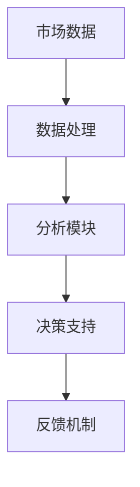

                 


# 芒格的认知偏差理论：如何克服投资中的心理陷阱

## 关键词：芒格认知偏差，投资心理，决策陷阱，心理账户，决策框架

## 摘要：  
芒格的认知偏差理论深刻揭示了投资决策中常见的心理陷阱，通过分析确认偏差、损失厌恶等认知偏差，提出了克服这些偏差的决策框架和心理账户管理方法。本文从认知偏差的背景、核心概念、算法原理、数学模型、系统架构到项目实战，全面探讨如何在投资中克服心理陷阱，帮助投资者做出更理性的决策。

---

# 引言：认知偏差与投资决策

## 1. 认知偏差概述

### 1.1 认知偏差的定义与分类  
认知偏差是指人们在信息处理和决策过程中，由于心理、环境等因素的影响，导致系统性偏离理性思考的错误判断。常见的认知偏差包括确认偏差、损失厌恶、从众心理等。  

| 偏差类型      | 定义与特征                                                                 |
|---------------|---------------------------------------------------------------------------|
| 确认偏差      | 倾向于寻找支持已知结论的信息，忽略相反证据。                             |
| 损失厌恶      | 对损失的恐惧超过对收益的追求，导致风险厌恶。                             |
| 从众心理      | 因随大流而做出与个人判断相悖的决策。                                       |

### 1.2 芒格的认知偏差理论  
芒格是巴菲特的长期合作伙伴，他提出的认知偏差理论强调，投资者的心理偏差是导致错误决策的主要原因。芒格认为，克服这些偏差需要建立系统的决策框架和心理账户管理。

### 1.3 投资中的心理陷阱  
在投资中，认知偏差表现为从众投资、过度自信、 anchoring effect（ anchoring effect）等。这些偏差可能导致投资者做出非理性的决策，如盲目跟风或过度交易。

---

# 第二部分：认知偏差的核心概念与算法原理

## 2. 确认偏差

### 2.1 确认偏差的定义与特征  
确认偏差是指投资者倾向于寻找支持自己已有观点的信息，而忽略或排斥与之相悖的证据。这种偏差可能导致投资者坚持错误的投资决策，错过调整的机会。

### 2.2 确认偏差的算法原理  
确认偏差可以通过信息过滤和选择性关注来解释。投资者会优先选择支持自己观点的信息源，并忽视相反的证据。这种选择性关注可以看作是一种过滤机制，导致信息处理的偏差。

### 2.3 确认偏差的数学模型  
确认偏差可以通过概率论中的贝叶斯定理进行分析。假设投资者已经有一个信念，他们可能会过度权重支持该信念的证据，而低估相反证据的概率。

$$ P(B|E) = \frac{P(E|B)P(B)}{P(E)} $$

其中，P(B|E)是信念B在证据E下的概率，P(E|B)是证据E在信念B下的概率，P(B)是先验概率，P(E)是证据E的全概率。

---

## 3. 损失厌恶

### 3.1 损失厌恶的定义与特征  
损失厌恶是指人们对损失的恐惧程度远超过对收益的追求。这种偏差导致投资者在面对损失时过度保守，甚至拒绝合理的机会。

### 3.2 损失厌恶的算法原理  
损失厌恶可以通过风险厌恶模型来解释。投资者在决策时，倾向于选择风险较低但收益较低的选项，而不是风险较高但潜在收益更高的选项。

### 3.3 损失厌恶的数学模型  
损失厌恶可以用效用函数来建模。效用函数将收益和损失转化为效用值，反映了投资者对风险的敏感性。

$$ U(r) = \ln(1 - r) $$

其中，U(r)是效用函数，r是收益率。ln函数的凹性反映了损失厌恶。

---

# 第三部分：系统架构与投资决策

## 4. 投资决策的系统化方法

### 4.1 系统设计  
投资决策系统需要考虑市场数据、个人风险承受能力、投资目标等多个因素。系统架构应包括数据采集、分析、决策支持和反馈机制。

### 4.2 系统架构图  



### 4.3 接口设计  
系统需要提供用户友好的界面，包括数据输入、分析结果展示和决策建议。接口设计应简洁明了，便于投资者理解和操作。

---

## 5. 项目实战：认知偏差分析与应对策略

### 5.1 环境安装  
需要安装Python、Pandas、Matplotlib等工具，用于数据处理和可视化。

### 5.2 核心实现代码  

```python
# 计算确认偏差的影响
import pandas as pd

def calculate_confirmation_bias(portfolio, actual_return):
    # 计算预期收益
    expected_return = portfolio.mean()
    # 计算偏差
    bias = actual_return - expected_return
    return bias

# 示例数据
portfolio = [10, 20, 30, 40]
actual_return = 25
print(calculate_confirmation_bias(portfolio, actual_return))
```

### 5.3 案例分析  
以某投资者为例，分析其投资决策中的确认偏差。通过数据可视化展示偏差，制定应对策略，如增加分散投资、定期回顾决策等。

---

# 结语：克服认知偏差，提升投资决策

## 6. 最佳实践 tips  
- 定期回顾投资决策，识别偏差。
- 建立系统的决策框架，避免情绪化决策。
- 使用工具和技术手段，量化分析偏差。

## 7. 小结  
认知偏差是投资中的主要障碍，芒格的理论提供了克服这些偏差的实用方法。通过系统化的分析和实践，投资者可以减少偏差的影响，做出更理性的决策。

## 8. 注意事项  
- 认知偏差是复杂的，需要长期实践和学习。
- 不要过度依赖技术工具，保持主观判断。

## 9. 拓展阅读  
推荐阅读《芒格的投资心理术》和《思考，快与慢》等书籍，深入理解认知偏差的理论与应用。

---

# 作者：AI天才研究院/AI Genius Institute & 禅与计算机程序设计艺术 /Zen And The Art of Computer Programming

