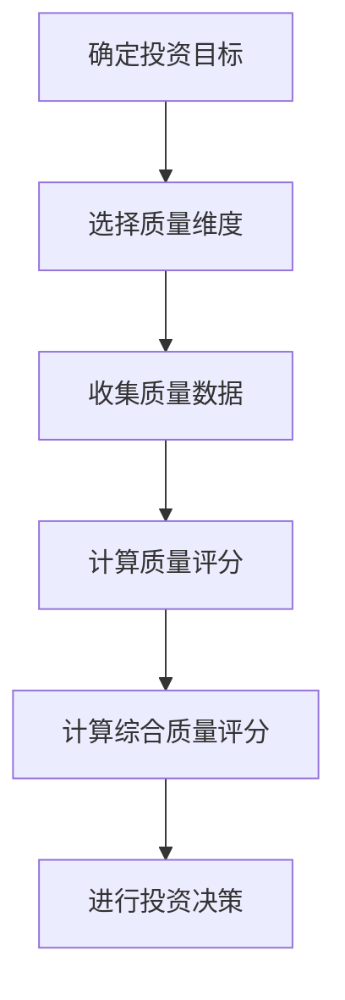
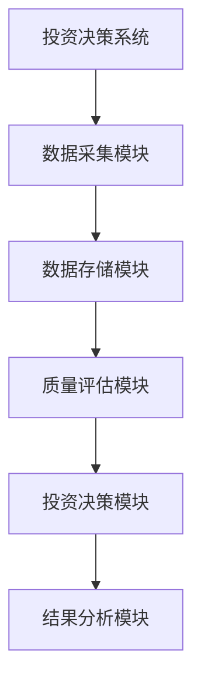
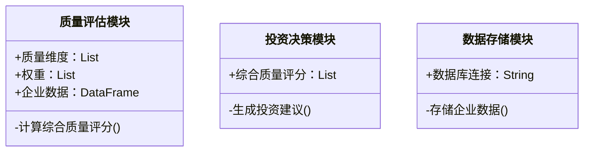

                 


# 《芒格的质量优先原则在投资中的应用》

## 关键词：芒格、质量优先原则、投资、算法、系统架构、项目实战

## 摘要：本文深入探讨了芒格的质量优先原则在投资中的应用，通过背景介绍、核心概念、算法原理、系统分析和项目实战等多角度，详细阐述了如何利用质量优先原则进行投资决策。文章从理论到实践，结合具体案例和系统架构，帮助读者全面理解和应用这一投资策略。

---

## 第一部分：引言

### 1.1 芒格与质量优先原则
#### 1.1.1 芒格的背景与投资理念
芒格是巴菲特的合作伙伴，他的投资理念强调质量而非数量，注重企业的长期价值和内在质量。芒格认为，投资成功的关键在于理解企业的真实价值，并选择那些具有持续竞争优势和优秀管理团队的企业。

#### 1.1.2 质量优先原则的核心思想
质量优先原则强调在投资决策中，优先选择那些具有高质量特性的企业。这些特性包括盈利能力、管理团队、行业地位、财务健康状况等。芒格认为，高质量的企业能够在市场波动中保持稳定，并为投资者带来长期的超额收益。

#### 1.1.3 本文的核心目标与结构安排
本文旨在探讨芒格的质量优先原则在投资中的具体应用，通过理论分析和实践案例，帮助读者掌握这一投资策略。文章结构包括背景介绍、核心概念、算法原理、系统分析和项目实战等部分。

---

## 第二部分：质量优先原则的背景与基础

### 2.1 投资中的质量概念
#### 2.1.1 质量在投资中的重要性
质量是投资的核心因素。高质量的企业具有更强的抗风险能力和盈利能力，能够在市场波动中为投资者提供稳定的回报。与之相比，低质量的企业容易受到市场变化的影响，投资风险较高。

#### 2.1.2 质量优先与数量优先的对比
传统的投资策略往往注重数量指标，如市盈率、市净率等，而忽略了企业的质量特性。质量优先原则则强调从企业的基本面出发，选择具有持续竞争优势和优秀管理团队的企业。

#### 2.1.3 质量优先原则的边界与外延
质量优先原则的应用范围广泛，但需要根据具体的投资环境和目标进行调整。本文将重点分析其在股票投资中的应用，同时也探讨其在其他投资领域中的潜在应用。

### 2.2 质量优先原则的核心要素
#### 2.2.1 质量维度的定义与分类
质量维度包括盈利能力、管理团队、行业地位、财务健康状况、创新能力和竞争优势等多个方面。每个维度都有其独特的评估指标和权重。

#### 2.2.2 质量维度的权重分配
质量维度的权重分配是质量优先原则的关键步骤。本文将通过数学模型和表格，详细阐述如何根据具体投资目标和市场环境，合理分配各质量维度的权重。

#### 2.2.3 质量优先原则的数学模型
质量优先原则的数学模型可以通过加权平均的方式，将各质量维度的评分与权重相乘，最终得到企业的综合质量评分。公式如下：
$$
\text{综合质量评分} = \sum_{i=1}^{n} w_i \times s_i
$$
其中，$w_i$ 是第 $i$ 个质量维度的权重，$s_i$ 是第 $i$ 个质量维度的评分。

---

## 第三部分：质量优先原则的核心概念与联系

### 3.1 质量优先原则的原理
#### 3.1.1 质量优先原则的逻辑框架
质量优先原则的逻辑框架包括以下几个步骤：
1. 确定投资目标和风险偏好。
2. 选择相关的质量维度。
3. 收集和分析企业的质量数据。
4. 计算各质量维度的评分和权重。
5. 计算综合质量评分，并进行投资决策。

#### 3.1.2 质量优先原则的数学模型与公式
质量优先原则的数学模型可以进一步细化为：
$$
\text{质量维度评分} = \frac{\text{企业某维度的指标值}}{\text{行业平均值}} \times 100
$$
权重分配可以通过层次分析法（AHP）进行计算：
$$
\text{权重} = \frac{\text{质量维度的重要性得分}}{\sum \text{所有质量维度的重要性得分}}
$$

#### 3.1.3 质量优先原则的流程图（Mermaid）


### 3.2 质量优先原则与传统投资策略的对比
#### 3.2.1 传统投资策略的特点与局限性
传统投资策略通常依赖于市场趋势和技术分析，忽视了企业的基本面质量。这种策略在市场波动较大时表现不稳定，容易导致投资损失。

#### 3.2.2 质量优先原则的优势与适用场景
质量优先原则的优势在于其注重企业的内在质量，能够在市场波动中稳定表现。其适用场景包括长期投资、价值投资和防御性投资。

#### 3.2.3 质量优先原则与传统策略的对比表格（Mermaid）
```mermaid
table
| 策略特点         | 传统投资策略      | 质量优先原则     |
|------------------|------------------|-----------------|
| 着重点           | 市场趋势和技术分析 | 企业基本面质量    |
| 适用场景         | 短期交易          | 长期投资         |
| 优势             | 灵活性高          | 稳定性和可靠性   |
| 局限性           | 风险较高          | 初期投入较大     |
```

---

## 第四部分：质量优先原则的算法原理

### 4.1 质量优先算法的原理
#### 4.1.1 算法的基本思路
质量优先算法的基本思路包括以下几个步骤：
1. 确定投资目标和风险偏好。
2. 选择相关的质量维度。
3. 收集和分析企业的质量数据。
4. 计算各质量维度的评分和权重。
5. 计算综合质量评分，并进行投资决策。

#### 4.1.2 质量优先算法的数学模型与公式
质量优先算法的数学模型可以表示为：
$$
\text{综合质量评分} = \sum_{i=1}^{n} w_i \times s_i
$$
其中，$w_i$ 是第 $i$ 个质量维度的权重，$s_i$ 是第 $i$ 个质量维度的评分。

#### 4.1.3 质量优先算法的流程图（Mermaid）


### 4.2 质量优先算法的实现
#### 4.2.1 质量优先算法的Python实现
以下是质量优先算法的Python实现示例：
```python
import pandas as pd

# 定义质量维度和权重
quality_dimensions = ['盈利能力', '管理团队', '行业地位', '财务健康状况']
weights = [0.4, 0.3, 0.2, 0.1]

# 收集企业的质量数据
data = {
    '企业A': [85, 90, 75, 95],
    '企业B': [70, 85, 80, 85],
    '企业C': [90, 80, 65, 75]
}
df = pd.DataFrame(data, columns=quality_dimensions)

# 计算综合质量评分
def calculate_quality_score(row, weights):
    return sum(w * score for w, score in zip(weights, row))

quality_scores = df.apply(lambda x: calculate_quality_score(x, weights), axis=1)
print(quality_scores)
```

---

## 第五部分：质量优先原则的系统分析与架构设计

### 5.1 系统分析
#### 5.1.1 问题场景介绍
在实际投资中，投资者需要处理大量的数据和信息，包括企业的财务数据、行业动态、市场趋势等。质量优先原则的应用需要一个高效的系统来支持。

#### 5.1.2 系统功能设计
系统功能设计包括数据采集、质量评估、投资决策和结果分析。

#### 5.1.3 系统架构设计（Mermaid）


### 5.2 系统架构设计
#### 5.2.1 领域模型（Mermaid类图）


#### 5.2.2 系统接口设计
系统接口设计包括数据输入接口、数据处理接口和结果输出接口。

#### 5.2.3 系统交互流程图（Mermaid序列图）
```mermaid
sequenceDiagram
    participant 投资者
    participant 数据采集模块
    participant 数据存储模块
    participant 质量评估模块
    participant 投资决策模块
    股票 >> 投资者
    投资者 -> 数据采集模块: 获取企业数据
    数据采集模块 -> 数据存储模块: 存储企业数据
    投资者 -> 质量评估模块: 计算质量评分
    质量评估模块 -> 数据存储模块: 获取企业数据
    质量评估模块 -> 投资决策模块: 提供质量评分
    投资决策模块 -> 投资者: 生成投资建议
```

---

## 第六部分：质量优先原则的项目实战

### 6.1 投资组合优化案例
#### 6.1.1 环境安装
需要安装Python、Pandas、NumPy等库。

#### 6.1.2 核心代码实现
以下是投资组合优化的Python代码：
```python
import pandas as pd
import numpy as np

# 定义质量维度和权重
quality_dimensions = ['盈利能力', '管理团队', '行业地位', '财务健康状况']
weights = [0.4, 0.3, 0.2, 0.1]

# 收集企业的质量数据
data = {
    '企业A': [85, 90, 75, 95],
    '企业B': [70, 85, 80, 85],
    '企业C': [90, 80, 65, 75]
}
df = pd.DataFrame(data, columns=quality_dimensions)

# 计算综合质量评分
def calculate_quality_score(row, weights):
    return sum(w * score for w, score in zip(weights, row))

quality_scores = df.apply(lambda x: calculate_quality_score(x, weights), axis=1)
print(quality_scores)
```

#### 6.1.3 案例分析与解读
通过计算综合质量评分，投资者可以优先选择质量评分较高的企业进行投资。例如，企业A的质量评分为：
$$
\text{企业A质量评分} = 0.4 \times 85 + 0.3 \times 90 + 0.2 \times 75 + 0.1 \times 95 = 85.5
$$
企业A的质量评分为85.5，高于企业B和企业C，因此投资者可以优先选择企业A进行投资。

---

## 第七部分：总结与展望

### 7.1 总结
本文通过理论分析和实践案例，详细阐述了芒格的质量优先原则在投资中的应用。质量优先原则强调在投资决策中，优先选择那些具有高质量特性的企业，能够在市场波动中为投资者提供稳定的回报。

### 7.2 最佳实践 tips
1. 在选择投资标的时，优先考虑企业的质量特性。
2. 使用数学模型和算法，合理分配各质量维度的权重。
3. 结合市场环境和投资目标，动态调整质量优先策略。

### 7.3 未来展望
未来，质量优先原则可以在更多投资领域中得到应用，例如私募股权、风险投资等。同时，随着人工智能和大数据技术的发展，质量优先原则可以通过更加智能化的方式实现。

---

## 作者：AI天才研究院/AI Genius Institute & 禅与计算机程序设计艺术 /Zen And The Art of Computer Programming

