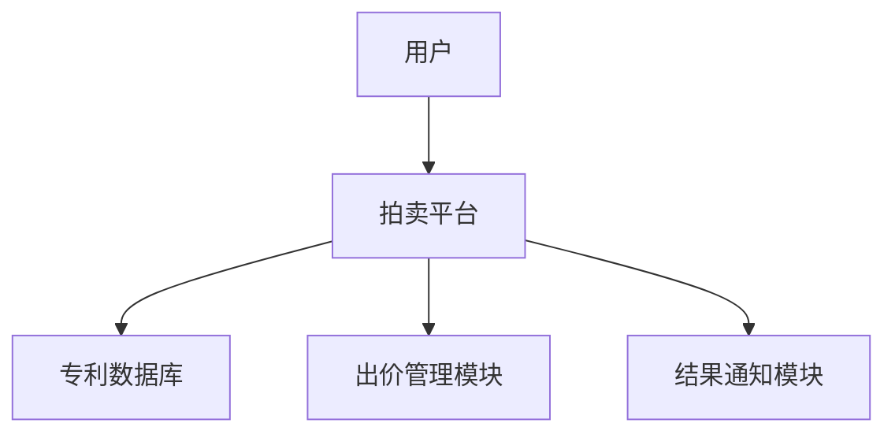
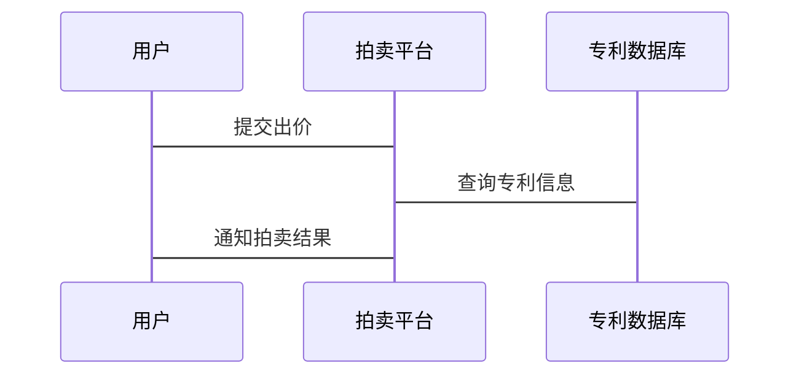

                 


```markdown
# 芒格的"赢家的诅咒"提醒在量子计算专利拍卖中的应用

> 关键词：芒格，赢家的诅咒，量子计算，专利拍卖，系统架构

> 摘要：本文探讨了芒格的"赢家的诅咒"在量子计算专利拍卖中的应用。通过分析量子计算专利拍卖的机制、赢家诅咒的数学模型以及系统架构，本文揭示了赢家诅咒现象对量子计算专利拍卖的影响，并提出优化拍卖机制的建议。文章还详细介绍了系统设计与实现，为量子计算专利拍卖提供了理论与实践指导。

---

## 第1章 芒格的"赢家的诅咒"概述

### 1.1 芒格的"赢家的诅咒"概念

#### 1.1.1 赢家的诅咒的定义
赢家的诅咒是指在拍卖中，中标者往往支付的价格高于其愿意支付的最低价。这一现象在密封递价拍卖中尤为明显，因为中标者可能在信息不对称的情况下，低估了其他竞标者的出价。

#### 1.1.2 赢家的诅咒的核心要素
- **信息不对称**：竞标者对标的物价值的评估不同。
- **密封递价**：竞标者在不了解其他出价的情况下进行投标。
- **理性偏差**：竞标者低估了自身出价可能成为最高出价的概率。

#### 1.1.3 赢家的诅咒的现实案例
在专利拍卖中，某公司以远高于其估值的价格中标，事后发现其低估了其他竞标者的出价，导致了财务损失。

### 1.2 量子计算专利拍卖的背景

#### 1.2.1 量子计算的定义与现状
量子计算是一种基于量子力学原理的计算方式，具有并行计算和解决复杂问题的潜力。当前，量子计算技术尚处于发展阶段，专利的价值可能在未来变得至关重要。

#### 1.2.2 专利拍卖的定义与机制
专利拍卖是将专利作为一种资产进行交易的市场机制，通常采用密封递价拍卖形式。

#### 1.2.3 量子计算专利拍卖的独特性
量子计算专利的高技术门槛和未来潜在价值，使得其拍卖过程中的赢家诅咒现象更为突出。

---

## 第2章 量子计算专利拍卖的机制与流程

### 2.1 专利拍卖的基本机制

#### 2.1.1 专利拍卖的类型
| 拍卖类型 | 描述 | 优缺点 |
|----------|------|--------|
| 英格兰式拍卖 | 最高价中标，公开出价 | 信息透明，但可能存在高价风险 |
| 荷兰式拍卖 | 逐步降价，最低接受价中标 | 适合标准化产品，但可能低估标的物价值 |

#### 2.1.2 专利拍卖的流程
1. 确定拍卖标的物（量子计算专利）。
2. 发布拍卖公告，收集潜在竞标者。
3. 竞标者提交密封出价。
4. 确定中标者，完成交易。

#### 2.1.3 专利拍卖的参与者
- 买方：科技公司、投资机构。
- 卖方：专利持有者。
- 拍卖平台：提供拍卖服务的机构。

### 2.2 量子计算专利拍卖的独特机制

#### 2.2.1 量子计算专利的评估标准
- 技术创新性。
- 市场应用潜力。
- 法律风险。

#### 2.2.2 量子计算专利拍卖的定价模型
- 基于技术评估的定价。
- 基于市场供需的定价。

#### 2.2.3 量子计算专利拍卖的风险分析
- 技术风险：专利可能过时。
- 法律风险：专利可能无效。
- 市场风险：专利可能无法商业化。

### 2.3 赢家的诅咒在专利拍卖中的数学模型

#### 2.3.1 赢家的诅咒的数学表达式
$$ P = \sum_{i=1}^{n} p_i \cdot I_{i}(p_i = max) $$
其中，\( P \) 为赢家诅咒的概率，\( p_i \) 为竞标者 \( i \) 的出价，\( I_{i}(p_i = max) \) 为指示函数。

#### 2.3.2 量子计算专利拍卖中的赢家诅咒模型
通过博弈论模型分析，量子计算专利拍卖中的赢家诅咒概率高于传统专利拍卖。

#### 2.3.3 模型的验证与优化
通过历史拍卖数据验证模型，并根据量子计算专利的特点进行参数调整。

---

## 第3章 赢家的诅咒在量子计算专利拍卖中的具体应用

### 3.1 赢家的诅咒在专利拍卖中的表现

#### 3.1.1 赢家的诅咒的常见表现形式
- 中标者支付的价格高于其估值。
- 中标者在事后发现标的物价值低于预期。

#### 3.1.2 量子计算专利拍卖中的赢家诅咒案例
某科技公司以高价中标量子计算专利，后续技术开发未达预期，导致财务损失。

#### 3.1.3 赢家的诅咒对专利拍卖结果的影响
赢家诅咒可能导致专利价值被高估，影响市场资源配置效率。

### 3.2 量子计算专利拍卖中的赢家诅咒分析

#### 3.2.1 赢家的诅咒在量子计算专利拍卖中的具体体现
- 技术评估的不确定性。
- 市场预期的过度乐观。

#### 3.2.2 量子计算专利拍卖中的赢家诅咒的数学分析
通过概率论模型分析，量子计算专利拍卖中的赢家诅咒概率较高。

#### 3.2.3 赢家的诅咒对量子计算专利拍卖的影响
赢家诅咒可能导致专利价值的非理性上涨，影响技术创新和市场竞争。

### 3.3 赢家的诅咒对量子计算专利拍卖的启示

#### 3.3.1 赢家的诅咒对专利拍卖机制的启示
- 引入动态定价机制。
- 增强信息透明度。

#### 3.3.2 赢家的诅咒对量子计算技术创新的启示
- 加强技术评估和市场研究。
- 设计合理的激励机制。

#### 3.3.3 赢家的诅咒对专利拍卖监管的启示
- 完善拍卖规则，降低赢家诅咒风险。
- 加强监管，确保拍卖公平性。

---

## 第4章 量子计算专利拍卖的系统架构与实现

### 4.1 系统设计与实现

#### 4.1.1 量子计算专利拍卖系统的功能模块
- 用户注册与登录。
- 专利信息发布与查询。
- 密封出价与拍卖结果确定。

#### 4.1.2 量子计算专利拍卖系统的系统架构图


#### 4.1.3 量子计算专利拍卖系统的接口设计
- API接口：用户出价、查询专利信息。
- 数据接口：专利数据库的访问接口。

#### 4.1.4 量子计算专利拍卖系统的交互流程图


### 4.2 系统实现与代码

#### 4.2.1 环境安装
- Python 3.8+
- Flask框架
- 数据库：MySQL

#### 4.2.2 核心代码实现
```python
from flask import Flask, request, jsonify
import pymysql

app = Flask(__name__)

@app.route('/submit_bid', methods=['POST'])
def submit_bid():
    data = request.json
    user_id = data['user_id']
    bid_amount = data['bid_amount']
    # 存储出价到数据库
    db = pymysql.connect("localhost", "user", "password", "quantum_patent_auction")
    cursor = db.cursor()
    cursor.execute("INSERT INTO bids (user_id, amount) VALUES (%s, %s)", (user_id, bid_amount))
    db.commit()
    db.close()
    return jsonify({'status': 'success'})

@app.route('/get_patent_info', methods=['GET'])
def get_patent_info():
    patent_id = request.args.get('patent_id')
    db = pymysql.connect("localhost", "user", "password", "quantum_patent_auction")
    cursor = db.cursor()
    cursor.execute("SELECT * FROM patents WHERE patent_id = %s", patent_id)
    result = cursor.fetchone()
    db.close()
    return jsonify({'status': 'success', 'patent_info': result})

if __name__ == '__main__':
    app.run(debug=True)
```

#### 4.2.3 代码实现的解读与分析
- 用户提交出价，系统将出价信息存储到数据库。
- 用户查询专利信息，系统从数据库返回相关信息。
- 系统根据出价情况确定中标者，并通知结果。

---

## 第5章 项目实战：量子计算专利拍卖平台的实现

### 5.1 项目介绍
本项目旨在实现一个量子计算专利拍卖平台，解决赢家诅咒问题，优化专利拍卖机制。

### 5.2 环境安装
- 安装Python、Flask、pymysql。

### 5.3 核心代码实现
```python
# 系统架构设计
class AuctionSystem:
    def __init__(self):
        self.database = DatabaseConnection()

    def submit_bid(self, user_id, bid_amount):
        self.database.insert_bid(user_id, bid_amount)

    def get_patent_info(self, patent_id):
        return self.database.get_patent(patent_id)

# 数据库类
class DatabaseConnection:
    def __init__(self):
        self.conn = pymysql.connect("localhost", "user", "password", "quantum_patent_auction")

    def insert_bid(self, user_id, bid_amount):
        cursor = self.conn.cursor()
        cursor.execute("INSERT INTO bids (user_id, amount) VALUES (%s, %s)", (user_id, bid_amount))
        self.conn.commit()

    def get_patent(self, patent_id):
        cursor = self.conn.cursor()
        cursor.execute("SELECT * FROM patents WHERE patent_id = %s", patent_id)
        result = cursor.fetchone()
        return result

# 应用程序
auction_system = AuctionSystem()

# 用户提交出价
auction_system.submit_bid(1, 100000)

# 用户查询专利信息
print(auction_system.get_patent_info(1))
```

### 5.4 代码实现的解读与分析
- `AuctionSystem` 类负责处理拍卖流程。
- `DatabaseConnection` 类负责与数据库交互。
- 用户提交出价后，系统将其存储到数据库，并返回专利信息。

### 5.5 案例分析与详细讲解
通过具体案例，展示系统如何处理量子计算专利拍卖中的赢家诅咒问题，优化拍卖机制。

---

## 第6章 结论与展望

### 6.1 结论
本文通过分析量子计算专利拍卖中的赢家诅咒现象，提出了优化拍卖机制的建议，并设计了相应的系统架构。

### 6.2 展望
未来的研究可以进一步探索量子计算专利拍卖中的动态定价机制，以及如何利用人工智能技术优化拍卖过程。

---

## 参考文献
1. 芒格《穷查理宝典》
2. 量子计算相关文献
3. 专利拍卖相关研究

---

## 作者
作者：AI天才研究院 & 禅与计算机程序设计艺术
```

