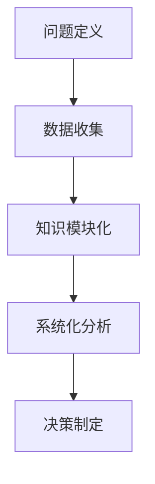

                 

# 《芒格的"跨学科学习"在投资视野拓展中的应用》

**关键词**：跨学科学习、投资视野、芒格、知识体系、系统思维、风险管理

**摘要**：  
芒格的“跨学科学习”方法是一种通过整合不同学科知识来提升投资决策能力的策略。本文深入探讨了跨学科学习的核心概念、其在投资分析中的具体应用，以及如何构建有效的投资分析框架。通过分析心理学、经济学等学科在投资中的应用，本文展示了跨学科学习如何帮助投资者拓展视野、优化决策，并降低投资风险。文章最后总结了跨学科学习在投资中的重要性，并提出了最佳实践建议。

---

## 第一章：背景介绍

### 1.1 跨学科学习的定义与核心要素

跨学科学习（Interdisciplinary Learning）是指将不同学科的知识、方法和视角结合起来，以解决复杂问题或拓展知识视野的学习方式。其核心要素包括：

- **知识整合**：将不同学科的概念和理论结合起来，形成新的认知框架。
- **问题导向**：通过解决实际问题来驱动跨学科学习。
- **系统思维**：从整体角度理解问题，而非单一维度。

| **跨学科学习** | **单一学科学习** |
|-----------------|-------------------|
| 整合多学科知识 | 专注于单一学科 |
| 解决复杂问题   | 解决简单或单一问题 |
| 全局视角       | 局部视角          |

### 1.2 芒格的生平与投资理念

沃伦·芒格（Warren Buffett）是著名的投资家，他的跨学科学习方法源于对多种学科的深入研究。芒格的投资理念强调：

- **价值投资**：寻找具有长期竞争优势的企业。
- **安全边际**：在投资中留出足够的安全空间。
- **逆向思维**：在别人恐惧时贪婪，在别人贪婪时恐惧。

### 1.3 投资视野拓展的重要性

投资决策往往涉及复杂的问题，单一学科的知识难以应对市场的不确定性。跨学科学习通过整合心理学、经济学、历史学等学科的知识，帮助投资者更全面地分析问题，避免认知偏差。

---

## 第二章：跨学科学习的核心概念

### 2.1 跨学科学习的核心原理

跨学科学习的核心在于：

- **知识的模块化**：将不同学科的知识分解为模块，便于组合和应用。
- **系统的思维方式**：通过系统架构将各模块连接起来，形成完整的认知框架。

### 2.2 跨学科知识体系的构建

构建跨学科知识体系的关键步骤包括：

1. **确定目标**：明确学习的目标和应用场景。
2. **选择学科**：根据目标选择相关学科。
3. **知识整合**：将各学科的知识点整合到统一的框架中。

### 2.3 跨学科学习与单一学科学习的对比

| **方面**       | **跨学科学习**       | **单一学科学习**     |
|-----------------|---------------------|---------------------|
| 知识整合         | 强调多学科结合       | 专注于单一学科       |
| 解决问题能力     | 能够解决复杂问题     | 适用于简单问题       |
| 可扩展性         | 高                  | 低                  |

---

## 第三章：跨学科学习在投资中的应用

### 3.1 心理学在投资中的应用

心理学帮助投资者理解市场中的非理性行为：

- **行为偏差**：如过度自信、从众心理等。
- **情绪管理**：帮助投资者避免情绪化决策。

### 3.2 经济学在投资中的应用

经济学提供了分析市场运行的基本工具：

- **市场均衡**：理解供给与需求的关系。
- **成本收益分析**：评估投资的可行性。

### 3.3 历史学在投资中的应用

历史学提供了长期视角下的市场规律：

- **周期分析**：识别经济周期和市场周期。
- **案例研究**：从历史案例中汲取经验教训。

### 3.4 其他学科的应用

- **统计学**：用于数据分析和风险评估。
- **法学**：理解法律对市场的影响。

---

## 第四章：投资分析框架的设计

### 4.1 知识模块化

将知识分解为模块：

1. **市场分析模块**：分析市场趋势和竞争对手。
2. **财务分析模块**：评估企业的财务状况。
3. **风险评估模块**：识别潜在风险。

### 4.2 系统化分析流程

系统化分析流程的步骤：

1. **问题定义**：明确分析的目标。
2. **数据收集**：收集相关数据。
3. **分析与整合**：将各模块的知识整合到系统中。
4. **决策制定**：基于系统分析结果做出决策。

**Mermaid 投资分析框架图**：

---

## 第五章：投资系统的优化与风险管理

### 5.1 投资系统的设计

投资系统设计的关键要素：

1. **输入模块**：收集市场数据。
2. **处理模块**：分析数据并生成信号。
3. **输出模块**：生成投资建议。

### 5.2 系统优化方法

- **反馈机制**：根据市场变化调整系统。
- **参数优化**：通过调整参数提高系统性能。

### 5.3 风险管理策略

- **风险分散**：通过多元化投资降低风险。
- **止损机制**：设定止损点以限制损失。

---

## 第六章：案例分析与经验总结

### 6.1 成功案例分析

以某公司为例，分析跨学科学习如何帮助做出投资决策：

1. **市场分析**：利用经济学和历史学知识识别市场趋势。
2. **财务分析**：通过财务指标评估企业价值。
3. **风险管理**：利用统计学方法评估潜在风险。

### 6.2 失败案例分析

分析一次失败的投资决策，总结教训：

- **认知偏差**：过度依赖单一学科的知识。
- **系统缺陷**：忽略某些关键风险因素。

### 6.3 经验总结

- **持续学习**：保持对新知识的吸收。
- **系统优化**：定期检查和优化投资系统。
- **风险管理**：始终将风险管理放在首位。

---

## 结论

跨学科学习是拓展投资视野的重要工具，它通过整合多学科的知识，帮助投资者更全面地分析问题，做出更明智的投资决策。芒格的跨学科学习方法为我们提供了一个优秀的范例，展示了如何将跨学科的知识应用于投资实践中。

### 最佳实践 Tips

1. **广泛阅读**：涉猎不同领域的书籍和文章。
2. **实践应用**：将学到的知识应用到实际投资中。
3. **持续优化**：定期回顾和优化投资策略。

---

## 作者信息

作者：AI天才研究院  
机构：禅与计算机程序设计艺术  
联系邮箱：contact@aicourse.com  

---

通过本文的详细分析，读者可以深入理解跨学科学习在投资中的应用，并将其应用于实际投资决策中。

