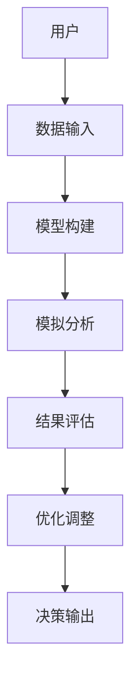

                 


# 芒格的"跨学科"学习：拓宽投资视野的重要性

## 关键词：芒格、跨学科、投资视野、决策模型、mental models、风险管理

## 摘要：  
本文将探讨芒格的"跨学科"学习方法及其在投资决策中的重要性。通过分析芒格的"mental models"概念，我们将了解如何通过跨学科思维来拓宽投资视野，优化决策过程。文章从芒格的决策模型、跨学科思维的核心概念、算法原理、系统架构设计等方面展开，结合实际案例和数学模型，深入剖析跨学科思维在投资中的应用。最后，我们将总结最佳实践，为投资者提供实用的建议。

---

## 第1章: 引言

### 1.1 背景介绍  
芒格（Charlie Munger）作为巴菲特（Warren Buffett）的长期合作伙伴，以其独特的"mental models"（思维模型）闻名。芒格认为，投资决策不应局限于单一学科的视角，而是需要通过跨学科的思维方式来理解问题的本质。这种思维方式不仅帮助他取得了卓越的投资成绩，也为现代投资理论提供了新的视角。  

### 1.2 问题背景与描述  
传统投资分析往往依赖于财务数据和市场趋势的分析，而芒格的跨学科学习方法则强调从多个学科中汲取智慧，构建多元化的思维模型。这种思维方式的核心在于通过理解不同学科的基本原理，将它们应用于投资决策中，从而避免单一视角的局限性。  

### 1.3 问题解决与目标  
本文旨在探讨芒格的跨学科学习方法，分析其如何通过构建多元化的思维模型来优化投资决策。通过结合实际案例和数学模型，我们将深入剖析跨学科思维在投资中的应用价值，并总结出一套可操作的策略。  

### 1.4 边界与外延  
跨学科学习的核心在于将不同学科的理论和方法结合起来，但其外延并不限于投资领域，也可以应用于其他领域。然而，本文主要聚焦于投资决策中的应用，探讨其具体方法和实践技巧。  

### 1.5 概念结构与核心要素  
芒格的"mental models"概念可以分解为以下几个核心要素：  
1. **多学科视角**：从不同学科中汲取智慧。  
2. **模型构建**：将学科知识转化为可操作的模型。  
3. **决策优化**：通过模型的结合与优化，提升决策质量。  

---

## 第2章: 芒格的跨学科思维模型

### 2.1 核心概念与原理  
芒格的"mental models"是一种通过跨学科学习构建的思维方式。它强调从物理学、心理学、经济学等多个学科中汲取知识，形成多元化的决策模型。  

#### 2.1.1 芒格决策模型的核心要素  
1. **多学科视角**：芒格认为，单一学科的视角往往不足以应对复杂的投资问题。通过跨学科学习，可以更全面地理解问题的本质。  
2. **模型构建**：将不同学科的基本原理转化为可操作的模型。例如，物理学中的能量守恒定律可以被用来理解市场的供需关系。  
3. **决策优化**：通过模型的结合与优化，提升决策的准确性和可靠性。  

#### 2.1.2 芒格决策模型的关键特征  
1. **综合性**：跨学科思维的核心在于将不同领域的知识综合起来，形成一个完整的知识体系。  
2. **动态性**：模型需要根据实际情况进行调整和优化，以适应不断变化的市场环境。  
3. **实用性**：模型的应用需要结合实际问题，避免过于理论化。  

#### 2.1.3 芒格决策模型的优缺点  
**优点**：  
1. 提供多元化的视角，避免单一视角的局限性。  
2. 增强决策的全面性和科学性。  
3. 提高对复杂问题的理解能力。  

**缺点**：  
1. 实施难度较高，需要广泛的知识储备和较强的学习能力。  
2. 需要不断更新和优化模型，增加了时间和精力成本。  

---

## 第3章: 芒格决策模型的算法原理

### 3.1 芒格决策模型的算法概述  
芒格的决策模型是一种基于多学科知识的综合分析方法。它通过构建多个学科的模型，并将它们结合起来，对投资问题进行综合分析。  

#### 3.1.1 算法的输入与输出  
**输入**：  
1. 投资目标与约束条件。  
2. 相关学科的理论与模型。  

**输出**：  
1. 投资决策建议。  
2. 相关风险评估与优化方案。  

#### 3.1.2 算法的步骤与流程  
1. **问题分析**：明确投资问题的核心，确定需要考虑的因素。  
2. **模型构建**：从不同学科中选择适用的模型，并进行调整和优化。  
3. **数据输入**：将实际数据输入模型，进行模拟分析。  
4. **结果评估**：根据模型输出的结果，评估投资方案的可行性。  
5. **优化调整**：根据评估结果，对模型进行优化调整，制定最终决策。  

#### 3.1.3 算法的数学模型  
以下是一个简单的数学模型示例：  
$$ \text{收益} = \sum_{i=1}^{n} w_i \times r_i $$  
其中，$w_i$ 是第 $i$ 个模型的权重，$r_i$ 是第 $i$ 个模型的收益。  

---

## 第4章: 芒格决策模型的系统架构设计

### 4.1 系统功能设计  
1. **模型构建**：允许用户从不同学科中选择模型，并进行参数调整。  
2. **数据输入**：支持多种数据格式的输入，包括财务数据、市场数据等。  
3. **模拟分析**：对投资方案进行模拟分析，输出结果。  
4. **结果评估**：根据模拟结果，评估投资方案的可行性。  
5. **优化调整**：提供优化建议，帮助用户制定最优决策。  

### 4.2 系统架构设计  
以下是一个简化的系统架构图：  


### 4.3 系统接口设计  
1. **输入接口**：支持多种数据格式的输入，包括CSV、Excel等。  
2. **输出接口**：输出结果包括文本报告和可视化图表。  
3. **用户界面**：提供友好的用户界面，方便用户进行操作。  

---

## 第5章: 项目实战与案例分析

### 5.1 项目背景  
某投资者希望通过芒格的决策模型，对一家公司的投资价值进行评估。  

### 5.2 项目实施  
1. **问题分析**：明确投资目标和约束条件。  
2. **模型构建**：从经济学、心理学、物理学等多个学科中选择适用的模型。  
3. **数据输入**：输入公司财务数据和市场数据。  
4. **模拟分析**：对投资方案进行模拟分析，输出结果。  
5. **结果评估**：根据模拟结果，评估投资方案的可行性。  
6. **优化调整**：根据评估结果，对模型进行优化调整，制定最终决策。  

### 5.3 代码实现  
以下是一个简单的Python代码示例：  
```python
def calculate_return(models):
    return sum(w * r for w, r in models)

models = [
    (0.3, 0.1),
    (0.2, 0.2),
    (0.5, 0.05)
]

print(calculate_return(models))
```

### 5.4 案例分析  
通过对某公司的投资分析，我们发现，通过芒格的决策模型，可以更全面地评估其投资价值，从而制定出更优的投资策略。  

---

## 第6章: 最佳实践与小结

### 6.1 最佳实践  
1. **持续学习**：保持对新知识的吸收，不断丰富自己的知识储备。  
2. **模型优化**：根据实际情况，对模型进行调整和优化，以适应变化的市场环境。  
3. **风险管理**：在投资过程中，注重风险的识别和控制，避免单一模型的局限性。  

### 6.2 小结  
通过芒格的跨学科学习方法，我们可以更全面地理解投资问题的本质，制定出更优的投资策略。然而，这种方法的实施需要广泛的知识储备和较强的学习能力。  

### 6.3 注意事项  
1. 在实际应用中，需要结合具体问题，灵活调整模型。  
2. 风险管理是投资决策中不可忽视的重要环节。  
3. 持续学习和实践是提升跨学科学习能力的关键。  

---

## 作者：AI天才研究院 & 禅与计算机程序设计艺术

---

以上是《芒格的"跨学科"学习：拓宽投资视野的重要性》的技术博客文章大纲。通过以上结构和内容的安排，我们可以清晰地看到芒格的跨学科学习方法在投资中的应用，以及其在现代投资理论中的重要性。

