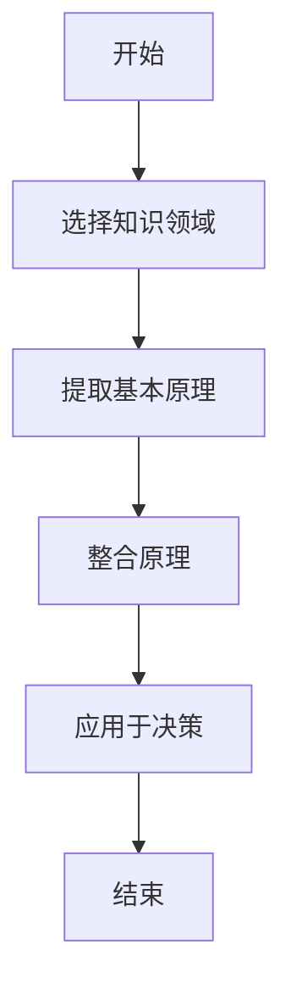
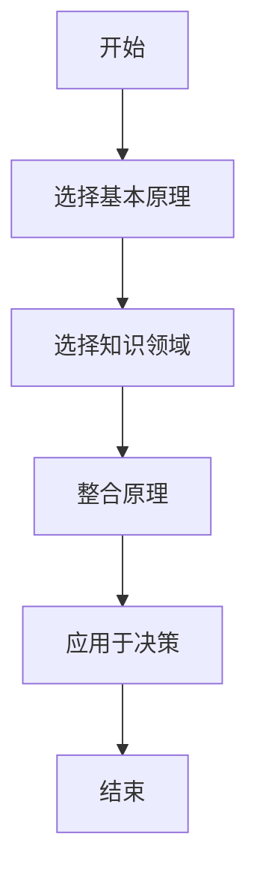
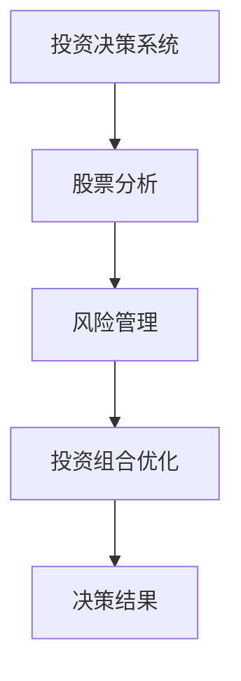
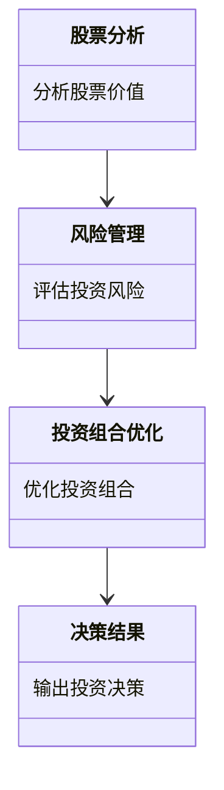
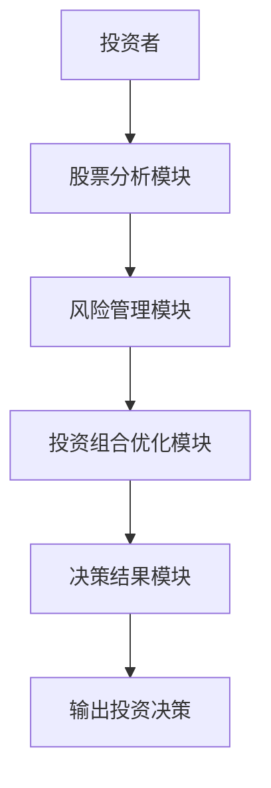
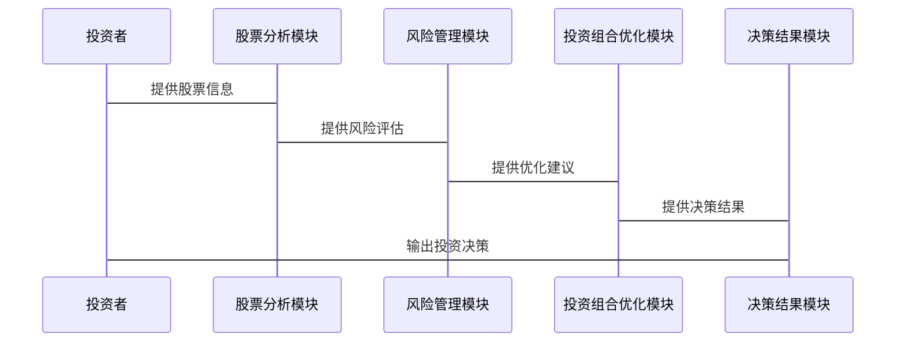

                 


# 芒格的跨界思维：将不同领域的知识应用于投资决策

## 关键词：芒格、跨界思维、投资决策、多元思维模型、决策框架、风险管理、心理学

## 摘要：  
芒格的跨界思维是一种通过整合不同学科知识来做出更明智决策的方法。本文将探讨芒格的多元思维模型、决策框架及其在投资中的应用，分析其成功的投资案例，并总结跨界思维在现代投资环境中的重要性。通过系统分析和实际案例，我们将理解如何利用跨界思维提升投资决策的质量。

---

## 目录大纲：  
1. **芒格的生平与思维方式**  
   1.1 芒格的早年经历与教育背景  
   1.2 芒格的多元思维模型  
   1.3 芒格思维方式对企业与个人的影响  

2. **多元思维模型的核心原理**  
   2.1 多元思维模型的定义与构成  
   2.2 多元思维模型的数学模型与公式  
   2.3 多元思维模型的ER实体关系图  

3. **芒格的决策框架与投资策略**  
   3.1 芒格决策框架的结构  
   3.2 芒格决策框架的算法原理  
   3.3 芒格决策框架的数学模型  

4. **芒格的跨界思维在投资中的应用**  
   4.1 芒格跨界思维在投资决策中的应用  
   4.2 芒格跨界思维的系统分析与架构设计  

---

## 正文

### 第一部分：芒格的生平与思维方式

#### 1.1 芒格的早年经历与教育背景

查理·芒格（Charlie Munger）是世界著名投资家，与沃伦·巴菲特（Warren Buffett）共同创立了伯克希尔哈撒韦公司。芒格的早年生活充满智慧和勤奋，他在哈佛大学学习法律，后来转向心理学和经济学的研究。这种跨学科的学习背景为他形成了独特的思维方式奠定了基础。

**关键词解释**：芒格的早年经历不仅包括法律学习，还包括对心理学和经济学的深入研究，这种跨学科学习为他的投资决策提供了丰富的知识储备。

#### 1.2 芒格的多元思维模型

芒格的核心理念是“多元思维模型”（Mental Models）。他主张投资者应该掌握多个领域的基本原理，并将这些原理结合起来，以更全面的角度分析问题。

**系统分析**：芒格的多元思维模型涉及多个学科，如心理学、经济学、物理学和数学。这种跨学科的综合应用帮助投资者避免单一视角的局限性，从而做出更明智的决策。

**ER实体关系图**：  
以下是一个简单的ER实体关系图，展示了多元思维模型的主要构成：

```mermaid
erd
  entity 多元思维模型 {
    attribute 知识领域
    attribute 基本原理
    attribute 应用案例
    attribute 决策框架
  }
  entity 知识领域 {
    attribute 心理学
    attribute 经济学
    attribute 物理学
    attribute 数学
  }
  entity 基本原理 {
    attribute 心理偏见
    attribute 市场规律
    attribute 物理定律
    attribute 数学模型
  }
```

#### 1.3 芒格思维方式对企业与个人的影响

芒格的思维方式不仅影响了他的投资决策，还对企业管理和个人决策产生了深远的影响。他的跨界思维强调知识的整合与应用，鼓励人们跳出传统思维框架，寻找更优的解决方案。

**关键词解释**：芒格的思维方式强调知识的整合与应用，这种思维方式不仅适用于投资，也适用于企业管理和其他领域。

### 第二部分：多元思维模型的核心原理

#### 2.1 多元思维模型的定义与构成

多元思维模型是一种通过整合多个学科的基本原理来解决问题的方法。它强调对问题的多维度分析，避免单一视角的局限性。

**数学模型**：  
多元思维模型可以用以下公式表示：

$$
\text{多元思维模型} = \sum_{i=1}^{n} \text{知识领域}_i \times \text{基本原理}_i
$$

其中，$n$ 是知识领域的数量，$\text{知识领域}_i$ 是第 $i$ 个知识领域，$\text{基本原理}_i$ 是该领域的基本原理。

#### 2.2 多元思维模型的数学模型与公式

芒格的多元思维模型可以用数学模型来描述，以帮助投资者更好地理解其结构和应用。

**算法原理**：  
以下是一个简单的多元思维模型的算法流程图：



**代码实现**：  
以下是一个简单的Python代码示例，用于演示多元思维模型的应用：

```python
# 定义知识领域和基本原理
knowledge_domains = ['心理学', '经济学', '物理学', '数学']
basic_principles = ['心理偏见', '市场规律', '物理定律', '数学模型']

# 整合原理
def integrate_principles(domains, principles):
    return {d: p for d, p in zip(domains, principles)}

# 应用于决策
model = integrate_principles(knowledge_domains, basic_principles)
print(model)
```

**数学公式**：  
多元思维模型的数学公式可以表示为：

$$
\text{决策} = f(\text{知识领域}_1, \text{基本原理}_1, \ldots, \text{知识领域}_n, \text{基本原理}_n)
$$

其中，$f$ 是整合函数，$\text{知识领域}_i$ 和 $\text{基本原理}_i$ 是第 $i$ 个知识领域和基本原理。

#### 2.3 多元思维模型的ER实体关系图

以下是一个多元思维模型的ER实体关系图：

```mermaid
erd
  entity 知识领域 {
    attribute 心理学
    attribute 经济学
    attribute 物理学
    attribute 数学
  }
  entity 基本原理 {
    attribute 心理偏见
    attribute 市场规律
    attribute 物理定律
    attribute 数学模型
  }
  entity 多元思维模型 {
    attribute 知识领域
    attribute 基本原理
    attribute 应用案例
    attribute 决策框架
  }
```

### 第三部分：芒格的决策框架与投资策略

#### 3.1 芒格决策框架的结构

芒格的决策框架是一个多层次的结构，包括基本原理、知识领域和应用案例等多个部分。以下是决策框架的层次划分：

1. **基本原理**：包括心理学中的心理偏见、经济学中的市场规律等。
2. **知识领域**：包括心理学、经济学、物理学和数学等多个领域。
3. **应用案例**：将基本原理和知识领域应用于实际的投资决策中。

**ER实体关系图**：  
以下是一个决策框架的ER实体关系图：

```mermaid
erd
  entity 决策框架 {
    attribute 基本原理
    attribute 知识领域
    attribute 应用案例
    attribute 决策步骤
  }
  entity 基本原理 {
    attribute 心理偏见
    attribute 市场规律
    attribute 物理定律
    attribute 数学模型
  }
  entity 知识领域 {
    attribute 心理学
    attribute 经济学
    attribute 物理学
    attribute 数学
  }
  entity 应用案例 {
    attribute 投资决策
    attribute 风险管理
    attribute 投资组合优化
  }
```

#### 3.2 芒格决策框架的算法原理

芒格的决策框架可以通过算法流程图来表示：



**代码实现**：  
以下是一个简单的Python代码示例，用于演示决策框架的应用：

```python
# 定义基本原理和知识领域
basic_principles = ['心理偏见', '市场规律', '物理定律', '数学模型']
knowledge_domains = ['心理学', '经济学', '物理学', '数学']

# 整合原理
def integrate_principles(domains, principles):
    return {d: p for d, p in zip(domains, principles)}

# 应用于决策
model = integrate_principles(knowledge_domains, basic_principles)
print(model)
```

**数学公式**：  
决策框架的数学公式可以表示为：

$$
\text{决策框架} = f(\text{基本原理}_1, \text{知识领域}_1, \ldots, \text{基本原理}_n, \text{知识领域}_n)
$$

其中，$f$ 是整合函数，$\text{基本原理}_i$ 和 $\text{知识领域}_i$ 是第 $i$ 个基本原理和知识领域。

#### 3.3 芒格决策框架的数学模型

芒格决策框架的数学模型可以通过以下公式表示：

$$
\text{决策结果} = \sum_{i=1}^{n} \text{基本原理}_i \times \text{知识领域}_i
$$

其中，$n$ 是知识领域的数量，$\text{基本原理}_i$ 是第 $i$ 个基本原理，$\text{知识领域}_i$ 是第 $i$ 个知识领域。

### 第四部分：芒格的跨界思维在投资中的应用

#### 4.1 芒格跨界思维在投资决策中的应用

芒格的跨界思维在投资决策中得到了广泛应用。以下是一些具体应用的例子：

1. **股票分析**：通过心理学中的心理偏见和经济学中的市场规律来分析股票的价值。
2. **风险管理**：利用物理学中的物理定律和数学中的数学模型来评估和管理投资风险。
3. **投资组合优化**：结合多个学科的基本原理来优化投资组合。

**系统分析**：  
以下是一个投资决策系统的架构图：



#### 4.2 芒格跨界思维的系统分析与架构设计

芒格的跨界思维可以通过系统分析和架构设计来实现。以下是系统的功能设计和架构图：

**功能设计**：  
系统功能设计包括股票分析、风险管理、投资组合优化和决策结果四个部分。



**架构设计**：  
以下是系统的架构图：



**接口设计**：  
系统的接口设计包括输入接口和输出接口。输入接口接收投资者的输入，输出接口输出投资决策结果。

**交互设计**：  
以下是系统的交互序列图：



---

## 总结

芒格的跨界思维是一种通过整合不同学科知识来做出更明智决策的方法。本文详细探讨了芒格的多元思维模型、决策框架及其在投资中的应用，并通过系统分析和实际案例展示了如何利用跨界思维提升投资决策的质量。芒格的成功不仅在于他的投资策略，更在于他能够将不同领域的知识结合起来，形成一个完整的决策系统。

---

## 作者：AI天才研究院/AI Genius Institute & 禅与计算机程序设计艺术 /Zen And The Art of Computer Programming

