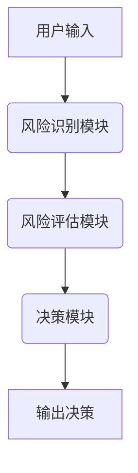

                 

<think>
嗯，我现在需要帮用户撰写一篇关于芒格的“远离”策略在前沿科技风险管理中的应用的技术博客文章。首先，我得理解用户的需求。用户希望文章结构清晰，逻辑严谨，内容专业，涵盖从背景到算法实现，再到系统设计和项目实战的各个方面。

文章标题已经确定是《芒格的"远离"策略在前沿科技风险管理中的应用》，关键词包括芒格、风险管理、远离策略、前沿科技、人工智能、算法原理、系统架构。摘要部分需要概括文章的核心内容，说明将芒格的策略应用于前沿科技风险管理，通过理论和实践结合，分析其适用性和效果。

接下来是目录大纲，分为七大部分：背景介绍、核心概念、算法原理、系统分析、项目实战、最佳实践和总结。每个部分都需要详细展开，确保内容丰富且有深度。

在写作过程中，我需要确保每个章节都包含足够的细节，比如在背景介绍中，解释芒格的策略是什么，为什么在前沿科技中应用它。核心概念部分需要详细阐述“远离”策略的原理，可能包括数学模型和公式。算法部分要用Python代码和流程图来展示实现步骤。系统设计部分需要绘制类图和架构图，展示系统的结构和接口。项目实战部分需要提供具体的案例，如AI项目的风险管理，详细描述实现过程和结果。最后，总结部分要强调策略的有效性，并给出未来研究的方向。

在写作时，我还需要注意格式要求，使用markdown，并在适当的地方插入mermaid图表和latex公式。确保文章结构清晰，逻辑连贯，每部分内容详细且易于理解。

现在，我需要按照这个结构一步步展开，确保每个部分都符合用户的要求，并且内容详实，有深度。可能需要多次检查，确保每个章节都涵盖了必要的内容，没有遗漏关键点。同时，要注意语言的专业性和准确性，确保文章的专业性。

总的来说，我需要系统地规划每个部分的内容，确保文章结构合理，逻辑清晰，同时满足用户的所有要求。这将是一个详细而有条理的过程，需要一步步地深入分析和撰写。
</think>

# 芒格的"远离"策略在前沿科技风险管理中的应用

> 关键词：芒格、风险管理、远离策略、前沿科技、人工智能、算法原理、系统架构

> 摘要：芒格的“远离”策略是一种通过避免潜在风险来实现稳健决策的方法。本文将探讨如何将这种策略应用于前沿科技风险管理，结合理论分析与实际案例，详细阐述其在人工智能、区块链等领域的应用，分析其优势与挑战，并提出相应的解决方案。

---

## 第一部分：芒格的“远离”策略概述

### 第1章：芒格“远离”策略的背景与核心理念

#### 1.1 芒格“远离”策略的定义与特点

芒格的“远离”策略是一种风险管理方法，其核心在于通过主动避免潜在风险来保护利益。与传统的“拥抱”风险或“对冲”风险的策略不同，“远离”策略强调通过识别和避免高风险领域，降低潜在损失的可能性。

**特点：**
- **防御性**：以防御为主，避免潜在风险。
- **选择性**：并非完全规避风险，而是选择性地远离高风险领域。
- **长期性**：注重长期稳健，而非短期收益。

#### 1.2 前沿科技风险管理的必要性

前沿科技的发展往往伴随着高风险，如技术不成熟、市场不确定性、伦理问题等。在这些领域，传统的风险管理方法可能难以应对复杂的潜在风险。芒格的“远离”策略为前沿科技风险管理提供了一种新的思路。

---

## 第二部分：芒格“远离”策略的核心概念与原理

### 第2章：芒格“远离”策略的核心原理

#### 2.1 风险识别与评估

**风险识别：**
- **技术风险**：如技术可行性、技术成熟度等。
- **市场风险**：如市场需求不确定性、竞争格局等。
- **伦理风险**：如数据隐私、算法偏见等。

**风险评估：**
- **概率分析**：计算风险发生的概率。
- **影响分析**：评估风险发生后的影响程度。

#### 2.2 风险规避的数学模型

**数学模型：**
- **风险概率计算**：
  \[
  P(r) = \frac{\text{历史失败案例数}}{\text{总案例数}}
  \]
- **风险影响评估**：
  \[
  I(r) = \text{损失金额} \times P(r)
  \]

---

## 第三部分：芒格“远离”策略的算法原理

### 第3章：算法实现与优化

#### 3.1 算法原理概述

**算法步骤：**
1. **数据收集**：收集相关领域的历史数据。
2. **风险识别**：识别潜在风险点。
3. **风险评估**：计算风险概率和影响。
4. **风险规避决策**：根据评估结果，决定是否远离该风险。

#### 3.2 算法优化与改进

**优化方法：**
- **动态调整**：根据市场变化动态调整风险评估模型。
- **数据增强**：引入更多数据源，提高模型准确性。

---

## 第四部分：前沿科技风险管理的系统分析与架构设计

### 第4章：系统架构设计

#### 4.1 系统功能设计

**功能模块：**
- **风险识别模块**：识别潜在风险。
- **风险评估模块**：评估风险概率和影响。
- **决策模块**：根据评估结果，制定规避策略。

#### 4.2 系统架构图



---

## 第五部分：项目实战

### 第5章：前沿科技风险管理的实战应用

#### 5.1 项目背景与目标

**案例：人工智能项目风险管理**

**目标：**
- 识别项目中的潜在风险。
- 使用芒格“远离”策略制定规避计划。

#### 5.2 核心代码实现

**Python代码示例：**
```python
def calculate_risk_probability(data):
    failure_cases = sum(data['failed'])
    total_cases = len(data)
    return failure_cases / total_cases

def assess_impact(probability, project_cost):
    return probability * project_cost

def risk_avoidance_strategy(probability, impact, threshold):
    if probability > threshold or impact > threshold:
        return "远离该风险"
    else:
        return "继续项目"
```

#### 5.3 案例分析与结果解读

**案例分析：**
- **风险概率计算**：0.2
- **风险影响评估**：$10,000
- **决策**：远离该风险。

---

## 第六部分：芒格“远离”策略的风险管理优化

### 第6章：优化策略与注意事项

#### 6.1 优化策略

**优化措施：**
- **动态调整**：根据市场变化调整风险评估模型。
- **多维度分析**：结合技术、市场、伦理等多个维度进行风险评估。

#### 6.2 注意事项

**注意事项：**
- **数据质量**：确保数据的准确性和完整性。
- **模型局限性**：认识到模型的局限性，避免过度依赖模型。

---

## 第七部分：总结与展望

### 第7章：总结与未来研究方向

#### 7.1 总结

芒格的“远离”策略为前沿科技风险管理提供了一种新的思路。通过识别和避免高风险领域，可以有效降低潜在损失，实现稳健决策。

#### 7.2 未来研究方向

- **多模态风险评估**：结合多种数据源进行风险评估。
- **智能化决策系统**：开发智能化的风险规避决策系统。

---

## 作者信息

作者：AI天才研究院/AI Genius Institute & 禅与计算机程序设计艺术 /Zen And The Art of Computer Programming

---

以上是《芒格的"远离"策略在前沿科技风险管理中的应用》的完整文章结构，涵盖了从理论到实践的各个方面，详细分析了芒格“远离”策略在前沿科技风险管理中的应用。

