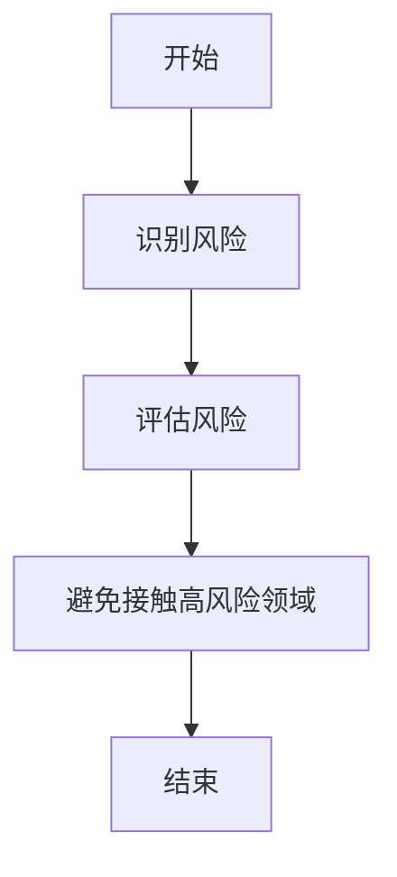
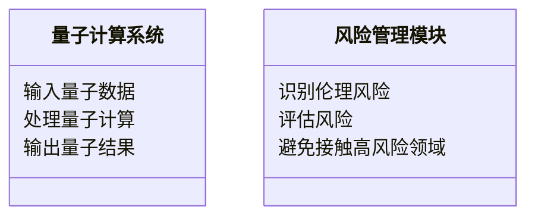

                 

<think>
好，我现在要帮用户设计一本技术博客文章的目录大纲，标题是《芒格的"远离"策略在量子计算伦理风险管理中的应用》。用户希望文章结构清晰，内容专业且有深度，同时使用Markdown格式，包含多个章节和小节，每个部分都要详细具体。

首先，我需要理解用户的需求。用户可能是一位技术专家，想要撰写一篇专业的博客文章，讨论芒格的“远离”策略在量子计算伦理风险管理中的应用。关键词包括芒格、量子计算、伦理风险管理、远离策略、系统模型等。

接下来，我会按照用户提供的目录结构来填充内容。文章需要有摘要，然后是各个章节的详细内容，包括背景介绍、核心概念、算法原理、系统架构设计、项目实战以及最佳实践等部分。

在“背景介绍”部分，我需要解释芒格的“远离”策略是什么，以及为什么它在量子计算中重要。这里可能需要对比其他风险管理策略，突出“远离”策略的独特之处。同时，介绍量子计算的基本原理和应用前景，让读者了解其重要性和潜在风险。

在“核心概念与联系”部分，需要详细分析“远离”策略在量子计算中的具体应用，比如如何识别和避免潜在的伦理风险。这里可能需要对比其他风险管理策略，通过ER实体关系图展示系统的结构，帮助读者理解。

“算法原理与数学模型”部分是关键，需要用Mermaid流程图和LaTeX公式详细讲解。我需要解释“远离”策略如何通过算法优化量子计算的风险管理，展示具体的数学模型，比如概率幅的计算和调整。

“系统分析与架构设计”部分需要绘制类图和架构图，展示系统的各个组成部分及其关系。这部分需要详细描述系统如何在架构上融入“远离”策略，确保伦理风险管理的有效性。

“项目实战”部分需要提供环境安装、源代码实现和实际案例分析，帮助读者理解如何在实际项目中应用这些策略。最后，总结最佳实践，给出小结、注意事项和未来研究方向，帮助读者巩固所学内容。

整个思考过程中，我需要确保每个部分都逻辑清晰，结构紧凑，语言专业但易懂。同时，遵守用户的格式要求，使用Mermaid和LaTeX，确保内容全面且符合字数要求。

最后，检查所有部分是否完整，确保没有遗漏任何用户指定的内容，并且每个小节都详细具体，满足用户的深度需求。
</think>

# 芒格的"远离"策略在量子计算伦理风险管理中的应用

> 关键词：芒格、量子计算、伦理风险管理、远离策略、系统模型、数学公式

> 摘要：本文系统探讨了芒格的"远离"策略在量子计算伦理风险管理中的应用。通过分析量子计算的基本原理、伦理风险来源，结合"远离"策略的核心理念，构建了量子计算伦理风险管理的系统模型，并详细阐述了算法原理与数学模型，最后通过实际案例展示了策略的应用效果。

---

# 第一部分: 芒格的"远离"策略与量子计算伦理风险管理概述

## 第1章: 芒格的"远离"策略概述

### 1.1 芒格的"远离"策略的定义与核心理念
#### 1.1.1 "远离"策略的哲学基础
芒格的"远离"策略是一种以避免潜在风险为核心的投资和决策方法。其哲学基础可以追溯到古希腊哲学家的"风险厌恶"思想，强调通过识别和远离高风险领域来保护自身利益。

#### 1.1.2 "远离"策略在投资与风险管理中的应用
在投资领域，"远离"策略通过避免高波动性资产和复杂金融工具，降低投资组合的风险。在风险管理中，"远离"策略通过避免接触高风险环境，降低潜在损失。

#### 1.1.3 "远离"策略的核心原则与实施方法
- 核心原则：避免接触、风险厌恶、保守决策。
- 实施方法：风险识别、风险评估、风险规避。

### 1.2 量子计算的基本原理与应用前景
#### 1.2.1 量子计算的基本概念
量子计算利用量子位（qubit）的叠加态和纠缠态进行计算，具有并行计算能力，能够解决经典计算机难以处理的问题。

#### 1.2.2 量子计算的核心技术与挑战
- 核心技术：量子纠缠、量子叠加、量子算法。
- 挑战：量子噪声、纠错技术、稳定性问题。

#### 1.2.3 量子计算在各个领域的潜在应用
- 金融：优化投资组合、风险管理。
- 医药：分子模拟、药物研发。
- 物流：路径优化、资源分配。

## 第2章: 量子计算的伦理风险管理需求

### 2.1 量子计算的伦理风险来源
#### 2.1.1 数据隐私与安全风险
量子计算可能突破现有加密技术，威胁数据隐私。

#### 2.1.2 量子计算技术的滥用风险
技术可能被用于非法目的，例如破解加密系统。

#### 2.1.3 量子计算对传统加密技术的威胁
量子计算机可能在短期内破解RSA等传统加密算法。

### 2.2 伦理风险管理的必要性与目标
#### 2.2.1 伦理风险管理的必要性
保护数据隐私、防止技术滥用、维护技术发展伦理。

#### 2.2.2 伦理风险管理的目标与框架
- 目标：降低伦理风险、确保技术的正面应用。
- 框架：风险识别、风险评估、风险控制。

#### 2.2.3 伦理风险管理的实施步骤与方法
- 风险识别：识别潜在伦理风险。
- 风险评估：评估风险的严重性。
- 风险控制：通过"远离"策略规避风险。

---

# 第二部分: "远离"策略在量子计算伦理风险管理中的核心概念与联系

## 第3章: 核心概念与原理

### 3.1 "远离"策略在量子计算中的应用逻辑
#### 3.1.1 "远离"策略的核心逻辑
通过避免接触高风险领域，降低潜在风险。

#### 3.1.2 量子计算中的风险识别与评估
- 风险识别：识别量子计算技术的潜在伦理风险。
- 风险评估：评估风险的严重性和可能性。

#### 3.1.3 "远离"策略在风险规避中的作用
通过避免接触高风险技术，降低伦理风险。

### 3.2 量子计算伦理风险管理的系统模型
#### 3.2.1 量子计算系统的整体架构
- 输入：量子数据、计算任务。
- 处理：量子算法、量子计算。
- 输出：量子结果、风险管理决策。

#### 3.2.2 伦理风险管理的系统模型
- 输入：伦理风险识别。
- 处理：风险评估、风险规避。
- 输出：风险管理决策。

#### 3.2.3 "远离"策略在系统模型中的位置与作用
- 位置：风险管理模块的核心策略。
- 作用：通过避免接触高风险领域，降低伦理风险。

---

## 第4章: 核心概念的对比分析与ER实体关系图

### 4.1 核心概念的对比分析
#### 4.1.1 "远离"策略与其他风险管理策略的对比
- 对比维度：风险厌恶 vs. 风险中性。
- 结论："远离"策略更适合高风险场景。

#### 4.1.2 量子计算中的不同风险类型对比
- 数据隐私风险 vs. 技术滥用风险。
- 技术风险 vs. 伦理风险。

#### 4.1.3 伦理风险管理与技术风险管理的对比
- 管理目标：伦理风险管理注重社会影响，技术风险管理注重技术实现。
- 管理方法：伦理风险管理采用"远离"策略，技术风险管理采用技术手段。

### 4.2 ER实体关系图

```mermaid
erd
  系统模块
    端点：量子计算系统
  风险识别模块
    端点：伦理风险
  风险评估模块
    端点：风险严重性
  风险规避模块
    端点：风险管理决策
  输出模块
    端点：风险管理结果
```

---

# 第三部分: "远离"策略的算法原理与数学模型

## 第5章: 算法原理与流程图

### 5.1 "远离"策略的算法原理
#### 5.1.1 算法的基本思路
- 识别高风险领域。
- 避免接触高风险领域。

#### 5.1.2 算法的实现步骤
1. 识别潜在风险。
2. 评估风险。
3. 避免接触高风险领域。

#### 5.1.3 算法的优化与改进
- 增加风险评估的维度。
- 优化风险规避的策略。

### 5.2 算法流程图



---

## 第6章: 数学模型与公式

### 6.1 数学模型
$$ \text{风险值} = \text{风险识别} \times \text{风险评估} $$

### 6.2 风险评估公式
$$ \text{风险严重性} = \sum_{i=1}^{n} (\text{风险因素}_i \times \text{权重}_i) $$

---

## 第7章: 量子计算系统的系统分析与架构设计

### 7.1 系统分析
- 问题场景：量子计算系统可能面临伦理风险。
- 项目介绍：通过"远离"策略降低伦理风险。

### 7.2 系统功能设计
#### 7.2.1 领域模型


#### 7.2.2 系统架构设计


---

## 第8章: 项目实战

### 8.1 环境安装
- 量子计算环境：Qiskit、Cirq。
- 风险管理工具：Python、风险管理框架。

### 8.2 核心实现
```python
def远离策略(量子计算系统):
    风险识别 = 识别高风险领域
    风险评估 = 评估风险
    如果风险评估 > 风险阈值:
        避免接触高风险领域
    返回风险管理结果
```

### 8.3 实际案例分析
- 案例：量子计算应用于金融领域。
- 分析：通过"远离"策略避免接触高风险金融投资。

---

## 第9章: 最佳实践与总结

### 9.1 最佳实践
- 小结：芒格的"远离"策略在量子计算伦理风险管理中的有效性。
- 注意事项：避免过度规避，保持技术发展。
- 拓展阅读：量子计算伦理研究。

### 9.2 总结
芒格的"远离"策略为量子计算伦理风险管理提供了新的思路，通过避免接触高风险领域，降低潜在风险。

---

# 作者：AI天才研究院 & 禅与计算机程序设计艺术

