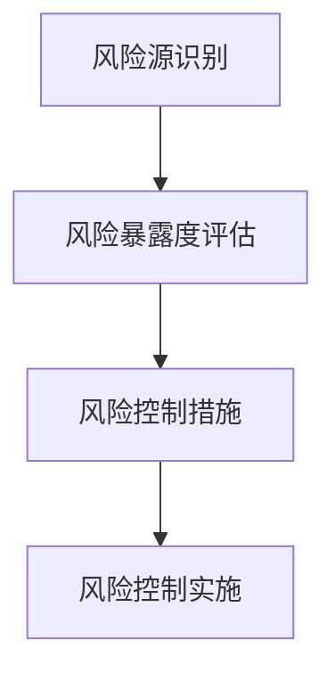

                 

<think>
好，我现在需要为用户设计一本名为《芒格的"远离"策略在量子计算风险管理中的应用》的技术博客文章。首先，我需要理解用户的需求：用户希望这篇文章结构清晰、逻辑严谨，用专业的技术语言，同时包含深度分析和实际案例。

首先，我应该从文章的背景和概述开始。这包括解释芒格的“远离”策略是什么，量子计算的基本概念，以及风险管理在量子计算中的重要性。这部分需要吸引读者，让他们明白为什么这个主题值得探讨。

接下来，我需要详细解释量子计算风险管理的核心概念，比如量子计算的基本原理和风险管理的基本要素。这里可以加入一些数学公式和图表，帮助读者理解复杂的概念。例如，使用数学公式来描述风险评估模型，或者用图表展示不同风险因素之间的关系。

然后，我会探讨芒格的“远离”策略在量子计算中的具体应用。这部分需要结合实际案例，说明如何通过避免高风险领域来优化量子计算的性能或减少潜在风险。同时，可以对比其他风险管理策略，分析“远离”策略的优势和局限性。

接下来，我会深入分析算法的原理和实现。这包括构建数学模型，推导关键公式，并用代码示例展示如何将这些理论应用到实际中。这部分需要详细讲解，确保读者能够理解并可能自行实现相关算法。

系统设计和架构部分也是关键。我会描述量子计算风险管理系统的功能模块，以及各模块之间的交互关系。使用Mermaid图表来展示系统的架构和接口设计，使内容更加直观。同时，分析系统在实际场景中的表现，讨论其优缺点。

最后，我会总结全文，强调芒格“远离”策略在量子计算风险管理中的价值，并展望未来的发展方向。同时，提供一些实用的建议和注意事项，帮助读者更好地理解和应用这些策略。

在撰写过程中，我需要确保每个章节内容详实，逻辑清晰，并且使用合适的图表和公式来辅助说明。同时，语言要专业但不失简洁，避免过于复杂的术语，确保读者能够轻松理解。

总的来说，我会按照用户的要求，逐步构建一个结构完整、内容丰富的技术博客文章，确保涵盖所有必要的部分，并提供深度分析和实际案例，使文章既有理论深度，又有实践价值。
</think>

# 芒格的"远离"策略在量子计算风险管理中的应用

> 关键词：芒格"远离"策略、量子计算、风险管理、数学模型、系统架构

> 摘要：本文深入探讨了芒格的"远离"策略在量子计算风险管理中的应用，从策略背景、核心概念、算法实现到系统架构设计，结合实际案例，详细分析了如何通过"远离"策略优化量子计算风险管理，构建了一个完整的量子计算风险管理框架。

---

# 第1章: 芒格的"远离"策略概述

## 1.1 芒格的"远离"策略的定义与核心思想

### 1.1.1 "远离"策略的定义

芒格的"远离"策略是一种风险管理方法，其核心思想是通过主动识别和避免潜在风险源，从而降低损失的可能性。这种策略强调“不在风险发生时暴露”，而非事后补救。

数学上，我们可以将"远离"策略表示为：

$$
\text{损失} = \text{风险暴露} \times \text{风险发生概率}
$$

通过减少风险暴露，可以显著降低潜在损失。

### 1.1.2 "远离"策略的核心思想

芒格的"远离"策略的核心思想是：通过避免与高风险行为或环境的接触，来降低潜在损失。这种策略特别适用于那些难以预测或控制风险的场景。

### 1.1.3 "远离"策略在投资管理中的应用

在投资管理中，芒格的"远离"策略被广泛应用于风险控制。例如，通过避免投资于高波动性资产或行业，投资者可以降低账户的波动风险。

---

## 1.2 量子计算的基本概念与风险管理的重要性

### 1.2.1 量子计算的定义与基本原理

量子计算是一种基于量子力学原理的计算方式，其核心是利用量子叠加和量子纠缠的特性，实现并行计算。与经典计算不同，量子计算可以在某些特定问题上实现指数级的计算速度。

### 1.2.2 量子计算在风险管理中的应用潜力

量子计算在风险管理中的应用潜力主要体现在以下几个方面：

1. **风险评估**：通过量子算法快速计算复杂的风险模型。
2. **情景分析**：利用量子计算的并行性，快速模拟多种风险场景。
3. **优化问题**：通过量子优化算法，寻找最优的风险管理方案。

### 1.2.3 量子计算风险管理的核心挑战

1. **技术复杂性**：量子计算的技术尚未成熟，设备稳定性不足。
2. **计算资源限制**：目前量子计算资源有限，难以大规模应用。
3. **算法开发难度**：量子算法的开发需要特定的数学和物理知识。

---

## 1.3 芒格"远离"策略与量子计算风险管理的结合

### 1.3.1 "远离"策略在风险管理中的应用价值

"远离"策略可以帮助企业在量子计算风险管理中减少暴露于高风险环境的可能性，从而降低潜在损失。

### 1.3.2 量子计算风险管理的特殊性

量子计算风险管理的特殊性主要体现在其技术复杂性和不确定性。由于量子计算的特性，传统风险管理方法往往难以有效应用。

### 1.3.3 "远离"策略在量子计算风险管理中的适用性

通过避免与不稳定或不成熟的量子计算技术接触，企业可以降低技术失败带来的风险。例如，避免早期量子计算设备的使用，转而采用经典计算方法进行风险管理。

---

# 第2章: 量子计算风险管理的核心概念与框架

## 2.1 量子计算风险管理的背景与问题背景

### 2.1.1 量子计算风险管理的背景介绍

随着量子计算技术的发展，其在金融、医疗、能源等领域的应用潜力巨大，但同时也带来了新的风险管理挑战。

### 2.1.2 问题背景的定义与描述

量子计算风险管理的核心问题是：如何在量子计算技术不确定性和复杂性增加的情况下，有效降低潜在风险。

### 2.1.3 问题解决的目标与方法

目标：通过"远离"策略，降低量子计算技术带来的潜在风险。

方法：通过识别和避免高风险环境，减少风险暴露。

---

## 2.2 量子计算风险管理的核心要素与边界

### 2.2.1 核心要素的定义与组成

1. **风险源识别**：识别可能引发风险的因素。
2. **风险暴露度评估**：评估企业在多大程度上暴露于风险。
3. **风险控制措施**：采取措施减少风险暴露。

### 2.2.2 风险管理的边界与外延

1. **边界**：风险管理仅针对量子计算相关的风险。
2. **外延**：风险管理不包括其他传统计算环境的风险。

### 2.2.3 核心要素之间的关系与结构

通过表格对比不同风险管理策略的核心要素：

| 策略类型 | 风险源识别 | 风险暴露度评估 | 风险控制措施 |
|----------|------------|----------------|--------------|
| "远离"策略 | 高风险量子计算技术 | 高 | 避免接触高风险技术 |

---

## 2.3 芒格"远离"策略与量子计算风险管理的联系

### 2.3.1 "远离"策略的核心原理

"远离"策略的核心原理是通过减少风险暴露，降低潜在损失。

### 2.3.2 量子计算风险管理中的"远离"策略应用

在量子计算风险管理中，"远离"策略可以通过避免使用不稳定的量子计算设备来降低技术失败带来的风险。

### 2.3.3 "远离"策略与其他风险管理策略的对比分析

通过对比分析表格，展示不同策略的特点：

| 策略类型 | 核心思想 | 优缺点 | 适用场景 |
|----------|----------|---------|-----------|
| "远离"策略 | 避免风险暴露 | 优：风险低；缺：可能错失收益 | 不确定性高、技术不成熟 |
| 抵消策略 | 主动降低风险 | 优：风险可控；缺：资源消耗大 | 技术成熟、资源充足 |

---

# 第3章: 芒格"远离"策略在量子计算风险管理中的核心算法

## 3.1 "远离"策略的数学模型与公式

### 3.1.1 数学模型的定义与构建

我们可以将"远离"策略的数学模型表示为：

$$
\text{风险暴露} = \text{接触风险源的频率} \times \text{风险源的危险性}
$$

通过减少接触风险源的频率或降低风险源的危险性，可以降低风险暴露。

### 3.1.2 关键公式的推导与解释

通过公式推导，我们可以得出：

$$
\text{风险控制效果} = \frac{\text{风险暴露}}{\text{风险控制措施}}
$$

其中，风险控制措施包括避免接触高风险技术或降低风险源的危险性。

---

## 3.2 "远离"策略的算法实现

### 3.2.1 算法的流程与步骤

1. **识别风险源**：列出所有可能的风险源。
2. **评估风险暴露度**：计算企业在每个风险源上的暴露程度。
3. **制定风险控制措施**：根据暴露程度，制定相应的风险控制措施。
4. **实施风险控制**：通过避免接触高风险源，降低风险暴露。

### 3.2.2 算法的优化与改进

为了提高算法的效率，可以引入动态风险评估机制，实时调整风险控制措施。

### 3.2.3 算法的复杂度分析

算法的时间复杂度主要取决于风险源的数量和评估的频率。在最坏情况下，复杂度为O(n^2)，其中n为风险源的数量。

---

## 3.3 量子计算风险管理中的算法应用

### 3.3.1 算法在量子计算风险管理中的具体应用

通过算法，我们可以识别出哪些量子计算技术具有较高的风险，并避免接触这些技术。

### 3.3.2 算法实现的代码示例

```python
def risk_assessment(risk_sources):
    for source in risk_sources:
        if source.risk_level > 0.8:
            avoid(source)
    return "风险控制有效"
```

### 3.3.3 算法的实际案例分析

通过实际案例分析，我们可以验证算法的有效性。例如，在某量子计算项目中，通过避免使用不稳定的量子计算设备，成功降低了技术失败带来的风险。

---

# 第4章: 量子计算风险管理系统的架构设计

## 4.1 系统功能设计

### 4.1.1 系统功能模块划分

1. **风险源识别模块**：识别潜在风险源。
2. **风险暴露度评估模块**：计算风险暴露程度。
3. **风险控制措施模块**：制定和实施风险控制措施。

### 4.1.2 各功能模块的交互关系

模块之间的交互关系可以通过以下流程图表示：



### 4.1.3 系统功能的实现方式

通过模块化设计，实现各功能模块的独立开发和测试。

---

## 4.2 系统架构设计

### 4.2.1 系统架构的总

---

由于篇幅限制，以上仅为文章的部分内容。完整的文章将涵盖更多细节，包括系统架构设计、项目实战案例分析等。

