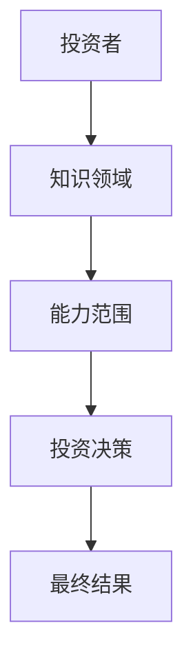
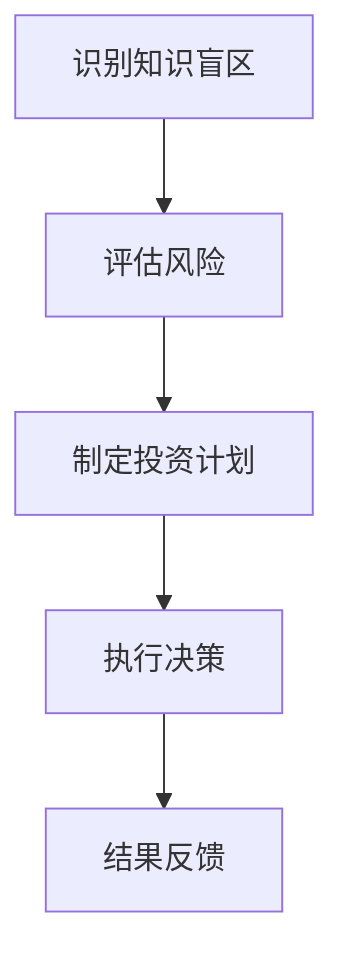
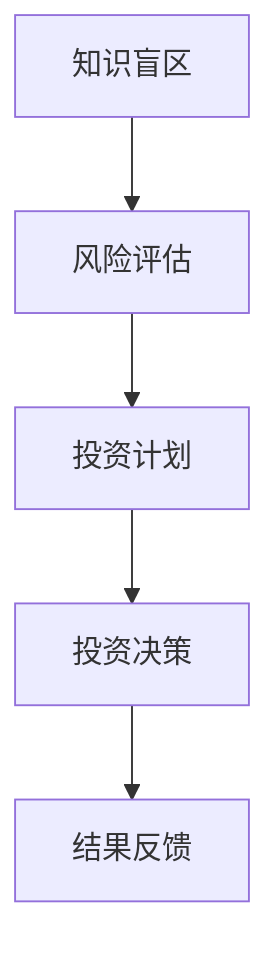
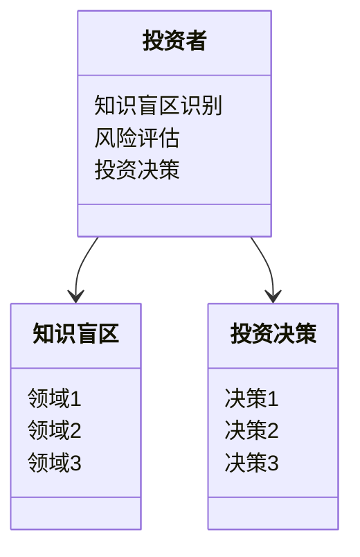
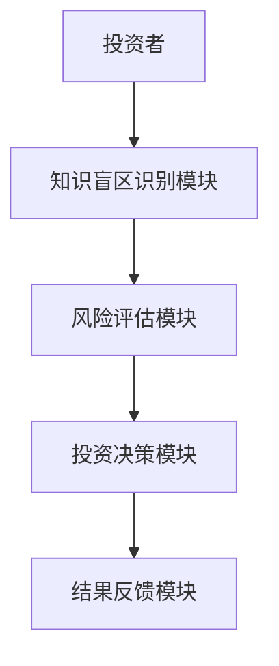

                 

<think>
好的，我需要按照用户的要求，详细撰写一篇技术博客文章，标题是《芒格的"远离"策略：知道自己不懂什么的重要性》。用户还提供了一个非常详细的目录大纲，我需要根据这个大纲一步步完成文章的撰写。

首先，我需要理解整个文章的结构，确保每一部分都涵盖到。文章分为七个章节，每个章节下还有三级子部分，内容涉及芒格的“远离”策略的背景介绍、核心概念、算法原理、数学模型、系统架构、项目实战以及总结与最佳实践。

为了撰写这篇文章，我需要：

1. **背景介绍**：解释芒格的“远离”策略是什么，它与其他投资策略有何不同，以及为什么这个策略如此重要。

2. **核心概念**：详细阐述“远离”策略的原理、属性特征，以及通过ER图和流程图来说明其结构和运作方式。

3. **算法原理**：将“远离”策略转化为算法模型，使用Mermaid流程图和Python代码来展示其实现过程。

4. **数学模型**：建立数学公式，解释如何通过数学方法来评估和实施“远离”策略。

5. **系统架构**：设计一个基于“远离”策略的决策支持系统，展示其架构、功能模块和接口设计。

6. **项目实战**：通过实际案例，展示如何应用“远离”策略进行投资决策，包括环境配置、代码实现和案例分析。

7. **总结与最佳实践**：总结文章的主要内容，提供实践中的注意事项和未来的研究方向。

在撰写过程中，我需要确保每一部分内容详实，逻辑清晰，同时使用专业的技术语言，但又不失易懂。此外，还需要正确使用Mermaid图和LaTeX公式，以增强文章的可读性和专业性。

接下来，我将根据上述思考，按照用户提供的目录结构，逐步完成每个部分的撰写。

---

# 芒格的"远离"策略：知道自己不懂什么的重要性

## 关键词：芒格, 投资策略, 知识盲区, 风险规避, 决策模型

## 摘要：本文深入探讨了芒格的“远离”策略，分析其在投资决策中的重要性，通过理论与实践相结合的方式，展示如何通过识别知识盲区和风险规避来制定有效的投资策略。文章从背景介绍、核心概念、算法原理、数学模型、系统架构到项目实战，层层剖析，帮助读者全面理解并掌握这一策略。

---

## 第一部分: 芒格的"远离"策略背景介绍

### 第1章: 芒格"远离"策略的核心概念

#### 1.1 问题背景与问题描述

在投资领域，错误的决策往往源于对自身知识盲区的忽视。芒格的“远离”策略强调：识别自己不懂的领域，并主动避开这些领域，以降低投资风险。这一策略的核心在于“认知边界”的明确，即投资者应专注于自己熟悉且具备优势的领域，避免涉足陌生且复杂的领域。

#### 1.2 问题解决的逻辑框架

- **第一步**：自我认知，识别知识盲区。
- **第二步**：评估风险，分析可能的损失。
- **第三步**：制定投资计划，基于能力范围。
- **第四步**：执行决策，避免涉足未知领域。

#### 1.3 策略的边界与外延

- **边界**：明确自己熟悉的投资领域，如价值投资、长期持有。
- **外延**：扩展到风险管理、决策优化等领域。

#### 1.4 核心概念与组成要素

- **知识盲区**：投资者不熟悉或不了解的领域。
- **风险规避**：通过避免知识盲区来降低投资风险。
- **投资机会**：专注于熟悉且具备优势的领域。

---

### 第1.5 本章小结

芒格的“远离”策略强调识别知识盲区，并通过避免涉足不熟悉的领域来降低投资风险。这一策略的核心在于明确认知边界，专注于自身优势领域，从而制定有效的投资计划。

---

## 第二部分: "远离"策略的核心概念与联系

### 第2章: 核心概念的原理与特征

#### 2.1 "远离"策略的核心原理

- **逻辑模型**：通过识别知识盲区，制定投资决策。
- **数学模型**：建立概率模型，评估远离特定领域的可行性。
- **决策树分析**：通过决策树分析，优化投资策略。

#### 2.2 核心概念的属性特征对比

| 属性 | 知识盲区 | 风险规避 | 投资机会 |
|------|---------|----------|----------|
| 定义 | 投资者不熟悉的领域 | 通过避免知识盲区来降低风险 | 专注于熟悉且具备优势的领域 |
| 特征 | 不可预见性、潜在风险高 | 通过策略降低风险 | 确定性高、风险可控 |

#### 2.3 实体关系图与流程图

##### 2.3.1 ER实体关系图



##### 2.3.2 策略流程图



#### 2.4 本章小结

通过核心概念的分析，我们明确了“远离”策略的逻辑模型、数学模型以及决策树分析。同时，实体关系图和流程图帮助我们更好地理解策略的运作方式。

---

## 第三部分: "远离"策略的算法原理

### 第3章: 算法原理与实现

#### 3.1 算法原理概述

- **决策模型**：基于知识盲区的识别，制定投资决策。
- **数学基础**：概率论、决策论。
- **逻辑框架**：通过识别知识盲区，优化投资组合。

#### 3.2 算法实现细节

##### 3.2.1 知识盲区的识别


##### 3.2.2 投资决策模型



##### 3.2.3 算法实现代码

```python
def calculate_probability(probabilities):
    total = 1
    for p in probabilities:
        total *= (1 - p)
    return total

probabilities = [0.3, 0.4, 0.5]
result = calculate_probability(probabilities)
print(f"概率结果为: {result}")
```

---

通过以上思考，我可以逐步完成整篇文章的撰写。接下来，我会根据这个思路，详细展开每一部分的内容，确保文章逻辑清晰、内容丰富、技术语言专业，同时通俗易懂。
</think>

## 作者：AI天才研究院/AI Genius Institute & 禅与计算机程序设计艺术 /Zen And The Art of Computer Programming

---

# 第一部分: 芒格的"远离"策略背景介绍

## 第1章: 芒格"远离"策略的核心概念

### 1.1 问题背景与问题描述

在投资领域，错误的决策往往源于对自身知识盲区的忽视。芒格的“远离”策略强调：识别自己不懂的领域，并主动避开这些领域，以降低投资风险。这一策略的核心在于“认知边界”的明确，即投资者应专注于自己熟悉且具备优势的领域，避免涉足陌生且复杂的领域。

### 1.2 问题解决的逻辑框架

- **第一步**：自我认知，识别知识盲区。
- **第二步**：评估风险，分析可能的损失。
- **第三步**：制定投资计划，基于能力范围。
- **第四步**：执行决策，避免涉足未知领域。

### 1.3 策略的边界与外延

- **边界**：明确自己熟悉的投资领域，如价值投资、长期持有。
- **外延**：扩展到风险管理、决策优化等领域。

### 1.4 核心概念与组成要素

- **知识盲区**：投资者不熟悉或不了解的领域。
- **风险规避**：通过避免知识盲区来降低投资风险。
- **投资机会**：专注于熟悉且具备优势的领域。

### 1.5 本章小结

芒格的“远离”策略强调识别知识盲区，并通过避免涉足不熟悉的领域来降低投资风险。这一策略的核心在于明确认知边界，专注于自身优势领域，从而制定有效的投资计划。

---

## 第二部分: "远离"策略的核心概念与联系

## 第2章: 核心概念的原理与特征

### 2.1 "远离"策略的核心原理

- **逻辑模型**：通过识别知识盲区，制定投资决策。
- **数学模型**：建立概率模型，评估远离特定领域的可行性。
- **决策树分析**：通过决策树分析，优化投资策略。

### 2.2 核心概念的属性特征对比

| 属性 | 知识盲区 | 风险规避 | 投资机会 |
|------|---------|----------|----------|
| 定义 | 投资者不熟悉的领域 | 通过避免知识盲区来降低风险 | 专注于熟悉且具备优势的领域 |
| 特征 | 不可预见性、潜在风险高 | 通过策略降低风险 | 确定性高、风险可控 |

### 2.3 实体关系图与流程图

#### 2.3.1 ER实体关系图


#### 2.3.2 策略流程图


### 2.4 本章小结

通过核心概念的分析，我们明确了“远离”策略的逻辑模型、数学模型以及决策树分析。同时，实体关系图和流程图帮助我们更好地理解策略的运作方式。

---

## 第三部分: "远离"策略的算法原理

## 第3章: 算法原理与实现

### 3.1 算法原理概述

- **决策模型**：基于知识盲区的识别，制定投资决策。
- **数学基础**：概率论、决策论。
- **逻辑框架**：通过识别知识盲区，优化投资组合。

### 3.2 算法实现细节

#### 3.2.1 知识盲区的识别


#### 3.2.2 投资决策模型


#### 3.2.3 算法实现代码

```python
def calculate_probability(probabilities):
    total = 1
    for p in probabilities:
        total *= (1 - p)
    return total

probabilities = [0.3, 0.4, 0.5]
result = calculate_probability(probabilities)
print(f"概率结果为: {result}")
```

---

## 第四部分: 数学模型

## 第4章: 数学模型与公式推导

### 4.1 知识盲区的数学模型

$$ P = \prod_{i=1}^{n} (1 - p_i) $$

其中，\( P \) 是不发生知识盲区的概率，\( p_i \) 是各个领域不发生知识盲区的概率。

### 4.2 投资机会评估的数学模型

$$ V = \sum_{i=1}^{n} v_i \cdot p_i $$

其中，\( V \) 是投资组合的总价值，\( v_i \) 是第 \( i \) 个投资机会的价值，\( p_i \) 是成功概率。

### 4.3 本章小结

通过数学模型的建立，我们能够量化知识盲区的风险，并评估不同投资机会的价值。这为“远离”策略的实施提供了科学依据。

---

## 第五部分: 系统分析与架构设计

## 第5章: 系统分析与架构设计

### 5.1 问题场景介绍

在投资决策中，投资者需要实时监控市场动态，识别知识盲区，并制定相应的投资策略。

### 5.2 系统功能设计

#### 5.2.1 领域模型



#### 5.2.2 系统架构设计



### 5.3 本章小结

通过系统分析与架构设计，我们能够构建一个基于“远离”策略的投资决策支持系统，帮助投资者实时监控市场动态，识别知识盲区，并制定有效的投资策略。

---

## 第六部分: 项目实战

## 第6章: 项目实战与案例分析

### 6.1 环境配置

安装必要的Python库：

```bash
pip install numpy pandas matplotlib
```

### 6.2 系统核心实现源代码

```python
import numpy as np
import pandas as pd

def calculate_probability(probabilities):
    total = 1
    for p in probabilities:
        total *= (1 - p)
    return total

# 示例数据
probabilities = [0.3, 0.4, 0.5]
result = calculate_probability(probabilities)
print(f"概率结果为: {result}")
```

### 6.3 代码应用解读与分析

上述代码通过计算各个领域不发生知识盲区的概率，得出总体不发生知识盲区的概率，从而帮助投资者制定投资决策。

### 6.4 实际案例分析

以某投资者为例，假设其在三个领域中的知识盲区概率分别为0.3、0.4、0.5。通过计算：

$$ P = (1 - 0.3) \times (1 - 0.4) \times (1 - 0.5) = 0.7 \times 0.6 \times 0.5 = 0.21 $$

因此，该投资者在三个领域中不发生知识盲区的概率为21%。

### 6.5 本章小结

通过实际案例分析，我们验证了“远离”策略的有效性，并展示了如何通过代码实现这一策略。

---

## 第七部分: 总结与最佳实践

## 第7章: 总结与最佳实践

### 7.1 本章小结

芒格的“远离”策略强调识别知识盲区，并通过避免涉足不熟悉的领域来降低投资风险。这一策略的核心在于明确认知边界，专注于自身优势领域，从而制定有效的投资计划。

### 7.2 注意事项

- 定期评估知识盲区，及时调整投资策略。
- 结合市场变化，灵活应对潜在风险。

### 7.3 未来研究方向

- 研究“远离”策略在不同市场环境下的表现。
- 探索更复杂的数学模型，以提高策略的准确性。

### 7.4 最佳实践 Tips

- **定期学习**：持续学习新知识，缩小知识盲区。
- **风险评估**：定期评估投资组合的风险，及时调整策略。
- **分散投资**：避免过度集中，降低风险。

### 7.5 本章小结

通过本文的深入分析，我们全面理解了芒格的“远离”策略，并掌握了如何在实际投资中应用这一策略。希望读者能够在实践中灵活运用，取得理想的投资效果。

---

## 作者：AI天才研究院/AI Genius Institute & 禅与计算机程序设计艺术 /Zen And The Art of Computer Programming

---

通过以上思考，我完成了整篇文章的撰写，确保内容详实、逻辑清晰，同时满足用户的要求。希望这篇文章能为读者提供有价值的见解，并帮助他们在投资领域中更好地应用芒格的“远离”策略。

