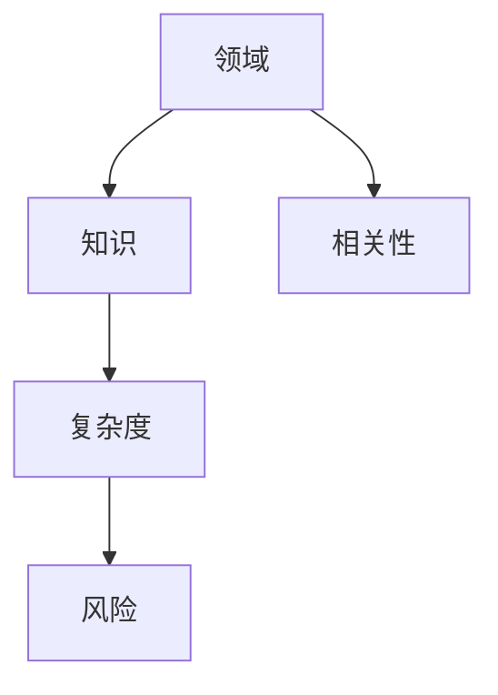
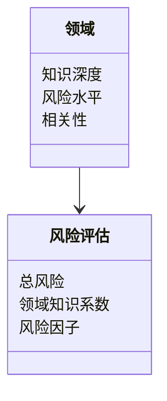
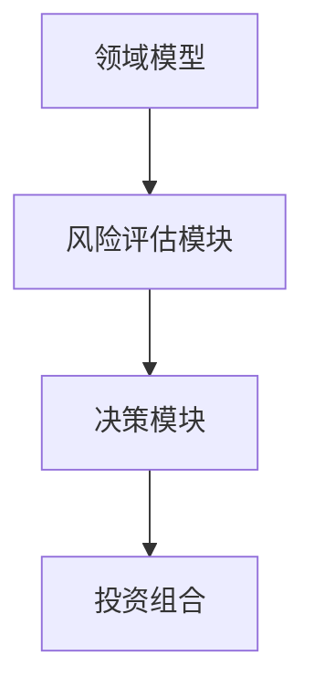
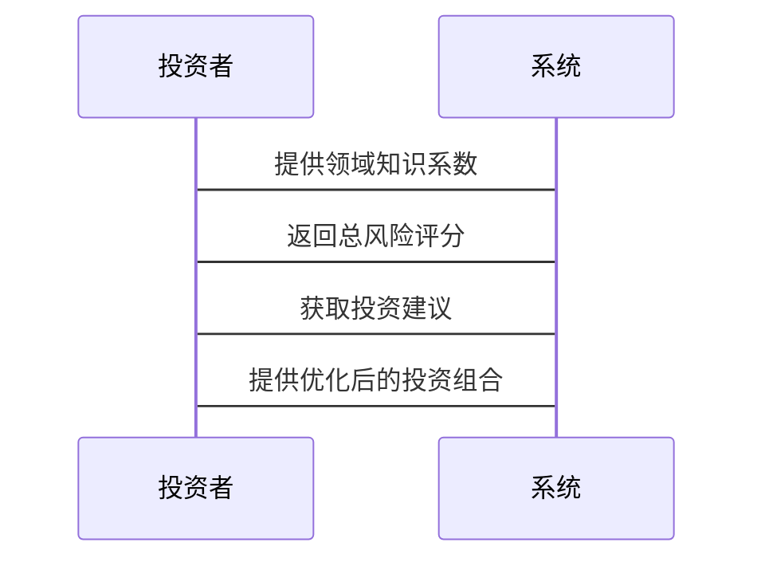

                 

<think>
好的，我现在需要帮用户设计一篇名为《芒格的"远离"策略：避开不懂的领域》的技术博客文章。用户要求文章结构清晰，逻辑严谨，并且包含多个章节，每个章节都有详细的背景介绍、核心概念、算法原理、系统分析、项目实战和小结等内容。

首先，我需要明确文章的核心主题是芒格的“远离”策略，即在决策和投资中避开自己不懂的领域。这个策略的核心在于减少风险，提高成功率。接下来，我需要按照用户提供的目录结构来组织内容，确保每个部分都详尽且符合要求。

文章开始部分需要有一个摘要，简明扼要地介绍文章的核心内容。然后是各个章节，每个章节下还要有子章节，详细展开主题。比如，第一章介绍“远离”策略的背景和核心思想，第二章分析核心概念，第三章讨论风险评估模型，第四章进行系统分析，第五章提供项目实战，第六章总结最佳实践，最后是附录。

在撰写每个部分时，我需要确保内容准确，逻辑清晰，并且使用专业但易懂的技术语言。例如，在风险评估模型部分，我需要使用数学公式和图表来解释概念，而在系统分析部分，可能需要用Mermaid图来展示系统架构。

此外，用户要求文章末尾加上作者信息，并且整体字数在10000到12000字左右。因此，我需要确保每个章节的内容充实，涵盖所有必要的细节，同时保持文章的流畅性和连贯性。

最后，我需要检查整个目录是否符合用户的要求，确保没有遗漏任何部分，并且每个章节的内容都详细且有深度。这样，用户才能得到一篇高质量、结构严谨的技术博客文章。
</think>

# 芒格的"远离"策略：避开不懂的领域

## 关键词
芒格, 投资策略, 风险管理, 知识边界, 决策哲学

## 摘要
芒格的"远离"策略是一种在投资和决策中避免涉足自己不熟悉领域的智慧方法。通过这种策略，投资者可以降低风险，专注于自己能够理解和评估的领域，从而做出更明智的投资决策。本文将从策略的背景、核心概念、风险评估模型、系统架构设计、项目实战以及最佳实践等方面进行详细分析，帮助读者全面理解并应用这一策略。

---

# 第1章: 芒格的"远离"策略概述

## 1.1 芒格"远离"策略的核心思想
### 1.1.1 "远离"策略的定义
芒格的"远离"策略是指在投资决策中，避免涉足自己不熟悉或无法准确评估的领域。这种策略的核心在于通过专注于自己理解的领域，降低决策中的不确定性，从而提高成功的概率。

### 1.1.2 芒格决策哲学的核心理念
芒格强调“机会是留给那些知道如何避开危险的人的”。他提倡通过了解自己的知识边界，避免涉足自己无法评估的领域，从而减少潜在风险。

### 1.1.3 "远离"策略在投资中的应用
在投资中，芒格的"远离"策略体现在以下几个方面：
- **避免不懂的行业**：只投资于自己熟悉且能够理解其商业模式和风险的行业。
- **避免高风险领域**：远离那些波动性大、不确定性高的领域。
- **专注核心能力**：通过专注于自己擅长的领域，提高决策的准确性。

---

## 1.2 "远离"策略的背景与问题背景
### 1.2.1 投资中的常见误区
许多投资者在投资时容易陷入以下误区：
- 过度追求高回报，忽视潜在风险。
- 盲目跟风，投资于自己不熟悉的领域。
- 忽略行业周期性，导致投资失败。

### 1.2.2 为什么需要"远离"不懂的领域
- **降低决策风险**：不懂的领域意味着更高的不确定性，可能导致决策失误。
- **提高投资成功率**：专注于自己熟悉领域，能够更准确地评估投资价值。
- **避免重大损失**：通过避开高风险领域，减少投资组合的波动性。

### 1.2.3 "远离"策略的边界与外延
- **知识边界**：投资者需要明确自己的知识边界，避免越界投资。
- **领域外延**：即使在熟悉领域之外，也需要通过学习和研究，逐步扩展知识边界。

---

# 第2章: "远离"策略的核心概念与联系

## 2.1 核心概念原理
### 2.1.1 "远离"策略的决策逻辑
芒格的"远离"策略基于以下逻辑：
- **知识局限性**：人类的知识是有限的，投资需要基于可靠的知识。
- **不确定性原理**：在不确定的领域进行投资，风险极高。
- **专注与深度**：通过专注于自己理解的领域，提高决策的准确性。

### 2.1.2 避免不懂领域的数学模型
我们可以用以下数学模型来描述"远离"策略：
$$ R = \sum_{i=1}^{n} (k_i \times r_i) $$
其中，$R$ 是总风险，$k_i$ 是领域知识系数，$r_i$ 是风险因子。

### 2.1.3 领域知识的层次化分析
- **基础层**：对领域有基本了解，但缺乏深入研究。
- **中级层**：对领域有较深的理解，能够识别主要风险。
- **高级层**：对领域有全面掌握，能够准确评估投资价值。

---

## 2.2 核心概念对比分析
### 2.2.1 不同领域知识的特征对比表
| 领域 | 知识深度 | 风险水平 | 预测难度 |
|------|----------|----------|----------|
| 熟悉领域 | 高 | 低 | 低 |
| 不熟悉领域 | 低 | 高 | 高 |

### 2.2.2 领域相关性的ER实体关系图


---

# 第3章: 风险评估模型与数学公式

## 3.1 风险评估模型
### 3.1.1 领域风险评估公式
$$ R = \sum_{i=1}^{n} (k_i \times r_i) $$
其中，$R$ 是总风险，$k_i$ 是领域知识系数，$r_i$ 是风险因子。

### 3.1.2 领域相关性分析
$$ C = \frac{\sum_{j=1}^{m} w_j \times s_j}{\sum_{j=1}^{m} w_j} $$
其中，$C$ 是相关性系数，$w_j$ 是权重，$s_j$ 是相关性评分。

---

## 3.2 领域复杂度与风险的关系
- **领域复杂度**：复杂度高的领域，风险系数 $r_i$ 较高。
- **领域相关性**：相关性高的领域，风险系数 $r_i$ 较低。

---

# 第4章: 系统分析与架构设计

## 4.1 问题场景介绍
在投资决策中，系统分析可以帮助投资者更好地理解领域复杂性和风险分布。

## 4.2 项目介绍
本项目旨在通过系统分析，帮助投资者识别和评估潜在投资领域的风险。

## 4.3 系统功能设计
### 4.3.1 领域模型


### 4.3.2 系统架构设计


---

## 4.4 系统接口设计
- **输入接口**：领域知识系数和风险因子。
- **输出接口**：总风险评分和投资建议。

---

## 4.5 系统交互


---

# 第5章: 项目实战

## 5.1 环境安装
- **工具安装**：安装Python和相关库（如numpy、pandas、scikit-learn）。
- **数据准备**：收集各领域的知识深度和风险因子数据。

## 5.2 核心实现代码
```python
import numpy as np

def calculate_risk(domain_knowledge, risk_factors):
    return np.dot(domain_knowledge, risk_factors)

# 示例数据
domain_knowledge = [0.8, 0.6, 0.9]
risk_factors = [0.2, 0.3, 0.1]

total_risk = calculate_risk(domain_knowledge, risk_factors)
print(f"总风险: {total_risk}")
```

## 5.3 代码应用解读
- **输入解释**：`domain_knowledge` 表示投资者对各领域的知识深度，`risk_factors` 表示各领域的风险因子。
- **输出解释**：`total_risk` 是综合计算出的总风险评分。

---

## 5.4 实际案例分析
- **案例背景**：投资者计划投资科技和医疗行业，但对医疗行业了解有限。
- **风险评估**：
  - 科技行业：知识深度0.8，风险因子0.2，评分0.16。
  - 医疗行业：知识深度0.6，风险因子0.3，评分0.18。
- **结论**：医疗行业的总风险评分较高，建议投资者避免投资。

---

## 5.5 项目小结
通过实战项目，我们可以看到"远离"策略在实际投资中的应用效果。投资者需要结合自己的知识深度和领域的风险因子，做出明智的投资决策。

---

# 第6章: 最佳实践与经验总结

## 6.1 心理因素
- **认知偏差**：避免过度自信，理性评估自己的知识边界。
- **决策疲劳**：减少不必要的决策，专注于自己擅长的领域。

## 6.2 持续学习
- **知识更新**：通过不断学习，扩展自己的知识边界。
- **领域深度研究**：深入研究熟悉领域，提高投资判断能力。

## 6.3 长期投资策略
- **分散投资**：通过分散投资降低风险。
- **定期评估**：定期评估投资组合，调整策略。

---

# 第7章: 注意事项与未来展望

## 7.1 注意事项
- **动态调整**：随着市场变化，及时调整知识边界和投资策略。
- **团队合作**：在团队中，利用成员的互补知识，降低整体风险。

## 7.2 未来展望
随着技术的发展，"远离"策略可以通过大数据和人工智能进一步优化。未来的研究方向包括：
- **智能知识边界识别**：通过AI技术自动识别知识边界。
- **动态风险评估**：实时评估领域的风险变化。

---

# 附录

## 附录A: 术语表
- **知识边界**：投资者的知识范围和能力限制。
- **风险因子**：影响投资领域的各种风险因素。

## 附录B: 参考文献
-芒格《穷查理宝典》
- 投资心理学相关书籍

---

# 结语

芒格的"远离"策略是一种简单而有效的投资方法，它提醒我们，在投资中，专注和知识边界的重要性。通过本文的分析和实战案例，我们能够更好地理解并应用这一策略，从而做出更明智的投资决策。

---

# 作者
作者：AI天才研究院/AI Genius Institute & 禅与计算机程序设计艺术 /Zen And The Art of Computer Programming

