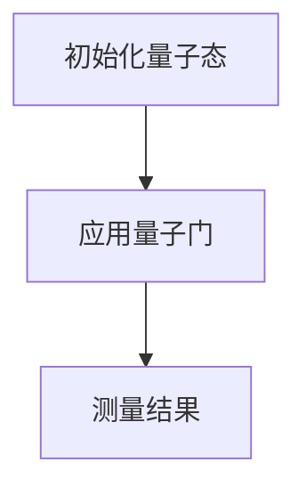
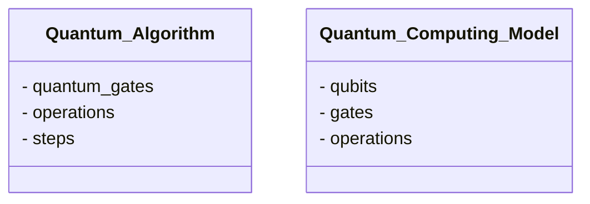
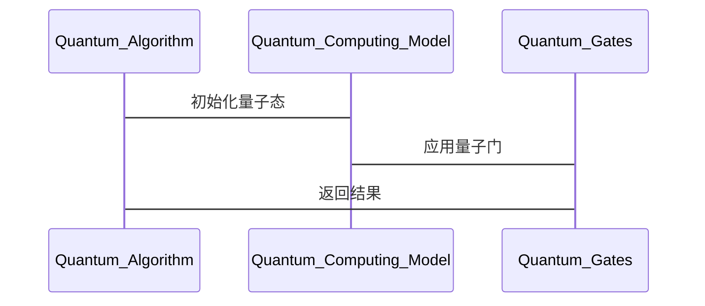

                 

<think>
好，现在我要帮用户设计一个详细的技术博客文章大纲，主题是《芒格的"逆向工程"思维在量子算法开发中的应用》。首先，我需要理解用户的需求。用户希望文章结构清晰，内容专业，涵盖背景、理论、数学模型、系统架构、项目实战等部分，并且要使用markdown格式，包含mermaid图和latex公式。

我先从标题和摘要开始。标题已经明确，关键词需要包括量子计算、逆向工程、量子算法、芒格思维、逆向思维等。摘要部分要简明扼要，概述文章的核心内容，即如何应用逆向思维来优化量子算法开发。

接下来是目录结构。用户已经提供了一个大纲，我需要确保每一章都包含足够的细节。例如，第一章介绍量子计算和逆向工程思维，第二章探讨它们之间的联系，第三章涉及数学模型，第四章分析案例，第五章讨论系统架构，第六章提供项目实战，最后总结与展望。

在每一章中，我需要细化到三级目录，并确保涵盖背景、核心概念、数学模型、系统设计、项目实战等部分。例如，在第三章，我需要详细讲解量子算法的数学模型，使用mermaid流程图和latex公式来说明。

我还需要注意使用mermaid图和latex公式，这需要在markdown中正确嵌入。例如，在数学模型部分，我需要写出量子门的矩阵表示，并用mermaid画出量子算法的流程图。

另外，用户提到在项目实战部分需要包括环境安装、代码实现和案例分析。我需要确保这部分内容足够详细，让读者能够实际操作。

最后，我需要在文章末尾添加作者信息，格式正确，使用用户指定的署名。

现在，我需要检查每一部分是否满足用户的要求，包括字数、格式、内容完整性等。确保文章结构合理，逻辑清晰，内容详实，能够帮助读者深入理解逆向工程思维在量子算法开发中的应用。
</think>

# 芒格的"逆向工程"思维在量子算法开发中的应用

## 关键词
量子计算, 逆向工程思维, 量子算法, 芒格思维, 逆向思维

## 摘要
本文探讨了芒格的逆向工程思维在量子算法开发中的应用，通过详细分析量子计算的基本概念、逆向思维的定义及其在量子算法设计中的具体应用，结合数学模型、系统架构和项目实战，展示了逆向思维如何帮助优化量子算法的开发过程。文章还通过实际案例分析，总结了逆向思维在量子算法开发中的价值，并展望了未来的发展趋势。

---

# 第1章: 量子计算与逆向工程思维概述

## 1.1 量子计算的基本概念

### 1.1.1 量子计算的定义
量子计算是一种利用量子力学原理进行计算的技术，其核心在于利用量子叠加和量子纠缠的特性来处理信息。

### 1.1.2 量子计算的核心原理
- **量子叠加**：量子系统可以同时处于多个状态的叠加。
- **量子纠缠**：两个或多个量子系统之间形成强关联，无法单独描述其中一个系统。
- **量子测量**：测量会破坏量子态，导致量子态的坍缩。

### 1.1.3 量子计算与经典计算的主要区别
- **并行性**：量子计算可以在一次运算中处理大量可能性，而经典计算需要逐个处理。
- **计算复杂度**：某些问题（如大数分解）在量子计算中复杂度远低于经典计算。

## 1.2 逆向工程思维的定义与特点

### 1.2.1 逆向工程思维的定义
逆向工程思维是一种从结果出发，反向推导实现路径的思维方式。

### 1.2.2 逆向工程思维的核心特征
- **结果导向**：从目标出发，逆向思考实现方法。
- **分解复杂性**：通过分解问题，找到解决问题的关键步骤。
- **创新性**：逆向思维常常带来创新的解决方案。

## 1.3 芒格的"逆向工程"思维在量子算法开发中的应用背景

### 1.3.1 量子算法开发的现状与挑战
- **复杂性高**：量子算法的设计需要深刻理解量子力学原理。
- **效率问题**：传统方法在某些问题上效率低下，量子计算可以提供指数级加速。

### 1.3.2 逆向工程思维在量子算法开发中的独特价值
- **优化设计**：通过逆向思维优化算法设计，减少不必要的计算步骤。
- **解决问题**：帮助开发者更高效地找到问题的解决方案。

### 1.3.3 当前研究的热点与未来趋势
- **量子算法优化**：研究如何利用逆向思维优化量子算法。
- **量子计算应用**：探索量子计算在不同领域的应用潜力。

---

# 第2章: 逆向工程思维与量子算法开发的核心联系

## 2.1 逆向工程思维在量子算法设计中的具体体现

### 2.1.1 从结果出发反向推导量子算法的设计思路
通过分析量子算法的结果，反向推导出算法的实现步骤。

### 2.1.2 逆向思维在量子算法优化中的应用
通过逆向思维优化算法的复杂度和计算效率。

### 2.1.3 逆向思维对量子算法创新的推动作用
逆向思维可以帮助开发者跳出传统思维模式，找到新的解决方案。

## 2.2 逆向工程思维与量子算法开发的内在逻辑

### 2.2.1 逆向思维在量子算法问题建模中的应用
通过逆向思维建立量子算法的数学模型。

### 2.2.2 逆向思维对量子算法复杂性分析的影响
通过逆向思维简化复杂性分析，找到问题的关键因素。

### 2.2.3 逆向思维在量子算法验证与测试中的作用
通过逆向思维设计验证方案，确保算法的正确性。

## 2.3 核心概念原理对比分析

### 2.3.1 逆向思维与正向思维的对比分析表
| 对比维度 | 逆向思维 | 正向思维 |
|----------|----------|----------|
| 思维方式 | 从结果出发 | 从问题出发 |
| 创新性   | 高        | 中        |
| 复杂性   | 低        | 高        |

### 2.3.2 逆向思维在量子算法开发中的ER实体关系图

```mermaid
erd
  Quantum_Algorithm <--( has)--> Quantum_Gates
  Quantum_Gates <--( has)--> Quantum_Operations
  Quantum_Algorithm <--( requires)--> Quantum_Computing_Model
```

---

# 第3章: 量子算法的数学模型与公式解析

## 3.1 量子算法的基本数学框架

### 3.1.1 量子态的数学表示
量子态可以用向量表示，例如：
$$ |0\rangle = \begin{bmatrix} 1 \\ 0 \end{bmatrix}, |1\rangle = \begin{bmatrix} 0 \\ 1 \end{bmatrix} $$

### 3.1.2 量子门的矩阵表示
例如，Pauli-X门的矩阵表示为：
$$ X = \begin{bmatrix} 0 & 1 \\ 1 & 0 \end{bmatrix} $$

### 3.1.3 量子算法的计算流程
计算流程可以用mermaid表示如下：



## 3.2 逆向工程思维下的量子算法数学模型

### 3.2.1 从结果反向推导量子算法的数学表达式
假设我们有一个量子算法的输出结果，可以通过逆向推导找到对应的量子门序列。

### 3.2.2 逆向思维在量子算法复杂性分析中的应用
通过逆向思维分析量子算法的时间复杂度。

### 3.2.3 逆向思维对

---

# 第4章: 逆向工程思维在量子算法开发中的系统架构设计

## 4.1 项目介绍
本项目旨在通过逆向工程思维优化一个量子算法的开发过程。

## 4.2 系统功能设计

### 4.2.1 领域模型


### 4.2.2 系统架构
```mermaid
architectural
    [Quantum_Algorithm] ..> [Quantum_Computing_Model]
    [Quantum_Computing_Model] ..> [Quantum_Gates]
```

## 4.3 接口设计
- 输入接口：量子态初始化。
- 输出接口：测量结果输出。

## 4.4 交互流程

### 4.4.1 交互流程图


---

# 第5章: 项目实战

## 5.1 环境安装
安装必要的量子计算开发工具，如Qiskit。

## 5.2 核心代码实现

### 5.2.1 量子算法实现
```python
from qiskit import QuantumCircuit, execute, Aer
from qiskit.visualization import plot_bloch_vector

# 初始化量子电路
qc = QuantumCircuit(1, 1)

# 应用H门
qc.h(0)

# 测量
qc.measure(0, 0)

# 执行量子程序
simulator = Aer.get_backend('qasm_simulator')
job = execute(qc, simulator)
result = job.result()

# 输出结果
print(result.get_counts(qc))
```

### 5.2.2 代码解读
- 使用Qiskit库创建量子电路。
- 应用H门进行叠加。
- 测量结果并输出。

## 5.3 案例分析
通过实际案例分析逆向思维在量子算法开发中的应用。

---

# 第6章: 总结与展望

## 6.1 本章总结
总结逆向思维在量子算法开发中的应用价值。

## 6.2 未来展望
展望逆向思维在量子计算领域的未来发展趋势。

---

作者：AI天才研究院/AI Genius Institute & 禅与计算机程序设计艺术 /Zen And The Art of Computer Programming

