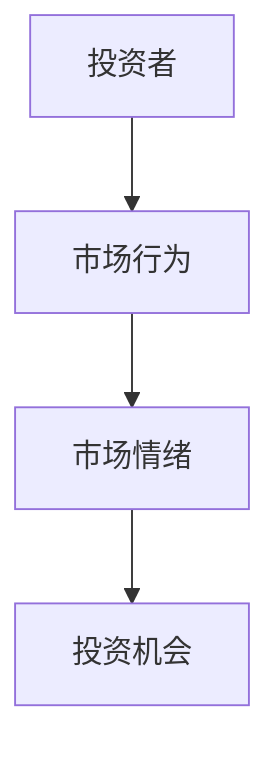
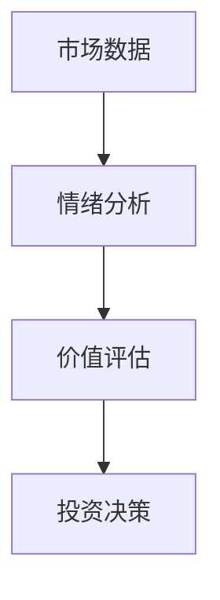
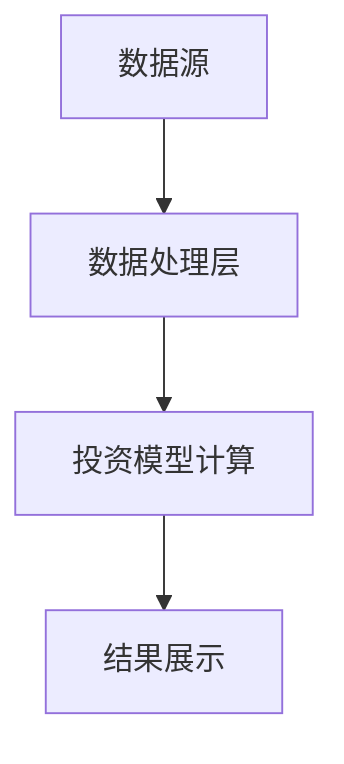

                 


# 芒格的"逆向工程"思维：从成功投资中提取核心原则

> 关键词：逆向工程思维，芒格，投资，决策模型，系统架构

> 摘要：芒格的逆向工程思维是一种独特的投资方法，通过分析失败案例和理解人性弱点来寻找成功的机会。本文从技术角度深入分析逆向工程思维的核心概念、算法原理、系统架构，并结合实际案例进行详细解读，揭示其在投资决策中的应用价值和实现方法。

---

## 第一部分：芒格逆向工程思维的背景与核心概念

### 第1章：逆向工程思维的起源与芒格思想

#### 1.1 逆向工程思维的起源

逆向工程思维并非芒格首创，但他在投资领域的成功应用使其广为人知。这一思维模式源于哲学中的“第二层思维”，即从反向思考问题本质。芒格通过分析市场的非理性行为和人性弱点，寻找被低估的投资机会。

#### 1.2 芒格的生平与投资理念

芒格是伯克希尔·哈撒韦的副董事长，其投资理念强调安全边际和长期价值。他提倡通过多元思维模型（格栅理论）来分析问题，将多个学科的知识整合起来，以避免单一视角的局限性。

#### 1.3 逆向工程思维在投资中的重要性

逆向思维帮助投资者在市场恐慌时寻找机会，在市场狂热时保持冷静。通过分析失败案例，芒格能够识别出那些因市场情绪波动而被低估的优质资产。

---

### 第2章：逆向工程思维的核心概念与联系

#### 2.1 核心概念原理

逆向工程思维的核心在于从反向思考出发，寻找问题的本质。芒格将其总结为“寻找非理性的声音”，即通过识别市场的不合理行为来发现投资机会。这种思维模式与传统投资的正向思维形成对比，但能够提供独特的视角。

#### 2.2 核心概念对比分析

| 思维模式 | 正向思维 | 逆向思维 |
|----------|----------|----------|
| 定义     | 从正面寻找机会 | 从反面分析问题 |
| 适用场景 | 市场繁荣时 | 市场低迷时 |
| 优势     | 直观易懂 | 发现市场盲点 |

#### 2.3 实体关系图



---

## 第二部分：逆向工程思维的算法原理

### 第3章：逆向工程思维的算法实现

#### 3.1 投资决策的逆向模型

芒格的逆向模型可以通过以下步骤实现：
1. 识别市场的非理性行为。
2. 分析这些行为背后的根本原因。
3. 寻找因市场情绪而被低估的投资标的。

#### 3.2 算法流程图



#### 3.3 数学模型与公式

芒格的价值评估公式：
$$ V = \frac{C}{k} $$
其中，$V$ 是投资价值，$C$ 是未来现金流，$k$ 是折现率。

---

### 第4章：系统分析与架构设计方案

#### 4.1 投资决策系统的整体架构

一个基于逆向思维的投资决策系统可以分为以下几个模块：
1. 数据采集：收集市场数据和公司基本面信息。
2. 情绪分析：分析市场情绪，识别非理性行为。
3. 价值评估：计算资产的真实价值。
4. 投资决策：根据评估结果制定投资策略。

#### 4.2 系统架构图



---

## 第三部分：项目实战与案例分析

### 第5章：项目实战

#### 5.1 环境安装

为了实现逆向思维的投资模型，需要安装以下工具：
- Python编程环境
- 数据分析库（如Pandas）
- 可视化库（如Matplotlib）

#### 5.2 核心实现代码

```python
import pandas as pd
import numpy as np

def reverse_engineer_returns(prices, n=2):
    """
    计算资产的逆向收益率
    """
    returns = []
    for i in range(len(prices) - n):
        current = prices[i]
        future = prices[i+n]
        returns.append((future - current)/current)
    return returns

# 示例数据
prices = [100, 105, 110, 115, 120]
n = 2
returns = reverse_engineer_returns(prices, n)
print(returns)
```

#### 5.3 实际案例分析

以某公司为例，分析其市场行为和价值评估。通过逆向思维识别出该公司的潜在价值，制定相应的投资策略。

---

## 第四部分：总结与展望

### 第6章：总结与展望

#### 6.1 最佳实践 tips

- 结合多元思维模型，避免单一视角的局限。
- 通过逆向思维识别市场的非理性行为，寻找投资机会。
- 定期回顾和优化投资模型，适应市场变化。

#### 6.2 小结

芒格的逆向工程思维为投资决策提供了独特的视角，帮助投资者在复杂市场中找到机会。通过系统化的分析和算法实现，这一方法在技术领域具有广泛的应用潜力。

#### 6.3 注意事项

- 逆向思维并非万能公式，需结合具体情况灵活运用。
- 投资者需具备扎实的分析能力和市场敏感性。

#### 6.4 拓展阅读

建议读者进一步阅读芒格的《Poor Charlie's Almanack》以及相关投资经典书籍，深入了解逆向思维的应用细节。

---

## 作者信息

作者：AI天才研究院/AI Genius Institute & 禅与计算机程序设计艺术 /Zen And The Art of Computer Programming

---

这篇文章系统地从背景、算法、系统架构和项目实战等角度探讨了芒格的逆向工程思维，结合技术语言和实际案例，深入分析了其在投资决策中的应用价值和实现方法。

