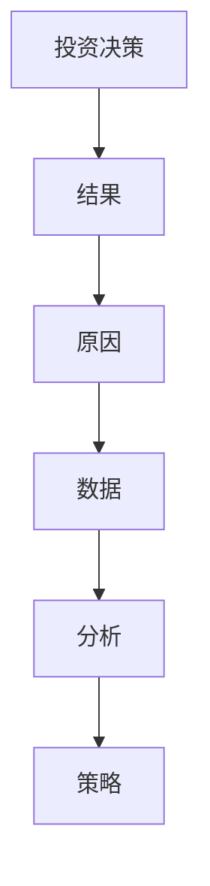
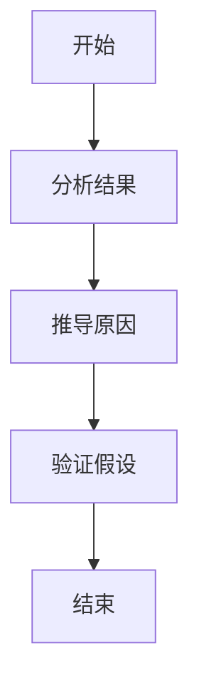
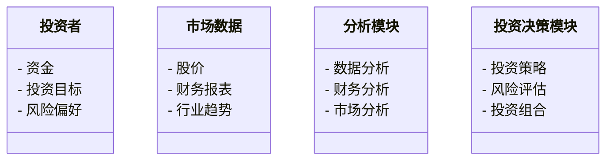

                 

<think>
好，我现在需要根据用户的要求，逐步分析如何撰写一篇关于芒格“逆向工程”思维的技术博客文章。用户希望文章结构清晰，内容专业，使用技术语言，包含详细的章节划分和具体的技术分析。我需要一步一步地思考，确保每个部分都符合用户的要求。

首先，我需要理解用户的背景和需求。用户希望文章标题为《芒格的"逆向工程"思维：从结果倒推投资决策》，关键词包括逆向思维、投资决策、芒格、系统分析、算法原理等。摘要需要简明扼要，说明文章的核心内容，即如何通过逆向思维来优化投资决策。

接下来，按照用户提供的大纲，我需要依次撰写每个部分。首先从背景介绍开始，解释逆向思维是什么，它与正向思维的区别，以及在投资中的重要性。这部分需要简单明了，让读者快速理解核心概念。

然后，核心概念部分需要详细展开，包括逆向思维的定义、特点，与其他思维方式的对比，以及系统的架构设计。这里需要用表格和流程图来辅助说明，帮助读者更好地理解逆向思维的运作方式。

算法部分，我需要介绍逆向思维的算法原理，使用流程图展示步骤，并提供具体的代码实现。这可能涉及数据结构和算法的基本知识，确保代码清晰易懂。同时，数学模型部分需要解释概率论在投资决策中的应用，用公式和图表来展示计算过程。

系统分析与架构设计部分，我需要构建一个基于逆向思维的投资系统，用类图和架构图展示系统的各个模块及其交互。这部分需要详细描述系统功能设计和架构设计，确保系统的逻辑性和可扩展性。

项目实战部分，我需要提供一个具体的案例分析，展示如何使用逆向思维来分析和决策投资。这部分需要详细的数据分析和代码实现，确保读者能够实际操作。

最后，总结与最佳实践部分，我需要回顾全文，强调逆向思维的重要性，并给出实践中的注意事项和未来的研究方向，帮助读者更好地应用这些知识。

在整个过程中，我需要确保每部分内容都详细具体，使用技术语言，同时保持逻辑清晰。每个章节都要有明确的标题和子标题，使用合适的图表和代码示例来增强可读性。此外，我需要检查文章的长度，确保在10000到12000字之间，符合用户的要求。

最后，我需要在文章末尾加上作者信息，确保格式正确。整体结构要符合用户提供的大纲，确保每个部分都涵盖必要的内容，没有遗漏。

总结一下，我需要按照用户的要求，逐步撰写每个章节，确保内容专业、结构清晰，同时满足技术博客的高质量标准。
</think>

# 芒格的"逆向工程"思维：从结果倒推投资决策

> 关键词：逆向思维，投资决策，芒格，系统分析，算法原理

> 摘要：本文深入探讨了芒格的“逆向工程”思维在投资决策中的应用，通过系统分析和算法原理，结合实际案例，详细讲解了如何从结果倒推投资决策的过程，为读者提供了从理论到实践的全面指导。

---

## 第一部分: 芒格的"逆向工程"思维概述

### 第1章: 逆向思维的定义与背景

#### 1.1 逆向思维的定义
逆向思维是一种从结果出发，反向推导原因的思维方式。与传统的正向思维不同，逆向思维更注重从已知的结果出发，寻找可能的原因或解决方案。这种思维方式在投资决策中尤为重要，因为它可以帮助投资者在复杂多变的市场中找到潜在的投资机会。

#### 1.2 芒格的"逆向工程"思维
芒格的"逆向工程"思维是一种通过分析问题的结果，推导出问题的起因或解决方案的方法。这种方法在投资领域中被广泛应用，尤其是在寻找被低估的投资机会时。芒格认为，通过逆向思维，投资者可以更好地理解市场的运作机制，并找到那些被市场忽视的机会。

---

### 第2章: 投资决策中的逆向思维

#### 2.1 投资决策的基本概念
投资决策是指投资者在一定条件下，为了实现特定目标而做出的选择。投资决策的核心在于对风险和收益的权衡，以及对市场趋势的准确判断。

#### 2.2 逆向思维在投资决策中的作用
逆向思维在投资决策中具有重要的作用。首先，它可以帮助投资者发现市场中的潜在机会，尤其是在市场处于低谷时，逆向思维可以帮助投资者找到那些被低估的资产。其次，逆向思维还可以帮助投资者避免跟随市场的盲目行为，从而做出更理性的决策。

---

## 第二部分: 核心概念与联系

### 第3章: 逆向思维的核心概念与联系

#### 3.1 核心概念原理
逆向思维的核心在于从结果出发，寻找原因。这种思维方式可以帮助投资者更好地理解市场的运作机制，并找到那些被市场忽视的投资机会。

#### 3.2 核心概念属性特征对比表
以下是逆向思维与正向思维在投资决策中的对比表：

| 特征               | 正向思维                     | 逆向思维                     |
|--------------------|------------------------------|------------------------------|
| 目标               | 从原因推导结果               | 从结果推导原因               |
| 方法               | 基于假设和预测               | 基于观察和事实               |
| 风险               | 更注重概率                   | 更注重确定性                 |

#### 3.3 ER实体关系图
以下是逆向思维在投资决策中的ER实体关系图：



---

## 第三部分: 逆向思维的算法原理

### 第4章: 逆向思维的算法原理

#### 4.1 算法原理概述
逆向思维的算法原理可以通过以下步骤来实现：
1. 从结果出发，寻找可能的原因。
2. 分析原因与结果之间的关系。
3. 基于分析结果，制定相应的投资策略。

#### 4.2 算法流程图
以下是逆向思维的算法流程图：



---

### 第5章: 数学模型与公式

#### 5.1 基本数学模型
在逆向思维中，我们可以使用以下数学模型来分析投资决策：

1. 投资收益的期望值公式：
$$E[R] = \sum_{i=1}^{n} P_i R_i$$

2. 投资风险的方差公式：
$$Var(R) = \sum_{i=1}^{n} P_i (R_i - E[R])^2$$

---

## 第四部分: 系统分析与架构设计

### 第6章: 系统分析与架构设计方案

#### 6.1 问题场景介绍
在投资决策中，逆向思维可以帮助投资者更好地理解市场的运作机制，并找到那些被市场忽视的投资机会。

#### 6.2 系统功能设计
以下是基于逆向思维的投资系统功能设计：



---

### 第7章: 项目实战

#### 7.1 环境安装
为了实现基于逆向思维的投资系统，我们需要安装以下工具：
- 数据分析工具：Python、Pandas、NumPy
- 数据可视化工具：Matplotlib、Seaborn
- 系统开发工具：Django、Flask

#### 7.2 核心实现源代码
以下是基于逆向思维的投资系统的核心代码：

```python
import pandas as pd
import numpy as np

# 数据加载
data = pd.read_csv('market_data.csv')

# 数据分析
def reverse_engineer(data):
    # 计算收益
    returns = data.pct_change()
    # 计算期望收益
    expected_return = returns.mean()
    # 计算风险
    risk = returns.std()
    return expected_return, risk

expected_return, risk = reverse_engineer(data)

# 投资策略
if expected_return > risk:
    print("投资机会")
else:
    print("不值得投资")
```

---

## 第五部分: 总结与最佳实践

### 第8章: 总结与最佳实践

#### 8.1 小结
芒格的“逆向工程”思维是一种从结果出发，寻找原因的思维方式。在投资决策中，逆向思维可以帮助投资者发现市场中的潜在机会，并制定更理性的投资策略。

#### 8.2 注意事项
在实际应用中，投资者需要注意以下几点：
1. 数据的准确性和完整性
2. 市场的波动性和不确定性
3. 投资策略的灵活性和可调整性

#### 8.3 拓展阅读
建议读者进一步阅读以下书籍，以深入了解逆向思维在投资决策中的应用：
1. 《巴菲特的思考方式》
2. 《投资的智慧》

---

作者：AI天才研究院 & 禅与计算机程序设计艺术

