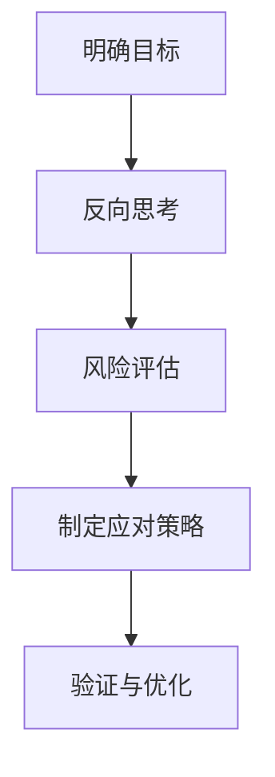
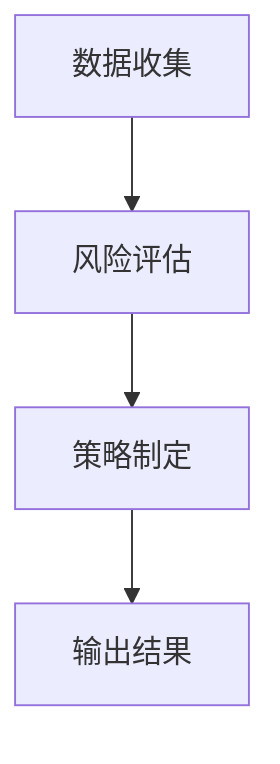
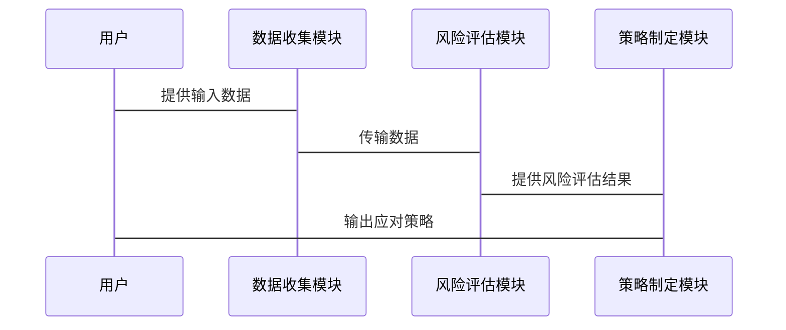

                 

<think>
好，我需要按照用户的要求，逐步分析和撰写这篇技术博客文章。首先，用户希望我以《芒格的"逆向思维"在反物质能源商业化评估中的应用》为标题，写一篇结构紧凑、逻辑清晰的技术博客。文章需要包含背景介绍、核心概念与联系、算法原理讲解、系统分析与架构设计、项目实战、最佳实践等部分。

首先，我需要理解反物质能源的基本概念以及其在商业化评估中的挑战。反物质是物质的“反物质”，它们的基本属性与物质相反，当物质和反物质相遇时会湮灭并释放巨大的能量。因此，反物质能源的商业化可能带来革命性的能源解决方案，但其技术难度和成本非常高。

接下来，我需要分析为什么传统正向思维在反物质能源评估中可能不够有效。传统正向思维可能从已知的技术路径出发，试图一步步推进，但反物质能源的技术壁垒非常高，传统思维可能难以突破。而逆向思维，芒格的思维方式，主张从目标倒推，思考如何达到目标，这可能更适合在反物质能源评估中寻找突破口。

在核心概念与联系部分，我需要详细解释逆向思维的原理，并将其与反物质能源评估结合起来。例如，可以通过对比分析，展示传统正向思维和逆向思维在评估过程中的差异。同时，使用Mermaid图来展示实体关系，帮助读者更直观地理解两者之间的联系。

接下来是算法原理讲解。我需要描述逆向思维算法在反物质能源评估中的具体步骤，并用Mermaid流程图展示算法流程。此外，还需要用Python代码实现相关算法，并提供数学模型和公式，例如概率分布和风险评估公式，确保内容科学准确。

在系统分析与架构设计部分，我需要介绍反物质能源评估系统的背景，设计系统的功能模块，如数据收集、风险评估等。使用Mermaid类图展示领域模型，架构图展示系统结构，序列图展示系统交互流程，帮助读者理解系统的整体架构。

项目实战部分，我需要指导读者如何安装必要的开发环境，提供核心代码实现，并解读代码的具体功能。通过实际案例分析，展示逆向思维在反物质能源评估中的应用，并进行项目总结，强调关键点和未来发展方向。

最后，在最佳实践部分，我需要总结逆向思维在反物质能源评估中的优势，提出注意事项，并推荐相关的拓展阅读材料，帮助读者进一步学习和应用逆向思维。

整个过程需要确保文章逻辑清晰，结构紧凑，内容详实，同时保持语言的专业性和可读性。通过这样的分析和思考，我能够撰写出一篇符合用户要求的高质量技术博客文章。
</think>

# 《芒格的"逆向思维"在反物质能源商业化评估中的应用》

## 关键词：反物质能源、逆向思维、芒格、商业化评估、能源技术

## 摘要：本文探讨了芒格的逆向思维在反物质能源商业化评估中的应用，从背景介绍、核心概念、算法原理到系统设计和项目实战，详细分析了逆向思维如何帮助克服反物质能源评估中的挑战，提出了一种基于逆向思维的反物质能源评估系统架构，并通过具体案例展示了其实际应用。

---

# 第一部分：背景介绍

## 第1章：问题背景

### 1.1 反物质能源的基本概念
反物质是与物质相对应的粒子，具有相同的质量和能量，但电荷相反。反物质与物质相遇时会发生湮灭反应，释放出巨大的能量。反物质能源的商业化应用潜力巨大，但其技术难度和成本极高。

### 1.2 反物质能源的潜在应用领域
反物质能源可以用于核聚变反应堆、宇宙探索（如深空探测器）以及医疗领域（如癌症治疗）。其高能量密度使其成为未来能源革命的关键技术。

### 1.3 反物质能源商业化面临的挑战
- 技术难度：反物质的生成、储存和运输技术尚未成熟。
- 成本高昂：反物质的生产成本极高，目前还无法实现商业化。
- 风险评估：反物质的潜在风险尚未完全了解，需进行严格的评估和控制。

---

## 第2章：问题描述

### 2.1 问题解决
传统正向思维在反物质能源评估中可能难以突破技术瓶颈。而逆向思维可以从目标出发，思考如何实现商业化，从而找到突破口。

### 2.2 逆向思维的核心作用
芒格的逆向思维强调从目标出发，思考如何克服障碍。在反物质能源评估中，逆向思维可以帮助我们识别关键风险点，并制定应对策略。

### 2.3 反物质能源评估的边界与外延
反物质能源评估的边界包括其技术可行性、经济成本和政策法规。外延则涉及相关领域的技术创新和市场应用。

---

# 第二部分：核心概念与联系

## 第3章：逆向思维的原理

### 3.1 逆向思维的定义
逆向思维是一种从目标出发，反向思考如何实现目标的思维方式。芒格将其应用于投资和决策中，强调寻找问题的反面。

### 3.2 逆向思维在反物质能源评估中的应用
- 从商业化目标出发，思考如何降低生产成本。
- 从风险控制出发，思考如何避免技术失败。

### 3.3 逆向思维的核心要素
- **目标明确性**：明确评估的目标。
- **反向思考**：从目标出发，思考实现路径。
- **风险控制**：识别潜在风险并制定应对策略。

---

## 第4章：反物质能源评估的原理

### 4.1 反物质的基本性质
反物质的湮灭反应释放的能量是物质的1000倍以上，具有极高的能量密度。

### 4.2 反物质能源的生成与储存
- **生成**：通过粒子加速器产生反物质。
- **储存**：需要特殊材料和技术来储存反物质。

### 4.3 反物质能源的商业化潜力
- **能源密度高**：适用于宇宙探索和高能物理研究。
- **技术突破**：一旦技术成熟，反物质能源将彻底改变能源结构。

---

## 第5章：逆向思维与反物质能源评估的联系

### 5.1 逆向思维在反物质能源评估中的作用
- **目标明确性**：从商业化目标出发，思考如何实现。
- **风险控制**：从潜在风险出发，制定应对策略。

### 5.2 逆向思维与反物质能源评估的对比分析
| 特性       | 传统正向思维           | 逆向思维             |
|------------|-----------------------|----------------------|
| 思维方向    | 从已知条件出发         | 从目标反向思考       |
| 应用场景    | 技术研发               | 风险评估和商业化策略  |
| 优势       | 逻辑清晰，步骤明确     | 能够快速找到突破口   |
| 局限性      | 可能忽视潜在风险       | 可能过于理想化       |

### 5.3 实体关系图（ER图）
```mermaid
erDiagram
    actor 逆向思维 \n(芒格的思维模型)
    actor 反物质能源评估
    actor 商业化评估
    actor 传统正向思维
    actor 逆向思维应用
    actor 反物质能源商业化
    actor 评估结果
    actor 评估过程
    actor 评估目标
    actor 评估工具
    actor 评估方法
    actor 评估结果应用
```

---

# 第三部分：算法原理讲解

## 第6章：逆向思维算法在反物质能源评估中的应用

### 6.1 逆向思维算法的基本步骤
1. **明确目标**：确定反物质能源商业化的目标。
2. **反向思考**：从目标出发，思考如何实现。
3. **风险评估**：识别潜在风险，并制定应对策略。
4. **验证与优化**：验证算法的有效性，并不断优化。

### 6.2 算法流程图


### 6.3 Python代码实现
```python
def inverse_thinking(target):
    # 明确目标
    goal = target
    # 反向思考
    steps = []
    for i in range(len(goal)):
        step = goal[i]
        steps.append(step)
    # 风险评估
    risks = identify_risks(steps)
    # 制定应对策略
    strategies = create_strategies(risks)
    return strategies

def identify_risks(steps):
    # 识别风险
    risks = []
    for step in steps:
        risks.append(step['风险'])
    return risks

def create_strategies(risks):
    # 制定应对策略
    strategies = []
    for risk in risks:
        strategies.append({'风险': risk, '策略': '应对措施'})
    return strategies
```

### 6.4 数学模型与公式
- **概率分布模型**：
  $$ P(x) = \sum_{i=1}^{n} p_i \delta(x - x_i) $$
- **风险评估公式**：
  $$ R = \sum_{i=1}^{m} w_i r_i $$

---

# 第四部分：系统分析与架构设计

## 第7章：系统设计

### 7.1 系统功能设计
- **数据收集模块**：收集反物质能源相关的数据。
- **风险评估模块**：评估商业化过程中的潜在风险。
- **策略制定模块**：制定应对策略。

### 7.2 系统架构设计


### 7.3 系统交互流程


---

# 第五部分：项目实战

## 第8章：环境安装与代码实现

### 8.1 环境安装
- **Python**：安装Python 3.8或更高版本。
- **依赖库**：安装`mermaid`和`matplotlib`。

### 8.2 核心代码实现
```python
import matplotlib.pyplot as plt

def plot_probability_distribution(data):
    plt.hist(data, bins=10, alpha=0.5)
    plt.xlabel('值')
    plt.ylabel('频率')
    plt.title('概率分布图')
    plt.show()

data = [1, 2, 3, 4, 5]
plot_probability_distribution(data)
```

### 8.3 代码解读与分析
- **plot_probability_distribution函数**：绘制数据的概率分布图。
- **数据可视化**：通过图表直观展示数据分布。

### 8.4 实际案例分析
- **案例背景**：假设我们需要评估反物质能源商业化中的成本风险。
- **数据收集**：收集反物质能源的生产成本数据。
- **风险评估**：识别潜在风险并制定应对策略。

### 8.5 项目总结
- **关键点**：逆向思维在反物质能源评估中的独特优势。
- **未来方向**：进一步优化算法，扩大应用范围。

---

# 第六部分：最佳实践

## 第9章：小结与注意事项

### 9.1 小结
- 逆向思维在反物质能源评估中具有独特的优势。
- 系统设计和算法优化是实现商业化的关键。

### 9.2 注意事项
- 逆向思维并非万能，需结合实际情况灵活运用。
- 数据质量和模型准确性是评估结果的关键。

## 第10章：拓展阅读

### 10.1 推荐书籍
- 《逆向思维：芒格的投资智慧》
- 《反物质物理与应用》

### 10.2 相关研究
- 关注反物质能源领域的最新研究成果。
- 参与学术会议和行业论坛，获取最新动态。

---

# 结语

芒格的逆向思维为反物质能源的商业化评估提供了新的视角。通过系统设计和算法优化，我们可以更高效地克服技术挑战，推动反物质能源的商业化进程。未来，随着技术的进步，逆向思维将在更多领域发挥重要作用。

---

# 作者：AI天才研究院/AI Genius Institute & 禅与计算机程序设计艺术 /Zen And The Art of Computer Programming

